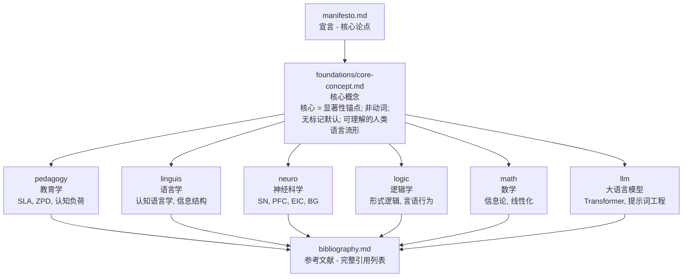

<div align="center">
  
</div>

# CFLT — 核心优先语言理论 (Core-First Language Theory)

> **跨语言通信、第二语言教学与人机认知对齐的统一理论框架。**
>
> 项目主页：[cflt.center](https://cflt.center)
>
> *English version: [README.md](./README.md)*

---

## 关于中文版

本仓库的理论文档目前以**英文为权威基准版本**，中文版正在分阶段翻译中。请参见 [TRANSLATION-PRIORITY.md](./TRANSLATION-PRIORITY.md) 了解翻译进度与优先级。

未翻译的页面会自动显示英文原文，并在网站顶部标注。如希望协助翻译，欢迎提交 PR。

---

## CFLT 是什么？

**核心优先语言理论 (Core-First Language Theory, CFLT)** 是一套旨在抹平全球语系间逻辑差异的**规范性认知协议**。

CFLT 认为，跨语言通信的主要障碍是**“结构重组税 (Structural Restructuring Tax)”** —— 即将一种语言的逻辑模板重塑为另一种语言模板时所产生的认知代谢开销。为了消除这笔“税收”，CFLT 基于一条话语层面的原则提供了一个**中性逻辑缓冲区 (Neutral Logic Buffer)**：

> *话语的认知核心，即为其在叙述序列中具有普适优先级的线性位置。*

通过将意图直接映射到 **CFLT 协议 (CFLT Protocol)**，人类与 AI 都可以绕过复杂的语法重构，通过简单的标记替换实现**即时流利 (Instant Fluency)**：

```
[核心动作/结果] → [条件/原因] → [空间/语境] → [时间]
```

CFLT 是**理论与方法的统一体**，而不是产品。理论属于公有领域 (CC BY 4.0)。具体的参考实现位于独立项目中 —— 参见 [reference-implementations.md](./docs/zh/reference-implementations.md)。

---

## 阅读顺序

对于初次阅读者：

1. **[`docs/zh/manifesto.md`](./docs/zh/manifesto.md)** — 从这里开始。权威理论陈述：CFLT 的主张、原因，以及如何将四元素“核心优先”序列运作化为 CFLT。

2. **[`docs/zh/foundations/core-concept.md`](./docs/zh/foundations/core-concept.md)** — **在读完宣言后立即阅读**。它定义了 CFLT 中“核心”的含义（显著性锚点——动作、状态、身份或请求——**不是**动词或谓语），并驳斥了最常见的误读。同时探讨了 CFLT 如何作为无标记默认值，而非唯一允许的形式。没有这篇文章，其他基础文档中的形式逻辑和信息论类比可能会被误读。

3. **选择最贴近您背景的基础文档：**
   - **[`docs/zh/foundations/pedagogy.md`](./docs/zh/foundations/pedagogy.md)** — Krashen 的输入假说、维果茨基的 ZPD、认知负荷理论、技能习得理论、任务型语言教学、Kroll 的双语词汇存取、语音学中的运动技能迁移。对教育者和二语习得 (SLA) 研究者最直接相关。
   - **[`docs/zh/foundations/linguistics.md`](./docs/zh/foundations/linguistics.md)** — 普遍语法、信息结构（主题-述题、话题-说明）、认知语言学（Talmy 的图形、Langacker 的剖面）、言语产生（Levelt）、自然语义元语言 (NSM)。明确区分了“核心优先”与 VSO 语序。
   - **[`docs/zh/foundations/neuroscience.md`](./docs/zh/foundations/neuroscience.md)** — 显著性网络、PFC 代谢成本（重组延迟）、早期立即成分 (EIC) 神经效率、注意力陷阱 vs. 原始标记、程序化（基底神经节）。
   - **[`docs/zh/foundations/logic.md`](./docs/zh/foundations/logic.md)** — 谓语逻辑、λ 演算、组合范畴语法 (CCG)、言语行为理论、关联理论、格莱斯格言、话语表征理论 (DRT)。将这些视为“早期承诺原则”的灵感来源，而非 CFLT 输出的表面形式。
   - **[`docs/zh/foundations/mathematics.md`](./docs/zh/foundations/mathematics.md)** — 信息论、均匀信息密度 (UID)、最优编码、马尔可夫链、KL 散度、偏序集上的线性化问题、产生规划中的搜索空间缩减。
   - **[`docs/zh/foundations/llm.md`](./docs/zh/foundations/llm.md)** — Transformer 注意力机制、位置偏差、lost-in-the-middle、提示词顺序方差、思维链 (CoT)、幻觉动态。为什么 CFLT 与 LLM 行为精准契合，正是因为它保持在模型训练所在的自然语言流形内。

4. **[`docs/zh/bibliography.md`](./docs/zh/bibliography.md)** — 统一参考文献（涵盖语言学、语言哲学、数学、LLM/NLP 研究和 SLA 教育学等约 80 篇参考文献）。

5. **[`docs/zh/vision.md`](./docs/zh/vision.md)** — 跨项目战略路线图：CFLT 在人类双语教育（支柱 I）和 LLM 协议标准化（支柱 II）中的双重使命。

## 阅读地图



---

## 参考实现

CFLT 本身是理论与规范。具体实现位于独立项目中。详见 [`docs/zh/reference-implementations.md`](./docs/zh/reference-implementations.md)。

第一个参考实现是 [**CoreFirst**](https://github.com/corefirst/corefirst) ([corefirst.world](https://corefirst.world)) —— 一个开源 Next.js 应用，为人类二语学习者实现 CFLT（支柱 I）。

---

## 编辑立场

理论文档遵循四项规则：

1. **引用真实学术成果。** 每一位署名作者和作品均可核实。
2. **承认局限性。** 每份基础文档都包含“诚实的局限性 (Honest Limitations)”章节。CFLT 在一定程度上是规范性的（一种教学/计算协议），而非纯粹描述性的 —— 我们对此予以说明。
3. **明确关联至 CFLT 主张。** 理论的存在是为了支持具体的操作性主张，而非装饰。
4. **保持“核心”定义的一致性。** 核心 = 显著性锚点（动作 / 状态 / 身份 / 请求）。不是动词。不是谓语符号。核心概念文档是权威参考。

---

## 如何引用

如在学术或技术写作中引用 CFLT，请使用：

> CFLT Core Team. (2026). *Core-First Language Theory (CFLT): Reconstructing Global Bilingual Education from First Principles.* Retrieved from https://cflt.center

特定基础文档可引用为：

> CFLT Core Team. (2026). *Pedagogical Foundations of CFLT.* In *Core-First Language Theory.* https://cflt.center/foundations/pedagogy

---

## 贡献

欢迎贡献 —— 请提交 Issue 或 Pull Request：

- 完善理论基础（补充引用、反驳论证、新学科视角）
- 翻译任意文档至其他语言
- 在 `reference-implementations.md` 中添加采用 CFLT 的新项目
- 提供支持或挑战 CFLT 主张的实证证据

---

## 许可

本仓库的理论内容采用 [Creative Commons Attribution 4.0 International (CC BY 4.0)](./LICENSE) 许可协议。在适当署名的前提下，您可以自由分享和改编本材料，包括用于商业目的。
