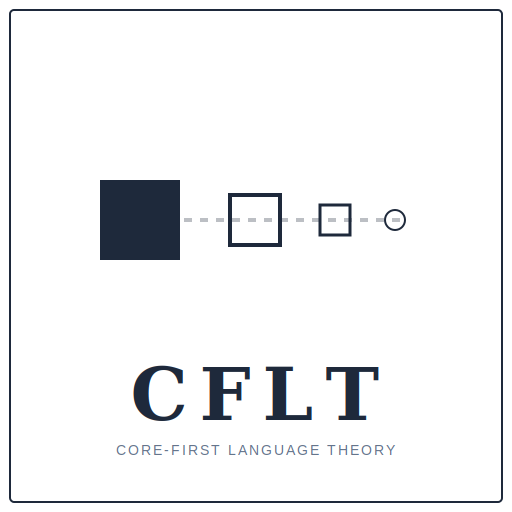

<div align="center">
  
</div>

# CFLT — 核心优先语言理论 (Core-First Language Theory)

> **跨语言通信、第二语言教学与人机认知对齐的统一理论框架。**
>
> 项目主页：[cflt.center](https://cflt.center) · 归档：[Zenodo · DOI 10.5281/zenodo.20289504](https://doi.org/10.5281/zenodo.20289504) · 许可：CC BY 4.0
>
> *English version: [README.md](./README.md)*

---

## 如何引用 (How to Cite)

若在学术工作或衍生项目中使用 CFLT 的理论、方法或代码，请按以下格式引用：

```
Yi, W. (2026). Core-First Language Theory (CFLT): A Discourse-Level
Linearization Protocol for Cross-Linguistic Communication and LLM
Prompting. Zenodo. https://doi.org/10.5281/zenodo.20289504
```

## 许可协议 (License)

- **理论文档、研究笔记与图表** —— [CC BY 4.0](https://creativecommons.org/licenses/by/4.0/)（见 [`LICENSE`](./LICENSE)）
- **配套参考实现仓库的源代码**（[CoreFirst](https://github.com/corefirst/corefirst) 等）—— 见各自仓库的 `LICENSE` 文件（Apache 2.0 / MIT）

以上两类许可均允许在**保留原作者署名**的前提下进行复用、改编与再分发。

如需在标准引用之外开展合作、获取数据集或申请扩展使用授权，请联系：tercel.yi@gmail.com

## AI 使用说明 (AI Use Disclosure)

作者母语非英语。在英文书面材料的准备过程中，使用了 AI 工具（Claude、GPT）协助进行**英文翻译、文字校对与引用格式整理**。本项目所有理论主张、研究设计、实证试点数据及实质性论证均由作者独立完成。

---

## 关于中文版

本仓库的理论文档目前以**英文为权威基准版本**，中文版正在分阶段翻译中。请参见 [TRANSLATION-PRIORITY.md](./TRANSLATION-PRIORITY.md) 了解翻译进度与优先级。

未翻译的页面会自动显示英文原文，并在网站顶部标注。如希望协助翻译，欢迎提交 PR。

---

## 快速链接

| 资源 | 状态 |
|---|---|
| **[cflt.center](https://cflt.center)** —— 完整文档站（mkdocs） | 已上线 |
| **[Zenodo 归档](https://doi.org/10.5281/zenodo.20289504)** —— *CFLT: 跨语言通信与 LLM 提示的篇章级线性化协议* | 已归档；concept DOI：[10.5281/zenodo.20289504](https://doi.org/10.5281/zenodo.20289504) |
| **[CoreFirst](https://github.com/corefirst/corefirst)**（[corefirst.world](https://corefirst.world)）—— 支柱 I MVP，Next.js + Electron，Apache 2.0 | 已部署 |

---

## CFLT 是什么？

**核心优先语言理论 (CFLT)** 是一套**篇章级规范性协议**，将两层构件的相对次序固定为：

```
[核心] → [理由] → [空间] → [时间]
```

CFLT 运作在**形态-句法层之上**：每种语言用自身的母语句法组装**事件核心**（槽位 0 —— 谓词 + 价位绑定的论元 + 方式 + 作用域内算子），而协议只治理**框架部分**（槽位 1–3）以及两层之间的边界。

"核心"是 Talmy（2000）"Figure" 意义下、Langacker（1987）"profile" 意义下的**显著性锚点 (salience anchor)** —— **不是**动词，**不是**对"最重要的词"的价值判断。

CFLT 处理一个**共同瓶颈**：成人 L2 产出以 DLPFC 工作记忆代谢为代价付出重构成本；LLM 提示工程以语义漂移、次序敏感性、"Lost in the Middle" 长上下文性能下降为代价付出同类成本（这是一种行为表现模式，其底层注意力机制尚未确证）。**单一规范性干预** —— Core-first 线性化 —— 在两个系统上都有效，但机制部分不同。

CFLT 是**理论 + 方法**，不是产品。理论属于公共开源域（CC BY 4.0）。参考实现位于独立项目中。

---

## 两支柱框架

CFLT 在**自然语言层**应用单一的 *Core-then-Frame* 组织原则，覆盖两种处理情境：

| 支柱 | 情境 | 工程交付 | 状态 |
|---|---|---|---|
| **支柱 I** —— 人类双语教育 | 自然语言（人类侧） | [CoreFirst 应用](https://github.com/corefirst/corefirst)（Logic-First, Grammar-Second 教学法） | MVP 已部署 |
| **支柱 II** —— 机器对齐 | 自然语言（LLM 侧） | CFLT 作为标准化提示协议 | Pilot 已验证（详见预印本 §6） |

把用户*自然语言*意图按同样的核心优先排序，是否在下游任务为 agentic 工具调用（如 MCP 式工具调用接口）时也有助益，是一个开放问题 —— 它是支柱 II 的一个特例，而非独立底物。CFLT 的线性化成本机制作用于按序处理的语言，而非结构化的工具调用 schema；因此我们把人-Agent 工具调用边界视为支柱 II 内部的研究问题。

---

## 实证状态

一项 pilot 两部分研究（720 次试验：24 cases × 4 levels × 2 languages × 5 frontier models × 3 runs）为 LLM 侧预测提供初步证据：

- **Level 3（干扰密集条件）：** CFLT 一致的提示将抽取准确率从平均 **65.6% 提升到 100%**，覆盖**全部五个**前沿模型（GPT-5、Gemini 3 Flash、Qwen3.5-Plus、DeepSeek V4 Pro、Claude Sonnet 4.6）。
- **Token 成本：** CFLT 在带可见思维链的推理型模型上降低完成 token 成本最多 **38%**；在短输出 / 隐藏推理模型上无 token 效应。
- **Level 4（决策深埋条件）：** 一个模型出现 null-to-slightly-negative 效应（DeepSeek V4 Pro, −11pp）；其他四个模型在 L4 饱和，因此该回归被刻画为**模型特定异常**，而非 CFLT 的一般属性。

Pilot 证据是**启示性的，非证实性的** —— 详见预印本 §6 的完整结果与 §7 的可证伪研究议程（六个子项目，§7.1–§7.6）。

原始数据、提示词与评测脚本位于发布标签 `osf-pilot-2026-05`。完整消融实验单条命令可复现：

```bash
python scripts/llm_eval/part2_llm_cflt_eval.py --runs 3
```

---

## 阅读顺序

对于初次阅读者：

1. **[`docs/zh/manifesto.md`](./docs/zh/manifesto.md)** —— 从这里开始。权威理论陈述：CFLT 的主张、原因，以及如何将四元素"核心优先"序列运作化为 CFLT。

2. **[`docs/zh/foundations/core-concept.md`](./docs/zh/foundations/core-concept.md)** —— **在读完宣言后立即阅读**。定义 CFLT 中"核心"的含义（显著性锚点 —— 动作、状态、身份或请求 —— **不是**动词或谓语），并驳斥最常见的误读。同时探讨 CFLT 如何作为无标记默认值，而非唯一允许的形式。

3. **[`docs/zh/vision.md`](./docs/zh/vision.md)** —— 跨项目战略路线图：两支柱使命（支柱 I 人类教育、支柱 II LLM 协议）。

4. **选择最贴近您背景的基础文档：**
   - **[`pedagogy.md`](./docs/zh/foundations/pedagogy.md)** —— Krashen、维果茨基 ZPD、认知负荷理论、DeKeyser 技能习得、TBLT、Kroll 双语词汇存取。对教育者和 SLA 研究者最直接相关。
   - **[`linguistics.md`](./docs/zh/foundations/linguistics.md)** —— 普遍语法、信息结构、认知语言学（Talmy/Langacker）、Levelt 言语产出、NSM。区分 Core-First 与 VSO 语序。
   - **[`neuroscience.md`](./docs/zh/foundations/neuroscience.md)** —— 显著性网络、PFC 代谢成本、EIC、注意力陷阱 vs. 原始标记、程序化。
   - **[`logic.md`](./docs/zh/foundations/logic.md)** —— 谓语逻辑、λ 演算、CCG、言语行为理论、关联理论、格莱斯格言、DRT。
   - **[`mathematics.md`](./docs/zh/foundations/mathematics.md)** —— 信息论、均匀信息密度、最优编码、KL 散度、偏序线性化。
   - **[`llm.md`](./docs/zh/foundations/llm.md)** —— Transformer 注意力、位置偏差、lost-in-the-middle、提示顺序方差、幻觉动态。

5. **[`docs/zh/methodology/empirical-agenda.md`](./docs/zh/methodology/empirical-agenda.md)** —— 三条实证 Track：计算（LLM）、心理语言学（人类）、SLA（教学法）。

6. **[`docs/zh/bibliography.md`](./docs/zh/bibliography.md)** —— 统一参考文献（覆盖语言学、语言哲学、数学、LLM/NLP、SLA 教育学等约 150 篇）。

---

## 参考实现

CFLT 本身是理论与规范。具体实现位于独立项目中 —— 详见 [`docs/zh/reference-implementations.md`](./docs/zh/reference-implementations.md)。

- **[CoreFirst](https://github.com/corefirst/corefirst)**（[corefirst.world](https://corefirst.world)）—— 支柱 I（人类双语教育）的第一个参考实现。Next.js + Electron，Apache 2.0。
---

## 编辑立场

理论文档遵循四项规则：

1. **引用真实学术成果。** 每一位署名作者和作品均可核实。
2. **承认局限性。** 每份基础文档都包含"诚实的局限性"章节。CFLT 在一定程度上是规范性的（一种教学/计算协议），而非纯粹描述性的 —— 我们对此予以说明。
3. **明确关联至 CFLT 主张。** 理论的存在是为了支持具体的操作性主张，而非装饰。
4. **保持"核心"定义的一致性。** 核心 = 显著性锚点（动作 / 状态 / 身份 / 请求）。不是动词。不是谓语符号。

预印本另增两条承诺：

- **跨域类比框架。** "SLA 与 LLM 提示工程共享线性化成本" 这一主张被视为**承重的类比**，其人类侧与 LLM 侧的预测**独立可证伪**（预印本 §1.1）。
- **启示性，非证实性。** §6 的 pilot 作为启示性证据被报告，包含一个有信息量的 null 结果（L4 决策深埋条件，单模型）。更强的主张被推迟到 §7 的可证伪研究议程中。

---

## 如何引用

引用整个框架：

> CFLT Core Team. (2026). *Core-First Language Theory (CFLT): Reconstructing Global Bilingual Education from First Principles.* [https://cflt.center](https://cflt.center)

引用归档预印本（Zenodo DOI 颁发后）：

> Yi, W. (2026). *Core-First Language Theory (CFLT): A Discourse-Level Linearization Protocol for Cross-Linguistic Communication and LLM Prompting.* Zenodo. https://doi.org/10.5281/zenodo.20289504

引用特定基础文档：

> CFLT Core Team. (2026). *Pedagogical Foundations of CFLT.* In *Core-First Language Theory.* [https://cflt.center/foundations/pedagogy](https://cflt.center/foundations/pedagogy)

---

## 贡献

欢迎贡献 —— 请提交 Issue 或 Pull Request：

- 完善理论基础（补充引用、反驳论证、新学科视角）
- 翻译任意文档至其他语言
- 在 `reference-implementations.md` 中添加采用 CFLT 的新项目
- 提供支持或挑战 CFLT 主张的实证证据，特别是针对 §7 议程的子项目

---

## 作者

**Tercel Yi** · 独立研究者 · ORCID [0009-0000-3742-4403](https://orcid.org/0009-0000-3742-4403) · [tercel.yi@gmail.com](mailto:tercel.yi@gmail.com)

CFLT 与 [CoreFirst](https://github.com/corefirst/corefirst) 的独立维护者。欢迎就指导、合作与独立实现进行联系。

---

## 许可

本仓库的理论内容采用 [Creative Commons Attribution 4.0 International (CC BY 4.0)](./LICENSE) 许可协议。在适当署名的前提下，您可以自由分享和改编本材料，包括用于商业目的。
