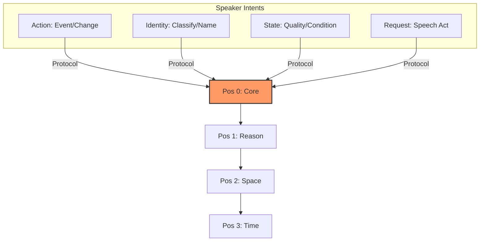
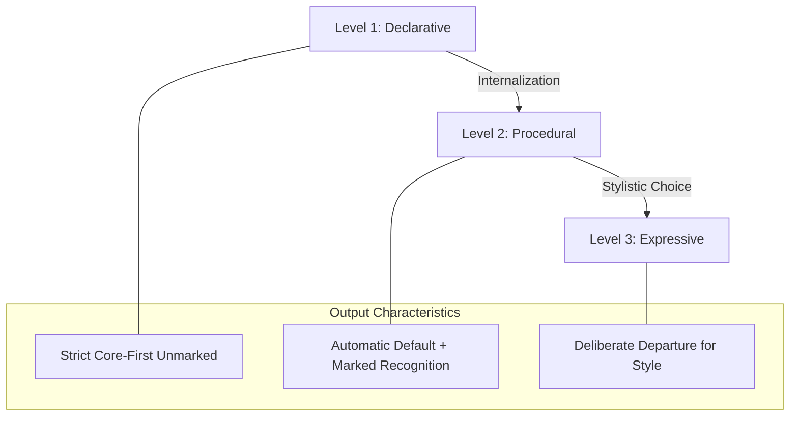
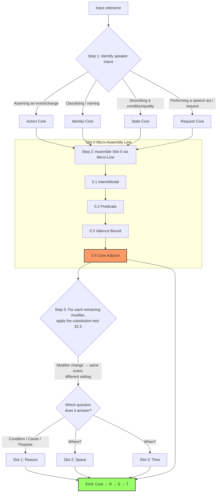

# What "Core" Means in CFLT — Salience, Not Syntax

> **Version:** 1.0.0 (Internal Draft)
> **Author:** CFLT Core Team
> **Organization:** [CFLT.center](https://cflt.center)
> **License:** [CC BY 4.0](https://creativecommons.org/licenses/by/4.0/)

---

## 1. The Core Misreading: "CFLT is verb-first / predicate-first."

> **Canonical definition site.** This document is the canonical definition of "salience anchor" / "Core" in CFLT. Other foundations docs (`linguistics.md` §1.1, `logic.md` §1, `mathematics.md` §1.1) refer back here for the constituent-type-agnostic definition; do not redefine the term elsewhere.

This is **wrong**, and the misreading would undermine the entire pedagogical and AI-alignment case for CFLT. The protocol is grounded in human cognition and is meant to produce **comprehensible human language**, not formal-logic notation or typologically rare verb-fronting word order.

The "Core" in CFLT is the **salience anchor** of the discourse. It is the constituent that the speaker is fundamentally "committing to" or "asserting" as the primary event or state.

The Core may *coincide* with the verb or predicate, but it is not defined by them. The CFLT Protocol places the Core in linear position 0; what fills position 0 depends on what the speaker is actually asserting.

### 1.1 Comparison Table

| Term | Domain | Definition | Example |
|---|---|---|---|
| **Verb** | Syntax | A grammatical category of words | "eat", "believe", "be" |
| **Predicate** | Formal logic | A function mapping individuals to truth values | $P(x, y)$ |
| **Figure** | Cognitive semantics (Talmy 2000) | The foregrounded entity/event | "*The cat* is on the mat" |
| **Core (CFLT)** | This project | The salience anchor — the committed assertion | "*I went out*, because it rained" |

These categories overlap in many sentences but are distinct. CFLT's Core is essentially the **Figure** of the discourse: the event or entity whose site, path, or orientation is the variable at issue. The subsequent slots (Reason, Space, Time) act as the **Ground**—the reference frame that provides the "stationary" setting for the Figure.

Talmy's **Contingency Principle** further supports this: humans naturally prioritize the event that is contingent on the frame. In the CFLT Protocol, the Core (the contingent event) is placed first, followed by the modifiers that provide its frame of reference.

### 1.2 What "Core" Is NOT — Two Critical Disambiguations

Two adjacent concepts are routinely conflated with CFLT's Core. Both readings are wrong and undermine the theory's operational claims. The following disambiguations are canonical.

#### Disambiguation A — Core ≠ "Important"

> **"Core" is a structural anchor (speaker-side commitment), not a value judgment about which constituent is "most important."**

| Property | "Important" (informal) | **Core** (CFLT) |
|---|---|---|
| Source of designation | Listener / context — value judgment | Speaker — what is being asserted |
| Theoretical lineage | None in formal linguistics | Talmy's Figure (2000); Halliday's intonational nucleus (1967); Van Valin & LaPolla's RRG Core (1997); Centering Theory's backward-looking center Cb (Grosz, Joshi & Weinstein 1995, as a *discourse-coherence* analogue, not a direct equivalent); Lambrecht's pragmatic assertion (1994) |
| Behavior under context shift | Changes when listener priorities change | Fixed by speaker intent for the utterance |
| Operational test | None — purely evaluative | §2.2 substitution test + listener-question test |

A consequence: in *"I went out, because the house was on fire"* the **most newsworthy / important** information to the listener is "the house was on fire" — yet the **Core is "I went out"**, because that is the speaker's primary commitment and the parsing anchor for everything that follows. CFLT places Core first not because it is most important, but because **it is the variable on which the ground frame is predicated**.

Across the literature reviewed for the CFLT terminology audit, **the word "important" never appears as a defined technical term** in linguistics, cognitive science, NLP interpretability, or vendor prompt-engineering documentation. Wherever the meaning is approached, the literature consistently uses *focus*, *salience*, *prominence*, *theme / topic*, *figure*, or *high-surprisal* — each of which separates evaluative importance from structural anchoring. Adopting "Important" as the CFLT term would conflate the four cognitively independent dimensions (focus / salience / accessibility / surprisal) that mainstream information-structure theory deliberately distinguishes (Krifka 2008; Gundel, Hedberg & Zacharski 1993).

#### Disambiguation B — Core ≠ RRG Nucleus

> **CFLT's "Core" aligns with RRG's *Core* layer (predicate + arguments), not RRG's *Nucleus* layer (predicate alone).**

Role and Reference Grammar (Van Valin & LaPolla 1997; Van Valin 2005) layers a clause as:

```
Nucleus  ⊂  Core  ⊂  Clause (= Core + Periphery)
predicate    predicate +     predicate + arguments +
             arguments       circumstantial adjuncts
```

CFLT's position-0 unit contains the predicate, its **valence-bound participants** (subject, object, instrument, beneficiary, recipient, accompaniment), **nuclear / core-level manner adverbials**, and **scope-internal operators** (negation, modality, aspect, degree) — see §9 for the canonical four-group enumeration that this prose summarizes. By RRG's stratification this corresponds to RRG's *Core* layer plus a small portion of the *Periphery* (manner) plus the scope-internal operator hierarchy (Cinque 1999). The terminological choice "Core" in CFLT is therefore deliberate — it inherits from RRG's Core layer, *not* from RRG's Nucleus. A reader who silently identifies CFLT's Core with RRG's Nucleus will incorrectly conclude that arguments live in the ground frame.

| Term | RRG content | CFLT content |
|---|---|---|
| RRG **Nucleus** | Predicate only | Strict subset of CFLT Core |
| RRG **Core** | Predicate + arguments | **≈ CFLT Core** (plus manner) |
| RRG **Periphery** | Circumstantial adjuncts (cause, location, time, setting-manner) | Setting-manner that fails the §2.2 substitution test stays out of Core; cause / location / time form the **ground frame** (slots 1–3). Nuclear/core-level manner is already inside RRG Core and stays inside CFLT Core. |

This alignment is operationalized in §2.1 (Event Nucleus) and §2.2 (Boundary Rule), and tested cross-linguistically in §2.5.

---

## 2. The Four Types of Core

Every well-formed CFLT utterance commits to one of these four core types in position 0:

| Type | Example (CFLT-L2 form) | What's foregrounded |
|---|---|---|
| **Action** | *I didn't go out*, because... | The event / change of state |
| **Identity** | *That girl is my sister*, wearing... | The classification / naming |
| **State** | *I'm exhausted*, because... | The condition / quality |
| **Request** | *Could you pass the salt*, please... | The speech act / desired outcome |



The selection of Core is a **semantic decision** the speaker makes ("what am I really trying to say?"). The placement of Core in position 0 is the **protocol** CFLT enforces.

### 2.1 The Event Nucleus: Core's Internal Structure

The Core occupies position 0 as a single attention unit, but **what fills that unit is not necessarily a single word**. It is the **event nucleus** — the predicate together with the participants and manner that are inseparable from the event itself.

CFLT operates as a **two-tier model**:

| Tier | Contents | Listener question it answers | Position |
|---|---|---|---|
| **Tier 1: Event Nucleus** | Predicate (Action/Identity/State/Request) + valence-bound participants (subject, object, instrument, beneficiary, recipient, accompaniment) + nuclear / core-level manner adverbials + scope-internal operators (negation, modality, aspect, degree) — see §9 for the canonical enumeration | *What happened?* (including who, to-whom, with-what, how, in-what-mood, negated, when-internal) | Slot 0 (Core) |
| **Tier 2: Ground Frame** | Reason / Space / Time | *Why? Where? When?* | Slots 1–3 |

The event nucleus is a single salience unit because the listener processes it as one foregrounded chunk: *"I baked the cake with butter, slowly, for my mom"* presents **one event**, not five. Whereas *"in the kitchen, yesterday"* are scene-setters that are conceptually independent of the event.

**Why this is cross-linguistically rigorous:**

- The **internal assembly** of the event nucleus uses each language's native syntax — case marking in Japanese/Korean/Turkish, prepositions in English/Romance/Chinese, coverbs in Chinese, particles in Japanese. CFLT does **not** mandate how to assemble it. Each language's "hardware" handles this.
- CFLT only governs the **boundary between event nucleus (Slot 0) and ground frame (Slots 1–3)**, plus the order within the ground frame. This is the protocol layer.

**Theoretical kin (alignment with existing frameworks):**

- **Role and Reference Grammar (Van Valin & LaPolla 1997; Van Valin 2005)** layers a clause as Nucleus (predicate) ⊂ Core (predicate + arguments) ⊂ Clause (= Core + Periphery, where Periphery hosts circumstantial adjuncts). **CFLT's Core ≈ RRG's Core layer** (predicate + valence-bound arguments). Manner adverbials are placed inside CFLT's Core; in RRG, manner is itself stratified — *nuclear manner* (e.g., manner-of-action *carefully, slowly*) attaches at the Nucleus, *core-level manner* (predicate-modifying *on purpose*) attaches at the Core, and *setting/peripheral manner* (e.g., *with the radio on*) is Peripheral. CFLT collapses these layers into a single Slot-0 placement for the *first two* (nuclear and core-level manner), and uses the substitution test in §2.2 to keep setting-manner outside Core when it does not change event identity. This is consistent with Cinque's (1999) cartography (manner adverbs at the lowest, most VP-internal functional projections — Spec of MannerP) and with Levin & Rappaport Hovav's (2005) event-structure templates (manner is part of the event nucleus when it is lexicalized in or selected by the predicate — *manner-of-motion* verbs like *stroll, saunter*). CFLT inherits RRG's *Core* terminology directly (the project name "Core-First" is a literal reference to this layer). We explicitly retract earlier wording that described this as "merging Nucleus and Core" — that phrasing collapsed the stratification and is replaced by the layered statement above.
- **LFG c-structure / f-structure separation** (Bresnan 2001) and **HPSG linearization theory** (Reape 1994) independently realize the same "protocol layer + implementation layer" split: f-structure (functional, cross-linguistically aligned) and c-structure (constituent, language-specific surface order) match CFLT's "protocol layer + event-nucleus assembly" decomposition.
- **Cinque (1999)** places manner adverbs at the **lowest (most VP-internal)** functional projections in the cartographic adverb hierarchy — closest to the predicate. CFLT's placement of manner inside the event nucleus is consistent with Cinque's positioning, though Cinque treats manner as Spec-of-FP rather than valence-bound; CFLT's "manner inside Core" is best read as "manner adjacent to the predicate in the linearization, not necessarily syntactically valence-bound."

Below the protocol layer, each language uses its own machinery; above it, all languages share one ordering. This is what makes CFLT a **protocol** rather than a syntactic prescription, and what makes it **universally applicable** without violating any language's typology.

> **Honest caveat — fluency vs complexity trade-off.** CFLT's two-tier model reduces working-memory load by externalizing the linearization decision (Sweller's Cognitive Load Theory). This benefit is strongest at **early-to-intermediate** proficiency. Skehan's (1998) Trade-off Hypothesis warns that formulaic templates can plateau learners on *fluency* at the cost of *complexity* and *accuracy* — i.e., learners stay safe inside the template instead of pushing for restructuring. CFLT therefore should be paired with progressive task-complexity escalation (see `pedagogy.md` §6 on weak-TBLT) so that intermediate-and-above learners are pushed beyond the unmarked default into marked deviations (see §6 here on the proficiency arc).

### 2.2 The Boundary Rule: What Goes In Core vs The Ground Frame

A modifier belongs **inside the event nucleus** (Slot 0) if it answers an internal question about the action itself:

- **How** was it done? → manner (*slowly, carefully, in a hurry*)
- **With what** instrument or means? → instrument (*with butter, by phone, by car, via API*)
- **For / to whom**? → beneficiary, recipient (*for my mom, to my friend*)
- **Together with whom**? → accompaniment (*with John, with the team*)
- **In what mood**? → modal (*probably, certainly, maybe*) — attaches to predicate
- **Negated**? → negation (*didn't, never, hardly*) — attaches to predicate

A modifier belongs **in the ground frame** (Slots 1, 2, or 3) if it answers a question about the world frame around the event:

- **Why?** (cause / purpose / condition) → Slot 1 [Reason]
- **Where?** (physical location, abstract domain, medium) → Slot 2 [Space]
- **When? How often? How long?** → Slot 3 [Time]

**Diagnostic — the substitution test**: *"Can the modifier change without the event changing?"*

| Modifier change | Same event? | Verdict |
|---|---|---|
| *slowly* baked → *quickly* baked | No (different action quality) | Inside Core (manner) |
| *with butter* → *with margarine* | No (different recipe = different event) | Inside Core (instrument) |
| *in the kitchen* → *in the garden* | Yes (same event, different scene) | Ground frame (Space) |
| *yesterday* → *today* | Yes (same event, different time) | Ground frame (Time) |
| *because tired* → *because curious* | Yes (same event, different motivation) | Ground frame (Reason) |

**If still ambiguous — the listener-question test**: which question does the listener naturally ask first?
- *"what + how + with-what + for-whom"* → inside Core (the event itself)
- *"why / where / when"* → ground frame (the world around the event)

For a strict decision tree, 20+ "stress test" boundary cases, and the rules for handling epistemic hedges (e.g., "I think..."), see the companion normative reference: **[`core-disambiguation.md`](./core-disambiguation.md)**.

For a 50-example reference table covering common slot assignments across the ground frame, see [`../methodology/slot-disambiguation.md`](../methodology/slot-disambiguation.md).

#### Cross-Linguistic Realization of Negation, Modality, and Aspect

CFLT requires that negation, modality, and aspect markers attach **inside the event nucleus** (Slot 0) rather than entering the ground frame. The protocol does **not** prescribe *where inside Slot 0* they go — that is delegated to each language's native morphology and syntax. The following table illustrates the cross-linguistic variation in the *implementation* of this protocol commitment, drawing on the cartographic hierarchy of Cinque (1999), the typology of negation in Horn (1989) and Miestamo (2005), and the cross-linguistic typology of modality in Palmer (2001) and van der Auwera & Plungian (1998).

| Operator | English | Mandarin | Japanese | Korean | Arabic (MSA) | Spanish | Position inside Core |
|---|---|---|---|---|---|---|---|
| **Negation** | *don't / didn't* (aux + neg) | *不 bù / 没 méi* (pre-verbal particle) | *-nai / -nakatta* (verbal suffix) | *안 an- / 못 mot-* (pre-verbal) or *-지 않다 -ji anh-* (suffix) | *lā / lam / mā* (pre-verbal particle) | *no* (pre-verbal) | Predicate-adjacent; scope over event nucleus |
| **Modality** (possibility) | *can / may / might* (epistemic & dynamic conflated) | *可以 kěyǐ / 能 néng* (modal verb) | *-(r)eru* (dynamic potential) / *-kamoshirenai* (epistemic possibility) | *-(으)ㄹ 수 있다* (potential) / *-(으)ㄹ지도 모르다* (epistemic) | *yumkin* (impersonal epistemic) | *poder + INF* | Pre-predicate or post-predicate, depending on whether modality is encoded as auxiliary, suffix, or main verb. *Note:* "possibility" conflates the dynamic (ability/permission) and epistemic (likelihood) readings of Palmer's (2001) typology; CFLT does not adjudicate the distinction at the protocol layer. |
| **Modality** (necessity) | *must / have to* | *必须 bìxū / 得 děi* | *-nakereba naranai* | *-아야 하다* | *yajib* | *deber + INF / tener que* | Same: scope over event nucleus |
| **Aspect** (perfective) | *-ed / have V-en* | *了 le* (post-verbal) | *-ta* | *-었-* | Perfective stem | Preterite | Inside event nucleus |
| **Aspect** (progressive) | *be V-ing* | *在 zài / 着 zhe* | *-te iru* | *-고 있다* | imperfective form (no dedicated progressive — *yaf'al* covers habitual + progressive) | *estar V-ndo* | Inside event nucleus |

**Strong cross-linguistic regularity (Cinque 1999 cartographic hierarchy)**: negation, modality, and aspect *typically* scope over the event nucleus and therefore live inside Slot 0 in the languages surveyed in the table above (English, Mandarin, Japanese, Korean, Arabic MSA, Spanish). This is consistent with Cinque's (1999) finding that mood, modality, and aspect occupy functional projections higher than the lexical verb but lower than CP — a region that maps to CFLT's Core, not its ground frame. Cinque's hierarchy is itself contested (Bobaljik 2003 treats it as a set of preferences rather than strict syntax; Croft 2001 resists universal functional-projection hierarchies in the Radical Construction Grammar tradition), and apparent counterexamples — e.g., Mandarin sentence-final 了 *le* — require the discourse-particle analysis below to be reconciled with this rule. CFLT therefore treats the inside-the-event-nucleus placement as the **unmarked default in the surveyed typology**, not as an absolute universal across all languages; principled deviations in languages outside the survey (e.g., Salish, Hopi, and Australian languages with sentence-final negation) remain an open empirical question.

**Language-specific note on Mandarin**: the perfective *了 le* is famously sentence-final in many surface positions (*我吃了 / 我吃饭了*), which can superficially look like it has exited the event nucleus. The Li & Thompson (1981) analysis treats sentence-final *了* as a discourse particle conveying currently relevant state — it remains an aspect/discourse operator over the event, not a circumstantial modifier of cause/location/time. CFLT therefore counts it inside Core.

**Language-specific note on Arabic**: the negative particle *lam* requires the jussive mood of the verb (*lam adhhab* "I didn't go"). Despite the morphological dependency on a separate word, the negation scopes over the event predicate and therefore lives inside Core (Benmamoun 2000).

### 2.3 Layer-by-Layer Universality: What's Universal, What's Language-Specific

A common confusion is whether CFLT prescribes the *same form* across all languages, or merely the *same protocol*. The answer differs by layer. The table below is the canonical reference.

| Layer | Content | Universal? | Role of any specific language (incl. English) |
|---|---|---|---|
| **L1: Protocol** | Core in position 0; ground frame in order Reason → Space → Time | **Yes — universal** | No language is privileged. The protocol is language-agnostic. |
| **L2: Slot semantics** | Which functional question each slot answers (Why → Reason; Where → Space; When → Time) | **Yes — universal** | These are functional categories, not surface syntax. |
| **L3: Event-nucleus internal assembly** | How predicate + valence + manner are arranged inside Core (case marking, particles, prepositions, coverbs, word order within the nucleus) | **No — fully language-specific** | Each language uses its own native syntax. CFLT does not prescribe internal Core structure. |
| **L4: Boundary edge cases** | Whether *"with X"* / *"in X"* / etc. attach inside Core or to a ground-frame slot | **Mostly universal, with language-specific edge cases** | English may serve as a *verification anchor* but is not the judge. Each language's functional analysis governs. |

**Principled implication for English's role.** English is used in this documentation as the **default illustrative language** because English-language docs reach the broadest audience and English-trained LLMs understand it best. English can also serve as a **verification anchor** (translate a contested slot assignment into English to check whether the same answer survives the round-trip). But English **must not** become:

- The judge of where Core boundaries lie in non-English target languages
- A required intermediate hop for cross-language pairs (e.g., a Mandarin↔Japanese learner does not have to route through English)
- The implicit referent of "L1" or "L2" — those terms are *learner-relative*, not English-relative

CFLT's universality claim is restricted to L1 and L2 above. The other two layers explicitly delegate to language-specific machinery, and that delegation is what makes the universality claim defensible. For practical operationalization of L4 in specific language pairs, see the [language-pair guides](../methodology/language-pair-guides/index.md).

### 2.4 Formal Structure of the Four Core Types

The taxonomy in §2 (Action / Identity / State / Request) is a *speaker-intent* classification. This subsection gives each type a formal internal structure — the predicate, the valence-bound participants, and the relation to existing predicate-typology and speech-act theory. This is the canonical reference for Logic-Transformer-style implementations.

| Core type | Predicate signature | Obligatory participants | Optional inside Core | Theoretical anchor |
|---|---|---|---|---|
| **Action** | Λx.Λy. *event*(x,y, ...) — eventive predicate with valence ≥ 1 | Agent / Patient (+ Instrument, Beneficiary, Recipient if licensed by the verb) | Manner adverbs; modal & negation operators; aspect | Vendler (1957) *event-types*; Dowty (1979) *event structure*; Levin & Rappaport Hovav (2005) |
| **Identity** | Λx. *be*(x, P) — copular predication where P is a property/category/entity | Subject (the carrier); copular complement (the predicated property/identity) | Modal & negation; degree modifiers on complement | Hengeveld (1992) *non-verbal predication*; Higgins (1979) copular-clause taxonomy (predicational / specificational / identificational / identity) |
| **State** | Λx. *state*(x) — stative predicate; non-progressive, durative | Experiencer / Theme | Degree adverbs (*very, extremely*); modal & negation; temporal scope-internal markers | Carlson (1977) *individual-level vs stage-level predicates*; Vendler (1957) *states*; Maienborn (2005) |
| **Request** | DIR(s, h, P) — directive illocution where s = speaker, h = hearer, P = requested propositional content | Speaker (implicit); addressee (implicit or vocative); requested action (the embedded predicate) | Politeness markers; modal layering (*could you, would you, might you*) | Searle (1969, 1975) *directives*; Sadock & Zwicky (1985) *speech-act typology*; Brown & Levinson (1987) *politeness-as-redress* |

**Why this matters operationally.** Implementers (LLM prompt designers, pedagogical material authors, Logic Transformer engines) must know **what fills Slot 0** for each Core type, otherwise the protocol is under-determined. The above signatures resolve four routine ambiguities:

1. **Identity Cores carry the copula.** *"That girl is my sister"* — the copula *is* belongs inside Slot 0 with the complement *my sister*, not as a separate predicate. Hengeveld's (1992) typology confirms that the predicating element in copular constructions is the complement together with the copula; the copula carries tense / agreement / polarity, while the complement supplies the predicational content. CFLT places **the entire copular predicate** (copula + complement) at position 0.

2. **Request Cores foreground the directive, not the requested action.** *"Could you pass the salt"* — Slot 0 is the full directive predicate *could you pass the salt* (illocutionary force + embedded propositional content), **not** an extracted *pass-the-salt* action. Searle's (1975) classification treats the illocution as the speech-act-defining element; CFLT inherits this. A learner who reduces *"Could you pass the salt"* to *"pass salt"* has discarded the politeness / modality structure that *makes it a request*, not a command.

3. **State Cores include their degree.** *"I'm extremely exhausted, because…"* — Slot 0 is *I'm extremely exhausted* (stative predicate + degree). Degree modifiers on a stative predicate are scope-internal (Kennedy 1999, *Projecting the Adjective*), so they belong inside the event nucleus, not in the ground frame.

4. **Action Cores include valence-licensed instruments and beneficiaries.** *"I baked the cake with butter for my mom"* — Slot 0 is the full predicate frame *baked the cake with butter for my mom*, not just *baked*. Levin & Rappaport Hovav's (2005) event-structure templates argue that instrument and beneficiary, when licensed by the verb, are part of the event nucleus, not the periphery. CFLT inherits this. The substitution test in §2.2 confirms: changing *with butter* → *with margarine* changes the event identity (different recipe = different event), whereas *in the kitchen* → *in the garden* does not.

This formalization is **constituent-type-agnostic at the protocol layer** (all four types map to a single Slot 0 in the same canonical order Core → R → S → T) and **predicate-type-specific at the implementation layer** (the four types are assembled internally by different syntactic mechanisms in different languages — see §2.5).

### 2.5 Cross-Linguistic Realization: Five-Language Worked Example

§2.3 makes a typological claim: the **protocol layer (L1, L2)** is universal, while the **event-nucleus internal assembly (L3)** is delegated to each language's native syntax. This subsection demonstrates that claim with a single propositional content rendered into five typologically distinct languages, including the Core internal-assembly mechanism each uses.

**Propositional content**: "I didn't go out yesterday, because it rained, at home."

| Language | CFLT-L2 surface form | Core internal mechanism | Typological note |
|---|---|---|---|
| **English** (SVO, analytic) | *I didn't go out, because it rained, at home, yesterday.* | Negation via auxiliary *did + not* (do-support, Pollock 1989); word order SVO | Quirk et al. (1985); Pollock (1989) on do-support; Cinque (1999) on negation height |
| **Mandarin** (SVO, isolating, topic-prominent) | *我没出门，因为下雨，在家，昨天。* | Negation 没 *méi* pre-verbal; no person/tense inflection; the perfective 了 *le* would attach inside Core if foregrounded (*我没出门了* is dispreferred; *我没出门* with implicit past) | Li & Thompson (1981); Huang, Li & Li (2009) |
| **Japanese** (SOV, agglutinative, head-final) | *出かけなかった、雨が降ったから、家で、昨日。* | Negation suffix *-nakat-* + past *-ta*; case particle が *ga* marks subject; postposition で *de* for action-locative | Kuno (1973); Tsujimura (2014); Shibatani (1990) |
| **Korean** (SOV, agglutinative, head-final) | *나가지 않았어, 비가 와서, 집에서, 어제.* | Negation construction *-지 않-*; subject particle 가/이 (-ka / -i, allomorphs by vowel/consonant ending); locative-of-action particle 에서 *-eseo* (contrasted with directional 에 *-e*) | Sohn (1999) *The Korean Language*; Yoon (2009) on long-form negation |
| **Arabic** (MSA, VSO default, fusional) | *لم أخرج، لأنّ المطر هطل، في البيت، أمس.* (*lam akhruj, li'anna l-maṭara haṭala, fī l-bayti, amsi*) | Negation particle لم *lam* + jussive verb form; VSO default; prepositions في *fī* for location | Mohammad (2000); Benmamoun (2000); Ryding (2005) |

**Key observation — protocol layer is invariant**: every surface form above places the event nucleus first (Slot 0), followed by Reason (Slot 1), Space (Slot 2), Time (Slot 3). The Core/ground-frame boundary is at the same conceptual location across all five languages — **even though** each language assembles the event nucleus with a completely different morphosyntactic toolkit:

- **Negation**: pre-verbal particle (Mandarin, Spanish-class), suffix (Japanese, Korean), auxiliary + adverb (English), independent word + mood (Arabic).
- **Aspect**: sentence-final particle (Mandarin), suffix (Japanese, Korean), inflection (Arabic), auxiliary (English).
- **Argument marking**: word order (English, Mandarin), case particles (Japanese, Korean), agreement morphology (Arabic).

This is the **defensible form** of CFLT's universality claim: not that all languages share a surface word order, but that **all languages support the same Core-first conceptual order through whatever native morphosyntax they possess** (cf. Greenberg 1963 — whose universals include both absolute and statistical types, with Greenberg's order-related universals such as #1 being framed as cross-linguistic *tendencies*; Dryer 2013 in WALS on negation typology; Croft 2001 on Radical Construction Grammar's language-specific surface, universal function).

**Marked deviations in each language** are independently available (Chinese topicalization *昨天我没出门*; Japanese topic-fronting *昨日は出かけなかった*; English clefts *It was yesterday that…*; Arabic VS-inversion to SV; Korean topic-particle 는 *-nun*). CFLT does not forbid them — see §6 for the unmarked/marked distinction.

---

## 3. CFLT Outputs Are Comprehensible Human Language

A common concern is that forcing a fixed order makes sentences "unnatural" or "un-English."

**No, because CFLT does not invert syntactic word order.** Compare:

| Form | Sequence | Naturalness |
|---|---|---|
| **CFLT-L2** | *I didn't go out, because it rained, at home, yesterday.* | Comprehensible English, slightly clipped, parseable by any reader and any modern LLM |
| Idiomatic English (post-Grammar-Overlay) | *Yesterday it rained, so I stayed home and didn't go out.* | Native fluent form, derived from CFLT by the Grammar Overlay |

CFLT-L2 sits between alien constructions and fully idiomatic prose. It's the **scaffold form**: comprehensible and consistent enough to anchor learning and machine processing, while carrying enough native flavor that humans don't reject it.

---

## 4. Why CFLT Aligns with LLMs

Modern LLMs are trained on the "manifold" of natural human language. If CFLT were a formal logical notation like `[GO(I, HOME, YESTERDAY)]`, models would require specialized fine-tuning or few-shot prompts to handle it.

- A CFLT-L2 prompt (*I went, because... at... yesterday*) is **slightly off-idiomatic but firmly in distribution** — it looks like clipped, structured English that LLMs handle well.

This is the deeper reason CFLT aligns with LLM behavior: not because LLMs love formal logic, but because **CFLT stays inside the human-language manifold while imposing useful structure on it**. The Core-First protocol is a constraint within natural language, not a replacement for it.

### 4.1 Three Empirical Anchors from the LLM Literature

The protocol-layer claim that "position 0 should carry the speaker's primary commitment" is supported by three independent, replicated findings in the LLM literature.

1. **Positional bias — "Lost in the Middle" (Liu et al. 2023).** Across multiple-document question answering and key-value retrieval tasks, decoder-only LLMs show a **U-shaped accuracy curve** as a function of where the answer-bearing context appears: highest at the beginning of the prompt, lowest in the middle, second-highest at the end. The beginning-of-prompt advantage is robust across GPT-5.4-Nano, Claude, MPT, and LongChat. CFLT's prescription "put the speaker's commitment first" matches the model architecture's *empirically measured* preferred input position.

2. **Attention sinks (Xiao et al. 2024, *Efficient Streaming LLMs with Attention Sinks*, ICLR).** The first few tokens of a sequence accumulate disproportionate attention mass — a softmax-stability artifact rather than semantic prioritization, but the *consequence* is that signal placed at the prefix is more reliably preserved across long contexts. Note: attention sinks are an architecture-level phenomenon distinct from the cognitive primacy effect in §1.1 of `llm.md`; CFLT benefits from both, but they are independent mechanisms.

3. **Prompt-order sensitivity (Lu et al. 2022, *Fantastically Ordered Prompts*).** Few-shot prompt accuracy varies by tens of percentage points as a function of example ordering, with the variance large enough that Lu et al. propose an entropy-based heuristic to select among orderings without a labeled validation set. Sclar et al. (2024) extended the order-sensitivity finding to spurious surface features (separators, formatting). The relevance to CFLT is not "which order is best" but the more basic claim: **order is a first-class variable that meaningfully affects LLM output**. CFLT's invariant Core-first ordering eliminates this variance source for the *content* of the prompt — there is exactly one canonical place for the speaker's commitment.

**Synthesis**: across the tested model families and tasks in these three literatures, three independent mechanisms (positional bias in long context, softmax-stability attention sinks, in-context-learning order sensitivity) converge on the same operational tendency: **what you put first matters disproportionately for tested decoder-only LLMs on tested task families**. CFLT's protocol-layer claim is therefore not a typological universal about natural language; it is a **production rule that exploits a measurable property of both human cognition (Salience Network, PFC restructuring cost) and Transformer attention dynamics**. The scope-creep caveat for Liu et al. 2023 (document-scale finding → sentence-scale extrapolation) is treated explicitly in `llm.md` §3 — readers using the Liu et al. citation in support of a sentence-scale claim should consult that disambiguation. The full treatment of these LLM-side phenomena is in `llm.md` §2–§3; this section is the cognitive-protocol-side summary.

---

## 5. The Role of the Intermediate Scaffold

The core-concept document defines the "unmarked" middle ground between thought and speech.

1. **Reduced restructuring cost.** L1 thought no longer needs to be re-parsed into L2 surface order; both languages share the CFLT intermediate scaffold (see `mathematics.md` §9).
2. **Stable attention anchor.** LLMs over-attend to the prefix region; the protocol ensures that position 0 carries the **speaker's salience anchor** — the Core (see §1.2 Disambiguation A for the warning that *important* is not a CFLT technical term; see `llm.md` §2.3 for the careful primacy-vs-sink disambiguation that this property rests on).
3. **Foundation for stylistic flexibility.** Once the Core-First habit is automatic, learners can deliberately depart from it for rhetorical effect (foregrounding time, hedging, etc.). CFLT is a *base case*, not a ceiling.

The Grammar Overlay layer (in the product) is what polishes CFLT-L2 into native-idiomatic L2 — and over time, the learner internalizes both layers and chooses naturally between them.

---

## 6. Expressive Variability: CFLT Is the Unmarked Default, Not the Only Permitted Form

A language without word-order variation would be a dead code. Real languages allow:
- *"I didn't go out yesterday."* (Unmarked)
- *"Yesterday, I didn't go out."* (Marked: time is foregrounded)
- *"It was yesterday that I didn't go out."* (Cleft: focus on time)

If CFLT proposes a single fixed order, does it conflict with this reality?

No.

CFLT proposes Core-First as **the unmarked conceptual default** for its target use cases — not as the only permitted form.

| Form | Status | Function |
|---|---|---|
| **CFLT-L2 (Core-First, four slots)** | Unmarked default | Neutral assertion; baseline for learners; consistent format for AI processing |
| Marked forms (fronted time, etc.) | Available for rhetorical use | Emphasizing specific context; contrastive focus; narrative flow |

CFLT does **not prohibit** marked deviations. It says: *if you have no special rhetorical purpose, the default is Core-First. When you do have such a purpose, depart deliberately.*

The problem for adult L2 learners is not "how to emphasize time"; the problem is "how to say anything at all without freezing." By removing the variability of the unmarked default, CFLT provides the **cognitive stability** needed to achieve basic fluency.

CFLT accelerates the learner's progression by giving them the unmarked default first, **then** introducing marked deviations as the next learning layer. This is consistent with how native speakers acquire grammar (default first, exceptions later), with skill acquisition theory (declarative→procedural→automatic with deliberate variation), and with cognitive load theory (build a single schema, then specialize).

### The Proficiency Arc:



1. **Declarative stage.** Learner explicitly applies the CFLT Protocol. Output is consistently unmarked Core-First. The default is being installed.
2. **Procedural stage.** The protocol becomes automatic. The learner can produce the unmarked default without thinking. They begin to **recognize** marked deviations in input — *"why did the speaker put 'yesterday' first there?"*
3. **Expressive stage.** Learner has internalized both the default and a growing inventory of marked deviations. Choices among orderings are deliberate stylistic decisions. CFLT becomes a fallback when cognitive load is high (under stress, in unfamiliar topics) or precision is required.

### 6.1 Worked Examples: When Marked Deviation Is Justified

CFLT does not prohibit marked deviations, but it does require them to be **principled** — every deviation pays a processing-cost premium (Frazier 1987 *Late Closure*; Fodor & Ferreira 1998 on reanalysis cost in sentence processing) and must be compensated by a corresponding **pragmatic gain**. If the gain is zero, the deviation is mere noise. The table below pairs each common marked structure with its license — the specific pragmatic / informational condition under which the cost is justified, with citations to the relevant information-structure literature.

| Marked structure | Unmarked CFLT form | Marked form | Pragmatic license | Cost (CFLT view) |
|---|---|---|---|---|
| **Contrastive topicalization** | *I didn't go out yesterday.* | ***Yesterday*** *I didn't go out (but today I did).* | Establishing a contrast set; the time is a member of a salient alternative set (Büring 1997 *D-trees*) | Listener must re-anchor the event after the fronted scene-setter; PFC cost ≈ +1 working-memory slot until Slot 0 is reached |
| **Stage-setting fronting** | *A king lived in a castle, long ago.* | ***Long ago***, a king lived in a castle. | Narrative-genre convention; reader needs the temporal frame to interpret the upcoming events (Erteschik-Shir 2007) | Establishes the discourse frame at the cost of delaying the event; routine in narrative, exceptional in expository or instructional discourse |
| **Conditional fronting** | *I'll go if it rains.* | ***If it rains***, I'll go. | Hypothetical scope: the conditional clause sets the world-frame in which the main event is interpretable (Haiman 1978 "Conditionals are topics") | Reverses the unmarked direction; justified when the hypothetical is the *given*, not the asserted |
| **Wh-question fronting** | *You went where?* (echo) | ***Where*** did you go? | Morphosyntactic requirement in many languages (English wh-fronting); the question word fills a focused gap (Rizzi 1997 *fine structure of left periphery*) | Mandatory in most cases — not a stylistic choice but a grammatical requirement |
| **It-cleft** | *I didn't go out yesterday.* | ***It was yesterday*** that I didn't go out. | Exhaustive contrastive focus on a specific constituent (Lambrecht 1994 §5; Birner & Ward 1998) | High cost (extra clause + relativizer); justified only when the cleft constituent is the answer to an implicit *which-question* |
| **Left-dislocation** | *I really like this book.* | ***This book***, I really like it. | Topic-shift in conversation; resumptive pronoun ties new topic to existing comment (Prince 1981 *Toward a Taxonomy*) | Acceptable in spoken register, marked in written; cost paid by redundancy of resumptive pronoun |
| **Mandarin object fronting** | *我吃了苹果。 (I ate apples.)* | ***苹果***我吃了。(Apples, I ate.) | Topic-prominent typology default for given/contrasted objects (Li & Thompson 1976; Tsao 1979) | Native-default in Mandarin; the "marked" status is relative to CFLT-L2 scaffold, not to Mandarin's typology |

**The general principle**: a marked deviation should answer the implicit listener question *"why is this constituent foregrounded instead of the event itself?"* with a specific pragmatic purpose — contrast, hypothetical scope, narrative framing, exhaustive focus, topic shift, or genre convention. If none of these applies, the deviation is **stylistic noise** and the CFLT default is correct (Birner & Ward 1998 *Information Status and Noncanonical Word Order*; Gundel, Hedberg & Zacharski 1993 *Givenness Hierarchy*).

**Why this matters for L2 pedagogy.** Adult L2 learners frequently produce **unprincipled marked deviations** under L1 transfer pressure (e.g., a Mandarin-L1 learner of English fronts time adverbials by default, producing *"Yesterday I went to the store"* as an unmarked statement — which English listeners parse as a contrastive topic). CFLT's contribution is to make the **default** non-negotiable, so that the learner *only* deviates when a real license applies. This aligns with VanPatten's (1996) Processing Instruction: train the unmarked first; introduce marked structures only after their pragmatic licenses can be identified.

---

## 7. Summary: What We Mean by "Core"

This view does not weaken CFLT's central claim — it strengthens it:

> **The cognitive core of an utterance is its universally-prioritized position** *(as CFLT's normative protocol-layer claim — an unmarked default within the surveyed typology, not a descriptive universal of natural-language word order; see §2.3 layer table and §2.5 typological evidence).*

CFLT is therefore best characterized as: **an unmarked default that can be deliberately departed from, with the departure itself becoming meaningful.**

### Misreading Refutation Matrix

| Misreading | Correction |
|---|---|
| "CFLT is verb-first." | CFLT is **salience-first**. The Core may be a verb phrase, a copular complement, a state descriptor, or a speech act. |
| "CFLT contradicts language typology." | CFLT makes no descriptive claim about natural-language word order. It is a **pedagogical and computational protocol** that overlays a fixed conceptual order. |
| "CFLT produces alien sentences." | CFLT-L2 is comprehensible (not idiomatic) English. The Grammar Overlay layer handles idiomaticity. |
| "CFLT is formal-logic notation in disguise." | CFLT is **natural language with constrained linearization**. The notation `P(a,b,c)` is an analogy for one direction of the protocol, not the protocol itself. |
| "CFLT only works for action sentences." | CFLT accommodates four core types (action, state, identity, request). The protocol is uniform; what fills position 0 varies. |
| "CFLT bypasses native idiom." | CFLT is a scaffold layer; native idiom is the surface layer that the Grammar Overlay produces. They coexist, they don't compete. |
| "CFLT forbids saying things any other way." | No. CFLT is the **unmarked default**. Marked deviations (topicalization, fronting, clefts) are part of mature fluency and are explicitly accommodated — see §6. |
| "CFLT is the endpoint of language learning." | CFLT is the **scaffold for the unmarked default**. Mastery includes deliberate departures from the protocol when the rhetorical context calls for them. |
| "Core means 'the most important part' of the sentence." | **No — Core is a structural anchor, not a value judgment.** See §1.2 Disambiguation A. The most newsworthy information may live in the ground frame (e.g., *"I went out, because the house was on fire"* — Core = *I went out*, despite *house was on fire* being more important). |
| "Core in CFLT = Nucleus in RRG." | **No — CFLT's Core aligns with RRG's *Core* layer (predicate + arguments), not its Nucleus layer (predicate alone).** See §1.2 Disambiguation B. The terminology choice "Core" is a deliberate inheritance from RRG's Core stratum. |

---

## 8. Implications for Foundation Docs

- **`linguistics.md`** — Talmy's Figure and Langacker's profile are the right linguistic kin. Surface word-order typology is **not** the right frame for evaluating CFLT, because CFLT does not claim a typological universal.
- **`logic.md`** — Predicate logic notation `P(a,b,c)` is an analogy for *function-application order*, not for the literal surface form CFLT produces. CFLT is a natural-language overlay inspired by this order, not a notational replacement for it.
- **`mathematics.md`** — The search-space reduction ($4! \to 1$) applies specifically to the marked/unmarked decision for the four slots.

### 8.5 Falsifiability and Empirical Predictions

CFLT is partly **normative** (a pedagogical / computational protocol) and partly **descriptive** (a claim about how cognitive prioritization manifests in language). The descriptive component is **falsifiable** in Popper's (1959 *The Logic of Scientific Discovery*) sense: it makes specific predictions whose failure would refute the theory. This subsection enumerates three such predictions, their proposed measurement methodology, and the published evidence currently bearing on them.

#### P1 — Production-Speed Advantage Under L2 Conditions

**Claim**: Adult L2 learners taught the CFLT unmarked default will produce sentences with **higher fluency** (words per minute) and **lower hesitation rate** than learners taught a free-order baseline, controlled for vocabulary and grammar coverage.

**Methodology**: A between-subjects intervention study — two groups of intermediate L2 learners receive identical lexical / grammatical content for N weeks; one group additionally drills the CFLT four-slot template, the other group receives free-form output instruction. Measure: (a) words per minute in elicited monologue, (b) hesitation pauses ≥ 250 ms (after Pawley & Syder 1983), (c) error rate.

**Falsification condition**: If the CFLT-trained group does **not** show statistically significant fluency advantage at p < .05 across at least two replication sites, the production-side claim is refuted.

**Adjacent evidence already available**:
- **VanPatten (1996, 2004) Processing Instruction** — controlled input training of a single grammatical default produces faster acquisition than free-form exposure. Methodologically analogous, not direct evidence for CFLT.
- **DeKeyser (2007) Practice in a Second Language** — declarative-to-procedural skill-acquisition curves support the existence of a "default schema" benefit. Again, methodologically adjacent.
- **Kormos (2006) Speech Production and Second Language Acquisition** — L2 speech-production bottleneck is at the formulator stage; structural templates reduce formulator load. Predicts CFLT effect; does not measure it directly.

#### P2 — LLM Attention Concentration at CFLT Position 0

**Claim**: When an LLM receives a CFLT-formatted prompt vs. a semantically identical scrambled-order prompt, attention weights to position 0 will be **higher** in the CFLT condition, and downstream task accuracy will be **higher** for tasks where the Core constituent is the answer-bearing element.

**Methodology**: Pair CFLT-ordered and scrambled prompts; extract attention rollout (Abnar & Zuidema 2020) or causal attribution (Vig 2019); compare position-0 attention mass. For task accuracy: standard prompt-engineering A/B with held-out evaluation sets.

**Falsification condition**: If across ≥ 3 model families (e.g., Llama, Claude, GPT) the CFLT-ordered prompt does not show attention-weight concentration or task-accuracy advantage at position 0, the LLM-alignment claim is refuted.

**Adjacent evidence already available**:
- **Liu et al. (2023) "Lost in the Middle"** — directly shows U-shaped positional accuracy curve favoring beginning-of-prompt. Strong indirect evidence for P2.
- **Xiao et al. (2024) "Attention Sinks"** (ICLR) — shows first-token attention concentration as a softmax-stability phenomenon. Provides the *mechanism* by which CFLT position 0 receives disproportionate model attention.
- **Lu et al. (2022) "Fantastically Ordered Prompts"** — shows large accuracy swings as a function of example ordering; proposes an entropy-based ordering heuristic. Replicated and extended in Sclar et al. (2024).
- **Min et al. (2022) "Rethinking the Role of Demonstrations"** — find that demonstration *content* correctness matters surprisingly little for in-context learning, while demonstration *format* and *order* are first-order variables. CFLT's contribution operates on the format/order axis (the dimension Min et al. show to be active); CFLT's *content-order* claim should not lean on Min as primary support — see `llm.md` §9 for the honest engagement with the partial-counter-evidence reading of this paper.

#### P3 — Bilingual PFC Cost Reduction Under CFLT Scaffolding

**Claim**: Bilingual speakers trained on a CFLT intermediate scaffold will show **reduced prefrontal cortex (PFC) activation** during L1→L2 production tasks compared to bilinguals using ad-hoc surface restructuring, as measured by fMRI or fNIRS, reflecting lower cognitive control load (Abutalebi & Green 2007 *bilingual language control model*).

**Methodology**: Within-subjects design with CFLT-trained vs untrained translation conditions; measure BOLD signal in dorsolateral PFC and anterior cingulate cortex (the Salience Network nodes in Seeley et al. 2007). Compare with the Hashimoto, Yokoyama & Kawashima (2012) word-order processing protocol.

**Falsification condition**: If trained CFLT speakers show **equal or greater** PFC activation than untrained controls, the cognitive-cost-reduction claim is refuted.

**Adjacent evidence already available**:
- **Abutalebi & Green (2007, 2016)** — bilingual control engages PFC; reducing language-switching cost reduces PFC load. Provides the predicted mechanism.
- **Hashimoto, Yokoyama & Kawashima (2012)** — cross-linguistic differences in canonical word order modulate brain responses during sentence comprehension. Methodologically aligned.
- **Hernandez (2009) *The Bilingual Brain*** — PFC load varies with L1↔L2 typological distance; a stable scaffold reduces switching cost. Theoretically predicts P3.

#### What CFLT Does *Not* Claim

CFLT explicitly does **not** claim:
- That all natural languages exhibit Core-First as their dominant word order (descriptive typology — clearly false; English uses SVO, Japanese SOV, Arabic VSO, etc.).
- That Core-First produces idiomatic native output without further processing (the Grammar Overlay layer, §5, handles idiomaticity).
- That marked deviations are bad style (they are essential to mature fluency, §6).
- That the four-slot count is mathematically optimal (acknowledged as an open question in `mathematics.md` §9).

These non-claims circumscribe the falsifiability frontier: P1–P3 are the substantive empirical predictions; the rest is normative protocol design.

---

## 9. Formal Definition for Implementers

For the Logic Transformer engine and for any future AI agent extending the CFLT Protocol:

> **The Core is the event nucleus — the predicate together with all participants and scope-internal operators inseparable from the event itself.** Formally: it is the smallest constituent that, uttered alone, identifies the speaker's primary intent (Action, Identity, State, or Request).
>
> To resolve the "internal modifier trap," the assembly of Slot 0 follows a deterministic **4-step Micro-Assembly Line**:
>
> 1.  **Step 0.1 Intent & Modal:** `[Must/Might/Not/Please]` (Cognitive attitude and illocutionary mitigators)
> 2.  **Step 0.2 Predicate:** `[Action/State/Identity]` (The anchor itself: verb, copula + complement, or stative head)
> 3.  **Step 0.3 Valence-Bound Participants:** `[Patient/Recipient/Beneficiary]` (Entities licensed directly by the predicate)
> 4.  **Step 0.4 Core-Adjuncts:** `[Manner/Instrument]` (The immediate mechanism/quality of the action)
>
> such that the message remains functionally useful even if contextually incomplete.

The Core functions as **one salience unit at position 0**. The CFLT Protocol does not prescribe how these steps are mapped to surface syntax (e.g., Japanese SOV vs English SVO) — that is delegated to each language's native hardware (see §2.5). The protocol governs the **internal sequence of planning** and the **boundary** between the event nucleus and ground frame.

### 9.1 Core-Extraction Decision Flowchart

For implementers needing a procedural recipe to extract and assemble the Core:



**Worked example** — *"I definitely baked the cake for Mom slowly with a knife in the kitchen yesterday because it was her birthday."*

| Step | Component | Result |
|---|---|---|
| 0.1 | Intent/Modal | *definitely* |
| 0.2 | Predicate | *baked* |
| 0.3 | Valence | *the cake for Mom* |
| 0.4 | Core-Adjunct | *slowly with a knife* |
| **Slot 0** | **CORE** | **I definitely baked the cake for Mom slowly with a knife** |
| 1 | Reason | *because it was her birthday* |
| 2 | Space | *in the kitchen* |
| 3 | Time | *yesterday* |

For a 50-example reference table covering edge cases, see [`../methodology/slot-disambiguation.md`](../methodology/slot-disambiguation.md).

---

## 10. Final Word

CFLT is **Core-First**, not verb-first, not predicate-first, not formal-logic-first. The Core is a salience anchor selected by the speaker's intent, placed in position 0 by the protocol, and surrounded by `[Reason] → [Space] → [Time]` modifiers.

Crucially, CFLT defines the **unmarked default**, not the only permitted form. Human languages have multiple expressive forms for any meaning, and that variability is essential to communication. CFLT gives learners and machines a reliable default; deliberate marked deviations from that default are the mark of advanced fluency and are explicitly part of the proficiency arc. The scaffold is the start, not the ceiling.

---

## See Also

- [`linguistics.md`](./linguistics.md) §2 — Talmy's Figure-Ground and Langacker's profile-base, the cognitive-linguistic kin of "salience anchor."
- [`logic.md`](./logic.md) §5 — How the four core types map onto Searle's illocutionary classes.
- [`mathematics.md`](./mathematics.md) §1.1 — Formal modeling of Identity / Request / State Cores beyond action verbs.
- [`llm.md`](./llm.md) §2.4 — How non-action Cores (Identity, Request) interact with the high-attention prefix region (primacy and sink combined).
- [`../methodology/human-learning.md`](../methodology/human-learning.md) §2 — The 3-step protocol that operationalizes "extract the Core."
