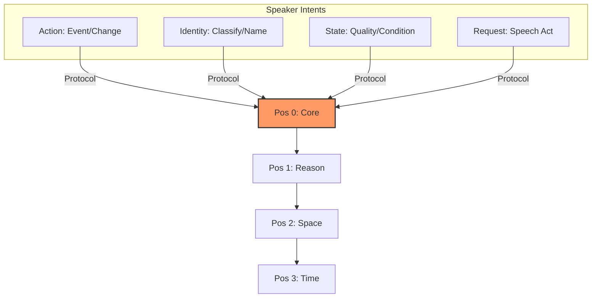
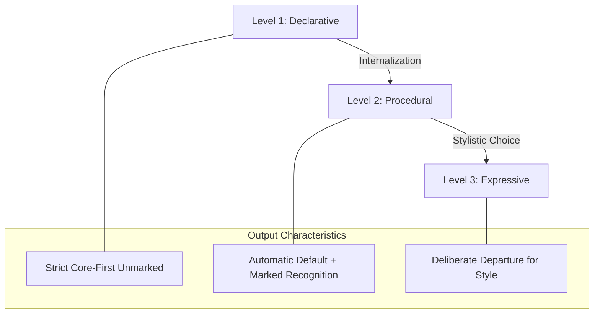

# What "Core" Means in CFLT — Salience, Not Syntax

> **Version:** 1.0.0 (Internal Draft)
> **Author:** CFLT Core Team
> **Organization:** [CFLT.center](https://cflt.center)
> **License:** [CC BY 4.0](https://creativecommons.org/licenses/by/4.0/)

---

## 1. The Core Misreading: "CFLT is verb-first / predicate-first."

> **Canonical definition site.** This document is the canonical definition of "salience anchor" / "Core" in CFLT. Other foundations docs (`linguistics.md` §1.1, `logic.md` §1, `mathematics.md` §1.1) refer back here for the constituent-type-agnostic definition; do not redefine the term elsewhere.

This is **wrong**, and the misreading would undermine the entire pedagogical and AI-alignment case for CFLT. The protocol is grounded in human cognition and is meant to produce **comprehensible human language**, not formal-logic notation or typologically rare verb-fronting word order.

The "Core" in CFLT is the **salience anchor** of the discourse. It is the constituent that the speaker is fundamentally "committing to" or "asserting" as the primary event or state.

The Core may *coincide* with the verb or predicate, but it is not defined by them. The CFLT Protocol places the Core in linear position 0; what fills position 0 depends on what the speaker is actually asserting.

### 1.1 Comparison Table

| Term | Domain | Definition | Example |
|---|---|---|---|
| **Verb** | Syntax | A grammatical category of words | "eat", "believe", "be" |
| **Predicate** | Formal logic | A function mapping individuals to truth values | $P(x, y)$ |
| **Figure** | Cognitive semantics (Talmy 2000) | The foregrounded entity/event | "*The cat* is on the mat" |
| **Core (CFLT)** | This project | The salience anchor — the committed assertion | "*I went out*, because it rained" |

These categories overlap in many sentences but are distinct. CFLT's Core is essentially the **Figure** of the discourse: the event or entity whose site, path, or orientation is the variable at issue. The subsequent slots (Reason, Space, Time) act as the **Ground**—the reference frame that provides the "stationary" setting for the Figure.

Talmy's **Contingency Principle** further supports this: humans naturally prioritize the event that is contingent on the frame. In the CFLT Protocol, the Core (the contingent event) is placed first, followed by the modifiers that provide its frame of reference.

---

## 2. The Four Types of Core

Every well-formed CFLT utterance commits to one of these four core types in position 0:

| Type | Example (CFLT-L2 form) | What's foregrounded |
|---|---|---|
| **Action** | *I didn't go out*, because... | The event / change of state |
| **Identity** | *That girl is my sister*, wearing... | The classification / naming |
| **State** | *I'm exhausted*, because... | The condition / quality |
| **Request** | *Could you pass the salt*, please... | The speech act / desired outcome |

The selection of Core is a **semantic decision** the speaker makes ("what am I really trying to say?"). The placement of Core in position 0 is the **protocol** CFLT enforces.

### 2.1 The Event Nucleus: Core's Internal Structure

The Core occupies position 0 as a single attention unit, but **what fills that unit is not necessarily a single word**. It is the **event nucleus** — the predicate together with the participants and manner that are inseparable from the event itself.

CFLT operates as a **two-tier model**:

| Tier | Contents | Listener question it answers | Position |
|---|---|---|---|
| **Tier 1: Event Nucleus** | Predicate (Action/Identity/State/Request) + valence-bound participants (subject, object, instrument, beneficiary, recipient) + manner adverbials | *What happened?* (including who, to-whom, with-what, how) | Slot 0 (Core) |
| **Tier 2: Ground Frame** | Reason / Space / Time | *Why? Where? When?* | Slots 1–3 |

The event nucleus is a single salience unit because the listener processes it as one foregrounded chunk: *"I baked the cake with butter, slowly, for my mom"* presents **one event**, not five. Whereas *"in the kitchen, yesterday"* are scene-setters that are conceptually independent of the event.

**Why this is cross-linguistically rigorous:**

- The **internal assembly** of the event nucleus uses each language's native syntax — case marking in Japanese/Korean/Turkish, prepositions in English/Romance/Chinese, coverbs in Chinese, particles in Japanese. CFLT does **not** mandate how to assemble it. Each language's "hardware" handles this.
- CFLT only governs the **boundary between event nucleus (Slot 0) and ground frame (Slots 1–3)**, plus the order within the ground frame. This is the protocol layer.

**Theoretical kin (alignment with existing frameworks):**

- **Role and Reference Grammar (Van Valin & LaPolla 1997)** distinguishes Nucleus (predicate) / Core (predicate + arguments) / Periphery (circumstantial adjuncts). CFLT's two-tier model can be viewed as a **functional merging of RRG's Nucleus and Core** into a single "event nucleus," with RRG's Periphery corresponding to CFLT's ground frame. This is a documentation-layer compression for pedagogical clarity, not a theoretical disagreement.
- **LFG c-structure / f-structure separation** and **HPSG linearization theory** independently realize the same "protocol layer + implementation layer" split: f-structure (functional, cross-linguistically aligned) and c-structure (constituent, language-specific surface order) match CFLT's "protocol layer + event-nucleus assembly" decomposition.
- **Cinque (1999)** places manner adverbs at the **lowest (most VP-internal)** functional projections in the cartographic adverb hierarchy — closest to the predicate. CFLT's placement of manner inside the event nucleus is consistent with Cinque's positioning, though Cinque treats manner as Spec-of-FP rather than valence-bound; CFLT's "manner inside Core" is best read as "manner adjacent to the predicate in the linearization, not necessarily syntactically valence-bound."

Below the protocol layer, each language uses its own machinery; above it, all languages share one ordering. This is what makes CFLT a **protocol** rather than a syntactic prescription, and what makes it **universally applicable** without violating any language's typology.

> **Honest caveat — fluency vs complexity trade-off.** CFLT's two-tier model reduces working-memory load by externalizing the linearization decision (Sweller's Cognitive Load Theory). This benefit is strongest at **early-to-intermediate** proficiency. Skehan's (1998) Trade-off Hypothesis warns that formulaic templates can plateau learners on *fluency* at the cost of *complexity* and *accuracy* — i.e., learners stay safe inside the template instead of pushing for restructuring. CFLT therefore should be paired with progressive task-complexity escalation (see `pedagogy.md` §6 on weak-TBLT) so that intermediate-and-above learners are pushed beyond the unmarked default into marked deviations (see §6 here on the proficiency arc).

### 2.2 The Boundary Rule: What Goes In Core vs The Ground Frame

A modifier belongs **inside the event nucleus** (Slot 0) if it answers an internal question about the action itself:

- **How** was it done? → manner (*slowly, carefully, in a hurry*)
- **With what** instrument or means? → instrument (*with butter, by phone, by car, via API*)
- **For / to whom**? → beneficiary, recipient (*for my mom, to my friend*)
- **Together with whom**? → accompaniment (*with John, with the team*)
- **In what mood**? → modal (*probably, certainly, maybe*) — attaches to predicate
- **Negated**? → negation (*didn't, never, hardly*) — attaches to predicate

A modifier belongs **in the ground frame** (Slots 1, 2, or 3) if it answers a question about the world frame around the event:

- **Why?** (cause / purpose / condition) → Slot 1 [Reason]
- **Where?** (physical location, abstract domain, medium) → Slot 2 [Space]
- **When? How often? How long?** → Slot 3 [Time]

**Diagnostic — the substitution test**: *"Can the modifier change without the event changing?"*

| Modifier change | Same event? | Verdict |
|---|---|---|
| *slowly* baked → *quickly* baked | No (different action quality) | Inside Core (manner) |
| *with butter* → *with margarine* | No (different recipe = different event) | Inside Core (instrument) |
| *in the kitchen* → *in the garden* | Yes (same event, different scene) | Ground frame (Space) |
| *yesterday* → *today* | Yes (same event, different time) | Ground frame (Time) |
| *because tired* → *because curious* | Yes (same event, different motivation) | Ground frame (Reason) |

**If still ambiguous — the listener-question test**: which question does the listener naturally ask first?
- *"what + how + with-what + for-whom"* → inside Core (the event itself)
- *"why / where / when"* → ground frame (the world around the event)

For comprehensive boundary cases and a 50-example reference table, see [`../methodology/slot-disambiguation.md`](../methodology/slot-disambiguation.md).

### 2.3 Layer-by-Layer Universality: What's Universal, What's Language-Specific

A common confusion is whether CFLT prescribes the *same form* across all languages, or merely the *same protocol*. The answer differs by layer. The table below is the canonical reference.

| Layer | Content | Universal? | Role of any specific language (incl. English) |
|---|---|---|---|
| **L1: Protocol** | Core in position 0; ground frame in order Reason → Space → Time | **Yes — universal** | No language is privileged. The protocol is language-agnostic. |
| **L2: Slot semantics** | Which functional question each slot answers (Why → Reason; Where → Space; When → Time) | **Yes — universal** | These are functional categories, not surface syntax. |
| **L3: Event-nucleus internal assembly** | How predicate + valence + manner are arranged inside Core (case marking, particles, prepositions, coverbs, word order within the nucleus) | **No — fully language-specific** | Each language uses its own native syntax. CFLT does not prescribe internal Core structure. |
| **L4: Boundary edge cases** | Whether *"with X"* / *"in X"* / etc. attach inside Core or to a ground-frame slot | **Mostly universal, with language-specific edge cases** | English may serve as a *verification anchor* but is not the judge. Each language's functional analysis governs. |

**Principled implication for English's role.** English is used in this documentation as the **default illustrative language** because English-language docs reach the broadest audience and English-trained LLMs understand it best. English can also serve as a **verification anchor** (translate a contested slot assignment into English to check whether the same answer survives the round-trip). But English **must not** become:

- The judge of where Core boundaries lie in non-English target languages
- A required intermediate hop for cross-language pairs (e.g., a Mandarin↔Japanese learner does not have to route through English)
- The implicit referent of "L1" or "L2" — those terms are *learner-relative*, not English-relative

CFLT's universality claim is restricted to L1 and L2 above. The other two layers explicitly delegate to language-specific machinery, and that delegation is what makes the universality claim defensible. For practical operationalization of L4 in specific language pairs, see the [language-pair guides](../methodology/language-pair-guides/index.md).

---

## 3. CFLT Outputs Are Comprehensible Human Language

A common concern is that forcing a fixed order makes sentences "unnatural" or "un-English."

**No, because CFLT does not invert syntactic word order.** Compare:

| Form | Sequence | Naturalness |
|---|---|---|
| **CFLT-L2** | *I didn't go out, because it rained, at home, yesterday.* | Comprehensible English, slightly clipped, parseable by any reader and any modern LLM |
| Idiomatic English (post-Grammar-Overlay) | *Yesterday it rained, so I stayed home and didn't go out.* | Native fluent form, derived from CFLT by the Grammar Overlay |

CFLT-L2 sits between alien constructions and fully idiomatic prose. It's the **scaffold form**: comprehensible and consistent enough to anchor learning and machine processing, while carrying enough native flavor that humans don't reject it.

---

## 4. Why CFLT Aligns with LLMs

Modern LLMs are trained on the "manifold" of natural human language. If CFLT were a formal logical notation like `[GO(I, HOME, YESTERDAY)]`, models would require specialized fine-tuning or few-shot prompts to handle it.

- A CFLT-L2 prompt (*I went, because... at... yesterday*) is **slightly off-idiomatic but firmly in distribution** — it looks like clipped, structured English that LLMs handle well.

This is the deeper reason CFLT aligns with LLM behavior: not because LLMs love formal logic, but because **CFLT stays inside the human-language manifold while imposing useful structure on it**. The Core-First protocol is a constraint within natural language, not a replacement for it.

---

## 5. The Role of the Intermediate Scaffold

The core-concept document defines the "unmarked" middle ground between thought and speech.

1. **Reduced restructuring cost.** L1 thought no longer needs to be re-parsed into L2 surface order; both languages share the CFLT intermediate scaffold (see `mathematics.md` §9).
2. **Stable attention anchor.** LLMs focus most heavily on position 0; the protocol ensures that position 0 is always the most important word (see `llm.md` §2).
3. **Foundation for stylistic flexibility.** Once the Core-First habit is automatic, learners can deliberately depart from it for rhetorical effect (foregrounding time, hedging, etc.). CFLT is a *base case*, not a ceiling.

The Grammar Overlay layer (in the product) is what polishes CFLT-L2 into native-idiomatic L2 — and over time, the learner internalizes both layers and chooses naturally between them.

---

## 6. Expressive Variability: CFLT Is the Unmarked Default, Not the Only Permitted Form

A language without word-order variation would be a dead code. Real languages allow:
- *"I didn't go out yesterday."* (Unmarked)
- *"Yesterday, I didn't go out."* (Marked: time is foregrounded)
- *"It was yesterday that I didn't go out."* (Cleft: focus on time)

If CFLT proposes a single fixed order, does it conflict with this reality?

No.

CFLT proposes Core-First as **the unmarked conceptual default** for its target use cases — not as the only permitted form.

| Form | Status | Function |
|---|---|---|
| **CFLT-L2 (Core-First, four slots)** | Unmarked default | Neutral assertion; baseline for learners; consistent format for AI processing |
| Marked forms (fronted time, etc.) | Available for rhetorical use | Emphasizing specific context; contrastive focus; narrative flow |

CFLT does **not prohibit** marked deviations. It says: *if you have no special rhetorical purpose, the default is Core-First. When you do have such a purpose, depart deliberately.*

The problem for adult L2 learners is not "how to emphasize time"; the problem is "how to say anything at all without freezing." By removing the variability of the unmarked default, CFLT provides the **cognitive stability** needed to achieve basic fluency.

CFLT accelerates the learner's progression by giving them the unmarked default first, **then** introducing marked deviations as the next learning layer. This is consistent with how native speakers acquire grammar (default first, exceptions later), with skill acquisition theory (declarative→procedural→automatic with deliberate variation), and with cognitive load theory (build a single schema, then specialize).

### The Proficiency Arc:

1. **Declarative stage.** Learner explicitly applies the CFLT Protocol. Output is consistently unmarked Core-First. The default is being installed.
2. **Procedural stage.** The protocol becomes automatic. The learner can produce the unmarked default without thinking. They begin to **recognize** marked deviations in input — *"why did the speaker put 'yesterday' first there?"*
3. **Expressive stage.** Learner has internalized both the default and a growing inventory of marked deviations. Choices among orderings are deliberate stylistic decisions. CFLT becomes a fallback when cognitive load is high (under stress, in unfamiliar topics) or precision is required.

---

## 7. Summary: What We Mean by "Core"

This view does not weaken CFLT's central claim — it strengthens it:

> **The cognitive core of an utterance is its universally-prioritized position.**

CFLT is therefore best characterized as: **an unmarked default that can be deliberately departed from, with the departure itself becoming meaningful.**

### Misreading Refutation Matrix

| Misreading | Correction |
|---|---|
| "CFLT is verb-first." | CFLT is **salience-first**. The Core may be a verb phrase, a copular complement, a state descriptor, or a speech act. |
| "CFLT contradicts language typology." | CFLT makes no descriptive claim about natural-language word order. It is a **pedagogical and computational protocol** that overlays a fixed conceptual order. |
| "CFLT produces alien sentences." | CFLT-L2 is comprehensible (not idiomatic) English. The Grammar Overlay layer handles idiomaticity. |
| "CFLT is formal-logic notation in disguise." | CFLT is **natural language with constrained linearization**. The notation `P(a,b,c)` is an analogy for one direction of the protocol, not the protocol itself. |
| "CFLT only works for action sentences." | CFLT accommodates four core types (action, state, identity, request). The protocol is uniform; what fills position 0 varies. |
| "CFLT bypasses native idiom." | CFLT is a scaffold layer; native idiom is the surface layer that the Grammar Overlay produces. They coexist, they don't compete. |
| "CFLT forbids saying things any other way." | No. CFLT is the **unmarked default**. Marked deviations (topicalization, fronting, clefts) are part of mature fluency and are explicitly accommodated — see §6. |
| "CFLT is the endpoint of language learning." | CFLT is the **scaffold for the unmarked default**. Mastery includes deliberate departures from the protocol when the rhetorical context calls for them. |

---

## 8. Implications for Foundation Docs

- **`linguistics.md`** — Talmy's Figure and Langacker's profile are the right linguistic kin. Surface word-order typology is **not** the right frame for evaluating CFLT, because CFLT does not claim a typological universal.
- **`logic.md`** — Predicate logic notation `P(a,b,c)` is an analogy for *function-application order*, not for the literal surface form CFLT produces. CFLT is a natural-language overlay inspired by this order, not a notational replacement for it.
- **`mathematics.md`** — The search-space reduction ($4! \to 1$) applies specifically to the marked/unmarked decision for the four slots.

---

## 9. Formal Definition for Implementers

For the Logic Transformer engine and for any future AI agent extending the CFLT Protocol:

> **The Core is the event nucleus — the predicate together with all participants and manner inseparable from the event itself.** Formally: it is the smallest constituent that, uttered alone, identifies the speaker's primary intent (Action, Identity, State, or Request) **including any valence-bound participants** (subject, object, instrument, beneficiary, recipient) **and manner adverbials**, such that the message remains functionally useful even if contextually incomplete.

The Core may be lexically simple (one verb) or structurally rich (a predicate with multiple valence slots filled and manner adverbials attached), but it functions as **one salience unit at position 0**. The CFLT Protocol does not prescribe how the event nucleus is internally assembled — that is delegated to each language's native syntax. The protocol governs only the **boundary** between event nucleus and ground frame (slots 1–3) and the **order** within the ground frame.

This definition is **language-agnostic** (no language is privileged in event-nucleus assembly), **constituent-type-agnostic** (the four core types Action/Identity/State/Request all unify under "predicate + valence + manner"), and **operationally testable** via the substitution and listener-question diagnostics in §2.2.

---

## 10. Final Word

CFLT is **Core-First**, not verb-first, not predicate-first, not formal-logic-first. The Core is a salience anchor selected by the speaker's intent, placed in position 0 by the protocol, and surrounded by `[Reason] → [Space] → [Time]` modifiers.

Crucially, CFLT defines the **unmarked default**, not the only permitted form. Human languages have multiple expressive forms for any meaning, and that variability is essential to communication. CFLT gives learners and machines a reliable default; deliberate marked deviations from that default are the mark of advanced fluency and are explicitly part of the proficiency arc. The scaffold is the start, not the ceiling.

---

## See Also

- [`linguistics.md`](./linguistics.md) §2 — Talmy's Figure-Ground and Langacker's profile-base, the cognitive-linguistic kin of "salience anchor."
- [`logic.md`](./logic.md) §5 — How the four core types map onto Searle's illocutionary classes.
- [`mathematics.md`](./mathematics.md) §1.1 — Formal modeling of Identity / Request / State Cores beyond action verbs.
- [`llm.md`](./llm.md) §2.4 — How non-action Cores (Identity, Request) interact with the high-attention prefix region (primacy and sink combined).
- [`../methodology/human-learning.md`](../methodology/human-learning.md) §2 — The 3-step protocol that operationalizes "extract the Core."
