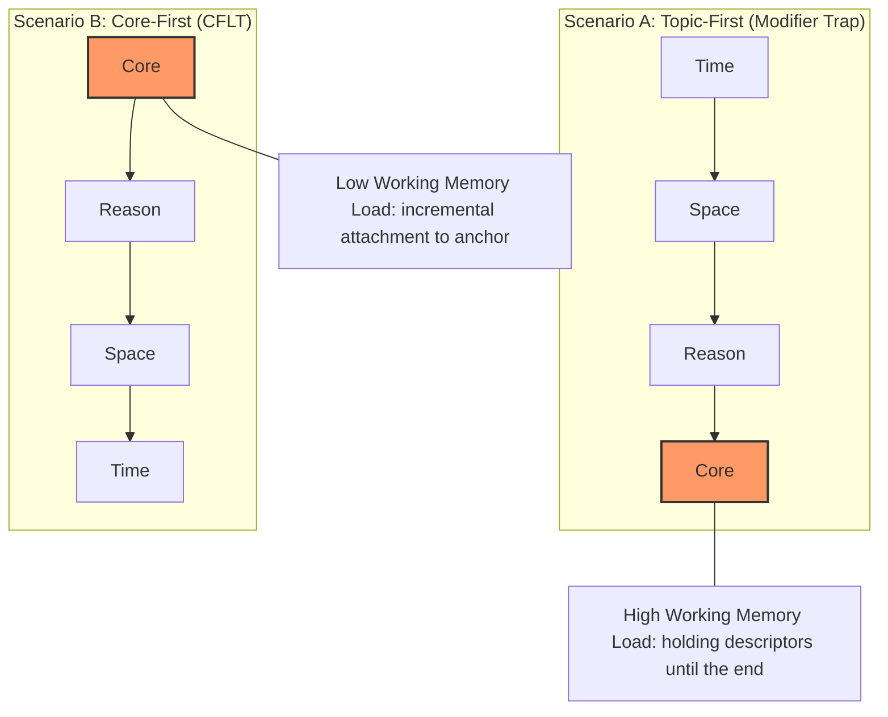
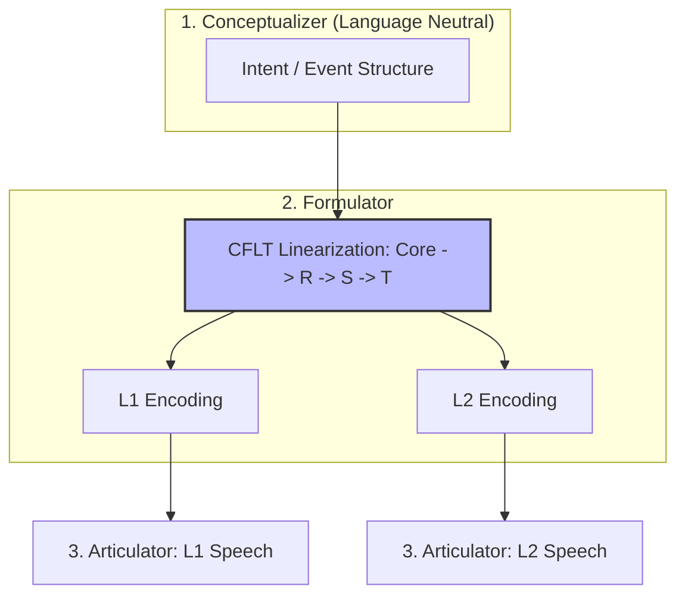

# Linguistic Foundations of CFLT

> **Version:** 1.0.0 (Internal Draft)
> **Author:** CFLT Core Team
> **Organization:** [CFLT.center](https://cflt.center)
> **License:** [CC BY 4.0](https://creativecommons.org/licenses/by/4.0/)

---

## 1. Scope: "Core-First" Is Not "Verb-First"

CFLT defines a normative sequence — `[Core] → [Reason] → [Space] → [Time]` — for both pedagogy and machine reasoning. One disambiguation belongs at the very top of any linguistic discussion of CFLT, because conflating the two concepts leads to wrong predictions about everything that follows.

### 1.1 Two different concepts that are easily confused

> **Notation.** This document and the rest of the project use the standard typological abbreviations **S = Subject, V = Verb, O = Object**, combined into the six possible permutations: SOV, SVO, VSO, VOS, OVS, OSV. They denote the *default surface order* of these three constituents in a transitive declarative clause. Example: "I (S) ate (V) rice (O)" — English is SVO. "I-rice-ate" — Japanese is SOV. "Ate-I-rice" — Welsh is VSO. Cross-linguistically, SOV (~45%) and SVO (~42%) dominate; VSO (~9%) is third; VOS / OVS / OSV are rare. (Greenberg 1963; Dryer 2013.) These abbreviations describe **syntax**, not the cognitive linearization CFLT prescribes.

| Concept | Level | What it claims | Example |
|---------|-------|---------------|---------|
| **Verb-First (VSO)** | Surface word order | The finite verb precedes subject and object | "Went I to the store" — rare in English; the natural form in Welsh, Classical Arabic |
| **Core-First (CFLT)** | Conceptual linearization | The salience anchor is committed to first | "I went to the store, yesterday" — comprehensible English with a fixed conceptual order |

Verb-First is a **syntactic** category that classifies languages by their default constituent order. Core-First is a **cognitive-pragmatic** principle that orders the speaker's commitments. The two operate at different levels and make different predictions.

The "Core" in CFLT is a **salience anchor** — the constituent the speaker is fundamentally committing to. It may be a verb phrase ("I went out"), a copular complement ("That girl is my sister"), a state ("I'm exhausted"), or a speech act ("Could you help me"). See [`core-concept.md`](./core-concept.md) §1 for the canonical definition; this section adopts that definition without re-stating it.

### 1.2 What this means for the typological literature

Word-order typology (Greenberg 1963; Dryer 2013) — SOV (~45%), SVO (~42%), VSO (~9%) — describes where the *verb* falls in surface word order. This literature is **largely orthogonal to CFLT**. CFLT does not claim a typological universal, does not propose VSO as a target form, and does not predict that natural languages should reorganize their surface syntax. CFLT is a normative conceptual scaffold layered *on top of* whatever surface order the target language uses; the resulting **CFLT Form** is comprehensible natural-language English (or French, Japanese, etc.), not a typologically rare construction.

### 1.3 What the linguistic case actually rests on

1. At the **conceptual** level (pre-verbal message formation; Levelt 1989), the salient event/state/identity/request is cognitively prior — this *is* well-supported.
2. As a **pedagogical scaffold**, surfacing the conceptual core in linear position reduces L1→L2 restructuring cost.
3. As an **AI prompt protocol**, Core-First aligns with documented Transformer attention biases (see `llm.md`) — and crucially, it does so while staying inside the natural-language manifold that LLMs were trained on.

The linguistic case for CFLT is drawn primarily from **cognitive linguistics, information structure, and speech-production theory** — kin notions like Figure (Talmy), profile (Langacker), Topic, and Theme — not from typological generalizations about verb position.

---

## 2. Cognitive Linguistics: Figure-Ground and Profile

### 2.1 Talmy's Figure-Ground in Language
> **Canonical introduction.** This section is the canonical treatment of the Figure-Ground asymmetry in CFLT. Refracted through other lenses in `neuroscience.md` §2 (neural correlates), `core-concept.md` §1 (generalization to "salience anchor"), and `manifesto.md` §2.2 (top-level framing).

Talmy (2000, *Toward a Cognitive Semantics*) argues that linguistic structure systematically reflects the cognitive distinction between **Figure** (the salient, foregrounded entity or event) and **Ground** (the backgrounded reference frame providing context).

> "The Figure is a moving or conceptually movable entity whose path or location is at issue; the Ground is a reference entity with respect to which the Figure's path or location is characterized." (Talmy 2000:312)

**CFLT Protocol mapping:**
- `[Core]` = the Figure (what happened)
- `[Reason] → [Space] → [Time]` = the Ground (under what circumstances)

CFLT thus codifies a **Figure-First** linearization of the Figure-Ground asymmetry. While natural languages distribute Figure and Ground across multiple word-order strategies, the cognitive primacy of the Figure is robust. Talmy's **Contingency Principle** further suggests that humans prioritize the event that is contingent on the frame; in the CFLT Protocol, the Core (contingent event) is placed first, followed by the frame-providing Ground modifiers.

### 2.2 Langacker's Profile-Base Distinction
In Cognitive Grammar (Langacker 1987, 2008), every linguistic expression has a **profile** (the entity or relation foregrounded for attention) against a **base** (the conceptual content presupposed). The profile is what the expression "is about."

**CFLT mapping:** the Core Action *is* the profile of an event-denoting clause. CFLT enforces that the linear utterance opens on the profile, not the base.

---

## 3. Parsing Efficiency: Early Immediate Constituents (EIC)

> **Canonical introduction.** This section is the canonical psycholinguistic statement of EIC in CFLT. Refracted in `mathematics.md` §3 (CRD ratio formalism), `neuroscience.md` §4 (BA 44 / lpSTG dependency-length effects), and `pedagogy.md` §4.1 (the "Modifier Trap" as the pedagogical face of EIC).

Beyond conceptual salience, CFLT is supported by the psycholinguistic requirement for parsing efficiency. John Hawkins (1994, 2004) proposes the **Early Immediate Constituents (EIC)** principle: the human processor prefers word orders that allow it to identify the major building blocks (ICs) of a phrase within the shortest possible window.

### 3.1 Minimizing the Constituent Recognition Domain (CRD)
The CRD is the word-count required to identify all ICs of a phrase. Efficiency is the ratio of ICs to the CRD.

By placing the Core in position 0, CFLT ensures that the "anchoring" constituent of the main clause is identified immediately. This results in an **EIC ratio approaching 100%** for core recognition, drastically reducing the "look-ahead" load on working memory. This is particularly beneficial for L2 learners who have limited cognitive resources for managing incomplete syntactic trees.

### 3.2 Incremental Processing vs. the Modifier Trap

CFLT creates a **head-initial** structure at the discourse level. This enables **incremental processing**: the brain can "attach" details to a known core as they arrive. In contrast, head-final (Topic-First) languages like Chinese often place complex modifiers before the head, forcing the listener to hold a string of descriptors in memory before knowing what is being described — the "modifier trap." CFLT eliminates this trap for the L2 learner.

---

## 4. Information Structure: Theme, Rheme, Given, New

### 4.1 Functional Sentence Perspective (Prague School)
Mathesius (1929), Firbas (1992), and the Prague School developed the concept of **Communicative Dynamism (CD)**: every clause-element carries a degree of "newness" or informational push. The element with the highest CD typically falls toward the end of the clause in English ("end-focus"), but the **thematic** element — what the message is *about* — typically opens the clause.

**Tension with CFLT:** Functional Sentence Perspective predicts that *new and important* information ends a sentence (end-focus, end-weight). CFLT puts the most important information first.

**Resolution:** CFLT is not about packaging information for a hearer who already shares context (where end-focus optimizes); it is about **unambiguously asserting the action as the topic** for a hearer who does not yet share context. CFLT thus aligns with Topic-Comment structures in topic-prominent languages (Li & Thompson 1976) where the topic — here, the core action — anchors the clause.

### 4.2 Givenness Hierarchy and Accessibility
Gundel, Hedberg & Zacharski (1993) and Ariel (1990) describe how speakers manage referent accessibility: more accessible (given) referents take shorter, earlier-mentioned forms. CFLT intersects with accessibility theory in that the Core Action, once fronted, becomes the accessible "given" against which all subsequent modifiers are interpreted.

### 4.3 R-S-T Inner Order: Convention with Rationale (Not Derivation)

CFLT's claim that **Core occupies position 0** is a *multiply-motivated convergence* — it is supported by seven independent strands of evidence (Talmy's Figure-Ground, Hawkins' EIC, Salience Network, Levelt's Conceptualizer, early-prefix conditional-entropy stability, Transformer **primacy effect** — note that attention sinks are a separate softmax-stability artifact, see `llm.md` §2.3, and Gricean Relevance). See `core-concept.md` §1, this document §2-3, `neuroscience.md` §1, `mathematics.md` §2, `llm.md` §2. ("Derivation" is loose here — the seven strands jointly motivate the claim but do not individually compose a formal proof.)

The internal order of the three ground-frame slots — **Reason → Space → Time** — is a different matter. It is a *convention* selected from $3! = 6$ permutations of the modifier slots. CFLT does not claim to derive this specific permutation from first principles; it claims only that **fixing some consistent order is better than letting the order float**.

The convention rests on three rationale arguments, none of which is a proof of optimality:

1. **Listener-question priority (Gricean Relevance).** After receiving the Core ("what happened"), the listener's most discourse-coherent next question is "why?" — the *cause* makes the event interpretable. *Where* and *when* are scene-locators that the listener can usually defer or infer from context. Reason therefore sits closest to Core.

2. **Concreteness ladder.** Spatial information is more concrete (visualizable, perceptible) than temporal information (which is more deictic and abstract). Working memory benefits from a concrete-to-abstract progression: hearing *where* helps the listener mentally place the event before the more abstract *when* binding closes the scene.

   > **Honest engagement with the cross-linguistic counter-evidence.** The space-over-time concreteness asymmetry is **not** a culture-neutral universal. The conceptual-metaphor literature consistently shows that humans recruit spatial structure to talk about time (Lakoff & Johnson 1980; Clark 1973), but the *direction* of the spatial mapping is language-specific. Boroditsky (2000, 2001) shows that English speakers prefer a horizontal time axis while Mandarin speakers also recruit a vertical axis (上週 "last week" lit. "up week"); Casasanto & Boroditsky (2008) show that the asymmetry runs *space → time* (manipulating spatial distance changes time judgments more than the reverse manipulates spatial judgments), but Núñez & Sweetser (2006) document Aymara, where the future is spatially behind and the past in front — i.e., the deictic anchor for time is inverted. Evans (2004, *The Structure of Time*) argues that "time" itself is internally heterogeneous (deictic time, sequence time, duration, matrix time) and that each subtype has different spatial / non-spatial cognitive grounding. **The concreteness rationale therefore generalizes only to languages where the dominant time-talk strategy is spatially-mediated.** For languages or registers where time is encoded grammatically (tense / aspect / evidentiality) rather than via spatial metaphor, the rationale weakens. CFLT's R-S-T should be understood as *provisionally* defensible on this rationale for the typological range surveyed; a cross-linguistic test of whether the listener-question priority alone (rationale (i)) suffices to motivate R-S-T without rationale (ii) is an open empirical question (see `methodology/evaluation-metrics.md` and `methodology/empirical-agenda.md`).

3. **Deictic recoverability.** In conversational contexts, time often has a recoverable default ("now" or "the time being discussed") — placing it last allows omission without information loss in many contexts. *Honest scope*: Levinson (1983) treats speaker / time / place as the three primary deictic axes without arguing one is more recoverable than another; the claim that time is *more* recoverable than space is a CFLT empirical observation about non-co-present L2 discourse, not a theorem of deixis theory. Spatial defaults ("here") exist too but tend to be weaker in classroom or remote-collaboration contexts, which is the most common L2 use case.

These are **engineering arguments**, not derivations. A protocol with order Core → Reason → Time → Space could be defended by competing arguments. The strongest such competitor in the discourse-analysis literature is the **temporal-anchor-first** position: Reinhart (1984, "Principles of Gestalt Perception in the Temporal Organization of Narrative Texts") argues that in narrative discourse, temporal location is the primary structural anchor — readers organize event sequences by *when* before *why*.

We treat this not as a deferred problem but as a **genre-conditional admission**: Reinhart's account is well-supported for narrative *discourse*, and CFLT's L2 conversational/expository default should not be read as a claim about narrative production. Three substantive responses, taken jointly:

- **Genre scope.** Reinhart's evidence base is narrative texts (the temporal-organization-of-narrative literature, from Labov 1972 onward), where the genre convention is itself a structural anchor — temporal succession *is* the discourse skeleton. CFLT's primary use cases (conversational request, expository explanation, agentic LLM instruction) are not narrative; in them, the genre convention does not pre-anchor time, and the listener-question priority (rationale (i)) does pre-anchor reason. The disagreement therefore narrows to a domain-of-application disagreement rather than a contradiction.
- **Working-memory cost in non-narrative discourse.** In a non-narrative utterance like *"I went out, because it rained, at home, yesterday,"* fronting Time (*"yesterday, I went out, because it rained..."*) reverses the direction of Hawkins-EIC efficiency for the Core anchor and requires the listener to hold a time-frame for the duration of the Core+Reason before it pays off. This is a working-memory cost Reinhart's narrative argument does not pay, because narrative listeners are already in a time-tracking mode. The non-narrative listener is not.
- **Empirical falsifier.** If R-T-S reliably outperforms R-S-T for *non-narrative* L2 production across ≥ 2 languages (controlled for vocabulary and proficiency), CFLT should adopt R-T-S as the unmarked default and Reinhart's intuition wins. If R-T-S only outperforms R-S-T for narrative production, the appropriate response is a **genre-conditional protocol**: R-S-T for expository / conversational / instructional registers, R-T-S for narrative. `methodology/empirical-agenda.md` §3.1 and `evaluation-metrics.md` §4.2 specify the comparison protocol.

CFLT chooses R-S-T (over R-T-S, T-R-S, or any other permutation of the three) because in the project's two targeted use cases (L2 conversational/expository pedagogy and LLM prompt stability), the listener-question priority and concreteness-ladder rationales above jointly outweigh narrative-temporal-anchoring within the typological range surveyed in §2.5; the genre-conditional question remains an **open optimization question** (see `mathematics.md` §12.2 and `methodology/evaluation-metrics.md` for the empirical protocol that would settle it).

**Operational consequence.** CFLT's strong claim ("Core in position 0") is fully derivable; CFLT's weaker claim ("R then S then T") is a documented convention with stated reasons. This distinction matters for anyone proposing extensions or alternatives — Core-first is not negotiable; R-S-T may be revised if empirical evaluation (see `methodology/evaluation-metrics.md`) shows another permutation outperforms it for a given language pair.

### 4.4 Coverage Boundary: Comparison with Halliday's Circumstance Roles

Systemic Functional Linguistics (Halliday & Matthiessen 2014) decomposes circumstantial adjuncts into nine semantic roles. CFLT's three ground-frame slots are a deliberate compression of this taxonomy. The compression is honest only if we list which Halliday roles map to which CFLT location:

| Halliday Circumstance Role | CFLT Location | Notes |
|---|---|---|
| **Extent** (duration, frequency) | Slot 3 [Time] | All temporal extents collapse here |
| **Location: place** | Slot 2 [Space] | Physical location |
| **Location: time** | Slot 3 [Time] | Time-point |
| **Manner: quality** (e.g., *slowly*) | **Inside Core** (event nucleus) | Manner adverbial bound to predicate |
| **Manner: means** (e.g., *by phone*) | **Inside Core** (instrument) | Treated as instrument, valence-bound |
| **Manner: comparison** (e.g., *like X*) | **Inside Core** (manner sub-type) | Adverbial of comparison |
| **Cause: reason** | Slot 1 [Reason] | Primary mapping |
| **Cause: purpose** | Slot 1 [Reason] | Sub-type with functional word *in order to* |
| **Cause: behalf** (beneficiary, e.g., *for X*) | **Inside Core** (beneficiary) | Valence-bound participant |
| **Contingency: condition** (e.g., *if X*) | Slot 1 [Reason] | Sub-type with functional word *if* |
| **Contingency: concession** (e.g., *despite X*) | Slot 1 [Reason] | Sub-type with functional word *although* |
| **Contingency: default** (e.g., *in the absence of X*) | Slot 1 [Reason] | Conditional sub-type |
| **Accompaniment** (comitative, e.g., *with John*) | **Inside Core** (accompaniment) | Valence-extension of predicate |
| **Role** (e.g., *as a teacher*) | Slot 2 [Space] (role-as-domain) or **Inside Core** | Marginal; usually role-as-identity goes inside Core when it's the Core type itself |
| **Matter** (e.g., *about X*, *concerning X*) | Slot 2 [Space] (matter-as-domain) | Sub-type of abstract domain |
| **Angle** (e.g., *according to X*) | Slot 2 [Space] (angle-as-domain) | Source-of-information sub-type |

**Summary**: of Halliday's 9 categories with their sub-types, **6 map to ground-frame slots** (Extent, Location, all four Cause/Contingency sub-types except behalf, Matter, Angle), and **4 belong inside the event nucleus** (the three Manner sub-types and Accompaniment, plus Cause:behalf as beneficiary).

This is a **structured compression**, not an arbitrary one: the compression follows the two-tier model (event nucleus vs ground frame) defined in `core-concept.md` §2.1–§2.2. Roles internal to the event (how, with-what, with-whom, for-whom) collapse into the event nucleus; roles framing the event (why, where, when, in-what-respect) populate the ground frame.

**Honest residual**: Halliday's *Role* (e.g., *acting as a teacher*) does not have a clean home and is treated case-by-case (often dissolving into either Identity-Core or a Space-as-domain reading). This is acknowledged as a boundary case in `methodology/slot-disambiguation.md` §8.

#### 4.4.1 Matter and Angle: Why "Space-as-Domain" is Contestable

A reader familiar with SFL will object that Halliday's **Matter** (*about X*) and **Angle** (*according to X*) are categorized separately from **Location: place** *precisely because* the abstract/concrete cut is theoretically loaded — collapsing them into "Space (abstract domain)" risks losing the very distinction Halliday's taxonomy was designed to preserve. We acknowledge the objection and respond with three points:

1. **Halliday's grouping intent.** Halliday & Matthiessen (2014) group all three (Location:place, Matter, Angle) under the broader **circumstance of Location-Manner-Cause** rubric because they all answer questions of the form "in what context / domain does this hold?" Matter answers *"in what semantic domain?"* (e.g., *talked **about Bayesian inference***); Angle answers *"from whose perspective?"* (e.g., *true **according to the IPCC***); place answers *"in what physical region?"* CFLT's "Space" slot is the *functional* slot for *"in what domain (physical, semantic, perspectival) does the event hold?"* — which is a unification at the *functional* level, not at the SFL *experiential* level. The compression is therefore lossy at the experiential layer and faithful at the functional layer.

2. **Operational test for the compression.** A modifier belongs in CFLT Slot 2 (Space) if it answers the listener's *"in what domain does this hold?"* question; otherwise it belongs in Tier 1 (event nucleus) or Slot 1 (Reason). On this test, Matter (*about X*) and Angle (*according to X*) pass — they restrict the *domain* in which the event's truth or relevance is asserted. Place (*in X*) also passes. Treating them as a single CFLT slot is a deliberate functional-level abstraction, not a claim that Halliday's experiential distinctions are illusory.

3. **Where the compression breaks.** Cases where Matter/Angle interact pragmatically with the Core (e.g., *"According to the speaker, p"* is a hedged-assertion construction, not a domain-restricting adjunct of *p*) belong **inside the event nucleus** as illocutionary modifiers, not in Slot 2. The slot-disambiguation reference handles these edge cases.

In short: CFLT's three-slot compression is **functional-level lossless** for the unmarked default but **experiential-level lossy** in a way SFL practitioners will rightly notice. We adopt the functional-level compression because the protocol is a discourse-level production scaffold, not an SFL replacement. SFL's full nine-role taxonomy remains the right tool for fine-grained discourse analysis.

---

## 5. Speech Production: Levelt's Model

Levelt (1989, *Speaking: From Intention to Articulation*) describes a three-stage production architecture:

1. **Conceptualizer** — generates the *preverbal message* (intent + event structure).
2. **Formulator** — encodes the message into grammatical and phonological form.
3. **Articulator** — produces physical speech.

Crucially, the Conceptualizer's output is **language-neutral**. The semantic core of the intended event exists before any L1- or L2-specific formulation.

**CFLT's pedagogical claim is grounded here:**

> If the preverbal message is language-neutral, then training learners to *linearize the preverbal message* in a fixed Core-First order before entering the Formulator stage decouples conceptual structuring from L1 surface grammar.

Once the message is pre-linearized as `[Core] → [Reason] → [Space] → [Time]`, both L1 and L2 formulation become token-substitution exercises over the same linearized scaffold. This is the cognitive mechanism by which CFLT reduces L1→L2 restructuring cost.

---

## 6. Universal Grammar: Two Different Senses of "Core"

A potential confusion: Chomsky's framework also uses the word "core." It is essential to keep the two senses apart.

| | **Chomsky's *core grammar*** (1981, 1986) | **CFLT's *Core*** |
|---|---------------------------------------|-------------------|
| Domain | Set of grammatical rules | A specific constituent in a specific utterance |
| What it picks out | The universal-principles + parametrized rules of a language | The salience anchor — what the speaker is fundamentally committing to |
| Status | Descriptive linguistic claim | Normative pedagogical/computational protocol |
| Example | "Subject-verb agreement is core; quirky case-marking is periphery." | "In *I went out, because…*, the Core is *went out*." |

These are two different conceptual moves on the word "core":
- **Chomsky's core** is a **classifier on the rule inventory**: which rules belong to the universal core?
- **CFLT's Core** is a **selector on a single utterance**: which constituent is the salience anchor?

CFLT's contribution is orthogonal to Chomsky's core/periphery distinction. CFLT does not classify rules; it specifies a linearization protocol. Chomsky's framework is **compatible with** CFLT (it does not forbid the protocol's linearization rule), but it does not **predict** it either. The two operate at different levels of grammatical theory.

The terminological coincidence is unfortunate but harmless once the distinction is made explicit.

### 6.1 CFLT Does Not Depend on Universal Grammar

Earlier framings of CFLT (e.g., the older draft of `manifesto.md` §2.1) read as if CFLT *extends* Chomsky's UG. That framing was rhetorical, not load-bearing. The actual load-bearing claim is much weaker: that *message formation* (the Conceptualizer stage of Levelt 1989, §5 above) is broadly shared across human language users, and that a fixed Core-First linearization at the *protocol layer* reduces L1→L2 restructuring cost. Neither sub-claim requires an innate, language-specific UG.

In particular:

- The **conceptual primacy of the speaker's salience anchor** (the "Core") can be motivated equally well from Construction Grammar (Goldberg 1995, 2006) — where the [salience-anchor + frame] arrangement is itself a learned discourse construction — or from Cognitive Grammar (Langacker 1987, 2008) — where the profile-base relation is a domain-general perceptual asymmetry — without invoking a language-specific innate device.
- The **cross-linguistic regularity** of negation/modality/aspect scoping inside the event nucleus (`core-concept.md` §2.2) is consistent with cartographic UG analyses (Cinque 1999) but is also consistent with the **typological-functional view** (Croft 2001 *Radical Construction Grammar*) that this regularity is grounded in cognitive scope-of-operator preferences rather than in a universal functional hierarchy.

We therefore treat the UG-extension framing as **one available motivation among several**, not as a dependency. Sections 5 (Levelt) and 8 (Construction Grammar) state the load-bearing case.

### 6.2 Engagement with the Anti-UG Opposition

The strong UG reading — that humans possess an innate, language-specific Language Acquisition Device — is contested by a well-developed usage-based / emergentist tradition that CFLT documentation must engage with, given its central claim of cross-linguistic regularity.

- **Tomasello (2003) *Constructing a Language*** argues that grammar is learned through general cognitive mechanisms (intention-reading, pattern-finding, analogy) over usage data — not from an innate UG. If Tomasello is right, CFLT's protocol-layer regularity must be re-grounded as an *emergent* outcome of shared message-formation pressures rather than as a manifestation of an underlying UG core grammar. We accept this re-grounding: CFLT does not depend on the innateness premise (§6.1), and the linearization-discipline benefit accrues to the *learner* on a usage-based account just as well as on a UG account.
- **Christiansen & Chater (2008) "Language as Shaped by the Brain" (*BBS*)** argues that the apparent universals of language are explained by the cognitive constraints under which language is *learned* and *transmitted*, not by an innate grammar module. This is again compatible with CFLT: the Core-first protocol can be read as a learning-and-transmission-friendly linearization (low CRD, early salience commitment) rather than as a UG-encoded universal.
- **Evans & Levinson (2009) "The Myth of Language Universals" (*BBS*)** argues that putative universals are typically statistical tendencies grounded in functional pressures, not absolute cognitive constraints. The Evans & Levinson critique is the **single most direct attack** on the kind of cross-linguistic regularity CFLT's L1/L2 layers (`core-concept.md` §2.3) claim. Saying CFLT "is compatible with" Evans & Levinson is not enough — the compatibility has to be demonstrated, not declared. Three points of substantive engagement:
  1. **Evans & Levinson distinguish absolute universals from statistical tendencies.** CFLT's L1 (protocol-layer) claim is **normative, not descriptive**. We are not claiming languages *exhibit* Core-first; we are claiming Core-first is a *good unmarked default* for cross-linguistic interfaces. Evans & Levinson's critique targets descriptive-universal claims — it does not target normative protocols.
  2. **Evans & Levinson's evidence base.** Their critique uses Pirahã (Everett 2005), Mayan languages, and a handful of Aboriginal Australian languages as the strongest counter-typology. The CFLT five-language demonstration in `core-concept.md` §2.5 covers Indo-European, Sino-Tibetan, Japonic, Koreanic, and Afro-Asiatic. **We explicitly do not generalize to Pirahã / Mayan / Aboriginal Australian / Salish / Yup'ik**. The L1/L2 universality claim is restricted to the surveyed typological range; Evans & Levinson's counter-typology lies outside it.
  3. **What would actually refute the protocol-layer claim?** If a language in the surveyed typological range (a) lacks a salience-anchor / Figure constituent at the discourse level, or (b) cannot natively express R-S-T ordering through marked or unmarked surface forms, the L1 claim is refuted for that language. We have not yet observed (a) or (b) in the five languages of §2.5, but the falsification condition is auditable.
- **Newmeyer (2005) *Possible and Probable Languages*** argues that universalist claims about cognitive primacy routinely fail under rigorous typological scrutiny, and that the appropriate domain for absolutist claims is much narrower than universals literature often assumes. CFLT engages this critique by (a) scoping its universality to the **protocol layer** (`core-concept.md` §2.3 L1/L2 layers — not L3/L4), and (b) listing the four-layer split explicitly so the boundary of the claim is auditable.
- **Counterexamples from non-event-prominent typologies.** Mithun (1992) on Yup'ik discourse-driven fronting, Aikhenvald (2004) on evidential-first languages, and Foley & Van Valin (1984) on Tagalog topic-prominence show that natural-language information packaging does *not* always foreground an event-anchored Core. This deserves more than a passing mention because it is the **strongest single typological objection to CFLT's L1/L2 universality claim**:
  1. **In Yup'ik (Mithun 1992)**, the leftmost constituent of a clause is frequently determined by pragmatic salience (newness, topic-shift, contrast) rather than by event identification. A Yup'ik speaker may legitimately front a place adverbial when the spatial frame is the discourse topic, producing structures that look pragmatically motivated rather than Core-first.
  2. **In evidential-first languages (Aikhenvald 2004) — Tariana, Tuyuca, Quechua, Aymara**, the leftmost obligatory element is an evidential marker that encodes the speaker's source of information for the proposition (visual / non-visual / inferential / reportative / hearsay). Arguably, the evidential **is** the salience anchor in these languages: it commits the speaker to a particular epistemic stance, which is the most propositionally consequential thing the speaker is doing.
  3. **In Tagalog (Foley & Van Valin 1984)**, the topic (marked by *ang*) is grammatically privileged and need not coincide with the event-anchor; topic-comment is the dominant information-packaging strategy.

  **How CFLT survives these counter-typologies.** Four points:
  - (a) **Scope restriction (already canonical).** CFLT's typological scope is explicitly the surveyed range (§2.5: Indo-European, Sino-Tibetan, Japonic, Koreanic, Afro-Asiatic). Yup'ik (Eskimo-Aleut), Tariana (Arawakan), Quechua (Quechuan), Tagalog (Austronesian) are all outside that range, and the L1/L2 universality claim does not extend to them.
  - (b) **Salience anchor ≠ event anchor.** The CFLT Core is defined (`core-concept.md` §1) as a *salience anchor*, not as an event anchor. In an evidential-first language, the evidential **could** be analyzed as the salience anchor; in a Yup'ik discourse-fronting clause, the fronted pragmatically-salient constituent **could** be the salience anchor. CFLT's protocol-layer claim is that "whatever the speaker's salience anchor is, put it at position 0" — this is consistent with the Core being an evidential or pragmatic-topic in non-event-prominent typologies, not an action verb.
  - (c) **Normative protocol vs. descriptive typology.** Even if Yup'ik's *current* default linearization is pragmatically-driven rather than salience-anchor-first, that is a fact about Yup'ik's descriptive grammar, not a fact about whether a Yup'ik L2 learner of English would benefit from a CFLT scaffold. CFLT's L1 universality claim is about the **L2-production scaffold layer**, not the L1's surface grammar.
  - (d) **The honest limitation.** These typological counter-positions reveal that the *terminology* "Core" — which has eventive resonance — risks misleading readers from non-event-prominent traditions. The canonical disambiguation (`core-concept.md` §1) addresses this by defining Core constituent-type-agnostically (four types: Action, Identity, State, Request). A possible future expansion is a fifth Core type — **Evidential / Stance Core** — to cover the evidential-first languages. This is an open empirical question (`methodology/empirical-agenda.md` SLA Track). Until that work is done, we restrict the L1/L2 universality claim to the surveyed typological range and treat evidential-first / pragmatically-ordered languages as **principled extensions pending empirical investigation**, not refuting counterexamples.

  In short: the canonical response combines (a) explicit scope restriction with (b) constituent-type-agnostic definition of Core with (c) protocol-vs-description distinction with (d) acknowledgment that CFLT terminology may need a fifth Core type for full typological coverage. None of this defends CFLT *outside* the surveyed range; it defends the *restricted* version against the *general* refutation.

**Bottom line.** The anti-UG opposition does not refute CFLT; it *narrows* the version of CFLT one is committed to. The narrower, opposition-compatible version is the version stated in this document and in `core-concept.md` §2.3 / §8.5. The earlier, broader UG-extension framing is retracted to the rhetorical-motivation layer.

---

## 7. Linguistic Relativity (Sapir-Whorf) and L2 Acquisition Friction

### 7.1 The Strong vs. Weak Hypothesis
The strong Whorfian claim — that language determines thought — is largely rejected (Pinker 1994). The **weak version** — that language influences habitual cognitive patterns — is well-supported (Lucy 1992; Boroditsky 2001).

### 7.2 Application to CFLT
For learners moving between languages with strongly divergent information packaging (e.g., Mandarin's topic-prominent + time-initial structures vs. English's subject-prominent + tense-marked structures), the cognitive friction of restructuring is real and measurable (Slobin 1996, "Thinking for Speaking").

CFLT proposes a **neutral buffer sequence** — the Core-First linearization — that **attenuates** (does not eliminate) L1- and L2-shaped cognitive habits at the production-protocol layer. Once the learner habitually produces preverbal messages in the buffer order, L2 surface formulation becomes more mechanical token substitution against a stable scaffold.

This is consistent with Slobin's "Thinking for Speaking" framework, which holds that what differs across languages is not deep cognition but the language-specific patterns of *organizing* cognition for verbal expression.

> **Honest scope (weak-Whorf engagement).** If weak Whorf is correct, the learner's L1-shaped habitus does **not** disappear when they adopt the CFLT protocol — habitual cognitive patterns (Lucy 1992; Boroditsky 2001) persist as background tendencies that the protocol overrides for the duration of a CFLT-formatted production. CFLT's claim is therefore the narrower one: the protocol provides a *deliberate-attention* scaffold that an L1-shaped speaker can use to *temporarily neutralize* the L1 organizational habit at message-formation time. Whether sustained use of the protocol weakens the underlying habit (i.e., produces a durable cognitive change) or only its production-time expression is an **open empirical question**.

---

## 8. Construction Grammar and Pedagogical Tractability

Goldberg's Construction Grammar (1995, 2006) treats grammar as a learned inventory of form-meaning pairings ("constructions") rather than abstract rules. This is highly compatible with CFLT's pedagogy:

- CFLT treats each `[Core] → [Reason] → [Space] → [Time]` slot as a **construction template**.
- Learners acquire fluency by filling slots, not by deriving sentences from abstract phrase-structure rules.
- Industry-specific token packs (medical, IT, finance) plug into the same constructional slots.

This makes CFLT compatible with the modern, usage-based mainstream of cognitive and constructional linguistics.

---

## 9. Natural Semantic Metalanguage (Wierzbicka)

The NSM program (Wierzbicka 1996; Goddard & Wierzbicka 2002) identifies a small inventory (~65) of **semantic primes** — concepts hypothesized to be lexicalized in all human languages (e.g., I, YOU, DO, GOOD, BECAUSE, BEFORE). NSM uses these primes as a metalanguage for cross-linguistic semantic description.

**CFLT application:** the four-element sequencing protocol corresponds closely to NSM primes:
- `[Core]` ↔ DO, HAPPEN, FEEL
- `[Reason]` ↔ BECAUSE
- `[Space]` ↔ WHERE, IN, AT
- `[Time]` ↔ WHEN, BEFORE, AFTER

NSM thus provides CFLT with a **language-independent vocabulary of slot fillers**. A learner moving between any two languages can use NSM-decomposed thoughts as the bridge.

---

## 10. Honest Limitations

A rigorous foundation must list what CFLT does *not* claim and where its linguistic case is weaker:

1. **CFLT is not a descriptive universal of word order.** Surface word-order typology classifies languages by where the *verb* falls; CFLT does not address verb position. CFLT operates one level up: the salience-defined Core, which may or may not coincide with the verb.
2. **End-focus tension.** In information-packaging terms, English natively places new/heavy information at the end; CFLT inverts this for pedagogical clarity, accepting some loss of native idiomatic feel in early production.
3. **Topic-Comment vs. Subject-Predicate.** CFLT aligns more naturally with topic-prominent languages (Li & Thompson 1976) than with strictly subject-prominent ones. Learners moving from Mandarin to English will find CFLT intuitive on the source side and slightly artificial on the target side until polished by the Grammar Overlay layer.
4. **Idiomaticity.** Idiomatic L2 production requires moving *beyond* the protocol's rigid slots. CFLT is an entry scaffold, not a terminal grammar.

---

## 11. Open Research Questions

1. **Empirical validation.** Does CFLT-trained production measurably reduce L1→L2 restructuring latency? (Suitable for a between-subjects experiment with eye-tracking and articulation-onset measurement.)
2. **Typological generalization.** How does CFLT perform when L1 and L2 are both strongly head-final (e.g., Japanese↔Korean) — does the protocol still help, or is the cognitive overhead already minimal?
3. **Critical period.** Does CFLT benefit adult learners disproportionately compared to children, given that adults are more reliant on explicit conceptual scaffolds?
4. **Idiomaticity ceiling.** At what proficiency level does strict protocol adherence become a hindrance to native-like fluency, and how should the Grammar Overlay layer escalate to relax it?

---

## 12. Cited Works

See [`bibliography.md`](../bibliography.md) for full references.

---

## See Also

- [`core-concept.md`](./core-concept.md) — Canonical disambiguation of "Core" as salience anchor; read first if confused about scope.
- [`phonetics.md`](./phonetics.md) — Phonetic transfer and articulatory bridges, the surface-form complement to syntactic linearization.
- [`sociolinguistics.md`](./sociolinguistics.md) — How register and politeness wrap around the Core without disturbing its position.
- [`pedagogy.md`](./pedagogy.md) §7 — Levelt's speech-production model as the pedagogical hinge for §5 here.
- [`mathematics.md`](./mathematics.md) §3 — EIC re-derived in terms of CRD ratio.
- [`neuroscience.md`](./neuroscience.md) §4 — EIC's neural correlates (BA 44, lpSTG dependency-length effects).
