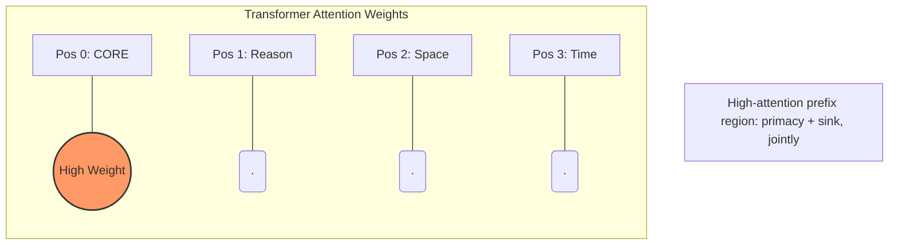
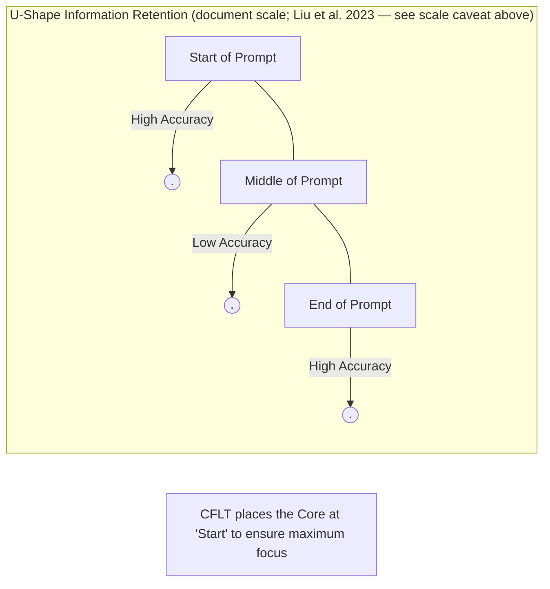
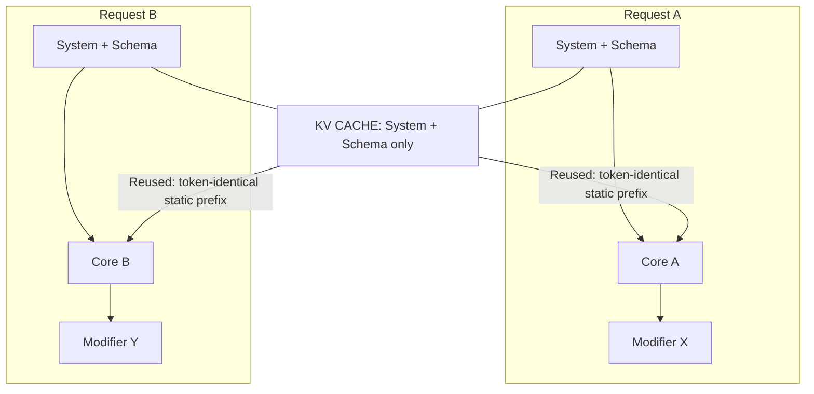

# LLM Foundations of CFLT

> **Version:** 1.0.0 (Internal Draft)
> **Author:** CFLT Core Team
> **Organization:** [CFLT.center](https://cflt.center)
> **License:** [CC BY 4.0](https://creativecommons.org/licenses/by/4.0/)

---

## 1. LLMs as the Bridge: Pillar II of CFLT

In the CFLT framework, LLMs are not just tools for translation; they are the standardized **inference engines** that operationalize the protocol. CFLT relies on LLMs for two distinct tasks:

1. **The Logic Transformer:** Converting messy user input into a strict `[Core] → [Reason] → [Space] → [Time]` sequence.
2. **The Grammar Overlay:** Refining that strict sequence into idiomatic, native-level output (e.g., L2 English, French, or Japanese).

The computational case for CFLT is motivated by the observation that **LLM behavior is sensitive to prompt design**: Habba et al. (2025) show that jointly varying many prompt dimensions (wording, delimiters, enumerators, demonstrations, answer order) produces substantial performance variation, and Zheng et al. (2024) document order effects in LLM-as-judge tasks. Note that these works vary *many* prompt dimensions at once rather than isolating information order. CFLT **hypothesizes** that enforcing a fixed, core-anchored sequence reduces the variance of the model's output and improves its instruction-following reliability; this is a prediction to be tested (see §10), not a result established by the cited sensitivity literature.

---

## 2. Transformer Attention and Positional Biases

The Transformer architecture (Vaswani et al. 2017) treats the input sequence as a set of tokens where every token can potentially attend to every other token. However, empirical research shows that attention is **not uniformly distributed**.

### 2.1 The Primacy Effect and Position 0
LLMs consistently exhibit a **Primacy Effect**: information at the very beginning of a prompt has a disproportionate impact on the model's internal state. 

### 2.2 Positional Encodings
Whether absolute (Vaswani 2017), relative (Shaw et al. 2018), or rotary (Su et al. 2021), positional encodings ensure the model knows where a token sits. Recent benchmarks suggest that "Absolute position 0" receives disproportionate attention ("attention sinks", Xiao et al. 2024).

### 2.3 Position-0 Attention: Two Distinct Phenomena

Position 0 in modern LLMs is over-attended for **two separate reasons** that must not be conflated:

1. **Attention Sinks (Xiao et al. 2024)** — a *softmax-stability artifact*. Because the softmax denominator must sum to 1, attention "leaks" into early tokens whose semantic content is **not** especially relevant. Xiao et al. explicitly note these tokens are *"not being semantically important"* — the sink is a mathematical consequence of softmax + windowed attention, not a signal of semantic priority.
2. **Primacy / Positional Bias** — early tokens are also attended more by virtue of being seen first by every later token's queries (causal masking compounds over depth). This is independent of the sink mechanism and *does* favor semantically rich content placed first.

**What CFLT actually exploits.** CFLT's Core-first claim rests on **(2) primacy**, not (1) sink. Because the listener / model conditions all subsequent processing on the first tokens, placing the salience anchor there compounds its influence over the rest of the generation. The sink phenomenon is a separate engineering finding about *why models stay stable in long contexts* — it does not on its own argue for putting semantic content at position 0.

It is also worth noting: putting the Core at position 0 does **not** "consume" the sink — most modern systems reserve the very first token (often `<bos>`) as a dedicated sink slot, and CFLT's Core would occupy positions immediately after that. The relevant claim is simply that *the high-attention prefix region is best occupied by high-information content.*

(For the complementary effect — that *middle-of-sequence* tokens are systematically under-attended — see §3 below on the Lost-in-the-Middle phenomenon.)

### 2.4 Anchoring Non-Action Cores

> **Section status.** The two bullets below are **architectural predictions consistent with §2.3 (primacy), extrapolated to Identity- and Request-Cores; they have not been directly measured for non-Action cores.** The published literature cited in §2.3 (Liu et al. 2023; Xiao et al. 2024; Lu et al. 2022) uses retrieval and classification tasks, not Identity / Request decompositions. The mechanism is the same primacy effect, but the *outcome magnitude* on non-Action cores is open empirical content (see §10.1). The term "definitional anchor" is a project-internal coinage — we deliberately avoid "definitional sink" because the attention-sink artifact (Xiao et al. 2024) is, by their own analysis, semantically indifferent (§2.3); re-using "sink" for a semantic-content claim would re-import the very framing §2.3 disclaims.

The primacy effect motivates the following predictions for any high-salience constituent at position 0, not just verbs:

- **Identity Cores (predicted):** Placing the "Subject-Identity" (e.g., "The solution is...") in position 0 is expected to create a **definitional anchor in the high-attention prefix region**. Subsequent modifiers (the *how* and *why*) are then interpreted against this anchored predicate, which we predict reduces the model's tendency to lose the subject-identity during long descriptions. This is a primacy-derived prediction, not a measured result.
- **Request Cores (predicted):** Placing the directive (e.g., "Please summarize...") at the start is expected to make the **task operator** more stable in the early KV cache. We predict this reduces the kind of *task-drift* (a project-internal label, not a literature term) in which middle-heavy prompts cause the model to begin describing the text instead of performing the requested action. Again, primacy-derived prediction, not measured.

> **Non-monotonic-position-bias caveat.** The primacy advantage is **task-dependent and non-monotonic**. Pezeshkpour & Hruschka (2024) show that LLM accuracy on **multiple-choice questions** varies by tens of percentage points when answer options are reordered (option content held fixed). Their study concerns MCQ option order, not discourse-constituent order, and does not establish a general model-wide taxonomy of first/last/middle preference; rather, it finds that option placement and candidate distance can alter decisions especially when the model is uncertain among its top candidates. Zheng et al. (2024) document parallel non-monotonic effects in LLM-as-judge tasks. **For tasks where the natural narrative order is a reasoning scaffold (e.g., multi-option decisions presented as "alternatives → final choice"), front-loading the conclusion may *remove* the scaffold and hurt accuracy on some models.** This is observed empirically in the CFLT pilot (`methodology/llm-part2-verification.md` §2.3): on Level-4 multi-action decision cases, **DeepSeek V4 Pro is the only one of five surveyed frontier models showing CFLT underperforming control** (by 11pp); the other four (GPT-5, Gemini 3 Flash, Qwen3.5-Plus, Claude Sonnet 4.6) all saturate L4 at or near 100% on both arms. The protocol-layer **Core-first accuracy** claim therefore holds across the surveyed range on distractor-heavy extraction (L3), with the L4 multi-option restriction best characterized as a **DeepSeek-specific model × task-type interaction** rather than a general property of CFLT-on-buried-decisions. **Scope the mechanism carefully:** the L3 design confounds *Core-first* with *Core-away-from-distractors*, so the measured gain demonstrates **distractor-robustness from Core-fronting**, not isolated *position-0 primacy*; the probe built to isolate primacy (L4, buried decision) was under-powered — four of five models were already at ceiling in the control arm — and did not corroborate it. Primacy thus remains the hypothesized mechanism, not a measured one. The deeper engagement with this counter-evidence is in §10.4–10.5.

---

## 3. The Lost-in-the-Middle Phenomenon

Liu et al. (2023, *Lost in the Middle*) demonstrated that, on the tested long-context tasks, LLM **behavioral performance** often follows a U-shaped curve: accuracy is frequently higher for information near the start or end of a long context and weaker for information in the middle. This is a behavioral performance pattern; Liu et al. measure task accuracy and do not isolate attention, causal masking, or positional encoding as the mechanism, and the pattern is not equally strong for every model, task, or context length.

> **Important — scale of the original finding.** Liu et al.'s experiment used **multi-document QA and key-value retrieval** with documents/keys placed at varying positions across a long context (10–30 documents). "Position" in their setup refers to *document position in a long context*, not *token position within a single sentence*. Extrapolating directly from "lost in the middle at document scale" to "core action at sentence scale" is a *cross-scale analogy* and should be treated as such.

CFLT applies the lost-in-the-middle finding at **two distinct scales**, and the strength of the inference differs:

1. **Document/prompt scale (well-supported).** When CFLT-structured content sits inside a long agentic prompt or RAG context, placing the most critical Core block near the start of the prompt is the direct application of Liu et al.'s finding. This concerns the ordering of already-**retrieved context fed to the generator**; it does not bear on whether Core-first phrasing improves the **retrieval** step itself (top-K recall), which Lewis et al. (2020) do not test and which would require a separate retriever-specific CFLT/control benchmark.
2. **Sentence/token scale (analogical, now preliminarily tested).** Within a single sentence, the relevant phenomenon is *primacy* + *attention sinks* (see §2.3), not lost-in-the-middle. The U-shaped curve has not been established at intra-sentence token granularity. The **Part II extraction pilot** ([`../methodology/llm-part2-verification.md`](../methodology/llm-part2-verification.md)) now provides initial sentence-scale evidence: across five frontier models, Core-first prompts raise distractor-heavy (L3) extraction accuracy by **+22–44pp** over natural reason-first order. This **strengthens, but does not conclusively prove**, the sentence-level claim (caveats: small N; a single comparison order; extraction task only). Treat the sentence-level claim as motivated by the document-level finding and **preliminarily supported** by the Part II pilot.

By placing the **Core Action** at the very beginning, CFLT ensures the most critical part of the message occupies the high-attention prefix region. The modifiers (Reason, Space, Time) occupy subsequent slots, which for typical sentence-length inputs are still within the early-attention window.

---

## 4. Prompt Steering and Autoregressive Prediction

LLMs are autoregressive: they predict the next token $t_n$ based on all preceding tokens $(t_1, \dots, t_{n-1})$.

$$
p(t_n \mid t_{n-1}, \dots, t_1)
$$

If $t_1, t_2, \dots$ (the prefix) are high-entropy, low-relevance tokens (like a long "Yesterday while I was walking..."), the model's state for the core action is poorly constrained. If the prefix is the **Core Action** itself, the probability distribution for all subsequent slots is immediately narrowed.

CFLT acts as a **steering protocol** that collapses the model's branching factor early in the generation process. We **predict** this contributes to more constrained continuations and reduced hallucination drift; the magnitude is the open empirical question of §10.1, and the §9 *Honest Limitations* item 5 engages the counter-positions (Min 2022 / Sclar 2024 / end-to-end-baseline) under which this prediction may be smaller than expected.

---

## 5. In-Context Learning and the "CFLT Manifold"

In-context learning (ICL) works by providing the model with patterns it can extend (Min et al. 2022). 

- Traditional grammar rules are complex to represent in a few shots.
- The **CFLT Protocol** is a simple, linear pattern.

CFLT **hypothesizes** that, because the `[Core] → [Modifiers]` sequence is close to patterns already present in the natural-language data the model was trained on, the model can learn to enforce the protocol with very few examples (low-shot, or zero-shot with a simple system prompt). No cited source tests CFLT-sequence learnability directly; low-/zero-shot CFLT compliance is an open empirical question to be measured across zero-, few-, and fine-tuned conditions (see §10).

---

## 6. Token Economy and Computational Cost

Recent research into structured prompts (TOON, CSV, etc.) reports that flattening information into a linear, non-nested format can reduce token consumption substantially compared to verbose natural language or dense JSON. Reported magnitudes vary by domain — published structured-data benchmarks land in the 30%–50% range for tabular content. **The CFLT-specific magnitude is not yet measured** and should not be assumed to match the structured-data literature directly: CFLT operates over discourse semantics, not tabular fields, and its reductions come from a different source (eliminating syntactic-coordination overhead rather than serializing rows).

CFLT plausibly contributes to token economy by:
1.  **Linearization:** Removing the need for complex syntactic markers (relative pronouns, nested subordinate clauses).
2.  **Explicit Nulls:** Using a "NULL" token for missing slots prevents the model from generating "filler" text to preserve grammatical flow.
3.  **Prefix Caching:** Inference engines (vLLM, SGLang) reuse KV state only for **token-identical static prefixes**. The reusable portion is therefore the fixed `[System Prompt] + [schema]` scaffold; the `[Core]` itself is normally request-variable and does not cache across different requests. Any compute savings depend on shared-prefix length, workload, and engine configuration, and must be measured rather than inherited from reported engine benchmarks (see `methodology/llm-prompting.md`).

The actual reduction must be quantified by the ablation specified in [`methodology/evaluation-metrics.md`](../methodology/evaluation-metrics.md) §4.1.

---

## 7. Hallucination Dynamics

CFLT **hypothesizes** a specific failure mode: that some hallucinations occur when the model loses track of the primary assertion (the Core) and begins generating plausible-sounding but irrelevant context. This "hallucination-as-loss-of-Core" account is a CFLT framing to be tested; the cited summarization-faithfulness literature (e.g., Maynez et al. 2020) documents that systems generate unfaithful content but does **not** establish constituent order, or loss of a Core, as the cause.

By placing the **Core** at position 0, CFLT exploits primacy (see §2.3) to provide a stable "semantic anchor" in the early KV cache. **We expect** this to reduce the risk of the model "drifting" away from the user's intent as the sequence grows; the magnitude of the reduction is an open empirical question (see §10.1 *Specific Accuracy Delta*). (Note: this is a primacy argument; the attention-sink artifact discussed in §2.3 is a *separate* phenomenon and is not the basis of this claim.)

---

## 8. Cross-Linguistic Alignment in Latent Space

Because LLMs are trained on massive multilingual corpora, CFLT **hypothesizes** that they develop a substantially **shared latent space** for semantic concepts across languages. The existence of a fully *language-neutral* representation is not established by the multilingual-evaluation literature, which documents uneven cross-language behavior rather than representational neutrality; we therefore treat language-neutrality as a hypothesis, not a fact.

CFLT targets this latent space by using a **language-agnostic sequence**. The intended design is that whether the surface tokens are Chinese, English, or Arabic, the *order of the concepts* hitting the attention heads is the same. For the typological motivation behind applying one constituent order within the surveyed range — five languages across four families with reference-grammar citations for each Core internal-assembly mechanism — see [`core-concept.md`](./core-concept.md) §2.5. This is presented as a project-standard design choice, not as demonstrated cross-linguistic invariance. CFLT proposes LLMs as a tool for implementing the "Neutral Buffer" that human learners use to bridge languages.

---

## 9. Honest Limitations

1.  **Strictness vs. Flow:** Forcing a strict sequence can sometimes lead to "stilted" output from smaller models. The Grammar Overlay layer is essential to restore natural flow.
2.  **Instruction Following:** Very small models (e.g., <3B parameters) may struggle to maintain the strict CFLT Protocol without fine-tuning.
3.  **Reasoning vs. Linearization:** While CFLT improves discourse structure, it is not a replacement for Chain-of-Thought (CoT) reasoning for complex math or logic problems (Wei et al. 2022). It should be used *alongside* CoT — CFLT contributes stable position-0 anchoring for tasks where the reasoning chain itself is not the Core (only the final action / decision is); CoT contributes the intermediate-step structure CFLT does not specify.
4.  **Long-context drift:** Even with primacy-based prefix anchoring, extremely long modifiers can still cause the model to lose the core. Modularization (breaking thoughts into multiple CFLT sentences) is recommended.
5.  **What if content order matters less than we claim?** Three serious counter-positions threaten the LLM-side argument; we engage each here rather than only in the foundations literature.
    - **Min et al. (2022) "Rethinking the Role of Demonstrations"** find that in in-context learning, the *correctness of input–label mappings* in demonstrations matters surprisingly little — demonstrations remain useful mainly by specifying the *demonstration format*, the *label space*, and the *input distribution*. (Min et al. study demonstration *properties*; they do **not** establish a demonstration-order effect — that result belongs to adjacent work, e.g. Lu et al. 2022 on few-shot demonstration order.) This is a partial counter-result for any naive "position-0 content matters" claim. CFLT's response is that CFLT operates on the *format/schema* axis (a dimension Min et al. show to be active), not primarily on the factual correctness of any single token — the prescription is "fix the schema and the linear order of the speaker's commitment", not "make sure the Core token is the most accurate fact in the prompt." Earlier citations of Min in `core-concept.md` §4.1 / §8.5 should be read in light of this.
    - **Sclar et al. (2024) "Quantifying Language Models' Sensitivity to Spurious Features in Prompt Design"** find that LM accuracy varies enormously with separators, formatting, and *non-semantic* features. This is a threat: if spurious surface formatting can dominate over content order, the marginal benefit of CFLT's content-order discipline is unclear. CFLT's response is that fixing *both* the schema (formatting) *and* the content order is the contribution — the two axes are complementary, and CFLT is most defensible as a joint format-and-content discipline rather than a pure content-order claim.
    - **End-to-end instruction-tuned baseline.** As frontier instruction-tuned models (GPT-5.5, Claude 4.7-class, Gemini 3.1+) scale, the marginal benefit of explicit linearization scaffolds may shrink — for many tasks, a one-line "answer in the form [Core, Reason, Space, Time]" instruction to a frontier model may match a separate CFLT-preprocessing pass. CFLT's response is the **falsification clause of P2** (`foundations/core-concept.md` §8.5): if across ≥ 3 frontier model families the CFLT-formatted prompt does not show measurable attention-or-accuracy advantage at position 0, the LLM-side claim is refuted. We accept this falsification condition.
6.  **Predicted-vs-measured status.** Several mechanistic claims in this document (e.g., §2.4 Identity / Request Core predictions, §7 hallucination-drift reduction) are extrapolations from §2.3's primacy framework, not measured CFLT-specific results. The empirical agenda for measuring these is in [`../methodology/empirical-agenda.md`](../methodology/empirical-agenda.md).

---

## 10. Open Research Questions

1.  **Specific Accuracy Delta:** What is the absolute improvement in instruction-following for CFLT vs. free-form prompts on the "Needle-in-a-Haystack" benchmark?
2.  **Latency Impact:** How much TTFT is saved by prefix-caching the CFLT structure in production RAG systems?
3.  **Fine-tuning Gains:** Does fine-tuning a model specifically on a CFLT-linearized corpus outperform standard instruction-tuning for cross-linguistic tasks?
4.  **Non-monotonic position bias.** Pezeshkpour & Hruschka (2024) show that LLM accuracy on multiple-choice questions is sensitive to the *order of answer options* (content held fixed) — first-position is not uniformly advantaged. They report option placement and candidate distance altering decisions especially under model uncertainty; they do not establish a general model-wide first/last/middle taxonomy, and the MCQ-to-constituent-order transfer is indirect. Zheng et al. (2024) document similar non-monotonic position effects in LLM-as-judge evaluations. **This is a partial counter to CFLT's primacy-favors-Core-first claim**: if position-0 advantage is task-dependent and non-monotonic, CFLT's strict Slot-0 placement may not be optimal for all tasks. The CFLT pilot (`methodology/llm-part2-verification.md` §2.3) shows that this counter-effect is **model-specific** rather than universal: L4 multi-action cases on DeepSeek V4 Pro show CFLT *underperforming* control by 11pp, but the four other surveyed frontier models (GPT-5, Gemini 3 Flash, Qwen3.5-Plus, Claude Sonnet 4.6) all saturate L4 at or near 100% on both arms — so the L3-vs-L4 reversal observation is currently confined to a single model. **Open question**: is the DeepSeek L4 regression (a) a DeepSeek-V4-Pro-specific instruction-following anomaly on multi-option items (model × items interaction; currently the most consistent reading with the 5-model data), (b) a property of the task type that other models hide under ceiling effects (to be tested with harder L4 items where the four ceiling models become informative), or (c) related to the model's intrinsic positional prior in the sense of Pezeshkpour & Hruschka? A pre-registered factorial design across ≥ 6 model families and ≥ 4 task types (extraction, MCQ, summarization, multi-step planning) with item difficulty calibrated above the current four-model ceiling is required to distinguish (a)–(c).
5.  **The Reversal Curse and intrinsic order-sensitivity.** Berglund et al. (2024) "The Reversal Curse" shows that LLMs trained on "A is B" do not automatically learn "B is A" — order-sensitivity is structurally entangled with the learned representations themselves, not just with prompt-time formatting. This implies that **CFLT-as-alignment-constraint** (`../methodology/empirical-agenda.md` §2.2; the §10.3 "Fine-tuning Gains" question above) may face a harder problem than CFLT-as-prompt-protocol: training on CFLT-reordered data may not transfer to inference-time CFLT robustness if the model treats "Core ... Reason ..." as a distinct token sequence from "Reason ... Core ...". A controlled fine-tuning experiment comparing (i) standard instruction-tuned baseline, (ii) CFLT-reordered fine-tune, (iii) bidirectional CFLT-and-reverse fine-tune, evaluated on prompt-order perturbation robustness, would settle this. We accept Berglund et al. as a partial counter: it does not refute the prompt-time CFLT claim, but it does narrow the alignment-constraint upgrade.

---

## 11. Cited Works

See [`bibliography.md`](../bibliography.md) (§ Large Language Models and NLP) for full references.

---

## See Also

- [`mathematics.md`](./mathematics.md) §6, §7 — Markov-chain prompt steering and KL-divergence framing of §4 here.
- [`neuroscience.md`](./neuroscience.md) §5 — The brain-vs-Transformer attention-sink parallel that §2.3 here exploits.
- [`logic.md`](./logic.md) §6 — Relevance Theory; cognitive justification for the engineering choice in §4 here.
- [`../methodology/llm-prompting.md`](../methodology/llm-prompting.md) — The engineering surface of this foundations doc; sanitization workflow, prefix caching, RAG.
