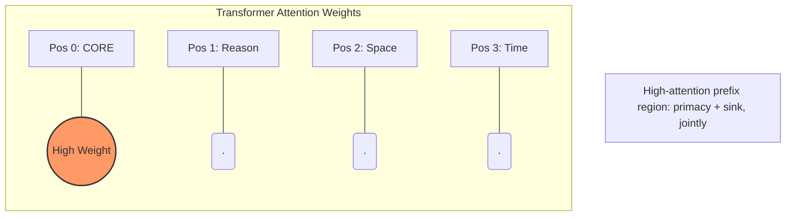
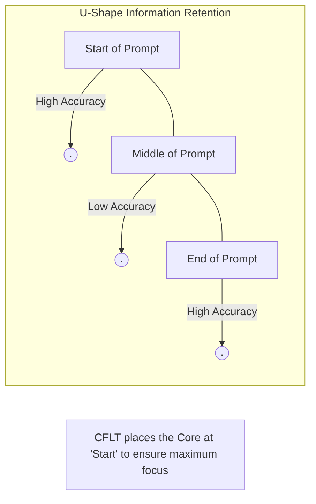
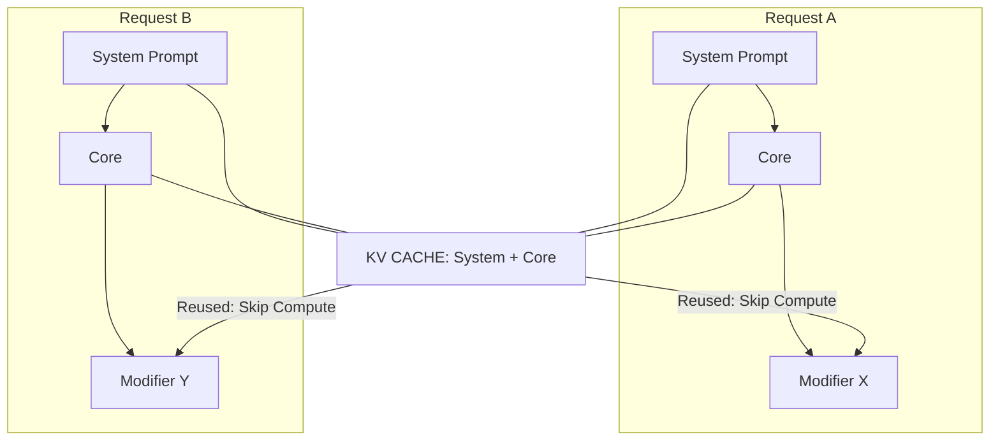

# LLM Foundations of CFLT

> **Version:** 1.0.0 (Internal Draft)
> **Author:** CFLT Core Team
> **Organization:** [CFLT.center](https://cflt.center)
> **License:** [CC BY 4.0](https://creativecommons.org/licenses/by/4.0/)

---

## 1. LLMs as the Bridge: Pillar II of CFLT

In the CFLT framework, LLMs are not just tools for translation; they are the standardized **inference engines** that operationalize the protocol. CFLT relies on LLMs for two distinct tasks:

1. **The Logic Transformer:** Converting messy user input into a strict `[Core] → [Reason] → [Space] → [Time]` sequence.
2. **The Grammar Overlay:** Refining that strict sequence into idiomatic, native-level output (e.g., L2 English, French, or Japanese).

The computational case for CFLT rests on the observation that **LLMs are highly sensitive to prompt linearization** (Habba et al. 2025; Zheng et al. 2024). By enforcing a fixed, core-anchored sequence, we reduce the variance of the model's output and improve its instruction-following reliability.

---

## 2. Transformer Attention and Positional Biases

The Transformer architecture (Vaswani et al. 2017) treats the input sequence as a set of tokens where every token can potentially attend to every other token. However, empirical research shows that attention is **not uniformly distributed**.

### 2.1 The Primacy Effect and Position 0
LLMs consistently exhibit a **Primacy Effect**: information at the very beginning of a prompt has a disproportionate impact on the model's internal state. 

### 2.2 Positional Encodings
Whether absolute (Vaswani 2017), relative (Shaw et al. 2018), or rotary (Su et al. 2021), positional encodings ensure the model knows where a token sits. Recent benchmarks suggest that "Absolute position 0" receives disproportionate attention ("attention sinks", Xiao et al. 2024).

### 2.3 Position-0 Attention: Two Distinct Phenomena

Position 0 in modern LLMs is over-attended for **two separate reasons** that must not be conflated:

1. **Attention Sinks (Xiao et al. 2024)** — a *softmax-stability artifact*. Because the softmax denominator must sum to 1, attention "leaks" into early tokens whose semantic content is **not** especially relevant. Xiao et al. explicitly note these tokens are *"not being semantically important"* — the sink is a mathematical consequence of softmax + windowed attention, not a signal of semantic priority.
2. **Primacy / Positional Bias** — early tokens are also attended more by virtue of being seen first by every later token's queries (causal masking compounds over depth). This is independent of the sink mechanism and *does* favor semantically rich content placed first.

**What CFLT actually exploits.** CFLT's Core-first claim rests on **(2) primacy**, not (1) sink. Because the listener / model conditions all subsequent processing on the first tokens, placing the salience anchor there compounds its influence over the rest of the generation. The sink phenomenon is a separate engineering finding about *why models stay stable in long contexts* — it does not on its own argue for putting semantic content at position 0.

It is also worth noting: putting the Core at position 0 does **not** "consume" the sink — most modern systems reserve the very first token (often `<bos>`) as a dedicated sink slot, and CFLT's Core would occupy positions immediately after that. The relevant claim is simply that *the high-attention prefix region is best occupied by high-information content.*

(For the complementary effect — that *middle-of-sequence* tokens are systematically under-attended — see §3 below on the Lost-in-the-Middle phenomenon.)

### 2.4 Anchoring Non-Action Cores
The sink effect applies to any high-salience constituent, not just verbs:

- **Identity Cores:** Placing the "Subject-Identity" (e.g., "The solution is...") in position 0 creates a **definitional sink**. Subsequent modifiers (the *how* and *why*) are then interpreted through this fixed predicate, preventing the model from losing the "Identity" of the subject during long descriptions.
- **Request Cores:** Placing the directive (e.g., "Please summarize...") at the start ensures the **task-operator** is the most stable element in the KV cache. This prevents the "Instruction Drift" commonly seen in middle-heavy prompts where the model starts describing the text instead of performing the requested action.

---

## 3. The Lost-in-the-Middle Phenomenon

Liu et al. (2023, *Lost in the Middle*) demonstrated that LLM performance follows a U-shaped curve: accuracy is high for information at the start or end of a prompt but drops significantly for information in the middle.

> **Important — scale of the original finding.** Liu et al.'s experiment used **multi-document QA and key-value retrieval** with documents/keys placed at varying positions across a long context (10–30 documents). "Position" in their setup refers to *document position in a long context*, not *token position within a single sentence*. Extrapolating directly from "lost in the middle at document scale" to "core action at sentence scale" is a *cross-scale analogy* and should be treated as such.

CFLT applies the lost-in-the-middle finding at **two distinct scales**, and the strength of the inference differs:

1. **Document/prompt scale (well-supported).** When CFLT-structured content sits inside a long agentic prompt or RAG context, placing the most critical Core block near the start of the prompt directly mitigates Liu et al.'s phenomenon. This is the direct application.
2. **Sentence/token scale (analogical).** Within a single sentence, the relevant phenomenon is *primacy* + *attention sinks* (see §2.3), not lost-in-the-middle. The U-shaped curve has not been experimentally established at intra-sentence token granularity in modern LLMs. Treat the sentence-level claim as motivated by, but not proved by, the document-level finding.

By placing the **Core Action** at the very beginning, CFLT ensures the most critical part of the message occupies the high-attention prefix region. The modifiers (Reason, Space, Time) occupy subsequent slots, which for typical sentence-length inputs are still within the early-attention window.

---

## 4. Prompt Steering and Autoregressive Prediction

LLMs are autoregressive: they predict the next token $t_n$ based on all preceding tokens $(t_1, \dots, t_{n-1})$.

$$
p(t_n \mid t_{n-1}, \dots, t_1)
$$

If $t_1, t_2, \dots$ (the prefix) are high-entropy, low-relevance tokens (like a long "Yesterday while I was walking..."), the model's state for the core action is poorly constrained. If the prefix is the **Core Action** itself, the probability distribution for all subsequent slots is immediately narrowed.

CFLT acts as a **steering protocol** that collapses the model's branching factor early in the generation process, leading to more factual and less hallucinated continuations.

---

## 5. In-Context Learning and the "CFLT Manifold"

In-context learning (ICL) works by providing the model with patterns it can extend (Min et al. 2022). 

- Traditional grammar rules are complex to represent in a few shots.
- The **CFLT Protocol** is a simple, linear pattern.

Because the `[Core] → [Modifiers]` sequence is a subset of the natural-language manifold the model was trained on, the model can learn to enforce the protocol with very few examples (low-shot or zero-shot with a simple system prompt).

---

## 6. Token Economy and Computational Cost

Recent research into structured prompts (TOON, CSV, etc.) reports that flattening information into a linear, non-nested format can reduce token consumption substantially compared to verbose natural language or dense JSON. Reported magnitudes vary by domain — published structured-data benchmarks land in the 30%–50% range for tabular content. **The CFLT-specific magnitude is not yet measured** and should not be assumed to match the structured-data literature directly: CFLT operates over discourse semantics, not tabular fields, and its reductions come from a different source (eliminating syntactic-coordination overhead rather than serializing rows).

CFLT plausibly contributes to token economy by:
1.  **Linearization:** Removing the need for complex syntactic markers (relative pronouns, nested subordinate clauses).
2.  **Explicit Nulls:** Using a "NULL" token for missing slots prevents the model from generating "filler" text to preserve grammatical flow.
3.  **Prefix Caching:** High reusability of the `[System Prompt] + [Core]` prefix in inference engines (vLLM, SGLang) reduces compute cost (see `methodology/llm-prompting.md`).

The actual reduction must be quantified by the ablation specified in [`methodology/evaluation-metrics.md`](../methodology/evaluation-metrics.md) §4.1.

---

## 7. Hallucination Dynamics

Hallucinations often occur when the model loses track of the primary assertion (the Core) and begins generating plausible-sounding but irrelevant context. 

By placing the **Core** at position 0, CFLT exploits primacy (see §2.3) to provide a stable "semantic anchor" in the early KV cache. This reduces the risk of the model "drifting" away from the user's intent as the sequence grows. (Note: this is a primacy argument; the attention-sink artifact discussed in §2.3 is a *separate* phenomenon and is not the basis of this claim.)

---

## 8. Cross-Linguistic Alignment in Latent Space

Because LLMs are trained on massive multilingual corpora, they develop a **language-neutral latent space** for semantic concepts.

CFLT targets this latent space by using a **language-agnostic sequence**. Whether the surface tokens are Chinese, English, or Arabic, the *order of the concepts* hitting the attention heads is the same. This makes LLMs the ideal tool for implementing the "Neutral Buffer" that human learners use to bridge languages.

---

## 9. Honest Limitations

1.  **Strictness vs. Flow:** Forcing a strict sequence can sometimes lead to "stilted" output from smaller models. The Grammar Overlay layer is essential to restore natural flow.
2.  **Instruction Following:** Very small models (e.g., <3B parameters) may struggle to maintain the strict CFLT Protocol without fine-tuning.
3.  **Reasoning vs. Linearization:** While CFLT improves discourse structure, it is not a replacement for Chain-of-Thought (CoT) reasoning for complex math or logic problems (Wei et al. 2022). It should be used *alongside* CoT.
4.  **Long-context drift:** Even with primacy-based prefix anchoring, extremely long modifiers can still cause the model to lose the core. Modularization (breaking thoughts into multiple CFLT sentences) is recommended.

---

## 10. Open Research Questions

1.  **Specific Accuracy Delta:** What is the absolute improvement in instruction-following for CFLT vs. free-form prompts on the "Needle-in-a-Haystack" benchmark?
2.  **Latency Impact:** How much TTFT is saved by prefix-caching the CFLT structure in production RAG systems?
3.  **Fine-tuning Gains:** Does fine-tuning a model specifically on a CFLT-linearized corpus outperform standard instruction-tuning for cross-linguistic tasks?

---

## 11. Cited Works

See [`bibliography.md`](../bibliography.md) (§ Large Language Models and NLP) for full references.

---

## See Also

- [`mathematics.md`](./mathematics.md) §6, §7 — Markov-chain prompt steering and KL-divergence framing of §4 here.
- [`neuroscience.md`](./neuroscience.md) §5 — The brain-vs-Transformer attention-sink parallel that §2.3 here exploits.
- [`logic.md`](./logic.md) §6 — Relevance Theory; cognitive justification for the engineering choice in §4 here.
- [`../methodology/llm-prompting.md`](../methodology/llm-prompting.md) — The engineering surface of this foundations doc; sanitization workflow, prefix caching, RAG.
- [`../methodology/software-architecture.md`](../methodology/software-architecture.md) — Two-stage Logic Transformer / Grammar Overlay pipeline introduced in §1 here.
