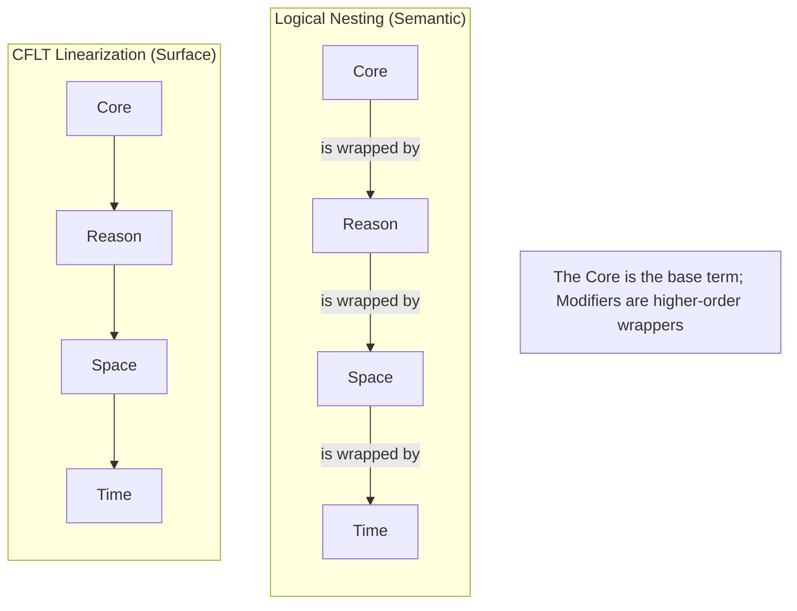
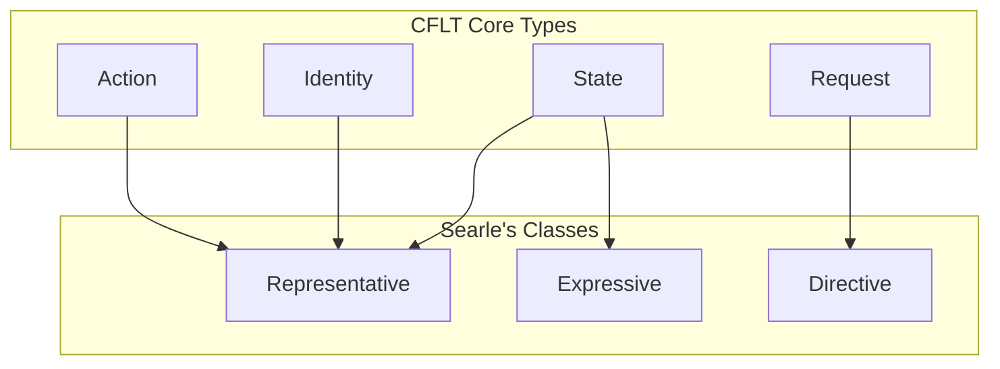
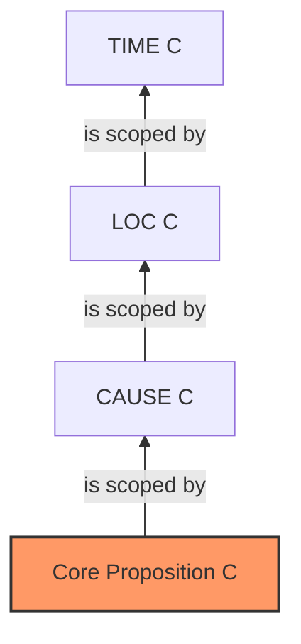

# Logical Foundations of CFLT

> **Version:** 1.0.0 (Internal Draft)
> **Author:** CFLT Core Team
> **Organization:** [CFLT.center](https://cflt.center)
> **License:** [CC BY 4.0](https://creativecommons.org/licenses/by/4.0/)

---

## 1. Scope: Formal Logic as a Functional Analog

Formal logic systems share a deep property with the **CFLT Protocol**: they prioritize the "function" (the action or relation) over its "arguments" (the entities or context) in their underlying representation.

- **Predicate Logic:** $P(a, b, c)$ — the predicate symbol $P$ (the Core) opens the expression.
- **Computer Science:** `function(arg1, arg2)` — the operation is identified before the data.

CFLT borrows this convergent pattern and applies it to natural language. The Core (salience anchor) is committed to early; `[Reason] → [Space] → [Time]` modifiers attach afterward. **The output is natural language**, not formal notation — but the conceptual order is the same one formal logic has used for over a century.

> **What this document is not:** This document does not claim that CFLT produces formal-logic notation, that CFLT is verb-first, or that it is predicate-first in the syntactic sense. It claims that the *abstract principle of early commitment*, which formal logic articulates clearly, is one of CFLT's intellectual ancestors — and that the resulting natural-language form is computationally well-formed for the reasons formal logic makes precise.

---

## 2. Predicate Logic and the "Early Commitment" Principle

In standard first-order logic, an event is represented by a predicate applied to terms:
$$\text{Go}(\text{me}, \text{store}, \text{yesterday})$$

**What CFLT borrows from this tradition:**
1. **The order of disambiguation.** Identifying the predicate first reduces the ambiguity of the following terms. "Eat" restricts the likely arguments to edible things; "Go" restricts them to locations or paths.
2. **The "Head" status.** The predicate is the logical head of the expression.

**What CFLT does *not* borrow:**
- The **notation** $P(a, b, c)$. CFLT produces "I went out, because it rained, at home, yesterday." — comprehensible English with structured ordering.
- The reduction of "Core" to "predicate symbol." A copular construction ("That girl is my sister") has no obvious "predicate" in the action-verb sense, but it has a clear Core (the identity assertion). CFLT handles this; bare predicate logic does not.

---

## 3. Lambda Calculus and Function Application

Lambda calculus ($\lambda$-calculus) models computation as function application. In this formalism, a function $f$ applied to an argument $x$ is written as $(f\,x)$.

**CFLT mapping (with caveat):** for *expository* purposes we model the Core as the **innermost (base) term** of a stack of modifier functions, with the modifiers as higher-order functions that wrap it:

$$\text{Time}\,(\,\text{Space}\,(\,\text{Reason}\,(\,\text{Core}\,)\,)\,)$$

> **Important caveat — this is a CFLT linearization metaphor, not Davidsonian event semantics.** In standard Neo-Davidsonian event semantics (Parsons 1990; Landman 2000), all event modifiers — manner, instrument, beneficiary, time, location, cause — attach to the event variable $e$ as **same-level conjuncts** $R_1(e,x_1) \land R_2(e,x_2) \land \dots$, **not** as a forced nesting hierarchy. There is no Davidsonian theorem that requires Time to be the outermost wrapper or Reason to be the innermost. The lambda nesting above is a *CFLT design choice* for surface linearization order — it captures the protocol's claim about what is uttered when, not a logical claim about what semantically scopes over what.
>
> Similarly, in modal-tense logic (Prior, Reichenbach, Kamp & Reyle 1993), modal operators ($\Box, \diamond$) and temporal operators ($G, F, H, P$) interact with each other in language-specific and construction-specific ways; there is no standard result requiring $\text{Time}(\text{Space}(\dots))$ to be the canonical scope order.
>
> CFLT picks this particular permutation as a *convention with rationale* (see [`linguistics.md`](./linguistics.md) §4.3 for the three rationale arguments). The lambda nesting notation here visualizes that convention — it does not derive it.

The CFLT *surface* linearization is the inside-out reading of the stack — the Core is uttered first, then each enclosing modifier is appended as it is "unwrapped." Equivalently, the CFLT surface form is generated by a left-fold over $[\text{Core}, \text{Reason}, \text{Space}, \text{Time}]$, where each step appends the next outer modifier rather than prepending it.

**Specific Example:**
- **Natural Language:** "I went, because I was hungry, to the shop, at noon."
- **Semantic Nesting:** $\text{AtNoon}\,(\,\text{ToShop}\,(\,\text{BecauseHungry}\,(\,\text{I-Went}\,)\,)\,)$
- **CFLT Linearization (inside-out):** I-Went → BecauseHungry → ToShop → AtNoon

In this view, **"I-Went"** is the base term, and each subsequent slot is a higher-order function that takes the current state of the discourse and "wraps" it in a new layer of context. CFLT prioritizes the **base term** (the Core) in position 0 of the surface form.

**Note on generality:** Lambda calculus is type-agnostic — the function $\lambda e.\,\text{COMMIT}(e)$ can wrap an action, a state, an identity, or a speech act. This generality is exactly why the function-application metaphor extends naturally to CFLT's four core types.

---

## 4. Combinatory Categorial Grammar (CCG)

CCG (Steedman 2000) is a highly lexicalized grammar formalism where the "syntax" is largely contained within the lexical categories themselves. CCG is unique in allowing multiple equivalent derivations (linearizations) for the same semantic result.

**CFLT as a CCG schedule choice:** CFLT does not invent a new combinatory grammar. It selects one canonical schedule from CCG's flexible space:
1. The **Core** is the primary functor.
2. It "looks" for its arguments in a fixed, predictable direction.

By fixing the derivation path, the CFLT Protocol eliminates the "spurious ambiguity" that usually complicates CCG parsing, making it an ideal bridge for AI agents.

---

## 5. Speech Act Theory (Austin, Searle)

Language does not just describe the world; it performs actions (*illocutionary acts*). Searle (1969, 1975) identifies five major illocutionary classes: **Representatives** (assertions), **Directives** (requests, commands), **Commissives** (promises), **Expressives** (thanks, apologies, emotive states), and **Declarations** (utterances that change the world by being uttered, e.g., "I now pronounce you…").

**CFLT mapping:** the Core, in CFLT, is the linguistic realization of the illocutionary commitment. CFLT's four core types map onto Searle's classes as follows:

| CFLT Core type | Searle's class | Example |
|---|---|---|
| **Action** | Representative (assertive) | "I went out" — asserts an event |
| **Identity** | Representative (assertive, copular sub-type) | "That girl is my sister" — asserts a classification |
| **State** | Expressive *or* Representative | "I'm exhausted" — expresses/asserts a condition |
| **Request** | Directive | "Could you pass the salt" — directs the hearer to act |

> **Note on Searle's "Declaration."** Searle's *Declaration* class is a narrow, performative category (e.g., "I hereby resign," "You're fired," "I now pronounce you…") whose utterance constitutes the act itself. It is **not** the same as a copular identity statement. CFLT's "Identity Core" is a Representative sub-type that asserts an identity claim; it is not a Searlean Declaration. The two are kept distinct here to avoid the easy terminological slip between *grammatical* declaration and *illocutionary* Declaration.

> **Note on Commissives and the four-class compression.** The mapping above omits two of Searle's five classes — **Commissives** (promises, e.g., *"I'll call you tomorrow"*; *"I promise I'll come"*) and **Declarations** (the performative class noted in the previous callout). In CFLT, Commissives are realized as a **sub-type of Action Core**: the predicate is a commit-action (*promise*, *commit*, *guarantee*, *will-do*), and the embedded propositional content is the committed action — so *"I promise I'll come"* parses as Core = *I promise I'll come*. Declarations, where they arise outside the narrow performative category, are a marked sub-type of Identity Core (typically a copular predicate with stipulative force). The CFLT four-way taxonomy is therefore a **deliberate pedagogical/operational aggregation** of Searle's five classes — consistent with the Declaration note above — not an implicit denial that Commissives and Declarations exist. This compression is documented here to prevent the reader from looking for a missing fifth Core type.

CFLT ensures that the **illocutionary force** of the utterance is identified first, aligning with the listener's need to know whether they are being informed, requested, or addressed.

---

## 6. Relevance Theory (Sperber & Wilson)

Relevance Theory posits that human communication is governed by the search for **optimal relevance**: achieving maximum cognitive effect with minimum processing effort.

**CFLT as a relevance-maximizing strategy:** placing the Core at position 0 puts the highest-effect token where the listener's attention is greatest. The listener (or LLM, see `llm.md`) can begin computing inferences from the Core onward, rather than waiting through modifiers to discover what the utterance is about.

Native English's end-weight tendency (Quirk et al. 1985) competes with this principle: heavy NPs and given/new structuring often delay the new information. CFLT resolves the tension by treating end-weight as a **stylistic refinement** applied at the polishing stage (the Grammar Overlay in the product implementation), not at the conceptual scaffold stage.

This is consistent with the broader lesson: CFLT optimizes **conceptual order**; native idiom optimizes **surface flow**. The Grammar Overlay layer reconciles them.

---

## 7. Gricean Maxims

Grice (1975) proposed four maxims for cooperative conversation: Quality, Quantity, Relation, and Manner.

| Maxim | Statement | CFLT correspondence |
|---|---|---|
| Quality | Be truthful | Orthogonal to CFLT (a content concern) |
| Quantity | Be informative | Handled by the four-slot completeness rule |
| Relation | Be relevant | Handled by selecting a salient Core |
| **Manner** | **Be clear, brief, orderly** | **The fixed slot order is the orderliness condition** |

The Maxim of Manner — *"Be orderly"* — explicitly requests predictable linearization. CFLT provides exactly one canonical order, fully satisfying this maxim. This makes the protocol unusually *Gricean-aligned*: native speakers improvise orderliness through context-sensitive heuristics; CFLT provides a single rule that achieves the same goal deterministically.

---

## 8. Discourse Representation Theory (DRT)

DRT (Kamp 1981) models how listeners build mental "maps" of a conversation as it unfolds.

**CFLT mapping:** if the Core is introduced first, it instantly establishes the central discourse referent — the event variable, identity claim, state, or speech act — against which all subsequent contributions are anchored. Modifiers attach to a referent that already exists in the discourse representation, eliminating the temporary ambiguity that would arise if modifiers appeared before their target.

---

## 9. Modal and Temporal Logic Under CFLT

The four CFLT slots align with operators in standard logical extensions:

| CFLT slot | Logical operator | Reading |
|---|---|---|
| [Core] | $C$ | Core Proposition |
| [Reason] | $\text{CAUSE}(C)$ | Causal logic |
| [Space] | $\diamond_{\text{loc}} C$ | Modal logic of location |
| [Time] | $\diamond_{\text{time}} C$ | Temporal logic ($G, F, H, P$) |

This is an **operator-stacking** reading: $C$ is the innermost commitment; reason, space, and time are progressively more "outer" modal-temporal operators wrapping it. Linearizing them outward-from-core gives exactly the protocol's order.

---

## 10. Honest Limitations

1. **Formal notation is the analogy, not the surface form.** Predicate-logic notation (`P(a,b,c)`), lambda terms, and CCG categories are inspirations for *why early commitment is computationally well-formed*. CFLT's actual output is natural language. A reader concluding "CFLT is formal-logic notation" has misread; see [`core-concept.md`](./core-concept.md).
2. **Logical priority ≠ pragmatic priority.** Formal logic places the function outermost, but human conversation is governed by pragmatics where given information often precedes new (Topic-Comment, Theme-Rheme). CFLT optimizes for *clarity of salience commitment*, which can conflict with native idiomaticity — the Grammar Overlay layer reconciles them.
3. **Categorial flexibility is sacrificed.** CCG explicitly admits multiple equivalent derivations; CFLT picks one canonical schedule. This trades flexibility for predictability — a fair exchange for pedagogy and machine processing, but a real loss for fully native idiomatic production.
4. **Non-compositional idioms.** Idiomatic expressions like "kick the bucket" do not easily decompose into Core + Modifiers. CFLT works best for compositional, literal discourse.
5. **Nested speech acts.** Performatives like "I promise to leave tomorrow" embed a verb that *is* the speech act and a complement that *names* a future action. Which slot does each fill? CFLT needs a meta-rule for nested acts — likely the outer act is the Core and the inner content fills the modifier slots.

---

## 11. Cited Works

See [`bibliography.md`](../bibliography.md) (§ Logic and Philosophy of Language) for full references.

---

## See Also

- [`core-concept.md`](./core-concept.md) §1 — Why "Core" is salience anchor, *not* predicate; the misreading that §1 here explicitly disclaims.
- [`mathematics.md`](./mathematics.md) §6, §7 — Markov-chain and KL-divergence views that complement the lambda-application story of §3 here.
- [`linguistics.md`](./linguistics.md) §4 — Information structure and end-focus, the Gricean-Manner counterweight discussed in §6, §7 here.
- [`llm.md`](./llm.md) §4 — Autoregressive prediction as the engineering manifestation of "early commitment."
