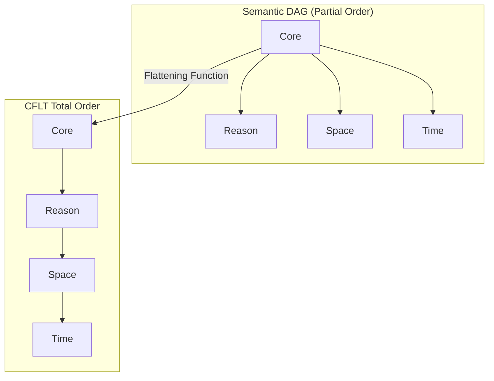
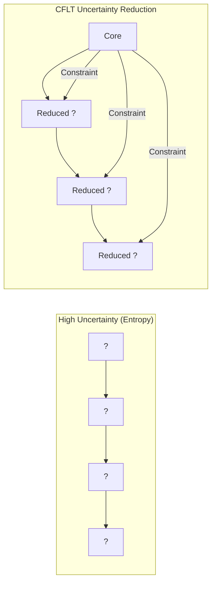
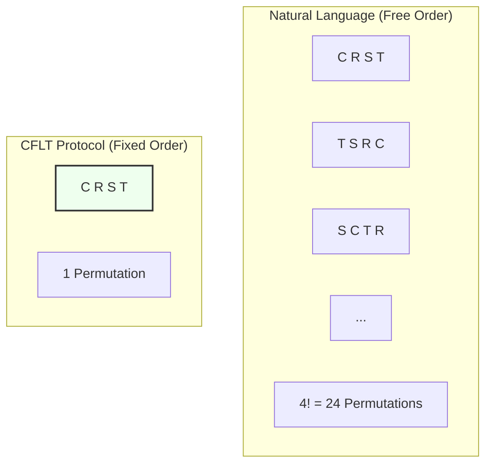

# Mathematical Foundations of CFLT

> **Version:** 1.0.0 (Internal Draft)
> **Author:** CFLT Core Team
> **Organization:** [CFLT.center](https://cflt.center)
> **License:** [CC BY 4.0](https://creativecommons.org/licenses/by/4.0/)

---

## 1. The Linearization Problem

Human thought (the *preverbal message*) can be modeled as a directed acyclic graph (DAG) or a partial order of semantic dependencies. Speech, however, is a **total order** of tokens. 

Different languages choose different deterministic linearization functions over the same underlying partial order. CFLT proposes one specific linearization:

$$L_{\text{CFLT}}(G) = [\,\text{root}(G),\ \text{cause}(G),\ \text{location}(G),\ \text{time}(G)\,]$$

where $\text{root}(G)$ is the Core. By fixing this function across all languages, CFLT reduces the **computational complexity** of translation from structural transformation to lexical substitution.

### 1.1 Modeling Identity and Request Cores
To prove CFLT is not merely "verb-first," we model the Core as the **highest-salience node** in the semantic DAG, regardless of its part-of-speech.

- **Identity Core (Copular/Stative):** In "That girl is my sister," the semantic root is the identity relation $\{A=B\}$. The linearization remains $L([A=B], \text{modifier}) = [A=B, \text{modifier}]$. The mathematical benefit is the immediate resolution of the **reference frame** before any descriptive attributes are processed.
- **Request Core (Illocutionary Force):** In a request, the illocutionary operator (e.g., `REQUEST(action)`) is the root. CFLT linearizes this as $[\text{Operator}, \text{Action}, \text{Context}]$. This minimizes the **illocutionary ambiguity** — the listener knows *why* they are listening before they hear *what* the task is.

---

## 2. Entropy and Sequence Prediction

From the perspective of a sequence predictor (human or LLM), the conditional entropy of token $t_i$ decreases as more relevant context is provided.

$$H(t_i \mid t_{i-1}, \dots, t_1)$$

In the **CFLT Protocol**, the Core occupies $t_1$. Because the Core is the highest-information constituent (the salience anchor), it provides the strongest constraint on the probability distribution of all subsequent slots.

> **Important caveat — chain rule and joint entropy.** By the chain rule of entropy (Cover & Thomas 2006, Ch. 2), the *joint* entropy $H(t_1, t_2, \dots, t_n)$ is **invariant** under permutation of the tokens — the total uncertainty of a sequence does not depend on the order in which we factor it. So CFLT does **not** claim to reduce total joint entropy by placing Core first.
>
> What CFLT does claim is weaker but still useful: under autoregressive decoding, **placing the highest-information constituent in the early prefix region maximizes the early conditional-distribution stability** $H(t_i \mid t_{<i})$ for the *first few* steps. This benefits (a) human listeners who do not buffer the entire utterance before starting to interpret, and (b) LLMs whose generation is sampled left-to-right and thus depend on early conditional distributions being well-shaped.
>
> Mathematically: CFLT optimizes for **early prefix informativeness**, not total entropy. The right framing is "Core in $t_1$ minimizes the uncertainty of *what kind of utterance this is* by step 1," not "Core in $t_1$ minimizes joint entropy."

Conditional entropy $H(\text{rest} \mid \text{core})$ is significantly lower than $H(\text{rest} \mid \text{some-modifier})$, which means the listener/model achieves **earlier disambiguation** even though total joint entropy is unchanged. This is the precise sense in which Core-first is information-theoretically motivated.

---

## 3. Parsing Efficiency: Early Immediate Constituents (EIC)

> See [`linguistics.md`](./linguistics.md) §3 for the canonical EIC introduction; this section gives the information-theoretic refraction (CRD ratios, branching direction).

John Hawkins (1994, 2004) proposes the **Early Immediate Constituents (EIC)** principle as a fundamental driver of word-order typology. It posits that the human parser prefers linear orders that allow for the identification of a phrase's **Immediate Constituents (ICs)** within the shortest possible window.

### 3.1 Constituent Recognition Domain (CRD)
The CRD is the word-count required to identify all ICs of a phrase. Hawkins quantifies efficiency as the ratio of ICs to the CRD. 

By placing the Core in position 0, the CFLT Protocol minimizes the CRD for the main clause. The listener identifies the "anchoring" constituent immediately, achieving a high IC-to-word ratio (often approaching 100% for the core recognition). This reduces the **look-ahead buffer** required by the parser, directly lowering cognitive load.

### 3.2 Branching Direction and Incremental Processing
CFLT effectively creates a **left-heavy (head-initial)** structure for the discourse-level core. This facilitates **incremental processing**: the listener can integrate information as it arrives rather than holding a sequence of modifiers in working memory while waiting for the core (a common "modifier trap" in head-final languages like Chinese).

---

## 4. Uniform Information Density Hypothesis (UID)

Levy & Jaeger (2007), Jaeger (2010), and the broader UID literature propose that speakers tend to spread information **uniformly** across the utterance — avoiding spikes and troughs.

This is sometimes presented as a counter-argument to frontloading high-information tokens. We address the tension honestly:

- **For native speakers**, UID predicts that within a fluent utterance, information density is roughly constant. End-focus and end-weight in English distribute heavy NPs to the right precisely to flatten density.
- **For L2 learners and AI agents**, UID is a *production-side* optimization that presupposes the speaker can already plan globally. Learners cannot. CFLT therefore optimizes for **interpretation-side** parsing certainty by frontloading the core, accepting a less-flat density curve.

CFLT is thus not a refutation of UID; it is a **different optimization target** suited to a different speaker population.

---

## 5. Optimal Coding (Source Coding Theorem)

Shannon's source coding theorem (1948) and Huffman coding (1952) tell us that **frequently used or highly informative items should occupy short, easily accessible code positions**.

Translating this to clause linearization:
- The Core Action is the **shortest path to disambiguating the speaker's intent**.
- Putting it in position 1 (the most accessible position) minimizes the listener's expected lookup cost.

This is analogous to placing the most frequently accessed instruction at the entry point of a function — the engineering principle of "front-load the dispatch."

---

## 6. Markov Chains and Sequential Dependence

A clause modeled as a Markov chain $(t_1, t_2, \dots, t_n)$ has joint probability:

$$p(t_1, \dots, t_n) = \prod_{i=1}^{n} p(t_i \mid t_{i-1}, \dots, t_1)$$

The **early tokens dominate the conditional distributions** of all later tokens. If $t_1$ encodes the action verb, then $p(t_2 \mid t_1)$ is heavily constrained — possible reasons, locations, and times must be compatible with the action.

For autoregressive language models (the dominant LLM architecture, see `llm.md`), this means:

- A CFLT-prefixed prompt steers all subsequent generation toward action-consistent continuations.
- A non-CFLT prompt (e.g., starting with a temporal adjunct) leaves the action under-determined for many tokens, increasing variance and hallucination risk.

---

## 7. KL Divergence and Prompt Steering

For an autoregressive model with conditional distribution $p_\theta(\cdot \mid \text{prompt})$, the **steering effect** of different prompt orderings can be quantified by the Kullback-Leibler divergence between the resulting distributions:

$$D_{KL}\!\left(p_\theta(\cdot \mid \text{prompt}_A)\,\Big\|\,p_\theta(\cdot \mid \text{prompt}_B)\right)$$

Empirical studies (Sclar et al. 2024; Lu et al. 2022 on order sensitivity) consistently find that prompt ordering substantially shifts model output distributions. CFLT is, in this framing, an **engineering choice** to fix the prompt prefix to a high-KL, low-variance ordering.

---

## 8. Combinatorial Bounds on Constructional Flexibility

For a four-slot template with $n_i$ candidate fillers per slot, the size of the productive language is:

$$|L_{\text{CFLT}}| = \prod_{i=1}^{4} n_i$$

This is independent of word-order choice — but the **search space at production time** is:

- For free-order natural language: $|L_{\text{CFLT}}| \times 4!$ permutations the speaker must choose among.
- For CFLT-constrained language: $|L_{\text{CFLT}}| \times 1$ — the linearization is fixed.

CFLT thus eliminates a factor of $4! = 24$ from the **protocol-level** search space, fixing the linearization sub-task to a single canonical schedule.

> **Caveat.** This is an upper-bound argument about the *space* the speaker is permitted to choose from, not a claim that natural-language production literally enumerates 24 permutations at runtime. Empirical models of speech production (Levelt 1989; Kormos 2006) treat linearization as guided by incremental, heuristically constrained choice rather than combinatorial search. The pedagogical force of the $4! \to 1$ collapse is therefore that it removes an *axis of choice* the learner would otherwise have to resolve under cognitive load — not that it shortcuts a literal 24-way decision per utterance.

---

## 9. Information-Theoretic View of L1 → L2 Translation

If $L_1$ and $L_2$ have surface linearizations $\sigma_1, \sigma_2$ over the shared semantic DAG $G$, then producing L2 from L1 thought requires:

$$\sigma_2 \circ \sigma_1^{-1}(G) = \text{re-linearize}(G \text{ extracted from L1 surface})$$

This composition has two costs:
1. **Decoding** $\sigma_1^{-1}$: recovering $G$ from L1 surface.
2. **Encoding** $\sigma_2$: re-linearizing $G$ in L2 order.

CFLT short-circuits both by introducing a **canonical intermediate linearization** $\sigma_C$:

$$\sigma_2 \circ \sigma_C^{-1} \circ \sigma_C \circ \sigma_1^{-1}(G)$$

This appears longer, but the trick is that $\sigma_C$ is **the same in every language**. Once a learner internalizes $\sigma_C$, both $\sigma_C \circ \sigma_1^{-1}$ and $\sigma_2 \circ \sigma_C^{-1}$ are simple token-level remappings, not structural reorganizations. CFLT converts a structural transformation into a lexical substitution.

> **Caveat — this section is heuristic, not a proof.** Formally, $\sigma_C^{-1} \circ \sigma_C$ is just the identity, so the four-arrow form is *equivalent* to $\sigma_2 \circ \sigma_1^{-1}$ in pure cost-function terms. The substantive claim is **cognitive**, not algebraic: a learner who has *internalized* $\sigma_C$ can amortize its decoding/encoding cost across millions of utterances, so the *per-utterance* effort drops from one structural transformation to two lexical substitutions over a shared scaffold. The math here illustrates the decomposition; it does not prove the cost reduction. Empirical validation is listed in [`methodology/evaluation-metrics.md`](../methodology/evaluation-metrics.md) §2 (Articulation Onset Latency, Cognitive Load Index).

---

## 10. Decision-Theoretic Framing for Pedagogy

A learner producing an L2 sentence faces a sequential decision problem at each token position. The total **production cost** can be modeled as:

$$C(\sigma) = \sum_{i=1}^{n} c_i(\sigma)$$

where $c_i$ is the cognitive cost of choosing token $i$ given the partial sequence so far. Empirically, $c_i$ scales with the **branching factor** at position $i$: how many continuations are still viable?

By fixing the slot order, the protocol forces the highest-information slot (Core Action) to be filled first, which **collapses branching factor at all later positions**. The overall production cost is bounded above by:

$$C(\sigma_{\text{CFLT}}) \leq C(\sigma_{\text{free}})$$

with the gap maximized when the speaker is novice (high baseline branching factor) — exactly the L2 learner case.

---

## 11. Honest Limitations

1. **UID tension.** As noted in §4, native idiomatic English aims for flat information density (often via end-weight); strict CFLT produces lumpy density profiles. Idiomatic polishing must be applied at the surface stage.
2. **Empirical estimation of $c_i$.** The decision-theoretic argument depends on cognitive cost functions that are hard to measure directly; experimental validation is needed (eye tracking, articulation onset latency).
3. **Non-eventive clauses.** The CFLT template assumes an event-denoting clause with a clear core action. Stative descriptions, generic statements, and identification clauses ("This is a chair") fit awkwardly and may need a separate template family.
4. **Long-range dependencies.** When semantic modifiers depend on each other (nested causes, conditional times), the four-slot template flattens what is logically a tree. The Grammar Overlay must reconstruct nesting at the surface level.

---

## 12. Open Mathematical Questions

> **Epistemic status.** The four points below are deliberately listed as *open* — they are not background limitations of the framework but unresolved formal questions. The first two are particularly important: CFLT does **not** claim mathematical optimality for either the slot count or the inner R-S-T order. The "Core in position 0" claim is multiply derived (see `core-concept.md` §1, `linguistics.md` §2-3, `neuroscience.md` §1, this document §2); the **R-S-T inner order is a documented convention with three rationale arguments** (see `linguistics.md` §4.3), not a derivation. This section is the canonical record of that distinction at the mathematical layer.

1. **Optimal slot count.** Why four? Can the cognitive cost function justify exactly four slots (Core + R + S + T), or is this an empirically motivated heuristic? Note that the two-tier model (event nucleus + ground frame; see `core-concept.md` §2.1) places manner / instrument / beneficiary / accompaniment / modal / negation **inside** Core rather than as additional slots, so "four" refers to the *circumstantial frame* dimensionality, not the total number of modifier categories.
2. **Slot order proof.** Is `Core → Reason → Space → Time` provably optimal under any natural cost function, or is it one of several local optima? CFLT currently treats R-S-T as a chosen permutation among $3! = 6$ alternatives, defended on Gricean Relevance + concreteness ladder + deictic recoverability arguments (`linguistics.md` §4.3). A formal proof — or counterexample — would tighten the foundation considerably.
3. **Recursive CFLT.** When a slot filler is itself a clause, the recursion needs a closure rule; does the recursive variant preserve the linearization-cost theorem?
4. **Cross-linguistic equivalence classes.** Two languages share a "CFLT equivalence class" if their $\sigma$ functions agree under permutation of the four slots. What is the algebraic structure of this equivalence relation?

---

## 13. Cited Works

See [`bibliography.md`](../bibliography.md) (§ Mathematics and Information Theory; § Large Language Models and NLP for autoregressive references) for full references.

---

## See Also

- [`linguistics.md`](./linguistics.md) §3 — EIC at the linguistic level; §3 here gives its information-theoretic counterpart.
- [`logic.md`](./logic.md) §3 — Lambda-calculus framing, dual to the autoregressive Markov chain of §6 here.
- [`llm.md`](./llm.md) §4, §6 — Prompt steering and token economy, the production-engineering corollaries of §7 and §8 here.
- [`neuroscience.md`](./neuroscience.md) §3 — The "Prefrontal Tax," the neural cost function whose abstract form §10 here models.
