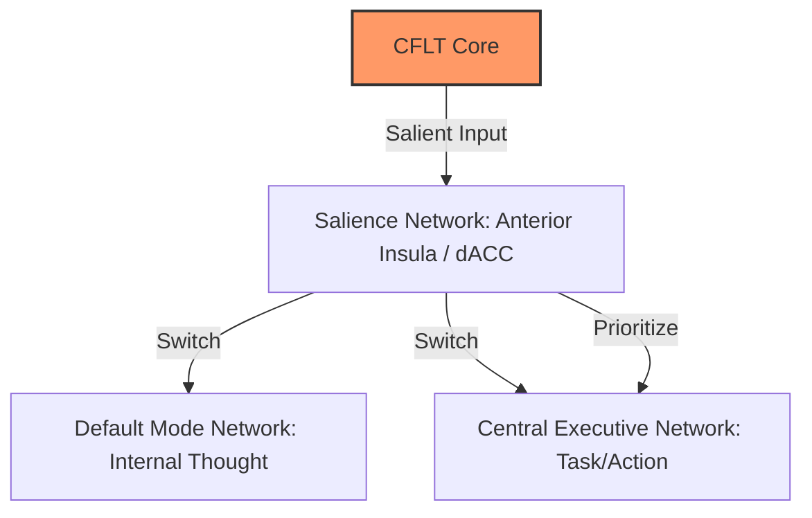
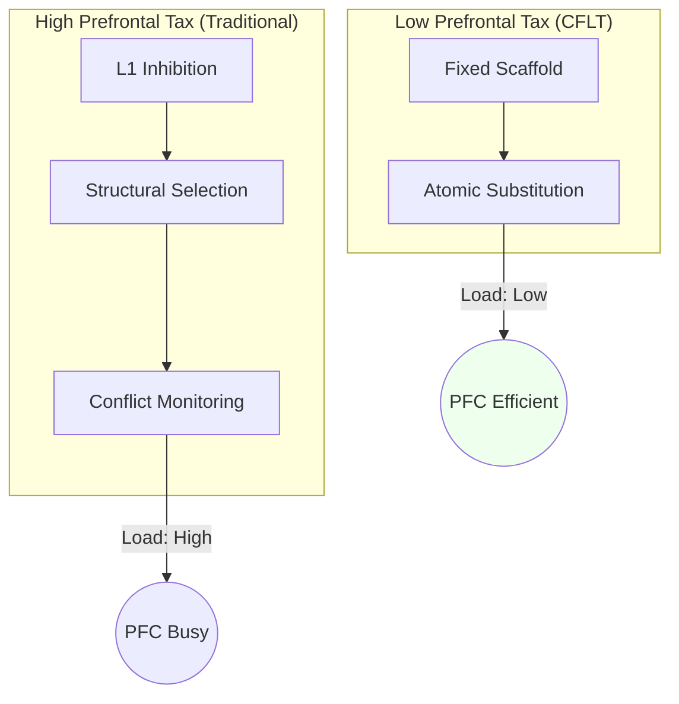
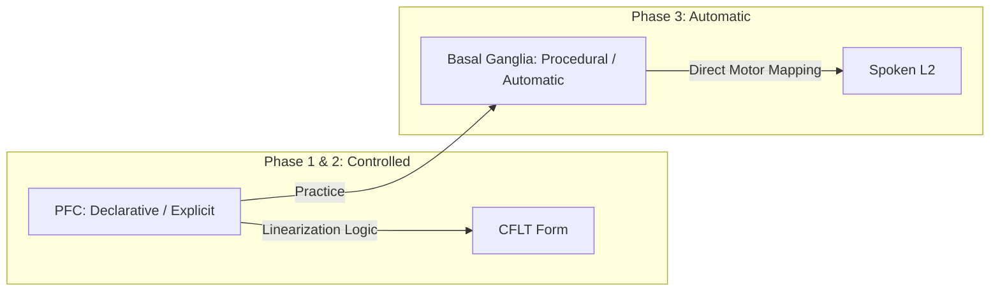

# Neuroscience Foundations of CFLT

> **Version:** 1.0.0 (Internal Draft)
> **Author:** CFLT Core Team
> **Organization:** [CFLT.center](https://cflt.center)
> **License:** [CC BY 4.0](https://creativecommons.org/licenses/by/4.0/)

---

## 1. The Salience Network and the "Core"

The human brain does not process information as a flat sequence. It uses a specialized **Salience Network (SN)** — centered in the **Anterior Insula** and **dorsal Anterior Cingulate Cortex (dACC)** — to identify which stimuli are behaviorally relevant.

- **The Dynamic Switch:** The SN acts as a switch between the Default Mode Network (internal thought) and the Central Executive Network (task focus).
- **CFLT Alignment:** The "Core" in CFLT is the linguistic realization of the most salient event or intent. By placing the Core at **Position 0**, the CFLT Protocol aligns the linear utterance with the brain's internal "priority queue." This reduces the latency between conceptualization and articulation.

---

## 2. Figure-Ground and the Attention Network

> See [`linguistics.md`](./linguistics.md) §2.1 for the canonical Figure-Ground introduction; this section gives the neural-correlates refraction.

CFLT’s "Core-First" principle is a linguistic implementation of the **Figure-Ground** distinction (Talmy, 2000). The neural correlates of this distinction are found in the **posterior parietal cortex (PPC)** and the **fronto-parietal attention network**.

- **Windowing of Attention:** The brain uses "windowing" to foreground a specific entity (the Figure) against a reference frame (the Ground).
- **Neural Cost of Reversal:** Cross-linguistic neuroimaging (primarily Hashimoto, Yokoyama & Kawashima 2012, the full journal article from this lab) shows that processing non-canonical Figure–Ground assignments and non-canonical word orders elicits increased activity in left frontal regions (LIFG / DLPFC), consistent with the additional working-memory and conflict-monitoring load required when default salience expectations are violated. We interpret these findings as a *neural signature* of salience-mismatch cost, not as a direct measurement of CFLT's intervention. **Caveat**: subsequent LATL combinatorial findings (Bemis & Pylkkänen 2013; Pylkkänen 2019) show basic semantic composition is stable across word orders, so the observed cost likely reflects surface-level reanalysis rather than a deficit in core combinatorial processing. A CFLT-targeted fMRI study is listed as an open question in §7.
- **CFLT Strategy:** By asserting the Core (Figure) first and modifiers (Ground) later, CFLT follows the path of least resistance for the brain's spatial and attentional processing.

---

## 3. Minimizing the "Prefrontal Tax" (Restructuring Cost)

Adult L2 production is bottlenecked by the **Prefrontal Cortex (PFC)**. Producing a sentence in a new language requires high metabolic and computational costs in the **Dorsolateral PFC (DLPFC)** and **Broca's Area (LIFG)**.

| Source of Cost | Neural Mechanism | CFLT Solution |
|---|---|---|
| **Inhibitory Control** | DLPFC must suppress automatic L1 habits. | The fixed 4-slot scaffold reduces the need for real-time structural decisions. |
| **Selection Demand** | LIFG must choose between competing L1 and L2 rules. | The protocol eliminates linearization choices ($4! \to 1$), freeing resources for vocabulary retrieval. |
| **Conflict Monitoring** | ACC detects "prediction errors" between L1 and L2. | The predictable pattern creates a stable "mental template" that reduces prediction error. |

By providing a **fixed conceptual scaffold**, CFLT lowers the "Prefrontal Tax," allowing learners to achieve higher fluency even before L2 grammar is fully internalized.

---

## 4. Early Immediate Constituents (EIC) and Neural Efficiency

> See [`linguistics.md`](./linguistics.md) §3 for the canonical EIC introduction; this section gives the neural-efficiency refraction.

The **Early Immediate Constituents (EIC)** principle (Hawkins, 1994) suggests that the brain prefers structures that allow it to recognize the phrasal head as early as possible.

- **Dependency Length:** Neuroimaging (fMRI) shows that activation in **BA 44 (Broca's area)** and the **lpSTG** increases linearly with the distance between related constituents.
- **CFLT Implementation:** The Core-First protocol is a **Maximum EIC** strategy. By placing the "head" (the Core) at the very start, the distance to dependents is minimized, reducing the "look-ahead buffer" and the working memory load on the **parietal cortex**.

> **Honest scope of "neural correlate" claim.** Neuroimaging research (Friederici 2017 *Language in Our Brain*; Bemis & Pylkkänen 2013 on LATL combinatorial activity; Pylkkänen 2019 *Science*) finds neural markers of **early syntactic/semantic composition** — ELAN ~150–250 ms, LATL composition signal stable across word orders. These findings provide **converging evidence** for EIC-style early constituent processing, but they are **not direct neural confirmations of the EIC efficiency metric itself**. EIC is a corpus-derived parsing efficiency measure (Hawkins 1994); its specific neural realization remains an open empirical question. CFLT's invocation of EIC at the linguistic level is well-grounded; the neural-efficiency framing in this section should be read as theoretically motivated, not as a tested neurobiological claim.

---

## 5. Position-0 Effects: Brain Primacy and Transformer Attention

Recent research in "StreamingLLM" (Xiao et al., 2024) identifies the very first tokens as **Attention Sinks**. As `llm.md` §2.3 carefully disambiguates, the sink is a *softmax-stability artifact* (Xiao et al. explicitly note these tokens are "not being semantically important"), distinct from the separate **Primacy Effect** under which causal masking compounds the influence of early tokens over later ones. Cognitive neuroscience identifies a partially parallel brain mechanism — sometimes informally called *"Primal Tokens"* (a project-internal term, not a standard cognitive-science label) — in which early-arriving information is weighted more heavily during stream comprehension.

- **The Anchor Effect:** The brain uses stable reference frames (like the self-schema) as a salience anchor for incoming sensory data.
- **Primacy Bias:** Early items in a sequence are integrated more deeply (Murdock 1962 *Serial Position Effect*; Baddeley working-memory primacy).
- **CFLT Application:** Placing the Core at Position 0 leverages **brain primacy** (and is compatible with — but does not strictly depend on — the LLM attention-sink artifact). It ensures the most critical information occupies the high-attention prefix region of both human listeners and LLM contexts. CFLT's claim rests on primacy, not on sink; see `llm.md` §2.3 for the precise disambiguation.

---

## 6. From PFC to Basal Ganglia: Proceduralization

Language mastery is the transition from **Declarative Memory** (knowing that — PFC) to **Procedural Memory** (knowing how — Basal Ganglia/Cerebellum).

- **The "Muscle" of Language:** CFLT treats language as a physical skill. The rigid 4-slot protocol is designed to be **"proceduralized"** through repeated use.
- **Bypassing the Formulator:** By training the brain to map concepts directly into the CFLT scaffold, we bypass the bottlenecked **Formulator stage** (Levelt, 1989), allowing for "instant" speech production.

---

## 7. Open Research Questions

1. **PFC Activation Delta:** Does CFLT-trained L2 production show significantly lower DLPFC activation compared to traditional grammar-based production?
2. **ERP Signatures:** Does the predictable CFLT structure lead to reduced **P600** or **LAN** amplitudes during processing?
3. **Interhemispheric Transfer:** Does the "Core-First" protocol improve the efficiency of interhemispheric communication during complex discourse?

---

## 8. Cited Works

See [`bibliography.md`](../bibliography.md) (§ Neuroscience) for full references. Relevant neuroscientific works include:
- **Hashimoto, Yokoyama & Kawashima (2012)** *Cross-linguistic difference in canonical word order affects brain responses during sentence comprehension* — the full journal article on word-order processing differences. DOI: [10.2174/1874347101206010062](https://doi.org/10.2174/1874347101206010062)
- **Pliatsikas (2020)** on the neurobiology of L2 restructuring. DOI: [10.1017/S1366728919000130](https://doi.org/10.1017/S1366728919000130)
- **Seeley et al. (2007)** on the Salience Network. DOI: [10.1523/JNEUROSCI.5587-06.2007](https://doi.org/10.1523/JNEUROSCI.5587-06.2007)
- **Friederici (2011)** on the hierarchy of language in the brain. DOI: [10.1152/physrev.00006.2011](https://doi.org/10.1152/physrev.00006.2011)

---

## See Also

- [`linguistics.md`](./linguistics.md) §2, §3 — The Figure-Ground asymmetry and EIC at the cognitive-linguistic level; this doc gives their neural correlates.
- [`pedagogy.md`](./pedagogy.md) §4, §5 — Cognitive Load Theory and Skill Acquisition Theory, the educational corollaries of §3 and §6 here.
- [`llm.md`](./llm.md) §2 — Transformer attention sinks; §5 here draws the brain-vs-Transformer parallel.
- [`mathematics.md`](./mathematics.md) §6 — Markov / autoregressive view of the same early-token dominance described neurally in §1 here.
