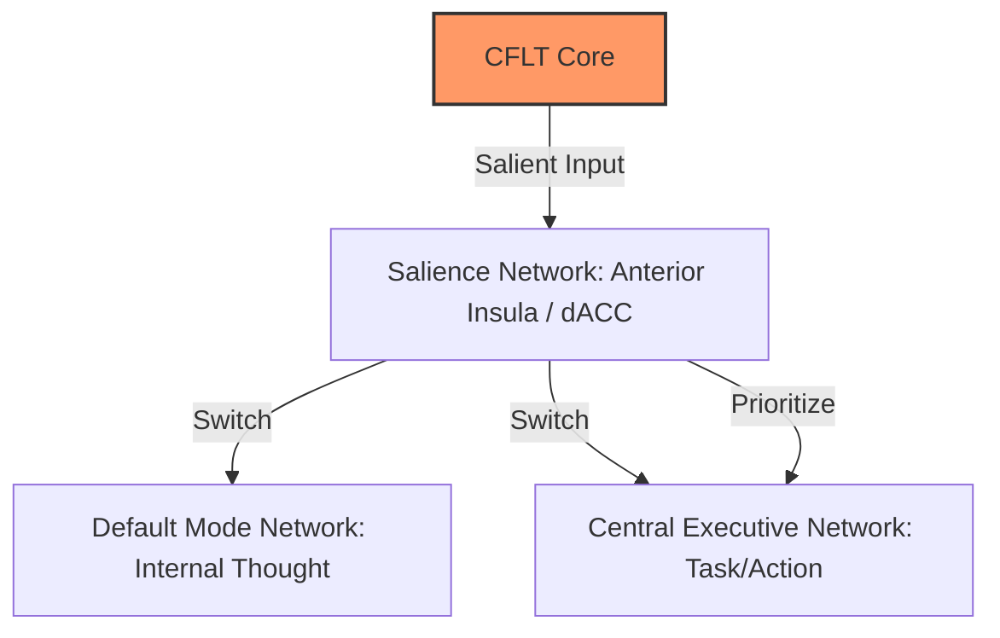
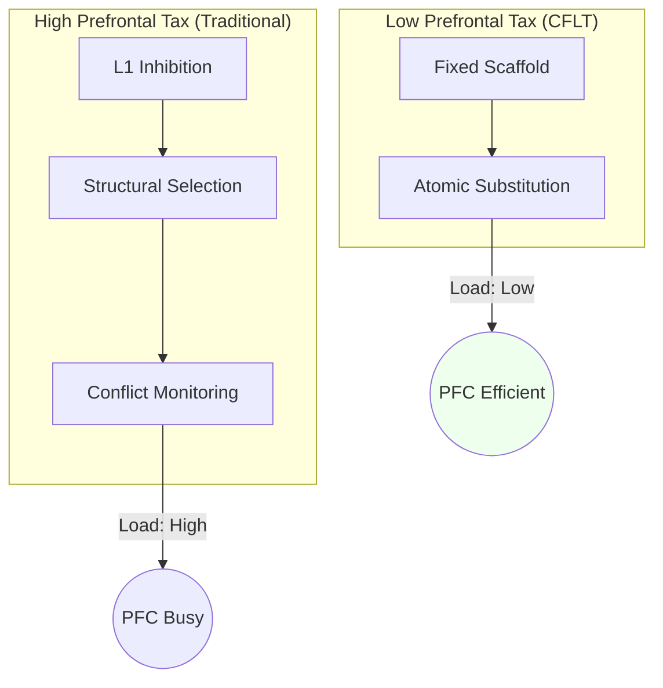
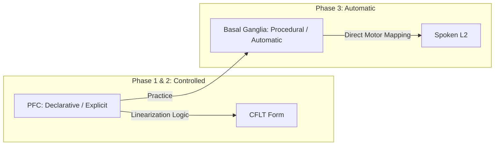

# Neuroscience Foundations of CFLT

> **Version:** 1.0.0 (Internal Draft)
> **Author:** CFLT Core Team
> **Organization:** [CFLT.center](https://cflt.center)
> **License:** [CC BY 4.0](https://creativecommons.org/licenses/by/4.0/)

---

## 1. The Salience Network and the "Core"

The human brain does not process information as a flat sequence. It uses a specialized **Salience Network (SN)** — centered in the **Anterior Insula** and **dorsal Anterior Cingulate Cortex (dACC)** — to identify which stimuli are behaviorally relevant (Seeley et al. 2007).

- **The Dynamic Switch:** The SN acts as a switch between the Default Mode Network (internal thought) and the Central Executive Network (task focus).
- **CFLT Alignment:** The "Core" in CFLT is the linguistic realization of the speaker's salience anchor. By placing the Core at **Position 0**, the CFLT Protocol aligns the linear utterance with the brain's internal "priority queue" — we **predict** this reduces the latency between conceptualization and articulation; the corresponding empirical test (PFC Activation Delta) is listed as an open question in §7.1.

> **Concept-import scope (T2 partial equivalence).** *We borrow the **Salience Network** (Seeley et al. 2007) only for its prioritization-detection function — the brain's capacity to flag behaviorally relevant stimuli. We do **not** claim that producing CFLT-formatted utterances activates the same anterior-insula / dACC nodes as the SN literature describes; the SN name denotes the **cognitive role**, not the **neural substrate**. A direct CFLT-targeted fMRI study designed to test the substrate claim is listed as an open question in §7. This caveat parallels the LATL caveat in §2 and the EIC "honest scope" caveat in §4.*

---

## 2. Figure-Ground and the Attention Network

> See [`linguistics.md`](./linguistics.md) §2.1 for the canonical Figure-Ground introduction; this section gives the neural-correlates refraction.

CFLT’s "Core-First" principle is, by analogy, a linguistic implementation of the **Figure-Ground** distinction (Talmy, 2000). Talmy is a cognitive-semantic source and supplies no neuroimaging evidence; the **posterior parietal cortex (PPC)** and **fronto-parietal attention network** are invoked here only as the *attention-research* substrate CFLT finds motivating for foregrounding, not as neural correlates established by Talmy.

- **Windowing of Attention:** The brain uses "windowing" to foreground a specific entity (the Figure) against a reference frame (the Ground).
- **Neural Cost of Reversal:** A cross-linguistic neurotypology survey (Hashimoto, Yokoyama & Kawashima 2012) reviews prior SVO/SOV sentence-comprehension studies and reports that canonical word-order typology is associated with differing activation distributions across frontal, temporal, and other regions, which the authors read as compatible with differing working-memory loads. This is a *literature survey*, not a controlled experiment: it does **not** test Figure–Ground reversal, does **not** compare canonical against non-canonical order within a unified design, and supplies **no** reusable protocol. CFLT therefore treats it as **indirect neurotypological motivation** for the hypothesis that violating default salience expectations carries a cost — a hypothesis CFLT must test directly, not as a measurement of CFLT's intervention. **Caveat**: minimal-composition LATL findings (Bemis & Pylkkänen 2013; Pylkkänen 2019) are sometimes cited for stability of basic semantic composition, but those experiments do not test broad word-order invariance; whether composition is stable across orders remains open. A CFLT-targeted fMRI study is listed as an open question in §7.
- **CFLT Strategy:** By asserting the Core (Figure) first and modifiers (Ground) later, CFLT follows the path of least resistance for the brain's spatial and attentional processing.

---

## 3. Minimizing the "Prefrontal Tax" (Restructuring Cost)

CFLT **hypothesizes** that adult L2 production is metabolically and computationally costly because it engages a **distributed bilingual-control network** (Abutalebi & Green 2007/2016) — including, among other regions, the **Dorsolateral PFC (DLPFC)** and **Broca's Area (LIFG)** — rather than being bottlenecked by any single region. We use "Prefrontal Tax" as shorthand for the cost CFLT is engineered to reduce; whether and where it falls is the empirical question of §7.1.

| Source of Cost | Neural Mechanism | Predicted CFLT Effect |
|---|---|---|
| **Inhibitory Control** | DLPFC must suppress automatic L1 habits. | The fixed 4-slot scaffold is predicted to reduce the need for real-time structural decisions. |
| **Selection Demand** | LIFG must choose between competing L1 and L2 rules. | The protocol eliminates linearization choices ($4! \to 1$); predicted to free resources for vocabulary retrieval. |
| **Conflict Monitoring** | ACC detects "prediction errors" between L1 and L2. | The predictable pattern is predicted to create a stable "mental template" that reduces prediction error. |

All three predicted effects are subject to the open empirical question of §7.1 *PFC Activation Delta*; the neural-cost framework cited (DLPFC / LIFG / ACC roles; Friederici 2011; Hashimoto et al. 2012) is well-established, but the *CFLT-specific* reductions are predictions, not measurements.

By providing a **fixed conceptual scaffold**, CFLT is engineered to lower the "Prefrontal Tax." Whether this translates into measurably higher fluency before L2 grammar is fully internalized is the empirical content of P3 (`foundations/core-concept.md` §8.5).

---

## 4. Early Immediate Constituents (EIC) and Neural Efficiency

> See [`linguistics.md`](./linguistics.md) §3 for the canonical EIC introduction; this section gives the neural-efficiency refraction.

The **Early Immediate Constituents (EIC)** principle (Hawkins, 1994) suggests that the brain prefers structures that allow it to recognize the phrasal head as early as possible.

- **Dependency Length:** Neuroimaging (fMRI) finds that activation in **BA 44 (Broca's area)** and the **lpSTG** tends to rise with the distance between related constituents — a dependency-length effect that motivates, but does not by itself confirm, EIC.
- **CFLT Implementation:** By analogy to EIC, the Core-First protocol places the "head" (the Core) at the very start so the distance to dependents is short. CFLT **hypothesizes** this reduces the "look-ahead buffer" and working-memory load. Hawkins's EIC is a corpus-derived parsing metric and does not itself supply a "Maximum EIC" optimum or a parietal-load result; both the discourse-level efficiency claim and its localization are CFLT predictions, not derivations (see the honest-scope caveat below).

> **Honest scope of "neural correlate" claim.** Neuroimaging research (Friederici 2017 *Language in Our Brain*; Bemis & Pylkkänen 2013 on LATL combinatorial activity; Pylkkänen 2019 *Science*) finds neural markers of **early syntactic/semantic composition** — e.g. ELAN ~150–250 ms and a left-anterior-temporal combinatory signal for minimal phrases. These findings **motivate** an EIC-style picture of early constituent processing, but they are **not direct neural confirmations of the EIC efficiency metric itself**, and they do **not** establish that minimal composition is invariant across word orders (the cited experiments do not test that contrast). EIC is a corpus-derived parsing efficiency measure (Hawkins 1994); its specific neural realization remains an open empirical question. CFLT's invocation of EIC at the linguistic level is well-grounded; the neural-efficiency framing in this section should be read as theoretically motivated, not as a tested neurobiological claim.

---

## 5. Position-0 Effects: Brain Primacy and Transformer Attention

Recent research in "StreamingLLM" (Xiao et al., 2024) identifies the very first tokens as **Attention Sinks**. As `llm.md` §2.3 carefully disambiguates, the sink is a *softmax-stability artifact* (Xiao et al. explicitly note these tokens are "not being semantically important"), distinct from the separate **Primacy Effect** under which causal masking compounds the influence of early tokens over later ones. Cognitive neuroscience identifies a partially parallel brain mechanism — sometimes informally called *"Primal Tokens"* (a project-internal term, not a standard cognitive-science label) — in which early-arriving information is weighted more heavily during stream comprehension.

- **The Anchor Effect:** The brain uses stable reference frames (like the self-schema) as a salience anchor for incoming sensory data.
- **Primacy Bias:** Early items in a sequence are integrated more deeply (Murdock 1962 *Serial Position Effect* — a *free-recall memory* phenomenon, whose transfer to online comprehension/production salience is **analogical**, not direct evidence; Baddeley working-memory primacy).
- **CFLT Application:** Placing the Core at Position 0 leverages **brain primacy** (and is compatible with — but does not strictly depend on — the LLM attention-sink artifact). It ensures the most critical information occupies the high-attention prefix region of both human listeners and LLM contexts. CFLT's claim rests on primacy, not on sink; see `llm.md` §2.3 for the precise disambiguation.

---

## 6. From PFC to Basal Ganglia: Proceduralization

Skill Acquisition Theory (Anderson; DeKeyser) describes a movement from **declarative** ("knowing that") toward increasingly **procedural, automatic** performance. CFLT borrows this as a learning-stage analogy. The declarative→procedural shift is **not** a simple location handoff from PFC to basal ganglia/cerebellum: the underlying neural systems are distributed, and a clean "PFC stores declarative, BG stores procedural" mapping is an oversimplification we use only for exposition.

- **The "Muscle" of Language:** CFLT treats language as a skill and **hypothesizes** that the fixed 4-slot protocol can be **"proceduralized"** through repeated use — a prediction to be tested, not a demonstrated outcome.
- **Reducing Formulator Demand:** By training the brain to map concepts directly into the CFLT scaffold, CFLT aims to **reduce selected planning demands at the Formulator stage** (Levelt, 1989). CFLT does **not** claim the Formulator can be bypassed — grammatical and phonological encoding still require formulation; the predicted gain is lower planning cost, to be measured empirically.

---

## 7. Open Research Questions

1. **PFC Activation Delta:** Does CFLT-trained L2 production show significantly lower DLPFC activation compared to traditional grammar-based production?
2. **ERP Signatures:** Does the predictable CFLT structure lead to reduced **P600** or **LAN** amplitudes during processing?
3. **Interhemispheric Transfer:** Does the "Core-First" protocol improve the efficiency of interhemispheric communication during complex discourse?

---

## 8. Cited Works

See [`bibliography.md`](../bibliography.md) (§ Neuroscience) for full references. Relevant neuroscientific works include:
- **Hashimoto, Yokoyama & Kawashima (2012)** *Cross-linguistic difference in canonical word order affects brain responses during sentence comprehension* — the full journal article on word-order processing differences. DOI: [10.2174/1874347101206010062](https://doi.org/10.2174/1874347101206010062)
- **Pliatsikas (2020)** on the neurobiology of L2 restructuring. DOI: [10.1017/S1366728919000130](https://doi.org/10.1017/S1366728919000130)
- **Seeley et al. (2007)** on the Salience Network. DOI: [10.1523/JNEUROSCI.5587-06.2007](https://doi.org/10.1523/JNEUROSCI.5587-06.2007)
- **Friederici (2011)** on the hierarchy of language in the brain. DOI: [10.1152/physrev.00006.2011](https://doi.org/10.1152/physrev.00006.2011)

---

## See Also

- [`linguistics.md`](./linguistics.md) §2, §3 — The Figure-Ground asymmetry and EIC at the cognitive-linguistic level; this doc gives their neural correlates.
- [`pedagogy.md`](./pedagogy.md) §4, §5 — Cognitive Load Theory and Skill Acquisition Theory, the educational corollaries of §3 and §6 here.
- [`llm.md`](./llm.md) §2 — Transformer attention sinks; §5 here draws the brain-vs-Transformer parallel.
- [`mathematics.md`](./mathematics.md) §6 — Markov / autoregressive view of the same early-token dominance described neurally in §1 here.
