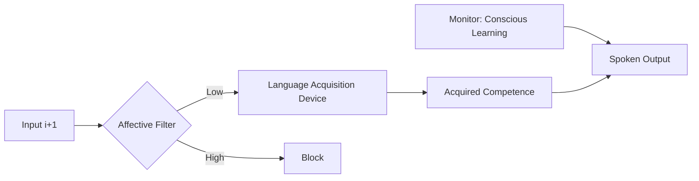
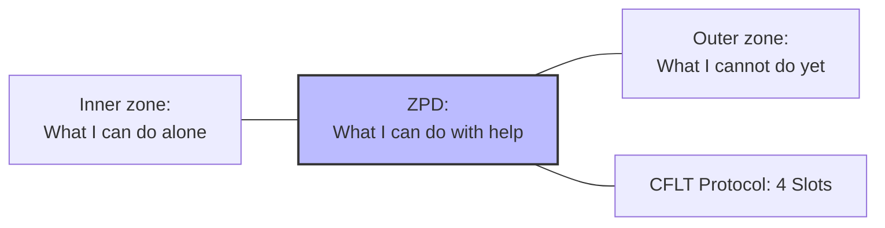
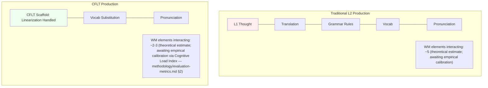

# Pedagogical Foundations of CFLT

> Companion to: [`manifesto.md`](../manifesto.md)
> Purpose: Ground the **CFLT Protocol's** pedagogical design in the second-language acquisition (SLA) literature — Krashen, Vygotsky, Cognitive Load Theory, Skill Acquisition Theory, and Task-Based Language Teaching. These sources motivate and constrain the design; the Core-First curriculum is **theory-inspired and experimentally testable**, and the learning claims below are CFLT predictions to be evaluated, not established results.

---

## 1. The Pedagogical Question CFLT Answers

Why do adult learners fail to achieve spoken fluency even after years of study? 

CFLT's hypothesis: the bottleneck is **structural restructuring cost** at production time. Adult learners with strong L1 habits face a real-time decision problem at every utterance: how to map an L1-shaped preverbal message into L2 surface form. CFLT eliminates this decision by providing a **fixed conceptual scaffold** that is the same regardless of L1 or L2.

---

## 2. The Input Hypothesis (Stephen Krashen)

Krashen's (1982, 1985) model posits that humans acquire language through **comprehensible input** ($i+1$) and that the best learning happens when the "affective filter" is low.

**CFLT alignment:**
- CFLT is designed as an **acquisition-friendly scaffold**, not a rule-memorization system. Learners are not asked to memorize the four-element protocol explicitly; they internalize it through repeated exposure and pattern completion (the gamified Builder, scenario-based courseware).
- The fixed protocol *lowers the affective filter*: by making "what comes next" predictable, the protocol reduces the anxiety of having to plan a sentence in real time.
- **CFLT Form** outputs are designed to be comprehensible (the +1 over the learner's current state) but not yet fully native. Krashen's $i+1$ refers to comprehensible **input** that contains the next-stage structure, not an output format; CFLT treats comprehensibility as a design consideration rather than claiming CFLT Form *is* the $i+1$ zone.

**CFLT departure (honest positioning):** Krashen's strong form (1982; reaffirmed 2003) holds that **explicit form instruction does not become acquisition** — the Monitor can only *edit* output under restrictive conditions, never produce native-like fluency. Under this view, CFLT's explicit protocol is incompatible with Krashen orthodoxy.

CFLT therefore does **not** claim Krashen-compatibility. The closer theoretical kin is:
- **Long's (1991) Focus-on-Form** — task-driven, but allows explicit form attention when learner difficulty signals it
- **Ellis's (2008) interface position** — explicit knowledge can transfer to implicit knowledge via practice, given proceduralization
- **VanPatten's processing instruction** — explicit training on form-meaning mappings before communicative use

CFLT operationalizes the interface position: the protocol is the explicit scaffold (declarative), repeated use across tasks proceduralizes it (procedural), and eventual stylistic deviation marks expressive mastery (automatic + flexible). See §5 for the skill-acquisition arc.

---

## 3. Zone of Proximal Development (Lev Vygotsky)

Vygotsky's (1978) **Zone of Proximal Development (ZPD)** is the distance between what a learner can do alone and what they can do with guidance.

**CFLT as a candidate scaffold within the ZPD:** CFLT proposes the four-element protocol as a candidate instructional support, compatible with the ZPD idea — it is intended to give the learner support to operate in the ZPD without doing the cognitive work for them. The learner still selects the Core, still chooses appropriate L2 vocabulary, still binds modifiers — but the *linearization decision* is offloaded to the protocol. Whether the protocol actually falls within a given learner's ZPD is an empirical question requiring per-learner, per-task assessment; "scaffolding" itself is later instructional terminology rather than Vygotsky's own.

*Three nested zones around the learner; ZPD is the middle band (per Vygotsky 1978). Connections are non-directional — these are bounded zones, not a progression.*

**Operational implication:** as learners advance, CFLT proposes that the scaffold be progressively withdrawn (the "fading" idea from later scaffolding research, not Vygotsky himself). Strict four-slot enforcement is hypothesized to be appropriate at early stages; the system should relax constraints as the learner masters the protocol, eventually allowing native-idiomatic deviations as deliberate stylistic choices. The fading schedule is a CFLT design hypothesis to be tested, not a source-established prescription.

---

## 4. Cognitive Load Theory (John Sweller)

Sweller (1988, 2011) identifies three types of cognitive load on working memory:

| Load type | Description | CFLT implication |
|---|---|---|
| **Intrinsic** | Inherent complexity of the task | A fixed design default (empirically open); set by the L2 complexity |
| **Extraneous** | Distraction from the learning goal | CFLT *predicts* it reduces this by removing structural choices (an unmeasured CFLT-specific claim) |
| **Germane** | Load directed at building schemas | CFLT aims to convert extraneous load into germane load by giving learners one schema (the four-slot protocol) instead of dozens of rules — a prediction, not an established result |

**CFLT cognitive-load argument:** in a traditional curriculum, an adult learner producing an L2 sentence performs roughly:
1. L1 thought formation
2. L1→L2 translation
3. L2 grammar rule application (tense, articles, agreement, word order)
4. Vocabulary retrieval
5. Pronunciation planning

That's at least five concurrent demands on working memory. CFLT collapses (1)+(2)+(3) into a single fixed-order operation: linearize the preverbal message into Core-First, then perform vocabulary substitution.

### 4.1 Solving the "Modifier Trap" (EIC in Pedagogy)

> See [`linguistics.md`](./linguistics.md) §3 for the canonical EIC introduction; this subsection gives the pedagogical refraction (the "Modifier Trap" as the learner-side face of EIC).

A hypothesized source of cognitive load is the **Modifier Trap** (motivated by analogy with Hawkins' EIC principle; EIC is primarily a parsing/ordering account, so the production-side transfer is a CFLT extrapolation that needs evidence). For learners from head-final backgrounds (like Chinese), the L1 habit of placing modifiers before the noun is predicted to create a high **look-ahead buffer** demand: the speaker must plan the entire noun phrase before uttering the head.

CFLT's **head-initial discourse protocol** is **predicted to** eliminate this buffer. By asserting the Core first, the learner "unloads" the most important information immediately, predicted to free working memory to append modifiers (Reason, Space, Time) incrementally. This is the pedagogical application of incremental processing; the working-memory magnitude is an open empirical question (see §12.1 *Affective Filter Measurement* for the corresponding measurement protocol).

---

## 5. Skill Acquisition Theory (DeKeyser, Anderson)

DeKeyser (2007, 2015) applied Anderson's ACT-R skill acquisition model (1982, 1993) to L2 learning:
- **Declarative Knowledge:** Knowing *that* (e.g., "the core comes first").
- **Procedural Knowledge:** Knowing *how* (e.g., being able to say it).
- **Automaticity:** The skill is executed without conscious effort.

**CFLT as a skill-acquisition curriculum:**
1.  **Phase 1 — Cognitive Reshaping**: The learner acquires the declarative knowledge of the protocol.
2.  **Phase 2 — Atomic Mapping**: Through varied practice (the gamified Builder, courseware, voice challenges, roleplay), it becomes **procedural**: learners produce protocol-formatted utterances without conscious decomposition.
3.  **Phase 3 — Cultural Refinement**: native-idiomatic L2 (the post-Grammar-Overlay form) becomes automatic, and the CFLT Protocol becomes a fallback scaffold the learner can fall back to under cognitive pressure.

---

## 6. Task-Based Language Teaching (TBLT) — Honest Positioning

TBLT (Long 1985, 2015; Ellis 2003) argues that language learning should be organized around communicative tasks rather than linguistic structures. The TBLT literature is internally divided between **strong-TBLT** (Long 2015) and **weak-TBLT** (Ellis 2003), and CFLT's relationship to each is different.

**CFLT is *not* compatible with strong-TBLT.** Long (2015) explicitly rejects *synthetic syllabus* — any pre-defined sequence of linguistic items used as the spine of instruction — and treats *focus on form* (incidental, task-driven attention to form) as the only acceptable form-focus strategy. The CFLT Protocol, which prescribes a fixed `[Core] → [Reason] → [Space] → [Time]` template *before* tasks are encountered, is exactly the kind of synthetic / focus-on-forms scaffolding Long opposes.

**CFLT is *potentially* compatible with weak-TBLT (Ellis 2003) and with VanPatten's structured input, contingent on activity design.** Ellis treats explicit form-focused instruction and task-based practice as complementary; VanPatten's processing instruction explicitly trains learners on form-meaning mappings prior to communicative use. CFLT *aims to* operationalize both — the protocol as the explicit scaffold, the courseware as the task delivery — but a CFLT activity counts as a "task" only if it satisfies the formal task criteria, and genuine structured-input activities (not output practice alone) are required before claiming a Processing-Instruction fit.

> **Task checklist (audit before applying a TBLT label):** an activity qualifies as a task only if it (1) is primarily meaning-focused, (2) has a non-linguistic communicative outcome, (3) contains an information, reasoning, or opinion gap, and (4) requires learners to draw on their own linguistic resources. Scenario labels and vocabulary context alone do not establish taskness.

**CFLT Courseware Generator as a candidate (weak-)TBLT engine:** the Generator takes inputs `topic`, `industry_context`, `age_group`, `difficulty_level` and produces a sequence of scenario-based activities, each a protocol-compliant communicative scenario with embedded vocabulary focus and audio-visual context. Whether these qualify as TBLT *tasks* must be demonstrated at the activity and outcome level against the checklist above, not asserted from scenario labels. The IT-English module (manifesto §8.2) is the canonical example: activities like "deploy a service, debug a latency issue, refactor a module" carry industry-appropriate vocabulary while the protocol provides the structural skeleton.

**Honest summary**: CFLT positions itself as an *interface-position* (Ellis 2008) framework — explicit protocol + task practice → procedural automaticity — rather than as TBLT in Long's strict sense.

---

## 7. Speech Production Models (Levelt, Kormos)

Levelt (1989) and Kormos (2006, 2014) model the speech production chain:
**Conceptualizer → Formulator → Articulator**

Adult L2 production is often "disfluent" because the **Formulator** stage is bottlenecked. The brain is trying to decide *where* to put words while also trying to *find* the words.

**CFLT intervention point:** by fixing the linearization sub-task (no more "where does the time go?" decision), CFLT *predicts* the protocol frees working memory for the L2-specific demands Kormos identifies. (Kormos describes constraints across multiple production stages and does not single out the Formulator or test fixed templates, so this is a testable extrapolation, not established evidence.) Specifically:
1.  **Earlier articulation onset:** the learner starts speaking as soon as the Core is retrieved.
2.  **Reduced repair rate:** because the sequence is fixed, there are fewer "re-starts" to correct word-order errors.

These are concrete, testable predictions about CFLT-trained learners' production behavior under working-memory load.

---

## 8. Bilingual Lexical Access (Kroll)

Kroll's **Revised Hierarchical Model** (Kroll & Stewart 1994; Kroll et al. 2010) suggests that early L2 learners access meaning through their L1 (*word-association route*). As they advance, they access meaning directly from concepts (*concept-mediation route*).

**CFLT as a proposed concept-mediation accelerator:** by training learners to think in language-neutral linearization (concept → CFLT scaffold → L1 *or* L2 surface), CFLT *hypothesizes* that the protocol short-circuits the word-association route. Neither Kroll study tests structural scaffolds or CFLT, and route strengths are graded, task-sensitive, and coexisting rather than discrete universal stages — so this acceleration is a CFLT hypothesis to be tested by a direct translation and picture-naming experiment.

CFLT *proposes* to pair this with NSM's role (manifesto §2.5): semantic primes as the language-neutral atoms that fill the slots. The idea that NSM + CFLT together form a **language-neutral conceptual layer** accessed before committing to either L1 or L2 surface forms is a CFLT pedagogical proposal, not an established result.

---

## 9. Critical Period and Developmental Stages

Children are often **assumed to be better long-term L2 acquirers** than adults (especially for native-like ultimate attainment), though the cited statistical-learning studies show infant success on controlled tasks rather than a general child-over-adult superiority. Children are also worse at *explaining what they have learned*. The right question is therefore not "does CFLT work for children?" but **"what is the right delivery mechanism for each developmental stage?"**

The Core-First protocol operates at the **cognitive-conceptual level**, not at the metalinguistic level. A child internalizing the protocol does not need to *know* they are applying a four-element protocol; they only need to absorb the pattern through repeated exposure to conformant input. This is exactly how children acquire grammar in the first place — without rule lectures.

| Learner Type | Delivery Method | Theoretical Basis |
|---|---|---|
| Early learners (~4–11) | **Visual CFLT**: animated icons for slot fillers, ~500 semantic primes, pattern absorption through play | Krashen's implicit acquisition; infant statistical-learning capacity demonstrated within studied tasks (Saffran, Aslin & Newport 1996), not an established child-over-adult advantage |
| Adults | **Efficiency CFLT**: explicit schema, industry tokens, complex connectors | Adult metalinguistic strengths (DeKeyser 2007); schema transfer; deliberate practice |

The manifesto's §8.1 Cross-Age Adaptation already encodes this differentiation. The CoreFirst v1 PRD scopes the initial product to adult learners — but this is a **v1 product-scope decision** (UI/UX adaptation, content-moderation infrastructure, and child-appropriate courseware require significant additional investment), **not a theoretical claim that CFLT is unsuitable for children**.

Several reasons CFLT may be especially well-suited to early learners — contrary to what an "adults learn explicitly" framing might naively suggest:

1.  **Hypothesized statistical-learning fit.** Infants are powerful pattern extractors within studied conditions (Saffran et al. 1996; Lany & Saffran 2010). CFLT *hypothesizes* that CFLT-conformant input would give learners a cleaner, more consistent statistical signal to internalize; no cited study tests CFLT or establishes that reduced natural-language variation actually benefits long-term acquisition, so this is a CFLT hypothesis to test.
2.  **Hypothesized lower L1-interference plateau.** Adults often plateau because entrenched L1 habits resist restructuring. CFLT *proposes* that children acquiring L2 alongside or shortly after L1 could absorb the protocol more directly, with less interference to overcome — an untested CFLT prediction.
3.  **Critical-period evidence is graded, not a puberty cliff.** Hartshorne, Tenenbaum & Pinker (2018) estimate that grammar-learning *ability* stays high until about age 17.4 and then declines, while native-like attainment generally requires starting by about age 10 because learning continues over years; onset and ability are distinct and should not be conflated. CFLT *proposes* that, by externalizing the linearization decision, it might narrow the part of the gap that is most age-sensitive (the structural-restructuring sub-task) while leaving age-neutral skills (vocabulary, pragmatics) to develop normally — a claim that requires a CFLT age-by-training experiment.

---

## 10. Honest Limitations

1.  **Pedagogical "Artificiality" / fossilization risk.** Strict four-slot sentences can feel artificial to advanced learners. Skehan's (1998) Trade-off Hypothesis motivates *measuring* complexity, accuracy, and fluency together; the specific claim that fixed templates plateau learners on *fluency* at the cost of *complexity* and *accuracy* is a CFLT-specific hypothesis, and the "Wes" single-case tradition (Schmidt 1983) illustrates communicative-vs-grammatical divergence in one learner rather than testing a CFLT template. CFLT's proposed response is the de-scaffolding path in §11.2 below: the system aims to manage the **transition to marked deviations** (manifesto §3.1) to avoid a fluency ceiling. The §11 scaffold-fading curriculum is CFLT-specific engagement with this risk and a design hypothesis to test, not a source-established solution.
2.  **Motivation vs. Method.** No protocol can solve for a lack of learner motivation. CFLT is a high-efficiency engine, but it still requires the learner to engage with the input.
3.  **Vocabulary Breadth.** The protocol focuses on structure. Vocabulary acquisition remains a separate, though related, challenge that requires specialized modules.

---

## 11. The Advanced Frontier: Skehan’s Trade-off & Scaffold Fading

A common criticism of fixed-sequence protocols is that they might lead to "linguistic fossilization" or "template-rigidity." Skehan's **Trade-off Hypothesis** (1998) does not establish that fixed-sequence templates cause fossilization or a fluency plateau; rather, it motivates *measuring* complexity, accuracy, and fluency simultaneously. CFLT uses it that way and frames the template-rigidity concern and the de-scaffolding response below as CFLT-specific hypotheses to test.

### 11.1 The Fluency-Accuracy-Complexity (FAC) Triad
Skehan posits that learners have limited attentional resources that must be divided between:
- **Fluency:** Ease of production.
- **Accuracy:** Grammatical correctness.
- **Complexity:** Structural variety and use of marked forms.

**CFLT’s Strategic Choice** (the level thresholds are CFLT design defaults, empirically open, not Skehan-derived):
- **At A1–B1 levels**, CFLT *aims to* prioritize **Fluency** (and, it predicts, **Accuracy**) by fixing the sequence, thereby reducing the "Complexity" (planning) load. Whether fluency and accuracy actually improve together is a measurement question, not a guaranteed outcome; the intent is to let the learner achieve communicative success early.
- **At B2+ levels**, the objective shifts. Once the learner has automatized the unmarked sequence, CFLT proposes re-introducing **Complexity**.

### 11.2 De-scaffolding (The Cleft / Shift Mechanism)
Mastery is defined not by strict adherence to the protocol, but by the ability to deviate from it *intentionally* based on **Information Structure** (Theme-Rheme). Advanced modules in CFLT (Phase 3: Expressive Mastery) explicitly teach the **Focus-Driven Shift**:

- **Topicalization:** Moving the [Time] or [Space] to the front for macro-thematic emphasis.
- **End-Focus Repackaging:** Utilizing cleft sentences (*"It is [X] that..."*) to highlight a ground-frame slot when it is the specific Rheme (the new info) of the discourse.

*Example:*
- **Unmarked (Stage 2):** "I wrote the code, at home, yesterday."
- **Marked (Stage 3 Focus on Space):** "**It was AT HOME** that I wrote the code, yesterday."

In this view, the CFLT protocol is a **survival scaffold** that is eventually "submerged" into the learner's subconscious, serving as the default logic from which they can perform precision deviations for rhetorical effect. This marks the transition to native-like fluency, where the protocol acts as the cognitive "fail-safe" rather than a rigid constraint.

---

## 12. Open Research Questions

1.  **Affective Filter Measurement.** Does the predictability of the protocol measurably reduce foreign language speaking anxiety (FLSA)?
2.  **Fading Schedule.** What is the optimal time to introduce "marked" forms (e.g., fronted temporal adjuncts) to avoid stunting a learner's stylistic development?
3.  **Cross-Modal Transfer.** Does training in the Core-First protocol via voice challenges transfer effectively to writing and reading?

---

## 13. Cited Works

See [`bibliography.md`](../bibliography.md) (§ Pedagogy and Second-Language Acquisition) for full references.

---

## See Also

- [`linguistics.md`](./linguistics.md) §5 — Levelt's speech-production model, the cognitive substrate for §7 here.
- [`neuroscience.md`](./neuroscience.md) §3, §6 — The "Prefrontal Tax" and proceduralization; neural mechanism behind §4 and §5 here.
- [`mathematics.md`](./mathematics.md) §10 — Decision-theoretic bound on per-token cognitive cost, formalizing the cognitive-load argument of §4 here.
- [`../methodology/human-learning.md`](../methodology/human-learning.md) — The learner-facing operational guide that this foundations doc grounds theoretically.
- [`../methodology/curriculum-engineering.md`](../methodology/curriculum-engineering.md) — TBLT scaling via token packs, derived from §6 here.
