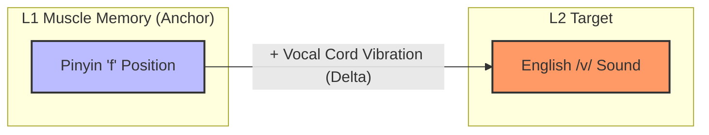
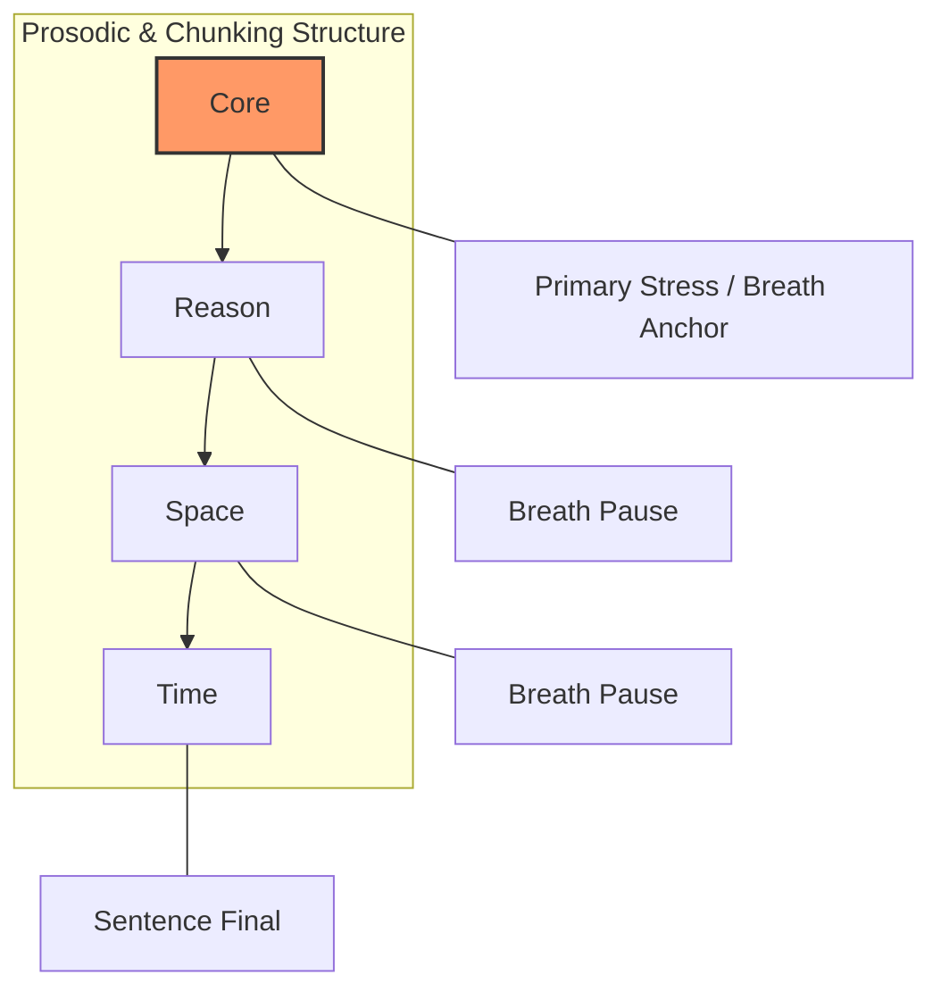

# Phonetic Foundations of CFLT

> **Version:** 1.0.0 (Internal Draft)
> **Author:** CFLT Core Team
> **Organization:** [CFLT.center](https://cflt.center)
> **License:** [CC BY 4.0](https://creativecommons.org/licenses/by/4.0/)
> **Warning:** Unlike the syntactic components of CFLT, phonetic bridges are strictly **L1-specific**. The examples provided here (Pinyin-to-English) are demonstrations of the methodology, not universal rules.

> Companion to: [`manifesto.md`](../manifesto.md)
> Purpose: Ground the pronunciation and articulatory strategies of the **CFLT Protocol** in motor learning theory and cross-linguistic phonetic transfer.

---

## 1. Pronunciation as Muscular Intelligence

Traditional language pedagogy often treats pronunciation as an auditory and abstract cognitive exercise—listening and repeating. CFLT proposes a paradigm shift: **pronunciation is fundamentally a physical, motor-skill problem.**

We term this **Muscular Intelligence**. Just as the CFLT syntax protocol reduces the *cognitive restructuring* cost (see [`neuroscience.md`](./neuroscience.md)), the phonetic protocol aims to reduce *articulatory restructuring* cost by mapping new sounds to existing muscle memory.

## 2. Cross-Linguistic Phonetic Transfer

When adult learners attempt to produce sounds in an L2 that do not exist in their L1, they often experience "articulatory freezing." Their vocal tract lacks the proceduralized muscle memory for the target phoneme.

CFLT solves this by utilizing **Phonetic Bridges**—identifying the overlapping articulatory postures between the learner's native phonology and the target language.

### 2.1 The Pinyin-to-IPA Bridge (Chinese to English)
For Chinese learners, the existing mastery of Hanyu Pinyin provides a highly granular map of mouth positions that can be repurposed for English IPA.

- **Direct Overlap (1:1 Mapping):** Consonants like /b/, /p/, /m/, /f/ share nearly identical articulation points in both Pinyin and English.
- **Relative Adjustments (Delta Mapping):** Instead of teaching a sound from scratch, CFLT uses the L1 anchor. 
  - *Example:* To teach the English voiced labiodental fricative /v/, the instruction is not "place your top teeth on your bottom lip and voice it." It is: "Form the Pinyin 'f' mouth shape, but vibrate your vocal cords."

- **Approximating Zero-to-One Phonemes:** For sounds entirely absent in the L1 (e.g., the English interdental fricatives /θ/ and /ð/), CFLT creates kinesthetic analogies. 

## 3. Proceduralization of Articulation

Drawing from Skill Acquisition Theory (see [`pedagogy.md`](./pedagogy.md)), articulatory fluency requires moving from *declarative knowledge* (knowing where the tongue goes) to *procedural memory* (automatic execution).

### 3.1 The Role of the Basal Ganglia
Motor skills, including speech articulation, are proceduralized in the basal ganglia and cerebellum. CFLT's focus on **relative muscular adjustments** accelerates this proceduralization by tying new motor patterns to already established neural pathways. 

## 4. Integration with the CFLT Sequencing Protocol

Phonetic mastery in CFLT is not taught in isolation; it is tightly coupled with the `[Core] → [Reason] → [Space] → [Time]` sequence.

- **Prosodic Anchoring:** The `[Core]` slot is not just the semantic anchor; it is also the **prosodic anchor**. In CFLT vocal training, learners are taught to place the primary phrasal stress on the Core token. 
- **Chunking:** The four-slot protocol naturally segments speech into breathable phonetic chunks. This prevents the learner from running out of breath, a common issue when trying to parse and pronounce complex, head-final sentences in real-time.

## 5. Honest Limitations

1. **L1 Specificity:** Unlike the syntactic `[Core]` sequence which is largely universal, the Phonetic Bridge is highly specific to the L1-L2 pair. A Pinyin bridge is useless for a native Spanish speaker learning English. Scaling CFLT requires building distinct phonetic matrices for each major language pair.
2. **Fossilization:** While relative mapping gets learners to "comprehensible output" rapidly, it may result in a persistent, albeit understandable, accent if the learner never fully divorces the L2 sound from the L1 anchor.
3. **Suprasegmentals:** Mapping individual phonemes does not solve intonation, rhythm, and stress across entire sentences, which require dedicated mimicry and shadowing practice beyond the basic muscular bridges.

---

## 6. Cited Works

See [`bibliography.md`](../bibliography.md) (§ Phonetics) for full references.

---

## See Also

- [`linguistics.md`](./linguistics.md) — Syntactic linearization, the cognitive complement to articulatory transfer.
- [`pedagogy.md`](./pedagogy.md) §5 — Skill Acquisition Theory, the proceduralization framework that motivates §3 here.
- [`neuroscience.md`](./neuroscience.md) §6 — Basal-ganglia proceduralization of motor skills.
- [`../manifesto.md`](../manifesto.md) §9 — The high-level Pinyin-to-IPA bridge framing.
