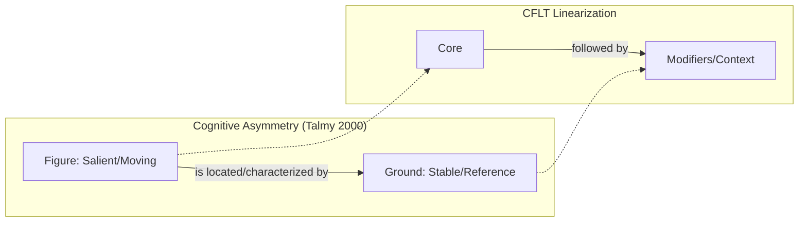
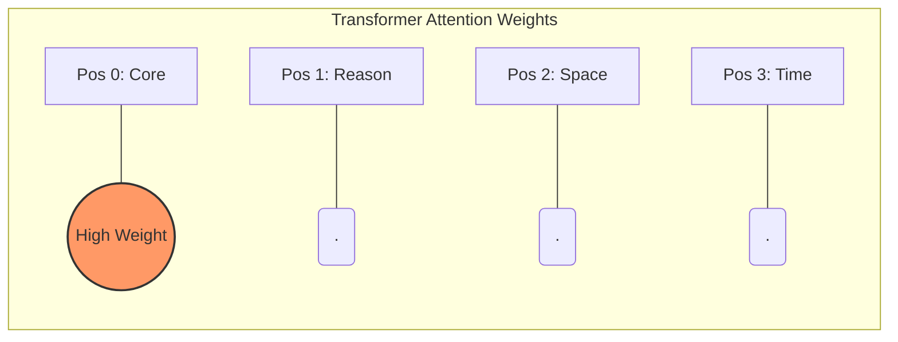
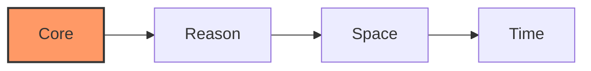

# Core-First Language Theory (CFLT): Reconstructing Global Bilingual Education from First Principles

> **Version:** 1.0.0 (Internal Draft)
> **Author:** CFLT Core Team
> **Organization:** [CFLT.center](https://cflt.center)
> **License:** [CC BY 4.0](https://creativecommons.org/licenses/by/4.0/)

## 1. Executive Summary

**Core-First Language Theory (CFLT)** is a unified theoretical and operational framework for cross-linguistic communication and bilingual education. It posits a single discourse-level principle — *the cognitive core of an utterance is also its universally-prioritized linear position, as an unmarked default within the surveyed typology* (see [`foundations/core-concept.md`](foundations/core-concept.md) §2.5 for a five-language worked demonstration spanning Indo-European, Sino-Tibetan, Japonic, Koreanic, and Afro-Asiatic) — and defines a teachable, AI-supportable sequencing protocol (**CFLT Protocol**) that bridges language pairs within that typological range with minimum cognitive friction.

### 1.1 The Nature of CFLT: Protocol vs. Description

It is critical to distinguish between two levels of linguistic claim:
1.  **Descriptive Observation:** Languages vary wildly in surface word order (e.g., English SVO vs. Japanese SOV). CFLT does *not* claim that all natural languages are naturally Core-First.
2.  **Normative Protocol:** CFLT is an **engineering protocol for Cognitive Ergonomics**. It defines how information *should* be sequenced to achieve the lowest possible cognitive load during cross-linguistic transfer, L2 acquisition, and AI prompting.

CFLT is to language what **TCP/IP** is to networking: it is a standardized packet-header format for human thought. By adopting a "Core-First" interlanguage protocol, learners bypass the massive metabolic cost of structural restructuring (e.g., waiting for the verb in German or planning a 10-word modifier in Japanese before uttering the noun). It is an **unmarked default**, not a descriptive universal.

By targeting cognitive capacities widely shared across human language users (the universals of message-formation in Levelt's preverbal-message stage; see [`foundations/linguistics.md`](foundations/linguistics.md) §5–§6, and the typologically-distinct worked examples in [`foundations/core-concept.md`](foundations/core-concept.md) §2.5 spanning Indo-European, Sino-Tibetan, Japonic, Koreanic, and Afro-Asiatic) and attenuating cross-linguistic structural-restructuring cost (a weak-Whorf scope, **not** a Whorf-elimination claim — see [`foundations/linguistics.md`](foundations/linguistics.md) §7), CFLT provides an AI-supported bridge between language pairs within that surveyed typological range.

> **A note on Universal Grammar.** Earlier drafts framed CFLT as an extension of Chomsky's Universal Grammar. The current framing is deliberately weaker: the load-bearing claim is that *message-formation* (Levelt 1989) is broadly shared, not that an innate language-specific UG is required. This makes CFLT compatible with the usage-based / construction-grammar tradition (Goldberg 1995, 2006; Tomasello 2003) as well as with strong-UG positions — see [`foundations/linguistics.md`](foundations/linguistics.md) §6 for the explicit non-dependence on UG and §6.2 for the engagement with the anti-UG opposition (Christiansen & Chater 2008; Evans & Levinson 2009).

**Nomenclature:**

| Layer | Name | Role |
|---|---|---|
| Framework | **CFLT — Core-First Language Theory** | The unified name for both the academic theory and the operational protocol |
| Implementation | **CFLT Protocol** | The specific `[Core] → [Modifiers]` sequencing rule |

**CFLT** is the primary designation for both its scientific foundations and its practical methods. The term **CFLT Protocol** specifically refers to the operational sequencing rules. **CFLT is an open framework**: any team is welcome to research, implement, or extend it independently. **CoreFirst** ([corefirst.world](https://corefirst.world)) is the official reference experimental project for CFLT, but is not a required dependency or licensing gate — it exists alongside any other implementations the community may build.

---

## 2. Theoretical Foundations

> The summaries in §2.1–§2.5 below are deliberately compact. For deep treatments — including honest limitations and citations — see the companion documents:
> - **[`foundations/core-concept.md`](foundations/core-concept.md) — Read this first.** Defines what "Core" means: a salience anchor, not a verb or predicate. Prevents mis-reading the analogies in the other foundation docs.
> - [`foundations/linguistics.md`](foundations/linguistics.md) — UG, information structure, cognitive linguistics, speech production
> - [`foundations/phonetics.md`](foundations/phonetics.md) — cross-linguistic phonetic transfer, muscular intelligence
> - [`foundations/sociolinguistics.md`](foundations/sociolinguistics.md) — politeness, register, honorifics
> - [`foundations/pedagogy.md`](foundations/pedagogy.md) — Krashen, Vygotsky, Cognitive Load Theory, TBLT, skill acquisition
> - [`foundations/neuroscience.md`](foundations/neuroscience.md) — salience network, PFC metabolic costs, EIC, proceduralization
> - [`foundations/logic.md`](foundations/logic.md) — predicate logic, lambda calculus, CCG, speech acts, Relevance Theory
> - [`foundations/mathematics.md`](foundations/mathematics.md) — information theory, UID, optimal coding, linearization
> - [`foundations/llm.md`](foundations/llm.md) — Transformer attention biases, prompt order, CoT
> - [`bibliography.md`](./bibliography.md) — unified reference list

### 2.1 Universal Grammar and *Core Grammar* (Noam Chomsky)
**Concept:** Chomsky's framework posits an innate "Language Acquisition Device" (LAD) and distinguishes the *core grammar* (universal principles) from its *periphery* (idiosyncratic, learned). The strong UG reading is contested by usage-based / construction-grammar alternatives (Tomasello 2003; Goldberg 1995, 2006; Christiansen & Chater 2008; Evans & Levinson 2009).

**Relationship to CFLT:** CFLT does **not** depend on the strong UG reading. The load-bearing claim is a **dynamic linearization** discipline — *the cognitive core is also the unmarked-default, prioritized utterance-initial position for declarative communicative acts within the typological range surveyed in [`foundations/core-concept.md`](foundations/core-concept.md) §2.5*. This protocol-layer claim is compatible with Chomsky's core/periphery distinction, but it does not require an innate UG: the same regularity can be motivated from usage-based / emergentist accounts (see [`foundations/linguistics.md`](foundations/linguistics.md) §6 for the non-dependence and §6.2 for the engagement with anti-UG positions).

### 2.2 Cognitive Foundations: Figure-Ground and EIC

**Figure-Ground (Talmy):** CFLT codifies a **Figure-First** linearization. The Core (Figure) is the salient event, while modifiers (Ground) provide the reference frame. This aligns with the cognitive expectation to locate salient events relative to stable frames.

**Early Immediate Constituents (Hawkins):** CFLT optimizes for **parsing efficiency**. By placing the Core at position 0, it minimizes the "Constituent Recognition Domain," achieving an efficiency ratio near 100% and reducing the look-ahead buffer for both humans and machines.

### 2.3 Computational Foundations: Attention Sinks (Xiao et al.)

**Concept:** Transformer-based LLMs over-attend to the prefix region for two distinct reasons — (1) **Attention Sinks** (Xiao et al. 2024), a softmax-stability artifact in which initial tokens absorb attention regardless of semantic content, and (2) **Primacy / positional bias**, where causal masking compounds the influence of early tokens over later ones.
**CFLT Application:** CFLT exploits (2), not (1). Placing the Core in the high-attention prefix region (typically positions just after `<bos>`) compounds its influence over generation — but this is a primacy argument, not a claim that attention sinks "prefer" semantic content. See [`foundations/llm.md`](foundations/llm.md) §2.3 for the careful disambiguation.

### 2.4 The Sapir-Whorf Hypothesis (Linguistic Relativity)
**Concept:** Language structure influences habitual cognitive patterns.
**CFLT Application:** For learners from "topic-prominent" backgrounds (e.g., Chinese), CFLT provides a **Neutral Buffer Sequence** to eliminate the mental cost of "thinking-for-speaking" in divergent L2 structures.

### 2.5 Natural Semantic Metalanguage (Anna Wierzbicka)
**Concept:** All meanings can be reduced to universal "Semantic Primes."
**CFLT Application:** AI utilizes these primes as an **Atomic Vocabulary** to fill CFLT slots, facilitating any-to-any cross-linguistic translation.

---

## 3. The Core Framework: Core-First Sequencing Protocol

### 3.1 The Principle: "Core First, Supplement Later"
CFLT mandates a standardized information sequence to unify human expression:

**`[Core] → [Reason] → [Space] → [Time]`**

All four elements are present in the **canonical (unmarked) sequence**. Implementations and teaching materials should preserve this four-element ordering when teaching the default form; partial sequences (e.g., dropping `[Space]`) are treated as **reduced forms** of the canonical sequence rather than as alternative protocols, and the slot-order rule still applies to whichever slots are present.

> **Coverage scope of the four slots.** The protocol governs only the **ground frame** — the world frame around the event. Modifiers that belong to the event itself (manner *slowly*, instrument *with butter*, beneficiary *for my mom*, accompaniment, modal, negation) live **inside the Core** as part of the event nucleus, not as separate slots. Each language assembles the event nucleus internally using its own native syntax (case marking, prepositions, particles, coverbs); CFLT does not prescribe that internal assembly. The four slots therefore are **not** an exhaustive taxonomy of all modifiers — they are an exhaustive taxonomy of the *circumstantial frame* that the unmarked default places after the Core. See [`foundations/core-concept.md`](foundations/core-concept.md) §2.1–§2.2 for the two-tier model and [`methodology/slot-disambiguation.md`](methodology/slot-disambiguation.md) for the operational decision tree.

> **The role of English in this documentation.** Because English is the most documented L2 and the strongest LLM-supported language, this documentation uses English as the **default illustrative language** and as a **verification anchor** when checking slot assignments across languages. English is **not**, however, a required intermediate hop for cross-language learning (a Mandarin↔Japanese learner does not have to route through English), nor is it the judge of where Core boundaries lie in non-English target languages.
>
> CFLT's universality is a **protocol-layer claim**: the schema (Core-first, R→S→T) and slot-semantics (functional WHY/WHERE/WHEN questions) are language-agnostic. **It is not a claim that English is unnecessary in practice.** The L3 / additional-language acquisition literature (Cenoz 2003; De Angelis 2007) supports the theoretical position that L1↔L2 transfer can be direct, but the *ecological reality* is that English serves as a resource and metalinguistic medium in most learning contexts globally. Specific language-pair courses may legitimately use the learner's existing L2 (often English) as a metalinguistic explanation language without contradicting CFLT's protocol-layer universality. The event-nucleus internal assembly and language-specific edge cases are delegated to each language's native syntax. See [`foundations/core-concept.md`](foundations/core-concept.md) §2.3 for the layer-by-layer breakdown, and the [language-pair guides](methodology/language-pair-guides/index.md) for operationalization in specific pairs.

> **Important scope clarification.** The four-element canonical sequence defines CFLT's **unmarked default** — the form a fluent speaker produces when no special rhetorical purpose applies. It does **not** prohibit marked deviations (topicalization, fronting, clefts, end-weight repackaging) that mature fluency requires, nor does it require every utterance to surface all four slots. Every natural language has multiple expressive forms for the same propositional content, and CFLT accommodates this by treating itself as the *baseline* from which deliberate marked deviations are learned later. See [`foundations/core-concept.md`](foundations/core-concept.md) §6 for the unmarked/marked distinction and §7 for the misreading-refutation matrix.

### 3.2 Demonstrating the CFLT Pivot

The Core in CFLT is a **salience anchor**, not a verb (see [`foundations/core-concept.md`](foundations/core-concept.md)). The four examples below illustrate the four kinds of Core that the protocol accommodates.

#### Example 1 — Action Core
**L1 (Chinese, context-heavy order):** *昨天下雨，我在家没出去。* — Time → Reason → Result
**CFLT Reconstruction:** *我没出去，因为下雨，在家，昨天。* — Core → Reason → Space → Time
**English (CFLT-L2):** *I didn't go out, because it rained, at home, yesterday.*

#### Example 2 — Identity / Description Core
**L1 (Chinese):** *那个穿红衣服的女孩是我妹妹。* — Modifier-heavy NP → Identity
**CFLT Reconstruction:** *那个女孩是我妹妹，穿着红衣服，在照片里，去年夏天。* — Core (identity) → Description → Space → Time
**English (CFLT-L2):** *That girl is my sister, wearing a red dress, in the photo, from last summer.*

#### Example 3 — State Core
**L1 (Chinese):** *开了一下午会，我在办公室都累瘫了。* — Cause → Space → State
**CFLT Reconstruction:** *我累瘫了，因为开了一下午会，在办公室，刚才。* — Core (state) → Reason → Space → Time
**English (CFLT-L2):** *I'm exhausted, because of the meeting, in the office, just now.*

#### Example 4 — Request / Speech-Act Core
**L1 (Chinese):** *现在能在桌上帮我递一下盐吗？* — Time → Space → Request
**CFLT Reconstruction:** *请帮我递一下盐，在桌上，现在。* — Core (request) → Polite marker → Space → Time
**English (CFLT-L2):** *Could you please pass the salt, on the table, now?*

**The CFLT Advantage:** Across all four core types, once the learner adopts Core-First sequencing in their native mind, producing the target language becomes a **token replacement** exercise rather than a structural reorganization. The protocol is uniform; what fills position 0 varies with the speaker's intent.

---

## 4. Distinction from Adjacent Literature

CFLT is to be carefully distinguished from a superficially similar phrase that already appears in the literature:

> Ambridge, B. & Wagner, L. (eds.) (2021). *Testable Theories of Core First Language Acquisition*. Special Issue, *Journal of Child Language*, Vol. 48, Special Issue 5.

**Parsing comparison:**

| | Ambridge & Wagner (2021) | CFLT (this work) |
|---|---|---|
| Constituent structure | `[core] + [first language acquisition]` | `[core-first] + [language theory]` |
| Subject | The **core mechanisms** by which children acquire L1 | The **core-first sequencing** rule for cross-linguistic discourse |
| Population | Children acquiring native language | Bilingual learners producing L2 |
| Domain | Developmental psycholinguistics | Applied linguistics + AI-assisted bilingual pedagogy |

The two strings overlap at the trigram "core first language" but the underlying concepts are unrelated. CFLT does not address L1 acquisition; the Ambridge/Wagner volume does not address bilingual sequencing. Authors writing on CFLT must cite this distinction in any work likely to be retrieved alongside L1 acquisition literature.

---

## 5. AI-Driven Implementation Roadmap

### Phase 1: Cognitive Reshaping (LLM as Logic Tutor)
The AI trains the user to express intentions in their native language using the Core-First sequence. This phase focuses on breaking L1-specific sentence patterns.

### Phase 2: Atomic Mapping (LLM as Token Swapper)
The AI introduces target language "tokens" into the established Core-First framework. Grammar is acquired implicitly through pattern recognition rather than explicit rule memorization.

### Phase 3: Cultural Refinement (Advanced Modules)
Once functional fluency is achieved via CFLT, the AI introduces culture-specific idioms, metaphors, and advanced stylistic nuances.

---

## 6. Global Vision: Any-to-Any Bilingualism

CFLT is not limited to Chinese-to-English. It is designed as a **Universal Protocol for Human Communication**. By adopting the Core-First sequence as the "Global Interlingua," we can scale bilingual education across any linguistic pair:

*   **Japanese (SOV) ↔ German (V2):** 
    - *Japanese habit:* [Modifiers] → [Object] → [Verb]. 
    - *CFLT Pivot (scaffold form):* "Ich esse einen Apfel (Core), weil ich Hunger habe (Reason), im Park (Space), jetzt (Time)." 
    - By forcing the Japanese brain to output the Action (Verb) immediately, the protocol is predicted to bypass the "waiting for the verb" processing delay in German V2 main clauses (predicted by the EIC analysis in [`foundations/linguistics.md`](foundations/linguistics.md) §3 — Hawkins 1994; the magnitude is an open empirical question). The Grammar Overlay layer subsequently polishes the appended adverbials into idiomatic German positioning.
*   **Arabic (VSO) ↔ Spanish (SVO):**
    - *Arabic habit:* [Verb] → [Subject] → [Object]. 
    - *CFLT Pivot (scaffold form):* "Como una manzana (Core), porque tengo hambre (Reason), en la cocina (Space), ahora (Time)." 
    - CFLT aligns the Arabic V-first tendency with the Spanish SVO core; **Natural Semantic Metalanguage (NSM) Primes** serve as the semantic bridge at the interlingual mediation layer to ensure the *intent* of the verb is preserved across divergent conjugation systems. The example above shows the Spanish L2 CFLT scaffold form (parallel to the Japanese ↔ German example above), not NSM notation itself.

The official reference implementation is hosted at **corefirst.world**; the framework itself is open for any team to implement independently.

---

## 7. Reference Implementation: CoreFirst

The section below describes **CoreFirst**, the official reference implementation of CFLT. It illustrates how the protocol can be operationalized as a product; it is **not** a prescription that all CFLT implementations must look this way.

### 7.1 The "Semantic Lego" Philosophy
Instead of teaching grammar as rigid rules, CoreFirst treats language as a set of functional blocks. The goal is **Maximum Communicative Efficiency** with **Minimum Cognitive Load**.

### 7.2 Implementation of Core Linguistic Elements

#### A. Parts of Speech → Logic Blocks
Grammatical terms (nouns, verbs) are replaced by intuitive functional categories:
*   **`[Who/What]`** (Subject/Object)
*   **`[Action]`** (Predicate)
*   **`[Context]`** (Adverbials of time, place, etc.)

> *Note: `[Context]` here is a grouping label used at the teaching layer (textbooks, courseware, and product UI alike), covering CFLT's modifier slots — typically `[Space]` + `[Time]` from §3.1. It is not a fifth CFLT slot.*

#### B. Tense → Semantic Time Tokens
To solve the complexity of English tenses, CFLT uses "Time Tokens."
*   *Input:* "I eat [Time: Yesterday]"
*   *AI Enhancement:* Automatically refines to "I ate" while validating that the semantic intent (Past) was correctly communicated.

#### C. Complex Structure → Flattened Logic
Avoid nested clauses (e.g., relative clauses). Use linear, additive logic.
*   *Traditional:* "The man who is standing there is my boss."
*   *CFLT Logic:* "That man is my boss, [Description] he is standing there."

### 7.3 Product Logic: Semantic First, Grammar Second
1.  **Semantic Core:** Priority is given to the correct sequence of CFLT logic.
2.  **Grammar Overlay:** AI acts as a non-intrusive "auto-correct" plugin, refining the user's CFLT output into idiomatic L2 without interrupting the flow of thought.

---

## 8. The CFLT Content Ecosystem: Universal Pedagogy

### 8.1 Cross-Age Adaptation
CFLT serves as the foundation for educational content across all age groups:
- **Early Learners:** Focus on "Visual CFLT" using animated icons and a restricted set of ~500 semantic primes to build intuitive concept-to-logic mapping.
- **Adult Learners:** Focus on "Efficiency CFLT" using industry-specific tokens and complex logical connectors for professional scenarios.

### 8.2 Industry-Specific Modules: The Case of "IT English"
The CFLT framework is uniquely suited for technical communication. In the **IT sector**, the logic of "Action-Result First" aligns perfectly with engineering documentation and collaborative coding.
- **Example Tokens:** *deploy, refactor, debug, latency, endpoint, scalability.*
- **Logic Mapping:** Instead of "If we have high latency, we should refactor the code," CFLT encourages: "**Refactor the code**, because of **high latency**, in the **backend**, now."
- **Predicted benefit:** the module is designed to support IT-professional communication of critical technical decisions across cultures, by reducing the clarification round-trips required when free-form English memo prose interacts with non-native readers. The magnitude of the reduction against a free-form-prose baseline is an open empirical question — see [`methodology/evaluation-metrics.md`](methodology/evaluation-metrics.md) for the projected operationalization.

The same modular vocabulary-injection pattern extends to medical, financial, technical, and hospitality sectors without altering the underlying cognitive protocol.

### 8.3 Multimodal Delivery (Audio-Visual Synthesis)
- **Audio-Primary:** Voice output is prioritized, with prosody and stress patterns emphasizing the `[Core]` of the CFLT block.
- **Visual-Support:** AI-generated images or short clips provide immediate visual feedback for the core concept, bypassing the need for native language translation.

### 8.4 Automated Courseware Generation
Leveraging LLMs, the CFLT framework can autonomously generate entire curricula based on simple prompts (e.g., "Hospital scenarios for an 8-year-old"). This ensures all educational content remains consistent with the "Core First" sequencing principle.

---

## 9. Phonetic Migration: Leveraging Existing Knowledge Systems

### 9.1 The Pinyin-to-IPA Bridge
For Asian learners, particularly those from Chinese-speaking backgrounds, CFLT leverages their existing mastery of **Pinyin** to accelerate pronunciation mastery.
- **Overlapping Sets:** Direct migration of sounds like /b/, /p/, /m/, /f/ (common to both systems).
- **Modification Guidance:** Instead of abstract articulatory descriptions, the system provides "Relative Adjustments." (e.g., "To pronounce the English /v/, start with the Pinyin 'f' muscle position but vibrate your vocal cords.")
- **Zero-to-One Phonemes:** For sounds entirely missing in the native system (like /θ/), AI generates analogies based on related native mouth positions.

### 9.2 Muscular Intelligence
Language learning is a physical skill. By identifying the "Muscle Overlap" between L1 and L2, CFLT reduces the cognitive resistance of learning "new" sounds, treating them as variations of familiar movements. This complements the Core-First sequencing principle: where §3 reduces *syntactic* friction, §9 reduces *articulatory* friction. Both are derived from the same first-principles approach — leverage what the learner's brain and body already encode.

---

## 10. Conclusion: The Unified Protocol for Intelligence

CFLT is not merely a word-order rule; it is a **Neutral Logic Protocol** designed to solve the cognitive heterogeneous gap between the world's linguistic regions.

### 10.1 The Core Discovery
A central barrier to cross-linguistic communication is the **Structural Restructuring Tax**. When moving between heterogeneous language families (e.g., Mandarin ↔ English, Japanese ↔ German), the brain spends finite metabolic resources "re-shaping" the L1 logic template into an L2 surface form (see [`foundations/neuroscience.md`](foundations/neuroscience.md) §3 for the DLPFC / LIFG / ACC cost framework, and [`foundations/pedagogy.md`](foundations/pedagogy.md) §7 on the Formulator-stage bottleneck). This background processing is a **major contributor** to L2 disfluency in humans and to logical-sequencing variance in AI — not the sole cause; lexical access, prosody, affective filter, and model-specific tokenization all contribute independently.

### 10.2 The Solution: An Interlanguage Buffer
CFLT proposes that between L1 and L2, there exists a **language-neutral logic layer**. By mapping raw intent directly to the Core-First sequence, we create a standardized "thought packet" (TCP/IP for Thought). This protocol is:
- **L1-Compatible:** It captures the speaker's intent without premature syntactic commitment.
- **L2-Friendly:** It provides a consistent landing zone for target language tokens.

### 10.3 The Predicted Benefit: Reduced Restructuring Cost
By adopting the CFLT Protocol, the task of speaking a second language is reframed from **complex restructuring** into **token replacement against a stable scaffold**. CFLT predicts two strategic outcomes (each operationalized as a falsifiable prediction in [`foundations/core-concept.md`](foundations/core-concept.md) §8.5):

- **For humans (predicted, see §8.5 P1):** the protocol is engineered to reduce the L2-production restructuring delay and the associated speaking anxiety. *Predicted direction:* positive effect on fluency rate (words-per-minute) and reduced hesitation-pause rate under controlled comparison. *Predicted magnitude:* unmeasured — `pedagogy.md` §12.1 *Affective Filter Measurement* specifies the protocol that would settle this; CFLT does **not** commit to a specific effect size.
- **For AI (predicted, see §8.5 P2):** the protocol is engineered to place the salience anchor in the high-attention prefix region of Transformer-based models, exploiting **primacy** (not the attention-sink artifact — see [`foundations/llm.md`](foundations/llm.md) §2.3). *Predicted direction:* higher position-0 attention mass and higher downstream task accuracy on tasks where the Core constituent is the answer-bearing element. *Predicted magnitude:* unmeasured; specific accuracy and latency deltas across ≥3 model families are the open empirical content of P2 (`llm.md` §10.1). The mechanism is expected to improve early-prefix conditional-distribution stability and instruction-following reliability, **not** to make autoregressive reasoning deterministic and **not** to reduce total joint entropy. [`foundations/mathematics.md`](foundations/mathematics.md) §2 explicitly retracts both stronger readings.

CFLT is the bridge. By standardizing the sequence of thought at the protocol layer, the framework aims to widen the bandwidth of human-machine collaboration; the empirical evaluation of that aim is laid out in [`methodology/empirical-agenda.md`](methodology/empirical-agenda.md).

---

*Authored by the CFLT Core Team, 2026. Project home: cflt.center.*
