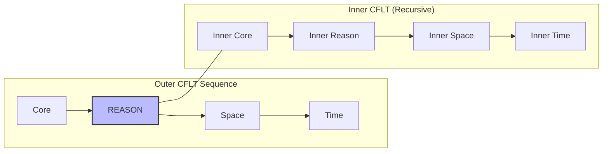
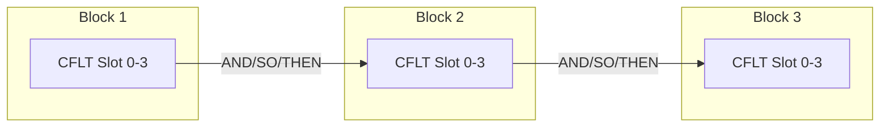
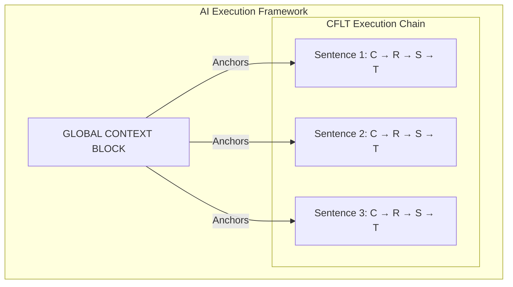

# Methodology: Complex Structures & Recursion (CFLT-Complex)

> **Version:** 1.0.0 (Internal Draft)
> **Author:** CFLT Core Team
> **Organization:** [CFLT.center](https://cflt.center)
> **License:** [CC BY 4.0](https://creativecommons.org/licenses/by/4.0/)

> **Purpose:** To extend the base CFLT Protocol to handle nested clauses, conditionals, and complex narrative structures without violating the "Core-First" mandate.

---

## 1. The Limits of the Base Protocol

The base CFLT sequence—`[Core] → [Reason] → [Space] → [Time]`—is highly optimized for single, discrete thoughts. It embodies "Flattened Logic." 

However, natural human communication frequently involves **recursion** and **dependency**. What happens when a "Reason" is an entire event itself? What happens when a sentence contains multiple conditional dependencies?

CFLT-Complex provides the rules for **clause stacking** and **recursive slot-filling**.

## 2. Recursive Slot-Filling

The primary rule of CFLT-Complex is that **any slot in the CFLT sequence can contain an embedded CFLT sequence**, provided the inner sequence also obeys the Core-First rule.

### Example: Nested Reason
*Raw Input (Chinese):* 因为如果明天下雨航班会取消，所以我决定今天走。
*(Because if it rains tomorrow the flight will be canceled, so I decided to leave today.)*

**CFLT Decomposition:**
- **Outer Core:** I decided to leave.
- **Outer Time:** today.
- **Outer Reason:** [Because the flight will be canceled, if it rains, tomorrow.] *(This is a nested CFLT block)*



**CFLT-Complex Output:**
> "I decided to leave, today, because [the flight will be canceled, if it rains, tomorrow]."

*Note: In advanced execution, the learner handles the nested block as an independent thought, processing one Core at a time.*

## 3. Clause Stacking (Chronological & Logical Chaining)

When narrating a series of events, forcing everything into a single four-slot sentence causes the "Modifier Trap" to re-emerge. 

**Rule:** Break long narratives into independent CFLT blocks joined by explicit logical connectors (`AND`, `BUT`, `THEN`, `SO`).



### 3.1 Chronological Chaining (The Narrative T-CRS Variant)
When narrating a series of events, forcing everything into a single four-slot sentence causes the "Modifier Trap" to re-emerge. For such **Narrative Mode** discourse, CFLT enables the **T-CRS** variant where Time serves as the macro-thematic anchor.

**Rule (T-CRS):** In narrative sequences, the `[Time]` slot may be fronted to position 0 to establish the reference frame for the upcoming events.

*Raw Input:* 昨天我在办公室开了一下午会，然后去餐厅吃了晚饭，最后回家睡觉了。

**CFLT-Complex Output (Narrative Mode):**
1. "[Yesterday] (Time), [I had a meeting] (Core), [in the office] (Space), [all afternoon] (Time)."
2. `THEN` "[I ate dinner] (Core), [at the restaurant] (Space)."
3. `THEN` "[I went to sleep] (Core), [at home] (Space)."

*Note: The first block establishes the global time anchor; subsequent blocks in the chain inherit it or provide relative updates.*

### 3.2 Conditional Chaining and the Reason Hierarchy
Conditionals are inherently tricky because the *condition* (If) often precedes the *result* (Then) in time, but the *result* is usually the semantic Core. 

**The CFLT-Complex Rule for Conditionals:** Always assert the **Result (Core)** first, then append the **Condition** in the `[Reason]` slot. 

When multiple logical modifiers (Condition, Cause, Purpose) co-occur within the `[Reason]` slot, CFLT enforces a strict **Scope Hierarchy**: 

**`[Condition] → [Cause] → [Purpose]`**

*Why?* Conditions establish possible worlds; causes are physical/logical drivers; purposes are subjective intents. Their logical scope dictates this order (Condition > Cause > Purpose).

*Raw Input:* 如果你完成报告，因为我很忙，为了节省时间，我明天就在办公室请你喝咖啡。

**CFLT-Complex Output:**
> "[I will buy you coffee] (Core), [if you finish the report] (Condition), [because I am busy] (Cause), [to save time] (Purpose), [in the office] (Space), [tomorrow] (Time)."

## 4. Multi-Agent Context: The "Context Block"

For LLM Prompting and multi-agent communication, passing massive contexts in the `[Reason]` or `[Space]` slots breaks the efficiency of the parser.

**Rule:** For AI systems, utilize an explicit **[GLOBAL CONTEXT]** block that precedes the CFLT execution array.

```json
{
  "global_context": "The production server went down at 02:00 AM.",
  "cflt_execution_chain": [
    {
      "core": "Restart the database",
      "reason": "to clear the connection pool",
      "space": "in the us-east-1 region",
      "time": "immediately"
    },
    {
      "core": "Notify the on-call engineer",
      "reason": "for secondary verification",
      "space": "via PagerDuty",
      "time": "after the restart"
    }
  ]
}
```



## 5. Honest Limitations

1.  **Idiomaticity ceiling for nested forms.** A nested CFLT block such as *"I decided to leave, today, because [the flight will be canceled, if it rains, tomorrow]"* is the **scaffold form**, not the target idiomatic English. The Grammar Overlay layer is expected to polish this into *"I decided to leave today, because the flight will be canceled if it rains tomorrow."* CFLT-Complex defines the recursion rule, not the surface output.
2.  **Connector inventory is open.** §3 lists `AND / BUT / THEN / SO` as canonical connectors; real chained discourse uses a much wider set (concessive, adversative, temporal-precedence, etc.). The minimal inventory should be treated as a starting point, not a closed set.
3.  **No formal bound on nesting depth.** §2 permits arbitrary recursive embedding, but human working memory and LLM attention both degrade at deep nesting. A practical depth limit (likely 1–2 levels for spoken production, 2–3 for written/agentic use) requires its own empirical bound.
4.  **Tense propagation across blocks.** When chained CFLT blocks share an implicit time frame, the protocol does not yet specify how the Grammar Overlay should propagate tense, aspect, and reference across blocks (e.g., shared subject ellipsis, sequence-of-tenses agreement). This is an open extension.
5.  **Modifier-role coverage is restricted to the ground frame.** The R/S/T trio addresses circumstantial modifiers of cause, location, and time. Manner, instrument, beneficiary, accompaniment, modal, and negation do **not** receive separate slot positions in the unmarked sequence — they live inside the Core as part of the event nucleus (see [`../foundations/core-concept.md`](../foundations/core-concept.md) §2.1–§2.2 and [`./slot-disambiguation.md`](./slot-disambiguation.md)). The four-slot protocol is therefore a **typicality optimum for the circumstantial frame**, not a coverage universal for all modifier types.

---

## 6. Summary

CFLT-Complex is not a departure from the Core-First principle; it is its recursive application. By treating complex sentences as **chains of simple CFLT blocks**, learners and models can process theoretically infinite complexity without ever exceeding the working memory limits of a single clause.
