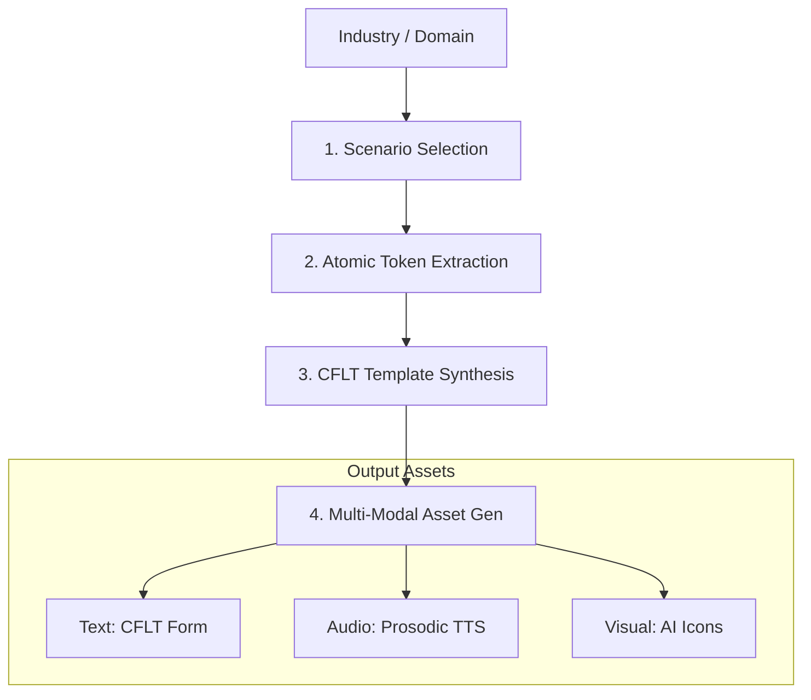
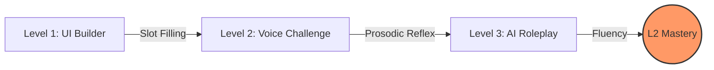
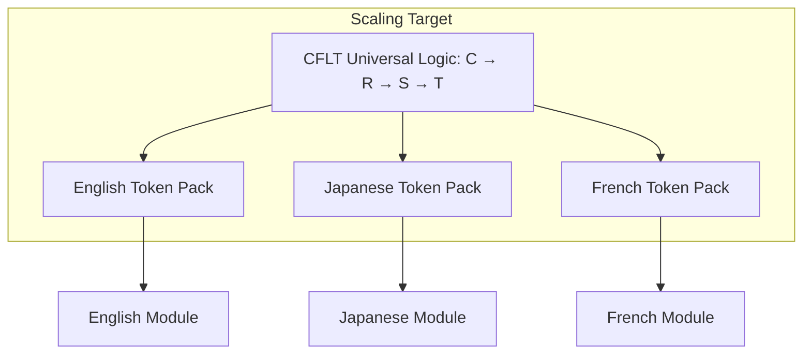

# Methodology: Curriculum Engineering (CFLT-Content)

> **Version:** 1.0.0 (Internal Draft)
> **Author:** CFLT Core Team
> **Organization:** [CFLT.center](https://cflt.center)
> **License:** [CC BY 4.0](https://creativecommons.org/licenses/by/4.0/)

> **Purpose:** To provide a systematic engineering framework for generating high-quality, CFLT-compliant educational content at scale using Large Language Models.
>
> **Theoretical anchors.** This document operationalizes [`foundations/pedagogy.md`](../foundations/pedagogy.md) §6 (**weak-TBLT** — Ellis 2003; CFLT is *not* compatible with Long's strong-TBLT, see pedagogy §6 for the honest positioning) and §8 (bilingual lexical access), and depends on [`foundations/linguistics.md`](../foundations/linguistics.md) §8 (Construction Grammar slot-filling) and §9 (NSM as the slot-filler vocabulary). Token-pack design is the engineering surface of those theoretical commitments.

---

## 1. From Theory to Content: The Modular Approach

Traditional curriculum design is slow and manual. CFLT enables **Programmatic Curriculum Generation** by treating language learning as an assembly of functional blocks and industry-specific tokens.

## 2. The Courseware Generation Pipeline

The generation of a CFLT module (e.g., "English for Backend Engineers") follows a four-step automated process:

### Step 1: Scenario Domain Selection
Identify the high-frequency scenarios for the target audience.
- *Input:* "Backend Engineering"
- *Output:* ["System deployment", "Database troubleshooting", "Code review", "Latency investigation"]

### Step 2: Atomic Token Extraction
Identify the **Salience Anchors (Cores)** and **Contextual Modifiers** specific to the domain.
- *Core Actions:* `deploy`, `refactor`, `debug`, `optimize`.
- *Space Contexts:* `production server`, `local environment`, `staging cluster`.
- *Reason Contexts:* `high latency`, `buffer overflow`, `deprecated API`.

### Step 3: CFLT Template Synthesis
Combine scenarios and tokens into valid `[Core] → [Reason] → [Space] → [Time]` patterns.
- *Example Template:* `[Action: Debug] because [Reason: Error 500] in [Space: Microservice] [Time: Now].`

### Step 4: Multi-Modal Asset Generation
- **Text:** The refined CFLT-L2 form.
- **Audio:** Text-to-Speech (TTS) with emphasis on the Core prosody.
- **Visual:** AI-generated images or icons representing the atomic tokens.

---

## 3. The "IT English" Module Case Study

The IT sector is the primary target for CFLT due to its logical affinity with engineering processes.

### 3.1 Token Taxonomy
| Logic Block | Token Examples |
|---|---|
| **Core** | `merge`, `revert`, `scale`, `containerize` |
| **Reason** | `bottleneck`, `concurrency issue`, `security patch` |
| **Space** | `repo`, `pipeline`, `endpoint`, `firewall` |
| **Time** | `sprint`, `deployment window`, `retroactive` |

### 3.2 Learning Path Engineering
1.  **Level 1 (The Builder):** Drag-and-drop these tokens into the 4-slot UI.
2.  **Level 2 (The Voice):** Speak the sequence: "Scale the database, because of traffic spike, in AWS, tonight."
3.  **Level 3 (The Reflex):** Real-time roleplay responding to an AI "Senior Architect" using strict CFLT.

---

## 4. Validating Content Quality

All AI-generated content must pass the **CFLT Validator**:
- **Constraint Check:** Does the sentence have all mandatory slots?
- **Salience Check:** Is the most important action truly in Position 0?
- **Vocabulary Check:** Does it use the provided industry token pack?

## 5. Scaling: Any-to-Any Content Generation

Because the CFLT logic is universal **at the protocol layer** (see [`../foundations/core-concept.md`](../foundations/core-concept.md) §2.3 for the L1/L2/L3/L4 split, and §2.5 for the five-language / four-family typological evidence), once an "IT English" module is engineered, the system can — in principle, with non-trivial language-specific engineering — generate an "IT Japanese" or "IT French" module by swapping the token pack and the Grammar Overlay configuration. The protocol-layer pivot is genuinely language-agnostic; the *automation* is conditional on the items listed in §7 below.

---

## 6. Summary

Curriculum Engineering in CFLT moves from "writing books" to "engineering systems." By automating the synthesis of industry logic and the CFLT protocol, we aim to provide personalized, relevant, and logically consistent learning material across a wide range of professional domains, beginning with the four named in [`../manifesto.md`](../manifesto.md) §8.2 (IT, medical, financial, hospitality) and extensible to further domains via token-pack engineering. The cross-domain extension is conditional on the limitations below.

---

## 7. Honest Limitations

The "swap the token pack, get a new module" story above is the protocol-layer ideal. The following caveats apply in practice and should temper any claim of a fully automated cross-language / cross-industry rollout:

1. **Cross-language LLM capability is uneven.** Modern LLMs do not perform equally across languages (Lai et al. 2023; Bang et al. 2023). A CFLT-formatted Vietnamese or Swahili curriculum running on the same LLM as an English curriculum will not have the same fluency, error rate, or factuality envelope. CFLT cannot close this gap; it can only reduce protocol-level drift. See [`./llm-prompting.md`](./llm-prompting.md) §2 for the cross-language LLM caveat.
2. **Phonetic bridges are L1-specific, not universal.** The pronunciation-pedagogy components of any module (Pinyin-to-IPA mapping, articulatory-overlap analyses) are anchored to the *learner's L1* and must be re-engineered for each L1 group, not just each target language. See [`../foundations/phonetics.md`](../foundations/phonetics.md) §5 for the L1-specificity warning.
3. **Token-pack engineering still requires domain expertise.** Generating an "IT Japanese" module is not "swap the tokens" — it requires a Japanese-IT lexicon curated by someone who knows both the technical domain and the target-language register conventions. The CFLT protocol is the framing; the token pack is the *content*, and content requires expertise.
4. **Edge-case calibration is language-pair-specific.** The boundary rules for what goes inside Core vs. into the ground frame have L4 (edge-case) variation across languages — see [`../foundations/core-concept.md`](../foundations/core-concept.md) §2.3 and the [language-pair guides](./language-pair-guides/index.md). Each new pair needs at least light L4 calibration; this is not automatable from the protocol alone.
5. **Empirical validation is per-domain.** The benchmark numbers in [`./evaluation-metrics.md`](./evaluation-metrics.md) are projected targets, not measured outcomes; each industry / language module must be empirically validated independently before its benefits can be advertised.
