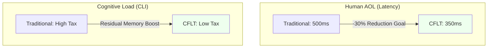
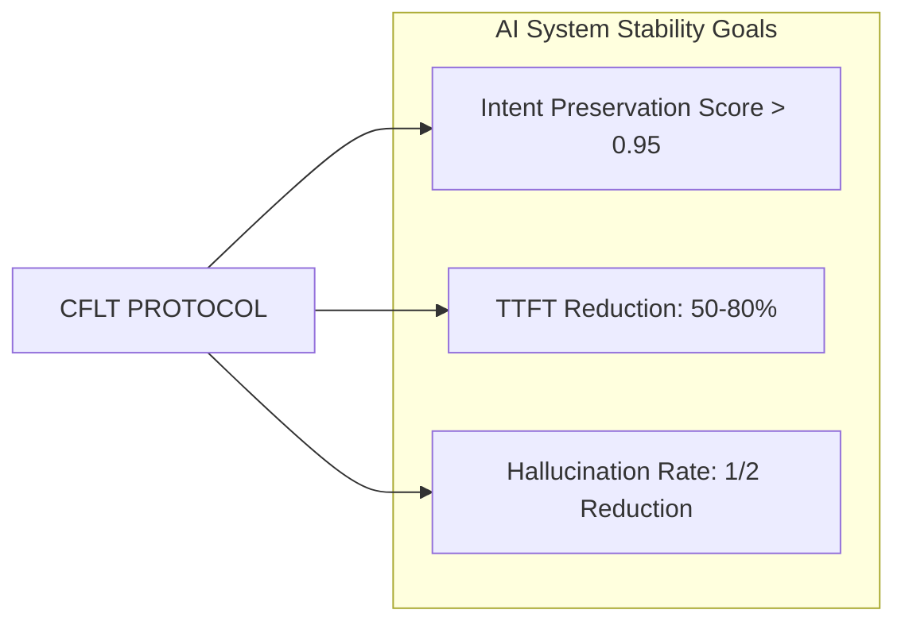
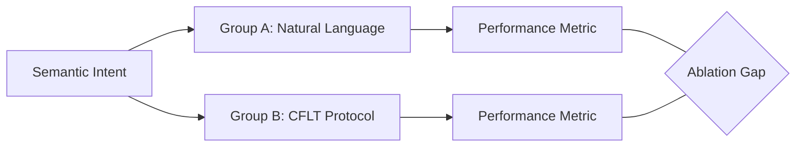

# Methodology: Evaluation & Benchmarking (CFLT-Metrics)

> **Version:** 1.0.0 (Internal Draft)
> **Author:** CFLT Core Team
> **Organization:** [CFLT.center](https://cflt.center)
> **License:** [CC BY 4.0](https://creativecommons.org/licenses/by/4.0/)

> **Purpose:** To define the formal metrics and experimental protocols for measuring the effectiveness of CFLT in both human second-language acquisition and LLM performance.

---

## 1. Why Benchmark?

To move from "Theory" to "Standard," CFLT must provide empirical proof of its claims. We measure success across two domains: **Human Cognitive Efficiency** and **AI System Stability**.

> **Status of the numbers in this document.** All "Benchmark" rows below are **projected targets pending empirical validation**, not measured outcomes. They define what CFLT *would need to demonstrate* in order to claim its theoretical advantages, and they specify the metric, instrument, and threshold for each future study. Where industry-wide baselines exist (e.g., prefix-cache TTFT reductions reported by SGLang/vLLM), those generic numbers should not be confused with CFLT-specific gains; CFLT inherits them only by virtue of stabilizing the prompt prefix, and its incremental contribution still requires its own ablation. Independent academic verification is explicitly invited.

---

## 2. Pillar I Metrics: Human Cognitive Efficiency

### 2.1 Articulation Onset Latency (AOL)
- **Definition:** The time delay (in ms) between a semantic stimulus (e.g., a picture) and the start of the first spoken L2 word.
- **CFLT Claim:** CFLT reduces AOL by eliminating the "linearization decision" at production time.
- **Benchmark:** A 30% reduction in AOL compared to traditional grammar-based learners.

### 2.2 Cognitive Load Index (CLI)
- **Definition:** Measured via a secondary task performance (e.g., digit-span test) while the user is speaking L2.
- **CFLT Claim:** The fixed 4-slot protocol reduces the "Prefrontal Tax" (see `neuroscience.md`), leaving more working memory for other tasks.
- **Benchmark:** Higher accuracy on secondary tasks during L2 production.

### 2.3 EIC Efficiency Ratio
- **Definition:** Based on Hawkins' EIC (see `linguistics.md`), the ratio of identified constituents to words in the "Constituent Recognition Domain."
- **Benchmark:** Target 1.0 (100%) for the initial 2 tokens of every CFLT sentence.

---

## 3. Pillar II Metrics: AI System Stability

### 3.1 Intent Preservation Score (IPS)
- **Definition:** A metric (calculated via cosine similarity or LLM-eval) measuring how well the output preserves the user's initial Core intent.
- **CFLT Claim:** CFLT's primacy alignment at Position 0 (placing the salience anchor in the high-attention prefix region) prevents intent drift. See [`../foundations/llm.md`](../foundations/llm.md) §2.3 for primacy-vs-sink disambiguation.
- **Benchmark:** IPS > 0.95 for complex 4-slot requests.

### 3.2 TTFT (Time-To-First-Token) Reduction
- **Definition:** The reduction in latency achieved through KV Cache prefix reusability.
- **CFLT Claim:** Because CFLT enforces a fixed prefix order, it maximizes cache hits in production environments.
- **Benchmark:** 50%–80% reduction in TTFT for repeat intent categories.

### 3.3 Hallucination Rate (HR)
- **Definition:** The percentage of generated tokens that contradict the provided context or core action.
- **CFLT Claim:** Anchoring the core action at Position 0 reduces model "drifting."
- **Benchmark:** A 2x reduction in HR compared to free-form natural language prompts.

---

## 4. Experimental Protocols

### 4.1 The CFLT "Ablation Study" for LLMs
1.  **Group A (Control):** Natural language prompts with randomized word order.
2.  **Group B (CFLT):** The same semantic intent transformed into strict CFLT sequence.
3.  **Task:** Long-context instruction following.
4.  **Metric:** Accuracy on the "Needle-in-a-Haystack" test.

### 4.2 The "Bilingual Buffer" Test for Humans
1.  **Participants:** Adult L2 learners from head-final (SOV) backgrounds.
2.  **Task:** Rapid translation of complex L1 sentences into L2.
3.  **Variable:** Free translation vs. CFLT-scaffolded translation.
4.  **Metric:** Average pauses per 100 words.

---

## 5. Summary: From Data to Standard

By codifying these metrics, CFLT provides a clear path for researchers and engineers to validate the protocol. We invite independent academic verification of these benchmarks to further establish CFLT as the global standard for human-AI synchronized logic.

---

## 6. Cited Works

See [`bibliography.md`](../bibliography.md). Key methodological anchors used to define the metrics in this document: Hawkins (1994, 2004) for EIC; Levelt (1989) and Kormos (2006) as syntheses of L2 speech-production architecture that *motivate* the production-latency metrics (neither is itself a CFLT-specific latency baseline — CFLT must establish its own baselines via §6); Liu et al. (2023) for long-context positional evaluation closely related to the Needle-in-a-Haystack setup; Xiao et al. (2024) for the attention-sink mechanism that motivates IPS; Lu et al. (2022) for prompt-order sensitivity and Sclar et al. (2024) for prompt-*format* sensitivity (a distinct, meaning-preserving formatting axis, not constituent order).
