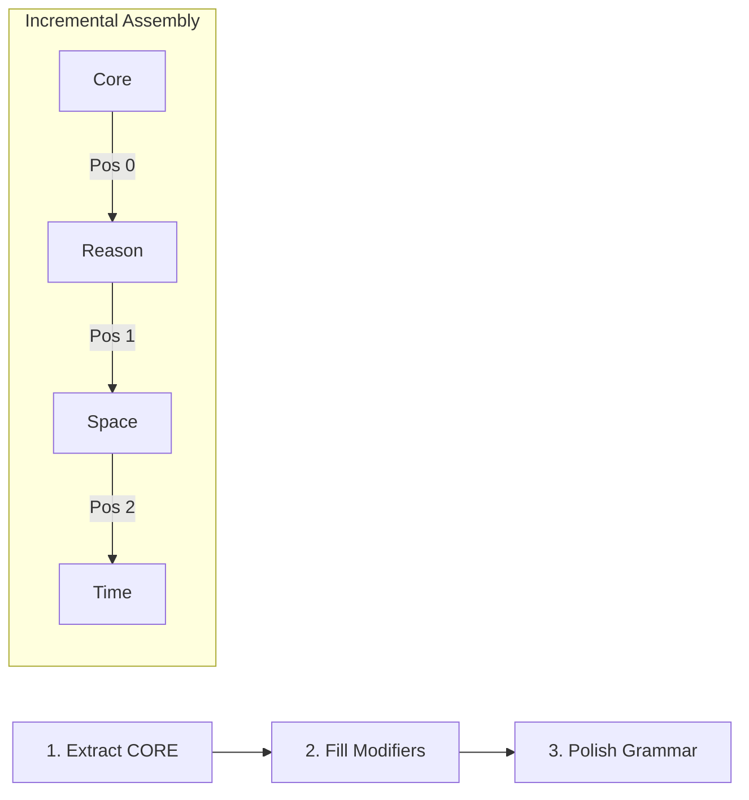
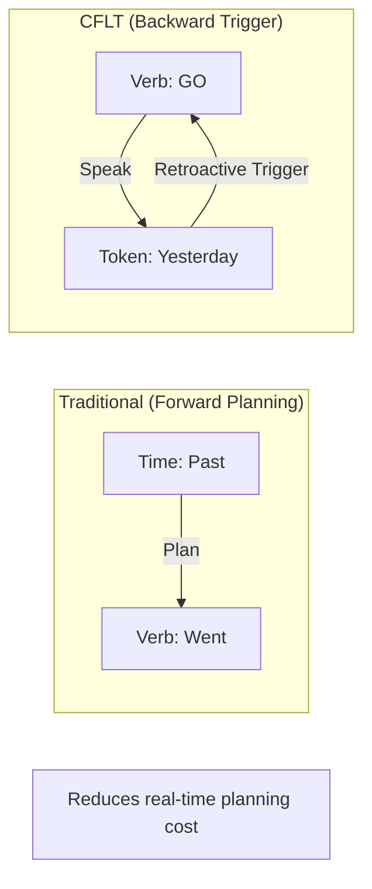
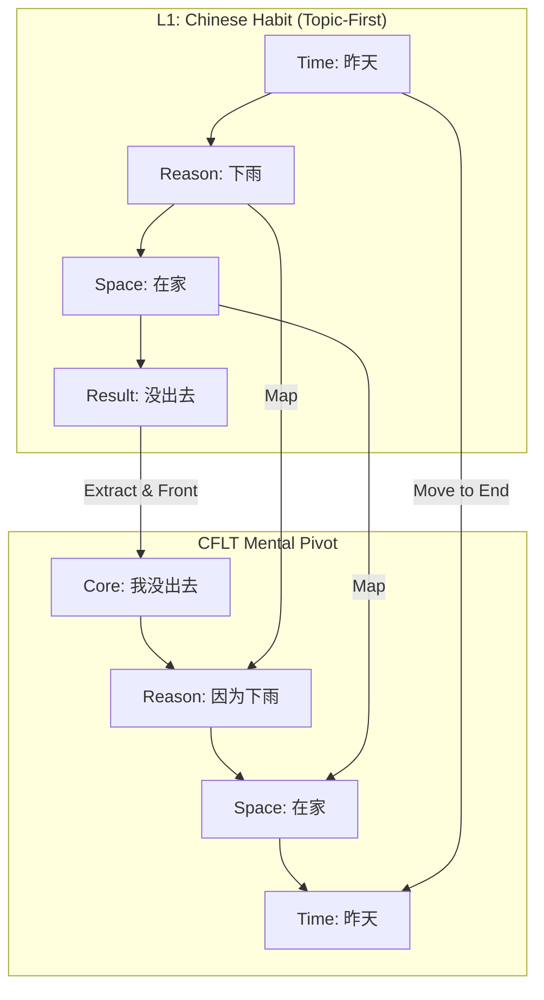

# Methodology: Human Cognitive Reshaping (L2 Fluency)

> **Version:** 1.0.0 (Internal Draft)
> **Author:** CFLT Core Team
> **Organization:** [CFLT.center](https://cflt.center)
> **License:** [CC BY 4.0](https://creativecommons.org/licenses/by/4.0/)

---

## 1. The Problem: The "Modifier Trap"

Most adult learners fail to achieve spoken fluency because they attempt to "translate" L1 thoughts into L2 surface forms. If your native language is **head-final** (like Chinese, where descriptors come before the noun), and your target language is **head-initial** (like English), your brain faces a massive **restructuring cost** in every sentence.

This leads to the **Modifier Trap**: your working memory overflows as you try to plan complex modifiers before you even utter the core of your message. You freeze, stutter, or lose the thread of your thought.

## 2. The Solution: Semantic Lego (The 3-Step Protocol)

CFLT solves this by treating language as "Semantic Lego"—functional blocks that are always assembled in the same cognitive order, regardless of the target language's grammar.

### Step 1: Extract the Core (The Salience Anchor)
Ignore the context, the time, and the reasons. Ask yourself: **"What is the one thing I am fundamentally asserting?"** 
- This is your **Core**. 
- Place it in **Position 0**.
- *Example:* "I didn't go out." / "That girl is my sister."

### Step 2: Fill the Slots (Incremental Modifiers)
Once the Core is "unloaded" from your working memory, append the modifiers one by one in the fixed **CFLT sequence**:
1. **[Reason]** — Why or under what condition? (*because it rained*)
2. **[Space]** — Where? (*at home*)
3. **[Time]** — When? (*yesterday*)

### Step 3: Grammar Overlay (Implicit Polishing)
At this stage, do not worry about "perfect" grammar. Use the **Atomic Vocabulary** (Semantic Primes) if needed. The goal is to establish the sequence. 
- **CFLT Form:** "I didn't go out, because it rained, at home, yesterday."

As you become more comfortable, the **Grammar Overlay** (provided by AI or natural acquisition) will polish this into idiomatic L2 (e.g., "It rained yesterday, so I stayed home"). However, in the heat of real-time conversation, **stick to the CFLT Form** — it is highly comprehensible to listeners and imposes minimal restructuring effort on the speaker.

### 2.1 Time Tokens vs. Tense: The Backward Constraint
In traditional L2 learning, "tense" is a forward-planning nightmare. You must know the time of the event *before* you choose the verb form. 

CFLT reverses this through **Backward Temporal Constraints**:
1.  **Core-First:** Speak the action in its base/atomic form immediately.
2.  **Time-Last:** Append the "Time Token" at the end.
3.  **Muscle Memory Training:** Learners are trained to treat the final Time Token as a "trigger" that retroactively validates the core. In the "Grammar Overlay" stage, the brain begins to *pre-echo* the time token into the core verb, transforming "I go... yesterday" into "I went... yesterday" via a subconscious feedback loop. This mimics how native speakers handle long-distance dependencies, building muscle memory for inflection without the planning cost.

> **Honest scope of this mechanism.** Backward Temporal Constraint is a **selection scaffold** — it helps learners decide *which* tense to use by anchoring on the temporal adverb. It does **not** automatically solve the *production* of tense morphology itself. Lardiere's (1998, 2003) "Patty" case study showed a Chinese-L1 advanced learner produced past-tense suppliance at only ~6%, attributed to a combination of (a) Mandarin phonotactic constraints (no syllable-final consonant clusters) limiting *-ed* production, and (b) the well-known "Missing Surface Inflection" challenge (Hawkins & Liszka 2003 *Prosodic Transfer Hypothesis*; Goad & White 2006). CFLT's backward-temporal scaffold helps learners *know* the tense to aim for; it does not by itself overcome the morpho-phonological mapping bottleneck. Effective Chinese→English tense pedagogy combines CFLT's temporal scaffolding with explicit phonological training on inflectional morphology.

---

## 3. Case Study: Chinese Learner to English

**Scenario:** You want to say "昨天下雨，我在家没出去" (Yesterday it rained, I was at home and didn't go out).

1. **L1 Habit (Topic-First):** [Time] → [Reason] → [Result].
2. **CFLT Mental Pivot:**
   - **Core:** 我没出去 (I didn't go out)
   - **Reason:** 因为下雨 (because it rained)
   - **Space:** 在家 (at home)
   - **Time:** 昨天 (yesterday)
3. **English Output:** "I didn't go out, because it rained, at home, yesterday."

**Result:** You produce the sentence incrementally. You don't have to "wait" for the time or reason to be processed before you start speaking. You are fluent from the first word.

---

## 4. How to Practice

1. **The "Max-Elision" Test:** Take any complex thought and try to reduce it to just one phrase. That phrase is your Core. Start every sentence with it.
2. **Slot-Filling Drills:** Practice adding only one modifier at a time. 
   - *Level 1:* Core + Time.
   - *Level 2:* Core + Space + Time.
   - *Level 3:* Core + Reason + Space + Time.
3. **Voice Overloading:** Use the CoreFirst app's Voice Challenge. Force yourself to speak the protocol sequence without looking at the screen. Trust the protocol.

---

## 5. Data & Projections: Quantifying Cognitive Load

CFLT's effectiveness is supported by theoretical metrics derived from established parsing principles and bilingual production models.

### 5.1 EIC Efficiency (Theoretical Deduction)
According to **John Hawkins'** **Early Immediate Constituents (EIC)** principle ([Hawkins 1994, 2004](https://doi.org/10.1017/CBO9780511554285)), human parsing efficiency is a ratio of identified constituents (ICs) to the word count (CRD).
- **Empirical Baseline:** Research shows that Chinese learners face significant **Negative L1 Transfer** when mapping head-final (L1) to head-initial (L2) structures, leading to a measurable increase in **Sentence Onset Latency**.
- **CFLT Projection:** By maximizing the EIC ratio (approaching 100%) at the start of the sentence, the protocol is **projected** to reduce the "look-ahead" load on working memory by **2x to 5x**.

### 5.2 Production Latency (Experimental Projections)
Cross-linguistic neuroimaging (e.g., **Hashimoto, Yokoyama & Kawashima 2012** [[10.2174/1874347101206010062](https://doi.org/10.2174/1874347101206010062)]) reports that processing non-canonical word orders elicits increased left-frontal activity, consistent with additional working-memory and conflict-monitoring load. Note that this is **converging neural evidence**, not direct measurement of an SVO/SOV cost asymmetry: subsequent LATL combinatorial findings (Bemis & Pylkkänen 2013; Pylkkänen 2019) suggest basic semantic combination is stable across word orders, so neural cost differences likely reflect surface-level reanalysis rather than protocol-level deficits.
- **Restructuring Delay:** Mapping L1 (Topic-First) to L2 (Subject-First) typically adds **200ms–500ms** of cognitive delay in spontaneous speech due to the "Modifier Trap."
- **Hypothesis:** CFLT is **hypothesized** to eliminate this specific restructuring delay by moving the linearization decision to an automatic pre-verbal stage ([Levelt 1989](https://mitpress.mit.edu/9780262620895/speaking/)).

---

## 6. Proposed Validation: The CFLT Latency Test

To validate these claims, we propose the following **Psycholinguistic Experiment**:
1. **Task:** Picture-naming or scene-elicitation task (L1 thought -> L2 speech).
2. **Variables:** Control (Free L2 word order) vs. Experimental (Strict CFLT sequence).
3. **Metric A (Latency):** Time from stimulus to first-word articulation.
4. **Metric B (Fluency):** Number of pauses/hesitations per 100 words.
5. **Metric C (Memory):** Digit-span task performance while speaking (measuring residual cognitive capacity).

---

## 7. The Proficiency Arc: From Protocol to Mastery

CFLT is a training wheels system, not a cage. The **Grammar Overlay** acts as the bridge from strict linearization to native-level expression:

1.  **Stage 1: The Strict Protocol (0-20% Proficiency):** The learner uses the 4-slot sequence exclusively. Output is "robotic" but perfectly clear.
2.  **Stage 2: Implicit Overlay (20-60% Proficiency):** Through AI feedback and exposure, the learner begins to "clot" slots together (e.g., merging Reason and Core).
3.  **Stage 3: Marked Deviations (60-90% Proficiency):** The learner begins to intentionally break the protocol for rhetorical effect (e.g., "Yesterday, I stayed home"). Because they have mastered the **unmarked baseline (CFLT)**, these deviations are now deliberate choices rather than "Modifier Trap" errors.
4.  **Stage 4: Transparent Fluency (90%+ Proficiency):** The protocol becomes an invisible cognitive skeleton. The speaker can produce any L2 structure, but when they encounter cognitive stress, they default back to the high-efficiency CFLT core to maintain the flow of speech.

---

## 8. Summary

The goal of CFLT is not to speak "perfectly," but to speak **instantly**. By fixing the order of your thoughts, you free your brain to focus on what matters: **communication.** 

**Core First, Supplement Later.**
