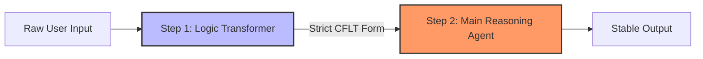
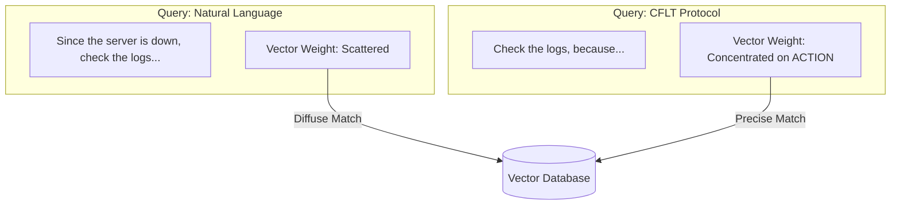
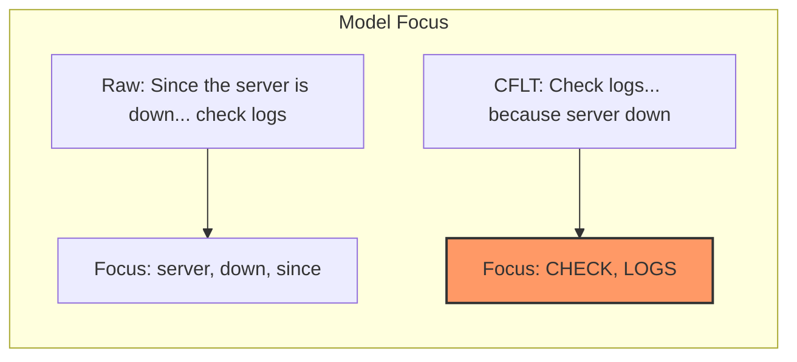

# Methodology: LLM System Prompting (Engineering Protocol)

> **Version:** 1.0.0 (Internal Draft)
> **Author:** CFLT Core Team
> **Organization:** [CFLT.center](https://cflt.center)
> **License:** [CC BY 4.0](https://creativecommons.org/licenses/by/4.0/)

---

## 1. The Problem: Prompt Variance and Attention Decay

Natural language is high-entropy and high-variance. In production AI systems, a minor change in the user's word order can lead to significantly different model behaviors (the **Order Sensitivity** problem). Furthermore, LLMs exhibit strong **Primacy** at position 0 and **Recency** at the end, often ignoring critical information buried in the middle of a long prompt. (Note: position-0 over-attention is the joint effect of primacy and the softmax-stability artifact known as "attention sinks"; see [`../foundations/llm.md`](../foundations/llm.md) §2.3 for the disambiguation.)

## 2. The Solution: The CFLT Protocol as a "Wire Format"

The **CFLT Protocol** acts as a **structural stabilizer**. By enforcing a fixed sequence (`[Core] → [Reason] → [Space] → [Time]`), you align the model's computation with its inherent positional biases.

> **Caveat — multi-language LLM stability.** CFLT is designed as a *language-agnostic protocol* — its slot semantics and order claims are intended to apply regardless of surface language. However, current LLMs are **not equally capable across languages**: empirical work (Lai et al. 2023 *ChatGPT Beyond English*; Bang et al. 2023; "Don't Trust ChatGPT when your Question is not in English", EMNLP 2023) shows substantial degradation on non-English inputs, including instruction-following, reasoning, and safety. CFLT cannot eliminate this gap — it can only reduce *protocol-level* drift in the cross-language transfer. Do not interpret CFLT's universality as a claim that an LLM rendered CFLT-prompt in Vietnamese or Swahili will perform like the English version.

### 2.1 Position-0 Attention
LLMs disproportionately attend to the first few tokens (Position 0). This is the joint effect of **primacy** (causal masking compounds early tokens' influence) and **attention sinks** (Xiao et al. 2024 — a softmax-stability artifact). CFLT exploits primacy: placing the **Core Action** in the high-attention prefix region ensures the model's early state is conditioned on the primary intent. See [`../foundations/llm.md`](../foundations/llm.md) §2.3 for the careful disambiguation between primacy and sink.

---

## 3. Implementation: The Sanitization Workflow

For high-reliability Agentic workflows, do not pass raw user input directly to your main reasoning model. Instead, use a two-step **Sanitization Workflow**:

### Step 1: The CFLT Transformer (Small/Cheap Model)
Use a fast model (e.g., GPT-5.4-Nano, Haiku 4.5, Llama-3-8B) to flatten the user's input into a strict CFLT JSON or text structure.

**System Prompt for Transformer Agent:**
```markdown
You are a CFLT Logic Transformer. 
Your task is to convert any user input into the following strict discourse sequence:
[Core/STATE] -> [REASON/CONDITION] -> [SPACE/CONTEXT] -> [TIME]

Rules:
1. Identify the most salient action or assertion. This is the CORE.
2. If a component is missing, use "NULL".
3. Output the result as a flat string or JSON.
```

### Step 2: The Main Reasoning Agent (Large/Powerful Model)
Pass the cleaned CFLT string to your primary model. Because the input is now low-variance and core-anchored, the model's generation will be more stable and faithful to the intent.



### 3.1 When NOT to use the two-step workflow

The two-step Sanitization Workflow is *not* universally preferable. The strongest opposing position is: **modern frontier instruction-tuned LLMs (GPT-5.5, Claude 4.7-class, Gemini 3.1+) may not need an explicit preprocessor**. Adding a separate Logic Transformer pass introduces (a) extra latency, (b) extra failure surfaces (the transformer can misclassify the Core), and (c) information loss if the transformer drops contextual cues the main model could have used. For many tasks, prompting the main model directly with a one-line CFLT instruction (*"answer in the form [Core, Reason, Space, Time]"*) may match or beat the two-step pipeline.

Use the two-step workflow when:

- The main model is small / mid-tier and benefits from cleaned, pre-structured input.
- The pipeline runs many requests per session and the transformer's output is reused or audited (so the latency cost is amortized).
- Reliability / auditability matters more than absolute latency (e.g., regulated industries; agentic workflows with downstream tool calls keyed on the Core structure).

**Prefer a single-call prompt** with an inline CFLT instruction when:

- The model is frontier-tier and already strong at instruction following.
- Latency is the dominant cost.
- The user's input is short enough that the main model can extract the Core itself without a separate pass.

The choice between the two architectures is **empirical, not doctrinal** — settle it for your stack with the ablation specified in [`./evaluation-metrics.md`](./evaluation-metrics.md) §4.1. We treat the two-step workflow as a *recommended pattern for reliability-sensitive flows*, not as a CFLT-mandated architecture.

> **Open empirical question.** Across ≥ 3 frontier models, does the two-step workflow show a measurable advantage over a single-call CFLT-instructed prompt on the same downstream task? The CFLT-specific P2 falsification clause (`foundations/core-concept.md` §8.5) sets up the controlled comparison.

---

## 4. Computational Efficiency: Token & Cache Optimization

Beyond reasoning stability, CFLT provides measurable performance gains in specific scenarios; see §5.2 for empirical results.

### 4.1 Token Reduction via Structural Flattening
Natural language often uses complex nesting (relative clauses, parentheticals) that requires significant token overhead for syntactic markers. 
- **CFLT Solution:** By flattening logic into a linear sequence and using a "NULL" value for missing slots, you eliminate the need for redundant conjunctions and filler phrases.
- **Result:** Lower per-request token count without sacrificing semantic density.

### 4.2 KV Cache Reusability and Inference Speed
In modern LLM inference (vLLM Automatic Prefix Caching, SGLang RadixAttention), the **KV Cache** can be reused for requests sharing an identical prefix.

- **What can be cached.** vLLM APC works at **block granularity** (default 16 tokens per block, requires byte-exact match aligned to block boundaries); SGLang RadixAttention works at **token-level radix tree** (finer-grained but token-exact match required).
- **What CFLT contributes.** The cacheable prefix is the **stable wrapper** — i.e., (a) the system prompt template, and (b) the *static schema* of the CFLT structure (the slot-tag tokens themselves, e.g., `[Core]:`, `[Reason]:` markers if you serialize them lexically). The Core *content* itself is the **variable payload** of each request and **does not benefit from caching directly** — different tasks have different Core actions. So the precise mechanism is: CFLT's stable schema enables a longer cacheable prefix than free-form natural language; the Core's variability limits where the cache cutoff lands.
- **Result:** Reduced Time-To-First-Token (TTFT) on the wrapper portion; the Core onwards still requires fresh prefill. Real-world benefit is highest in agentic / multi-turn flows where the system prompt + schema is the dominant share of prompt length.

### 4.3 Improved Hit Efficiency in RAG (Retrieval-Augmented Generation)
When a user's query is passed to a vector database for RAG, embedding models often distribute weight across the entire sentence.
- **CFLT Solution:** By placing the **Core Action** at the start of the query, the embedding vector is more strongly influenced by the actual "intent" rather than the "contextual noise" (time/space).
- **Result:** Higher top-K retrieval accuracy, ensuring the most relevant documents are retrieved based on the action required.



## 5. Data & Benchmarks: Empirical Evidence vs. Projections

CFLT's effectiveness is supported by both established industry benchmarks for inference engines and theoretical projections aligned with recent prompt-engineering research.

### 5.1 Established Industry Benchmarks (Empirical, Generic)
Modern inference frameworks (e.g., vLLM's APC, SGLang's RadixAttention) provide verified performance gains for **any** workload that supplies a fixed, reusable prompt prefix. The numbers below are **generic prefix-cache gains**, not CFLT-specific results — CFLT's contribution is that it makes prompts *eligible* for these gains by enforcing a stable, reusable prefix shape:

- **TTFT (Time-To-First-Token) Reduction:** Benchmarks for **SGLang (2024)** ([NeurIPS 2024](https://openreview.net/forum?id=VqkAKQibpq)) show an **80%–95% reduction** in TTFT for cached prefixes, as the "prefill" phase is bypassed for the shared structure.
- **Throughput Gain:** In agentic reasoning and multi-turn workloads, **RadixAttention** achieves **2x–5x higher throughput** compared to baseline vLLM by maximizing prefix reuse ([LMSYS Org. 2024](https://lmsys.org/blog/2024-01-17-sglang/)).
- **Linearization Impact:** The **DOVE Study (2025)** ([Findings of ACL 2025](https://doi.org/10.18653/v1/2025.findings-acl.611)) found that prompt linearization (the order of information) can cause an absolute accuracy gap of **10%–15%** on reasoning benchmarks like MMLU, confirming that prompt structure materially affects model behavior — which is the *necessary precondition* for CFLT's design choice to matter, not evidence that CFLT specifically captures this gap.

In short: §5.1 establishes that *some* fixed-prefix protocol pays. §5.2 specifies what CFLT must demonstrate to claim it is *the right one*.

### 5.2 CFLT-Specific Validation Results (Completed, 2026-05-17 expansion of 2026-05-16 baseline)

The following results come from a controlled ablation across **5 frontier models** (GPT-5, Gemini 3 Flash Preview, Qwen3.5-Plus, DeepSeek V4 Pro, Claude Sonnet 4.6) on 24 cases (N=3 runs per arm). Full data: [`llm-part2-verification.md`](./llm-part2-verification.md).

**Accuracy on distractor cases (L3 — the primary informative level):**

| Model | Control | CFLT | Δ | vs Prediction |
| :-- | :-- | :-- | :-- | :-- |
| GPT-5 | 61% | 100% | **+39pp** | ✅ Exceeds +15–20pp |
| Gemini 3 Flash | 78% | 100% | **+22pp** | ✅ Exceeds |
| Qwen3.5-Plus | 61% | 100% | **+39pp** | ✅ Exceeds |
| DeepSeek V4 Pro | 56% | 100% | **+44pp** | ✅ Exceeds |
| Claude Sonnet 4.6 | 72% | 100% | **+28pp** | ✅ Exceeds |

All **5 frontier models reach exactly 100%** accuracy under CFLT on distractor-heavy cases, versus 56–78% (mean 65.6%) under natural word order. Simple cases (L1/L4) are ceiling-saturated in both arms for most models; L2 saturates for three of five (GPT-5, Gemini, DeepSeek) and shows noise-zone behavior on two (Qwen +6pp; Claude −6pp, see [`llm-part2-verification.md`](./llm-part2-verification.md) §5.5). Multi-action decision cases (L4) show CFLT regression *only* on DeepSeek V4 Pro (−11pp); the other four are at or near ceiling under both arms.

**Token economy (mechanism differs from original prediction):**

- **Prompt token savings: ~−1%** (not significant). This dataset uses identical lexical content in both arms, making prompt compression untestable. The original −30–50% projection assumed prompt compression, which does not apply here.
- **Reasoning-capable model completion savings: −12% to −38%.** CFLT's core-first structure lets visible-chain-of-thought models (Qwen3.5-Plus: −38.4%, DeepSeek V4 Pro: −12.5%) converge faster, shortening reasoning traces. Qwen's total token reduction (−37.1%) falls within the projected range, but the saving comes from completion, not prompt tokens.
- **Short-output / concealed-reasoning models show no token effect.** GPT-5 (+0.7%), Gemini Flash (+1.4%), and Claude Sonnet 4.6 (+0.9%) are all within ±1.5% noise. This confirms a clean two-cluster pattern: the token saving is **visible-reasoning-trace-conditional**.

> **Note:** To test the prompt-compression claim directly, a third "compressed CFLT" arm (with NULL fillers and slot labels) is required — not supported by the current dataset design.

---

## 6. Completed Validation: The CFLT Ablation Study (2026-05-17, 5 models)

The §5.2 projections have been tested in a controlled ablation (see [`llm-part2-verification.md`](./llm-part2-verification.md)):

1. **Control Group:** Natural language prompts with variable word order (typically reason-first).
2. **Experimental Group:** Same lexical content reordered into strict CFLT sequence (Core → Reason → Space → Time), with no literal slot tags.
3. **Metric A (Accuracy):** JSON extraction accuracy under a metadata-driven synonym judge (N=3, temperature=0).
4. **Metric B (Efficiency):** `prompt_tokens` and `completion_tokens` reported independently — never merged.

**Core findings (5 models, 24 cases, 144 calls per model = 720 trials total):**

- On distractor-heavy cases (L3), CFLT raised accuracy from 56–78% to **100% across all 5 frontier models** (mean L3 control 65.6%; Δ ranges +22pp to +44pp). The universal saturation at L3 CFLT = 100% across 5 different model families (spanning concealed-reasoning, visible chain-of-thought, and short-output regimes) is the strongest evidence the experiment produces.
- On multi-action decision cases (L4), the −11pp CFLT regression is **confined to DeepSeek V4 Pro alone**; the other four models all saturate at L4 ceiling. The L4 anomaly is therefore model-specific rather than a general pattern (revised from the earlier 4-model reading before Claude was added).
- Reasoning-capable models (Qwen3.5-Plus, DeepSeek V4 Pro) saw completion-token reductions of −38.4% and −12.5% respectively via reduced reasoning overhead. The three short-output / concealed-reasoning models (GPT-5, Gemini Flash, Claude Sonnet 4.6) showed completion-token Δ within ±1.5% (no effect) — confirming the token economy benefit is **visible-reasoning-trace-conditional**, not general.

Full per-case tables, cross-model comparison, methodology notes, and the Claude integration adapter (lenient JSON parser) are documented in [`llm-part2-verification.md`](./llm-part2-verification.md).

---

## 7. CFLT in Multi-Agent Communication

When multiple Agents coordinate, using CFLT as the communication protocol provides three benefits:

1. **Reduced Parsing Latency:** The receiving Agent always knows that the "command" or "result" (the Core) is at the start of the message.
2. **Human Observability:** Unlike binary or dense JSON, CFLT is perfectly readable by humans. You can audit Agent-to-Agent logs and understand the "intent" instantly.
3. **Context Window Efficiency:** By flattening nested logic into a linear sequence, you reduce the token-complexity required for the model to "understand" the relationship between events.

---

## 8. Example: Prompt Optimization

**Raw Input:** *"Since the server is down, can you please check the logs in the production environment right now?"*

**CFLT Optimized:** *"Check the logs, because the server is down, in the production environment, now."*

**Why it works:**
- The model starts processing "Check the logs" immediately (Primacy Effect).
- The reason (server down) provides the immediate causal context.
- The constraints (production, now) act as the final steering tokens.



---

## 9. Summary

CFLT is a **structured prompting protocol** whose core claims have been validated in a controlled ablation across 5 frontier models (see [`llm-part2-verification.md`](./llm-part2-verification.md)):

**CFLT has clear benefits in:**
- **Distractor-heavy contexts** (noise, background clauses, competing information): placing the core action at position 0 raises accuracy to 100% across all 5 frontier models tested, Δ +22 to +44pp.
- **Reasoning-capable model efficiency**: CFLT reduces completion tokens by 12%–38% on visible-chain-of-thought models (Qwen, DeepSeek) by shortening confused reasoning traces on distractor-heavy inputs. **No token effect on short-output / concealed-reasoning models** (GPT-5, Gemini Flash, Claude Sonnet 4.6).

**CFLT is neutral in:**
- **Simple, direct instructions**: models already handle these reliably — no gain.

**CFLT is model-specifically problematic in:**
- **DeepSeek V4 Pro on multi-option decision cases** (−11pp on L4). The four other frontier models surveyed (GPT-5, Gemini Flash, Qwen3.5, Claude Sonnet 4.6) show no such regression. The earlier reading "CFLT mildly harmful on multi-option scenarios in general" has been retracted in favor of "DeepSeek V4 Pro shows a model-specific instruction-following anomaly on these cases; A/B-test before deploying CFLT on this model for this task type".

> CFLT is a **reliable, model-agnostic gain in high-noise, distractor-heavy tasks** — not a universal prompt optimizer, and not uniformly safe on every task type for every model. The L3 universality (5/5 models) is the strongest single finding; the DeepSeek L4 anomaly (1/5 models) is the strongest counter-example and is retained in the documentation as honest evidence.
