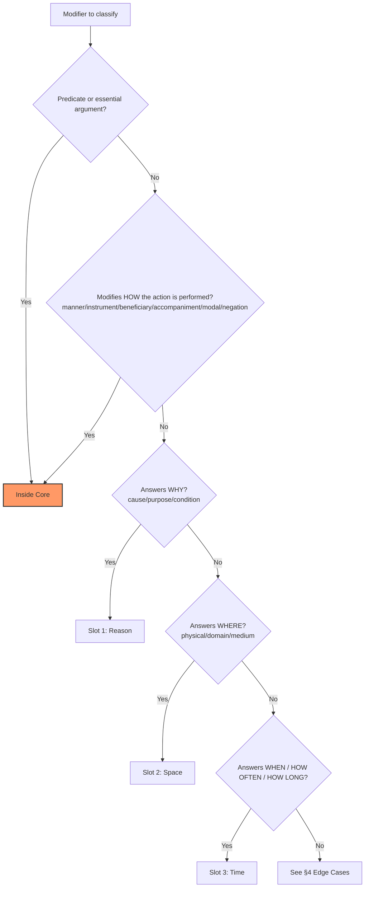

# Slot Disambiguation Reference

> **Version:** 1.0.0 (Internal Draft)
> **Author:** CFLT Core Team
> **Organization:** [CFLT.center](https://cflt.center)
> **License:** [CC BY 4.0](https://creativecommons.org/licenses/by/4.0/)

> **Purpose:** A normative reference for assigning any modifier in an utterance to one of CFLT's four positions (or recognizing it as a Core-internal element). This document is the operational ground truth for human curriculum authors, AI annotators, and the Logic Transformer engine.

---

## 1. Why This Document Exists

The four-slot canonical sequence `[Core] → [Reason] → [Space] → [Time]` is **complete only for the ground frame** (the world around the event). The event nucleus itself contains additional content — manner, instrument, beneficiary, accompaniment, modal, negation — that is structurally part of Slot 0 (Core), not a separate slot.

This document gives:
- A **decision tree** for unambiguously routing any modifier (§2)
- A **50-example reference table** covering the most common boundary cases (§3)
- **Edge-case rules** for ambiguous combinations (§4)
- **Multi-language sanity checks** showing the rules apply across SVO / SOV / VSO / topic-prominent typologies (§5)

For the theoretical foundation of the two-tier model (event nucleus vs ground frame), see [`../foundations/core-concept.md`](../foundations/core-concept.md) §2.1–§2.2.

---

## 2. Decision Procedure (Heuristic, with Priority Hierarchy)

> **Status of this procedure.** This is a **prioritized heuristic**, not a formally-verified decision tree. Formal completeness (every modifier maps to exactly one slot for every input combination) is an open problem — see §8 Open Boundaries. The procedure is sufficient for the vast majority of natural-language modifiers; edge cases where two questions answer "yes" are resolved by the priority hierarchy below.

For any word or phrase in an utterance, ask in order:

1. **Is it the predicate or an essential argument of the predicate?** (subject, direct/indirect object) → **Inside Core**
2. **Does it modify HOW the action is performed?** (manner, instrument, beneficiary, accompaniment, modal, negation) → **Inside Core**
   > *Scope note.* For modals and negation the "how" question is a **CFLT operational heuristic**, not a typological test. Across languages the *semantic scope* and *syntactic attachment* of modal and negation operators vary substantially (Horn 1989; Palmer 2001; Miestamo 2005; van der Auwera & Plungian 1998) — sentence-internal vs sentence-final, predicate-level vs propositional. CFLT's convention of routing them inside Core is a project-defined placement to be tested against language-specific scope and morphology, not a claim that they universally "answer how" or attach to the predicate.
3. **Does it answer WHY?** (cause / purpose / condition) → **Slot 1 [Reason]**
4. **Does it answer WHERE?** (physical / domain / medium) → **Slot 2 [Space]**
5. **Does it answer WHEN / HOW OFTEN / HOW LONG?** → **Slot 3 [Time]**
6. **Otherwise** — see §4 Edge Cases.

**Hierarchical priority**: 1 > 2 > 3 > 4 > 5. If a phrase plausibly fits multiple categories, the lower number wins (i.e., "inside Core" wins over "ground frame").

---

## 3. Standard Reference Table — 50 Examples

### A. Inside Core (Event Nucleus)

| # | Modifier | Role | Why |
|---|---|---|---|
| 1 | *slowly* | manner | answers "how" |
| 2 | *carefully* | manner | answers "how" |
| 3 | *quietly* | manner | answers "how" |
| 4 | *in a hurry* | manner | answers "how" |
| 5 | *with a knife* | instrument | answers "with what" |
| 6 | *with butter* | instrument | substitution test: changes the recipe → different event |
| 7 | *by phone* | instrument / medium-of-action | bound to the verb's valence ("call by X") |
| 8 | *by car* | instrument | answers "by what means" |
| 9 | *for my mom* | beneficiary | answers "for whom" |
| 10 | *to my friend* | recipient | answers "to whom"; valence-bound |
| 11 | *with John* | accompaniment | answers "together with whom" |
| 12 | *probably* | epistemic modal | routed inside Core by CFLT convention (scope/attachment is language-specific; see §2 step 2 scope note) |
| 13 | *certainly* | epistemic modal | routed inside Core by CFLT convention (scope/attachment is language-specific; see §2 step 2 scope note) |
| 14 | *didn't / never* | negation | routed inside Core by CFLT convention (scope/attachment is language-specific; see §2 step 2 scope note) |
| 15 | *please* (in Request) | politeness marker | **CFLT pedagogical simplification** — attached to Directive Core internally. Note: in standard speech-act theory (Searle 1975; Brown & Levinson 1987), *please* operates at the *illocutionary* level (modifying the request as a speech act), not at the propositional content level. CFLT bundles it inside Core for pedagogical convenience; the theoretically-precise position is that politeness markers are a separate illocutionary layer orthogonal to the four-slot protocol. See [`../foundations/sociolinguistics.md`](../foundations/sociolinguistics.md). |

### B. Slot 1 — Reason (Why?)

| # | Modifier | Sub-type | Functional word |
|---|---|---|---|
| 16 | *because it rained* | cause | because |
| 17 | *because of the meeting* | cause | because of |
| 18 | *since I was tired* | cause | since |
| 19 | *due to traffic* | cause | due to |
| 20 | *as a result of X* | cause | as a result of |
| 21 | *in order to learn* | purpose | in order to |
| 22 | *so as to win* | purpose | so as to |
| 23 | *to get the job* | purpose | to + infinitive |
| 24 | *for studying* | purpose | for + gerund |
| 25 | *if it rains* | condition | if |
| 26 | *unless he calls* | condition | unless |
| 27 | *provided that X* | condition | provided that |
| 28 | *given that X* | condition | given that |

### C. Slot 2 — Space (Where?)

| # | Modifier | Sub-type | Notes |
|---|---|---|---|
| 29 | *at home* | physical | basic location |
| 30 | *in the kitchen* | physical | basic location |
| 31 | *on the table* | physical | basic location |
| 32 | *in San Francisco* | physical | geographic |
| 33 | *in software engineering* | abstract domain | "field/area" |
| 34 | *in the photo* | representational domain | image/representation |
| 35 | *in the meeting* | event-as-domain | abstract container |
| 36 | *via Slack* | medium | channel/platform |
| 37 | *via PagerDuty* | medium | channel/platform |
| 38 | *through the API* | medium | technical channel |
| 39 | *according to John* | angle/perspective | source-of-information sub-type |
| 40 | *with respect to X* | matter/topic | "regarding" sub-type |

### D. Slot 3 — Time (When? How often? How long?)

| # | Modifier | Sub-type | Notes |
|---|---|---|---|
| 41 | *yesterday* | point | deictic |
| 42 | *at 3pm* | point | clock time |
| 43 | *just now* | point | immediate past |
| 44 | *last summer* | point/span boundary | broad point |
| 45 | *for an hour* | duration | how long |
| 46 | *all afternoon* | duration | how long |
| 47 | *every day* | frequency | how often |
| 48 | *twice a week* | frequency | how often |
| 49 | *occasionally* | frequency | how often |
| 50 | *after the restart* | sequential anchor | relational point |

---

## 4. Edge Cases & Disambiguation Rules

### 4.1 "When" — Time or Reason?

*"when you arrive"* can be either:
- **Time** — *"I felt sad when you left."* (= at the time of) — temporal locator
- **Reason (condition)** — *"I'll leave when you arrive."* (= once / if) — conditional dependency

**Rule**: if the matrix clause is **future** or **modal** ("will", "would", "might"), the *when*-clause is conditional → **Reason**. If the matrix clause is **past indicative** describing co-occurrence, → **Time**.

### 4.2 "By X" — Instrument or Time?

- *"by phone"* — instrument → **Inside Core**
- *"by Tuesday"* — temporal deadline → **Time**

**Rule**: if X is an entity/tool/channel → instrument (Core). If X is a temporal anchor → Time.

### 4.3 "In X" — Space or Time?

- *"in the kitchen"* — physical → **Space**
- *"in 2026"* — temporal → **Time**
- *"in software"* — abstract domain → **Space**
- *"in three minutes"* — duration → **Time**

**Rule**: if X denotes a region/domain/container → Space. If X denotes a year/duration/period → Time.

### 4.4 "For X" — Beneficiary, Purpose, or Duration?

- *"for my mom"* — beneficiary → **Inside Core**
- *"for studying"* — purpose → **Reason**
- *"for an hour"* — duration → **Time**

**Rule**: if X is a person/entity → beneficiary (Core). If X is an activity/goal → purpose (Reason). If X is a duration → Time.

### 4.5 Multiple Modifiers in the Same Slot

If a sentence has **multiple** elements for the same slot, place them adjacent in canonical order:

- **Multiple Reason elements**: cause-then-condition. *"... because I was tired, if you must know, ..."*
- **Multiple Time elements**: frequency → duration → point. *"every day for an hour at 3pm"*
- **Multiple Space elements**: from-broad-to-specific. *"in San Francisco, in the office, at my desk"*

### 4.6 Discourse Connectors (Outside All Slots)

*"however, therefore, then, so, anyway, by the way"* — these do **not** fill any of the four slots. They appear:
- Between blocks (see [`complex-structures.md`](./complex-structures.md) §3 on chunk-level chaining), or
- Pre-Core as discourse anchors (e.g., *"By the way, I'll leave at 5."*)

### 4.7 Tense Is Not a Slot

The grammatical tense of the predicate (past, present, future) is **inside Core**, attached to the verb form. The Time slot carries adverbial time references; tense morphology is triggered by the Time token but realized lexically inside Core. See [`human-learning.md`](./human-learning.md) §2.1 on backward temporal constraints.

---

## 5. Multi-Language Sanity Checks

The decision tree is meant to apply across language types. Below are minimal verifications.

> **Notation reminder.** **S = Subject, V = Verb, O = Object**. SVO / SOV / VSO denote the default surface order of these constituents in a transitive declarative clause. See [`../foundations/linguistics.md`](../foundations/linguistics.md) §1.1 for the canonical typology note.

### 5.1 SVO — English

> *"I baked the cake with butter, slowly, for my mom, in the kitchen, yesterday, because it was her birthday."*

| Span | Slot |
|---|---|
| I baked the cake | Core (predicate + patient) |
| with butter | Core (instrument) |
| slowly | Core (manner) |
| for my mom | Core (beneficiary) |
| in the kitchen | Space |
| yesterday | Time |
| because it was her birthday | Reason |

**CFLT canonical reorder** (event nucleus first as one chunk, then ground frame R→S→T):
> *"I baked the cake with butter slowly for my mom, because it was her birthday, in the kitchen, yesterday."*

### 5.2 SOV — Japanese

> *昨日、母のために、台所で、誕生日だったので、バターでゆっくりケーキを焼いた。*
> (yesterday | for-mom | in-kitchen | because-birthday | with-butter slowly | cake | baked)

| Span | Slot |
|---|---|
| バターでゆっくりケーキを焼いた | Core (instrument *de* + manner + patient *o* + verb) |
| 母のために | Core (beneficiary, dative-purposive) |
| 誕生日だったので | Reason |
| 台所で | Space |
| 昨日 | Time |

**CFLT canonical reorder** (event nucleus first as one chunk, then R→S→T) — note the verb stays final per Japanese syntax; CFLT only governs the order of *adjuncts* relative to the nucleus boundary:
> *母のためにバターでゆっくりケーキを焼いた、誕生日だったので、台所で、昨日。*

> **Note on Japanese punctuation.** The comma continuation after a sentence-final verb (-た) is **afterthought / right-dislocation** — common in spoken Japanese and acceptable as a CFLT teaching illustration. In formal written Japanese the same content would normally be split into separate sentences (e.g., *母のためにバターでゆっくりケーキを焼いた。誕生日だったので、台所で焼いた。昨日のことだ。*). CFLT-Japanese rendering should match the discourse register.

### 5.3 Topic-prominent — Chinese

> *昨天，因为是她生日，在厨房里，他用黄油慢慢地为妈妈烤了一个蛋糕。*
> (yesterday | because-birthday | in-kitchen | he | with-butter | slowly | for-mom | baked-a-cake)

CFLT canonical reorder:
> *他用黄油慢慢地为妈妈烤了一个蛋糕，因为是她生日，在厨房里，昨天。*

The nucleus *"用黄油慢慢地为妈妈烤了一个蛋糕"* (instrument + manner + beneficiary + verb-patient) stays in its native Chinese order; CFLT only reorders the R/S/T frame to **after** the nucleus.

### 5.4 VSO — Welsh (illustrative)

Welsh canonical: V-S-O. CFLT moves R/S/T after the V-S-O nucleus, leaving the language's verb-initial structure intact.

---

## 6. What This Reference Does NOT Do

1. It does **not** replace each language's syntax. Internal assembly of the Core (case marking, particles, prepositions, word order within the nucleus) is governed by the L1/L2 grammar, not CFLT.
2. It does **not** prescribe stylistic word order in marked utterances. CFLT defines the *unmarked default*; rhetorical fronting, clefts, and topicalization remain available (see [`../foundations/core-concept.md`](../foundations/core-concept.md) §6).
3. It does **not** handle quoted speech or embedded propositional attitude verbs ("I think that...", "She said that..."). For nested propositions, see [`./complex-structures.md`](./complex-structures.md).

---

## 7. Validation Process

When extending this reference (e.g., adding new domains or new languages):

1. New entries must pass the **substitution test** and **listener-question test** (defined in [`../foundations/core-concept.md`](../foundations/core-concept.md) §2.2).
2. New entries that fall in §4 Edge Cases must include a disambiguation rule.
3. Cross-language entries (§5) must verify the assignment is **structurally** correct in the target language, not merely a translation of the English example.

---

## 8. Open Boundaries (Honest Limitations)

The following remain under-specified and are listed here so future work can address them:

1. **Quotation and reported speech.** *"He said 'I'm leaving' yesterday"* — does *"I'm leaving"* form a nested CFLT block, or stay as direct quotation?
2. **Modal stacking.** *"He probably must have left"* — multiple modal layers all attach to Core, but their internal ordering is language-specific.
3. **Discourse particles in Asian languages** (e.g., Chinese 吧, 呢, 啊; Japanese ね, よ, か). These attach to the utterance as a whole, not to any single slot. They are treated as **utterance-level** markers, outside the four-slot system.
4. **Honorific and politeness systems** in Korean / Japanese. These pervade the entire utterance morphologically and are not slot-specific. CFLT handles them as a **partially dissociable** layer rather than a fully orthogonal one: neuro- and processing evidence (Momo et al. 2008; Cui et al. 2022) shows honorific processing interacts with socio-pragmatic and grammatical factors rather than running as a detachable wrapper, so full independence from slot content is not established. The two-stage "CFLT structure first, honorific layer second" workflow is a CFLT **hypothesis to test**, not a validated procedure; see [`../foundations/sociolinguistics.md`](../foundations/sociolinguistics.md) for the partial-dissociation caveat on the politeness layer.
