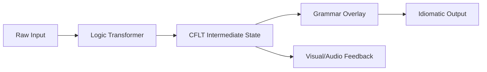

# Methodology: Software Architecture (CFLT-Engine)

> **Version:** 1.0.0 (Internal Draft)
> **Author:** CFLT Core Team
> **Organization:** [CFLT.center](https://cflt.center)
> **License:** [CC BY 4.0](https://creativecommons.org/licenses/by/4.0/)

> **Purpose:** To define the reference software architecture for implementing CFLT-native applications, focusing on the two-stage AI pipeline: The Logic Transformer and the Grammar Overlay.
>
> **Theoretical anchors.** The two-stage Transformer/Overlay split implements [`foundations/llm.md`](../foundations/llm.md) §1 (the Logic Transformer / Grammar Overlay distinction) and exploits the attention-sink and prefix-cache properties documented in §2.3 and §6 of the same file. Layer 2's "Retroactive Inflection" depends on the Backward Temporal Constraint defined in [`methodology/human-learning.md`](./human-learning.md) §2.1.

---

## 1. The CFLT Pipeline Overview

A CFLT-compliant application (like CoreFirst) operates as a modular pipeline that deconstructs human intent and reconstructs it into target language surface forms.



## 2. Layer 1: The Logic Transformer (LT)

The LT is a specialized AI agent tasked with **intent extraction** and **linearization**.

### 2.1 LT Implementation Stack
- **Models:** Optimized for small, fast instruction-followers (e.g., Llama-3-8B, GPT-4o-mini).
- **Task:** Map unstructured input (L1) to the 4-slot JSON schema.
- **Handling Ambiguity:** If the input is missing a core, the LT must prompt the user or inject a `[NULL]` token to maintain protocol stability.

### 2.2 Logic Extraction Prompt Pattern
The LT uses a "Salience-First" prompt that ignores syntactic sugar:
```json
{
  "instruction": "Extract the action/identity, reason, space, and time.",
  "constraint": "The CORE must be a standalone functional assertion.",
  "output_format": "CFLT_JSON"
}
```

## 3. Layer 2: The Grammar Overlay (GO)

The GO is responsible for **morphological refinement** and **idiomatic polishing**.

### 3.1 GO Implementation Stack
- **Models:** Larger, high-nuance models (e.g., GPT-4o, Claude 3.5 Sonnet).
- **Task:** Take the `CFLT Intermediate State` and generate the surface L2 form.
- **Temperature Control:** Set `temp=0.3` to ensure the core intent remains unchanged while allowing for natural flow.

### 3.2 Retroactive Inflection (The Tense Solver)
The GO resolves the "Backward Temporal Constraint" (see `human-learning.md` §2.1). It reads the `[Time]` slot and injects the correct tense into the `[Core]` slot during generation.

## 4. Layer 3: The Content Engine

To scale CFLT, the software architecture must support **Modular Token Injection**.

- **Token Packs:** Industry-specific CSV/JSON files (e.g., `it-tokens.json`).
- **Dynamic Slot Filling:** The engine injects these tokens into CFLT templates to generate infinite, contextually relevant practice scenarios.

## 5. Frontend Strategy: The "Semantic Lego" UI

The UI must reflect the underlying logic. Instead of a text box, the UI should provide **visual slots**:
1.  **Slot Rendering:** Clear visual boundaries for Core, Reason, Space, and Time.
2.  **State Management:** Real-time validation that the user is filling the slots in the correct order.
3.  **Visual Anchoring:** Icons linked to NSM Primes (Semantic Primes) to reduce reliance on L1 translation.

## 6. Performance Benchmarks for Engineers

- **LT Latency (TTFT):** Target < 300ms (to maintain conversational flow).
- **GO Fidelity:** Measured by `Intent Preservation Score` (does the output match the input Core?).
- **Context Window Usage:** Minimize overhead by using flattened CFLT strings instead of nested JSON structures.

---

## 7. Summary

The CFLT software architecture is designed for **deterministic discourse**. By separating logic from grammar, we allow for faster processing, lower error rates, and a seamless bridge between human intention and machine execution.
