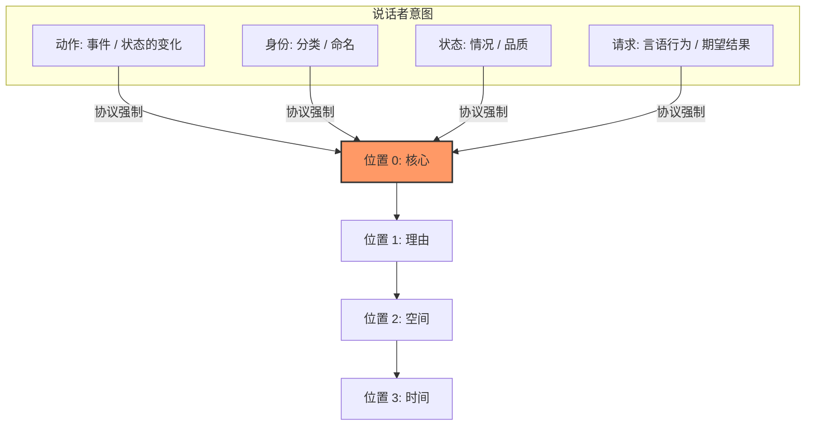
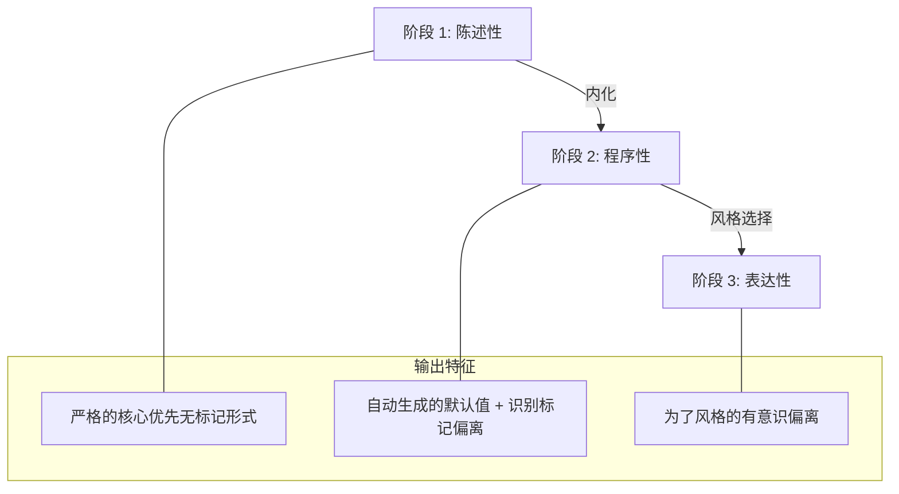

# CFLT 中“核心”的含义——显著性而非句法

> **版本：** 1.0.0 (内部草案)
> **作者：** CFLT 核心团队
> **组织：** [CFLT.center](https://cflt.center)
> **许可：** [CC BY 4.0](https://creativecommons.org/licenses/by/4.0/)

---

## 1. 对“核心”的错误解读：“CFLT 是动词优先/谓语优先。”

> **权威定义。** 本文档是 CFLT 中“显著性锚点 (salience anchor)”/“核心 (Core)”的权威定义。其他基础文档（`linguistics.md` §1.1, `logic.md` §1, `mathematics.md` §1.1）均指向此处以获取成分类型无关的定义；请勿在其他地方重新定义该术语。

这种解读是**错误**的，而且这种误读会削弱 CFLT 在教学法和 AI 对齐方面的全部论点。该协议植根于人类认知，旨在产生**可理解的人类语言**，而非形式逻辑符号或类型学上罕见的动词前置语序。

CFLT 中的“核心”是话语的**显著性锚点**。它是说话者从根本上“承诺”或“断言”为主要事件或状态的成分。

核心可能与动词或谓语*重合*，但并非由它们定义。CFLT 协议将核心放在线性位置 0；填充位置 0 的内容取决于说话者实际上在断言什么。

### 1.1 比较表

| 术语 | 领域 | 定义 | 示例 |
|---|---|---|---|
| **动词 (Verb)** | 句法 | 词的一个语法类别 | "eat", "believe", "be" |
| **谓语 (Predicate)** | 形式逻辑 | 将个体映射到真值的函数 | $P(x, y)$ |
| **图形 (Figure)** | 认知语义学 (Talmy 2000) | 前景化的实体/事件 | "*The cat* is on the mat" |
| **核心 (Core) (CFLT)** | 本项目 | 显著性锚点——承诺的断言 | "*I went out*, because it rained" |

这些类别在许多句子中虽有重叠，但各不相同。CFLT 的核心本质上是话语的**图形 (Figure)**：即其位置、路径或方向作为所讨论变量的事件或实体。随后的插槽（理由、空间、时间）充当**背景 (Ground)**——即为图形提供“静止”背景的参考框架。

Talmy 的**偶然性原则 (Contingency Principle)** 进一步支持了这一点：人类自然会优先考虑依附于框架的事件。在 CFLT 协议中，核心（依附事件）被放在第一位，随后是提供其参考框架的修饰语。

---

## 2. 核心的四种类型

每个格式正确的 CFLT 话语都会在位置 0 承诺以下四种核心类型之一：

| 类型 | 示例 (CFLT-L2 形式) | 前景化的内容 |
|---|---|---|
| **动作 (Action)** | *I didn't go out*, because... | 事件 / 状态的变化 |
| **身份 (Identity)** | *That girl is my sister*, wearing... | 分类 / 命名 |
| **状态 (State)** | *I'm exhausted*, because... | 情况 / 品质 |
| **请求 (Request)** | *Could you pass the salt*, please... | 言语行为 / 期望的结果 |

核心的选择是说话者做出的**语义决策**（“我到底想说什么？”）。将核心放在位置 0 是 CFLT 强制执行的**协议**。

### 2.1 事件核：核心 (Core) 的内部结构

核心占据位置 0，作为一个单一的注意力单元，但**填入这个单元的不一定是一个单词**。它是**事件核 (Event Nucleus)** —— 谓词，连同那些与事件本身不可分割的参与者和方式状语。

CFLT 是一个**两层模型**：

| 层级 | 内容 | 听者所问的问题 | 位置 |
|---|---|---|---|
| **第一层：事件核** | 谓词（动作 / 身份 / 状态 / 请求）+ 价位绑定参与者（主语、宾语、工具、受益者、接受者）+ 方式状语 | *发生了什么？*（含 谁、对谁、用什么、怎样） | 槽位 0（核心） |
| **第二层：场景框架** | 理由 / 空间 / 时间 | *为什么？哪里？何时？* | 槽位 1–3 |

事件核之所以是单一显著性单元，是因为听者把它作为一个前景化的语块来处理：*"我用黄油慢慢地为妈妈烤了一个蛋糕"* 呈现的是**一个事件**，不是五个。而 *"在厨房，昨天"* 是与事件本身概念上独立的场景设定。

**为何这在跨语言意义上是严谨的：**

- 事件核的**内部组装**使用每种语言的原生句法 —— 日/韩/土耳其语的格标、英/罗曼/汉的介词、汉语的连动结构、日语的助词。CFLT **不**规定如何组装。每种语言的"硬件"自己处理。
- CFLT 只规定**事件核（槽位 0）与场景框架（槽位 1–3）之间的边界**，以及**场景框架内部的顺序**。这是协议层。

**理论近亲（与既有框架的对齐）：**

- **角色与指称语法（Role and Reference Grammar，Van Valin & LaPolla 1997）** 区分 Nucleus（谓词）/ Core（谓词+论元）/ Periphery（情境状语）。CFLT 的两层模型可视为**RRG 的 Nucleus 与 Core 的功能性合并**为单一"事件核"，RRG 的 Periphery 对应 CFLT 的场景框架。这是文档层面为教学清晰所作的压缩，不是理论分歧。
- **LFG 的 c-structure / f-structure 分离** 与 **HPSG 线性化理论** 各自独立地实现了同一"协议层+实现层"分离：f-structure（功能性，跨语言对齐）与 c-structure（成分性，语言特定的表面语序）匹配 CFLT 的"协议层+事件核组装"分解。
- **Cinque (1999)** 把方式副词放在制图副词层级中**最低（最 VP 内部）**的功能投射 —— 最贴近谓词。CFLT 把方式置于事件核的做法与 Cinque 的定位一致，尽管 Cinque 把方式视为 Spec-of-FP 而非价位绑定；CFLT 的"方式在 Core 内"最好读作"方式在线性化中紧邻谓词，并非必然句法上价位绑定"。

协议层之下，每种语言用自己的句法机制；协议层之上，所有语言共享同一个排序。这就是为什么 CFLT 是**协议**而不是句法规定，也是为什么它能**普适**应用而不违反任何一种语言的类型学特征。

> **诚实警示 —— 流利度 vs 复杂度的权衡。** CFLT 两层模型通过把线性化决策外化降低工作记忆负荷（Sweller 认知负荷理论）。这一收益在**初级到中级**熟练度时最强。Skehan (1998) 的权衡假说警告：固定化模板可能让学习者在*流利度*上达到平台、却以*复杂度*与*准确度*为代价 —— 即学习者停留在模板内的安全区，不再追求重构。CFLT 因此应与渐进任务复杂度升级配套（参见 `pedagogy.md` §6 的弱式 TBLT），使中级及以上学习者被推向无标默认值之外的有标偏离（参见本文 §6 熟练度弧线）。

### 2.2 边界规则：什么进事件核、什么进场景框架

如果一个修饰语回答的是关于动作本身的内部问题，它属于**事件核内部**（槽位 0）：

- **怎样**做的？→ 方式（*慢慢地、小心地、匆忙地*）
- **用什么**工具或手段？→ 工具（*用黄油、通过电话、坐车、经由 API*）
- **为/给谁**？→ 受益者、接受者（*为妈妈、给朋友*）
- **和谁一起**？→ 伴随（*和约翰、和团队*）
- **何种语气**？→ 情态（*可能、一定、也许*）—— 附着于谓词
- **是否否定**？→ 否定（*没、从不、几乎不*）—— 附着于谓词

如果一个修饰语回答的是关于事件外部世界框架的问题，它属于**场景框架**（槽位 1、2 或 3）：

- **为什么？**（原因 / 目的 / 条件）→ 槽位 1 [理由]
- **哪里？**（物理位置、抽象 domain、媒介）→ 槽位 2 [空间]
- **何时？多久一次？多长时间？** → 槽位 3 [时间]

**判定方法 —— 替换测试**：*"修饰语改变后，还是同一个事件吗？"*

| 修饰语替换 | 同一事件？ | 判定 |
|---|---|---|
| *慢慢地* 烤 → *快快地* 烤 | 否（动作品质不同） | 事件核内（方式） |
| *用黄油* → *用人造黄油* | 否（配方不同 = 不同事件） | 事件核内（工具） |
| *在厨房* → *在花园* | 是（同事件，不同场景） | 场景框架（空间） |
| *昨天* → *今天* | 是（同事件，不同时间） | 场景框架（时间） |
| *因为累* → *因为好奇* | 是（同事件，不同动机） | 场景框架（理由） |

**如果仍然模糊 —— 听者问题测试**：听者最自然会先问哪个问题？
- *"什么 + 怎么 + 用什么 + 给谁"* → 事件核内（事件本身）
- *"为什么 / 哪里 / 何时"* → 场景框架（事件外部世界）

完整的边界案例和 50 例参考表见 [`../methodology/slot-disambiguation.md`](../methodology/slot-disambiguation.md)。

### 2.3 分层的普适性：哪些跨语言一致、哪些依赖具体语言

一个常见的混淆是：CFLT 究竟规定所有语言*同一表层形式*，还是仅规定*同一协议*？答案在不同层是不同的。下表是权威参照。

| 层级 | 内容 | 是否普适？ | 任一具体语言（含英语）的角色 |
|---|---|---|---|
| **第 1 层：协议** | 核心位于位置 0；场景框架按 理由 → 空间 → 时间 排序 | **是 —— 普适** | 没有任何语言享有特权。协议是语言无关的。 |
| **第 2 层：槽位语义** | 每个槽位回答哪类功能性问题（为什么 → 理由；哪里 → 空间；何时 → 时间） | **是 —— 普适** | 这些是功能分类，不是表面句法。 |
| **第 3 层：事件核内部组装** | 谓词 + 价位 + 方式状语在 Core 内的排列方式（格标、助词、介词、连动结构、核内语序） | **否 —— 完全依赖具体语言** | 每种语言使用自己的原生句法。CFLT 不规定 Core 内部结构。 |
| **第 4 层：边界 edge case** | 像 *"用 X"*、*"在 X"* 等到底归核内还是某个场景框架槽 | **大体普适，含语言特定 edge case** | 英语可作*验证锚*，但不是裁判。每种语言的功能分析自行决定。 |

**英语角色的原则性界定。** 本文档使用英语作为**默认示例语言**，因为英文文档触达最广，英语训练的 LLM 理解最好。英语也可作为**验证锚**（把有争议的槽位分配翻译成英语再过一次判定，看答案是否一致）。但英语**不可**成为：

- 非英语目标语言中 Core 边界判定的权威
- 跨语言对的强制中介（例如汉语↔日语学习者不必经过英语）
- "L1" 或 "L2" 的隐含指代 —— 这两个术语是*相对于学习者*的，不是相对于英语的

CFLT 的普适性主张仅限于上述第 1、2 层。其余两层显式委托给语言特定机制，而正是这一委托让普适性主张得以辩护。各语言对中第 4 层的具体落地，参见[语言对指南](../methodology/language-pair-guides/index.md)。

---

## 3. CFLT 输出是可理解的人类语言

一个常见的担心是，强制固定顺序会使句子变得“不自然”或“不地道”。

**不，因为 CFLT 并不反转句法语序。** 比较：

| 形式 | 序列 | 自然度 |
|---|---|---|
| **CFLT-L2** | *I didn't go out, because it rained, at home, yesterday.* | 可理解的英语，略显简练，任何读者和现代 LLM 均可解析 |
| 地道英语（语法叠加后） | *Yesterday it rained, so I stayed home and didn't go out.* | 母语流利形式，由语法叠加层从 CFLT 推导而来 |

CFLT-L2 介于异类结构和完全地道的散文之间。它是**支架形式**：足够可理解且一致，足以锚定学习和机器处理，同时带有足够的母语风味，使人类不会排斥它。

---

## 4. 为什么 CFLT 与 LLM 对齐

现代 LLM 是在自然人类语言的“流形 (manifold)”上训练的。如果 CFLT 是像 `[GO(I, HOME, YESTERDAY)]` 这样的形式逻辑符号，模型将需要专门的微调或少样本提示词来处理它。

- 一个 CFLT-L2 提示词 (*I went, because... at... yesterday*) 虽然**略微不地道，但完全在分布之内**——它看起来像简练、结构化的英语，LLM 处理得很好。

这是 CFLT 与 LLM 行为对齐的更深层原因：不是因为 LLM 喜欢形式逻辑，而是因为 **CFLT 在对其施加有用结构的同时，保持在人类语言流形之内**。核心优先协议是自然语言内部的一种约束，而非其替代品。

---

## 5. 中间支架的作用

核心概念文档定义了思维与言语之间的“无标记”中间地带。

1. **降低重组成本。** L1 思维不再需要重新解析为 L2 表面语序；两种语言共享 CFLT 中间支架（见 `mathematics.md` §9）。
2. **稳定的注意力锚点。** LLM 最关注位置 0；协议确保位置 0 始终是最重要的单词（见 `llm.md` §2）。
3. **风格灵活性的基础。** 一旦“核心优先”习惯变得自动化，学习者可以为了修辞效果（前景化时间、托辞等）而有意识地偏离它。CFLT 是一个*基础情况*，而非上限。

（产品中的）语法叠加层 (Grammar Overlay) 将 CFLT-L2 润色为地道的 L2——随着时间的推移，学习者会内化这两个层面，并在它们之间自然选择。

---

## 6. 表达多变性：CFLT 是无标记默认值，而非唯一允许的形式

没有语序变化的语言将是一组死代码。真实的语言允许：
- *"I didn't go out yesterday."* (无标记形式)
- *"Yesterday, I didn't go out."* (有标记形式：时间被前景化)
- *"It was yesterday that I didn't go out."* (分裂句：焦点在时间)

如果 CFLT 提出单一固定语序，是否与这一现实冲突？

不。

CFLT 将“核心优先”提议为**目标用例中的无标记概念默认值**——而非唯一允许的形式。

| 形式 | 地位 | 功能 |
|---|---|---|
| **CFLT-L2 (核心优先，四插槽)** | 无标记默认值 | 中性断言；学习者的基准；AI 处理的一致格式 |
| 有标记形式（前置时间等） | 可用于修辞 | 强调特定背景；对比焦点；叙事流 |

CFLT **并不禁止**有标记的偏离。它的意思是：*如果你没有特殊的修辞目的，默认采用核心优先。当你有此类目的时，请有意识地偏离。*

成年 L2 学习者的问题不在于“如何强调时间”；问题在于“如何说出任何话而不卡壳”。通过消除无标记默认值的多变性，CFLT 提供了实现基本流利所需的**认知稳定性**。

CFLT 通过首先赋予学习者无标记默认值，**然后**引入有标记偏离作为下一学习层，来加速学习者的进步。这与母语者习得语法的方式（先默认值，后例外情况）、技能习得理论（陈述性→程序性→带有刻意变化的自动化）以及认知负荷理论（构建单一图式，然后专门化）是一致的。

### 熟练度弧线：

1. **陈述性阶段**：学习者显式应用 CFLT 协议。输出是一致的无标记核心优先形式。默认值正在被安装。
2. **程序性阶段**：协议变得自动化。学习者无需思考即可生成无标记默认值。他们开始在输入中**识别**有标记偏离——*“为什么那个说话者把 'yesterday' 放在前面了？”*
3. **表达性阶段**：学习者已经内化了默认值和日益丰富的有标记偏离清单。语序的选择是自觉的风格决策。当认知负荷很高（压力下、陌生主题）或需要精确性时，CFLT 成为备用支架。

---

## 7. 总结：我们所说的“核心”指什么

这种观点并没有削弱 CFLT 的核心主张——反而加强了它：

> **话语的认知核心就是其普遍优先的位置。**

因此，CFLT 最好被表征为：**一个可以被有意识偏离的无标记默认值，而偏离本身也变得富有意义。**

### 误读反驳矩阵

| 误读 | 修正 |
|---|---|
| “CFLT 是动词优先。” | CFLT 是**显著性优先**。核心可以是一个动词短语、一个系词补足语、一个状态描述词或一个言语行为。 |
| “CFLT 与语言类型学相矛盾。” | CFLT 不对自然语言语序做描述性主张。它是一个叠加了固定概念顺序的**教学和计算协议**。 |
| “CFLT 产生异类句子。” | CFLT-L2 是可理解的（而非地道的）英语。语法叠加层负责处理地道性。 |
| “CFLT 是伪装的形式逻辑符号。” | CFLT 是**具有约束性线性化的自然语言**。符号 `P(a,b,c)` 是该协议一个方向的类比，而非协议本身。 |
| “CFLT 仅适用于动作句。” | CFLT 容纳四种核心类型（动作、状态、身份、请求）。协议是统一的；填充位置 0 的内容各异。 |
| “CFLT 绕过了母语习语。” | CFLT 是支架层；母语习语是语法叠加层产生的表面层。它们共存，而非竞争。 |
| “CFLT 禁止以任何其他方式说话。” | 不。CFLT 是**无标记默认值**。有标记偏离（话题化、前置、分裂句）是成熟流利度的一部分，并被明确容纳——见 §6。 |
| “CFLT 是语言学习的终点。” | CFLT 是**无标记默认值的支架**。精通包括在修辞上下文需要时有意识地偏离协议。 |

---

## 8. 对基础文档的影响

- **`linguistics.md`** —— Talmy 的图形和 Langacker 的轮廓是正确的语言学近亲。表面语序类型学**不是**评估 CFLT 的正确框架，因为 CFLT 不主张类型学上的普遍性。
- **`logic.md`** —— 谓语逻辑符号 `P(a,b,c)` 是*函数应用顺序*的类比，而非 CFLT 产生的字面表面形式。CFLT 是受此顺序启发而产生的自然语言叠加，而非其符号替代品。
- **`mathematics.md`** —— 搜索空间缩减 ($4! \to 1$) 专门适用于四个插槽的有标记/无标记决策。

---

## 9. 给实现者的正式定义

对于逻辑 Transformer 引擎以及任何未来扩展 CFLT 协议的 AI 代理：

> **核心是事件核 —— 谓词，连同那些与事件本身不可分割的所有参与者和方式状语。** 形式定义：它是这样一个最小的成分 —— 当被单独说出时，能够识别说话者的主要意图（动作、身份、状态或请求），**包括所有价位绑定参与者**（主语、宾语、工具、受益者、接受者）**和方式状语**，使得即便在上下文不完整的情况下，该信息在功能上仍然有用。

核心可以是词汇上简单的（一个动词），也可以是结构上丰富的（一个填满价位槽位并附带方式状语的谓词），但它在位置 0 作为**单一显著性单元**起作用。CFLT 协议不规定事件核内部如何组装 —— 这交给每种语言的原生句法。协议只规定**事件核与场景框架（槽位 1–3）之间的边界**，以及**场景框架内部的顺序**。

这个定义是**语言无关**（在事件核组装上没有特权语言）、**成分类型无关**（动作 / 身份 / 状态 / 请求 四种核心类型统一在"谓词 + 价位 + 方式"之下）、**可操作可测试**（通过 §2.2 的替换测试与听者问题测试可判定）的。

---

## 10. 结束语

CFLT 是**核心优先**，而非动词优先，非谓语优先，非形式逻辑优先。核心是由说话者的意图选择的显著性锚点，由协议放在位置 0，并被 `[理由] → [空间] → [时间]` 修饰语包围。

关键在于，CFLT 定义的是**无标记默认值**，而非唯一允许的形式。人类语言对任何意义都有多种表达形式，这种多变性对交流至关重要。CFLT 为学习者和机器提供了一个可靠的默认值；而有意识地偏离该默认值则是高级流利度的标志，并显式地作为熟练度弧线的一部分。支架是开始，而非上限。通过消除异构语系间的**结构重组税**，CFLT 实现了人类与 AI 的即时流利与逻辑对齐。

---

## 另请参阅

- [`linguistics.md`](./linguistics.md) §2 —— Talmy 的图形-背景和 Langacker 的轮廓-基础，“显著性锚点”的认知语言学近亲。
- [`logic.md`](./logic.md) §5 —— 四种核心类型如何映射到 Searle 的言语行为类别。
- [`mathematics.md`](./mathematics.md) §1.1 —— 动作动词之外的身份 / 请求 / 状态核心的形式化建模。
- [`llm.md`](./llm.md) §2.4 —— 非动作核心（身份、请求）如何与高注意力前缀区互动（首因与汇点联合）。
- [`../methodology/human-learning.md`](../methodology/human-learning.md) §2 —— 使“提取核心”变得可操作的 3 步协议。
g.md`](../methodology/human-learning.md) §2 —— 使“提取核心”变得可操作的 3 步协议。
