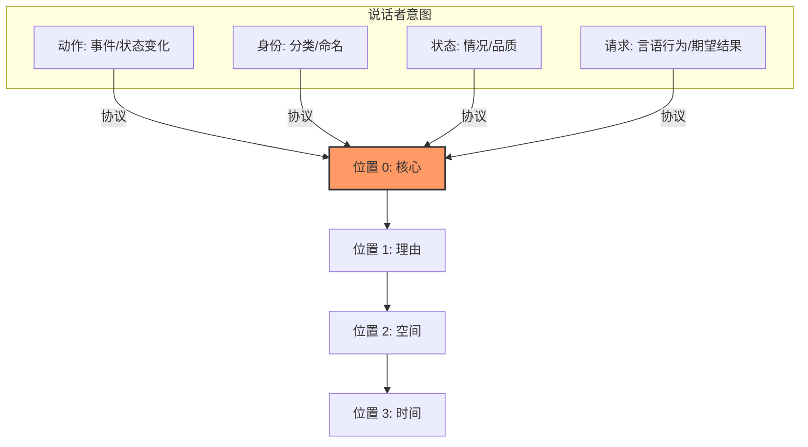
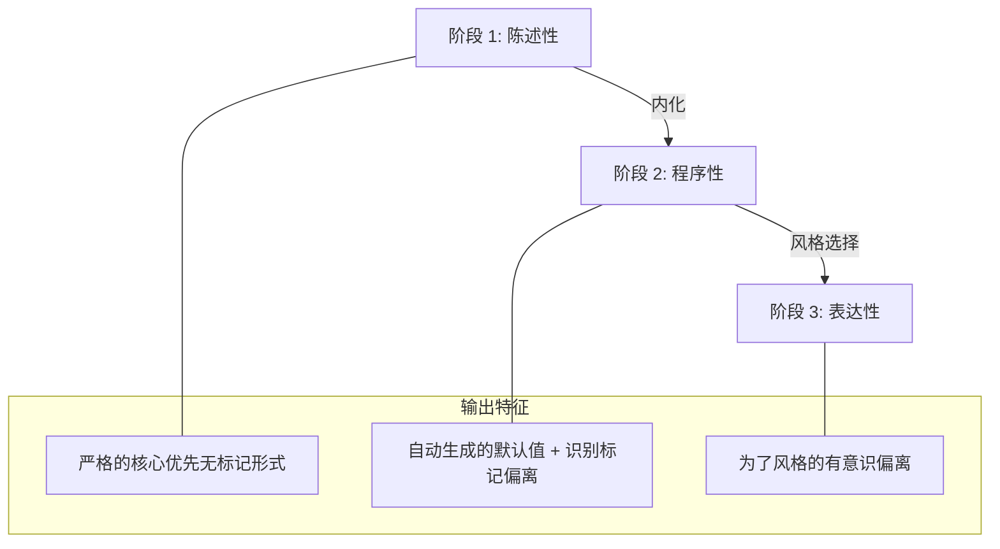
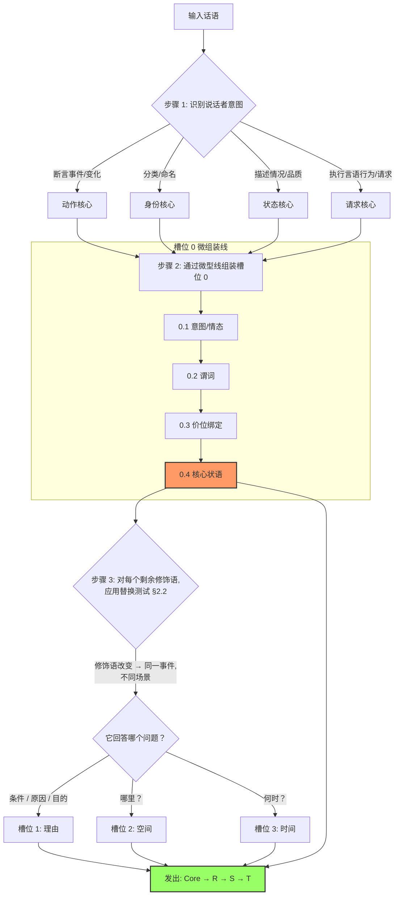

# CFLT 中"核心"的含义——显著性而非句法

> **版本：** 1.0.0 (内部草案)
> **作者：** CFLT 核心团队
> **组织：** [CFLT.center](https://cflt.center)
> **许可：** [CC BY 4.0](https://creativecommons.org/licenses/by/4.0/)

---

## 1. 对"核心"的错误解读："CFLT 是动词优先/谓语优先。"

> **权威定义。** 本文档是 CFLT 中"显著性锚点 (salience anchor)"/"核心 (Core)"的权威定义。其他基础文档（`linguistics.md` §1.1, `logic.md` §1, `mathematics.md` §1.1）均指向此处以获取成分类型无关的定义；请勿在其他地方重新定义该术语。

这种解读是**错误**的，而且这种误读会削弱 CFLT 在教学法和 AI 对齐方面的全部论点。该协议植根于人类认知，旨在产生**可理解的人类语言**，而非形式逻辑符号或类型学上罕见的动词前置语序。

CFLT 中的"核心"是话语的**显著性锚点**。它是说话者从根本上"承诺"或"断言"为主要事件或状态的成分。

核心可能与动词或谓语*重合*，但并非由它们定义。CFLT 协议将核心放在线性位置 0；填充位置 0 的内容取决于说话者实际上在断言什么。

### 1.1 比较表

| 术语 | 领域 | 定义 | 示例 |
|---|---|---|---|
| **动词 (Verb)** | 句法 | 词的一个语法类别 | "eat", "believe", "be" |
| **谓语 (Predicate)** | 形式逻辑 | 将个体映射到真值的函数 | $P(x, y)$ |
| **图形 (Figure)** | 认知语义学 (Talmy 2000) | 前景化的实体/事件 | "*The cat* is on the mat" |
| **核心 (Core) (CFLT)** | 本项目 | 显著性锚点——承诺的断言 | "*I went out*, because it rained" |

这些类别在许多句子中虽有重叠，但各不相同。CFLT 的核心本质上是话语的**图形 (Figure)**：即其位置、路径或方向作为所讨论变量的事件或实体。随后的插槽（理由、空间、时间）充当**背景 (Ground)**——即为图形提供"静止"背景的参考框架。

Talmy 的**偶然性原则 (Contingency Principle)** 提供了一个启发性类比：它描述了事件与其框架之间不对称的图形—背景关系。把核心放在线性顺序的*第一位*是 CFLT 的设计步骤，而非 Talmy 所确立的结论——Talmy 的不对称性本身并不蕴含图形优先的表层语序。

### 1.2 "核心"不是什么——两项关键辨析

有两个邻近概念经常被混同于 CFLT 的核心。两种解读都是错误的，都会动摇理论的操作性主张。以下辨析具有权威效力。

#### 辨析 A——核心 ≠ "重要"

> **"核心"是结构性锚点（说话者侧的承诺），而非关于哪个成分"最重要"的价值判断。**

| 属性 | "重要"（非正式） | **核心（CFLT）** |
|---|---|---|
| 指定来源 | 听者 / 语境——价值判断 | 说话者——正在被断言的内容 |
| 理论近邻（类比，非等同） | 形式语言学中无对应 | Talmy 的图形（2000）；Halliday 的音调核（1967）；Van Valin & LaPolla 的 RRG 核心（1997）；Centering Theory 的回溯中心 Cb（Grosz, Joshi & Weinstein 1995，作为*话语连贯性*类比，非直接等同——Cb 依转换而定，未必是位置 0 的成分）；Lambrecht 的语用断言（1994，作为信息结构的比较参照——断言可覆盖整个命题，与核心并不等同）。这些是 CFLT 所借鉴的比较参照；它们都没有*定义*核心，核心由 CFLT 通过 §2.2 操作化。 |
| 语境切换下的行为 | 随听者优先级变化而改变 | 由说话者意图在当次话语中固定 |
| 操作测试 | 无——纯粹是评估性的 | §2.2 替换测试 + 听者问题测试 |

推论：在 *"I went out, because the house was on fire"* 中，对听者而言**最具新闻价值 / 最重要**的信息是"房子着火了"——然而**核心是"I went out"**，因为那是说话者的主要承诺，也是后续一切内容的解析锚点。CFLT 把核心放在第一位，不是因为它最重要，而是因为**它是场景框架所依托的变量**。

在为 CFLT 术语审查所查阅的文献中，**"重要 (important)"一词从未作为技术定义术语出现**于语言学、认知科学、NLP 可解释性或厂商提示词工程文档中。凡是接近该含义之处，文献一律使用 *焦点 (focus)*、*显著性 (salience)*、*突显 (prominence)*、*主题 / 话题 (theme / topic)*、*图形 (figure)* 或 *高惊奇度 (high-surprisal)*——每一个术语都将评估性重要性与结构性锚定分开。采用"重要"作为 CFLT 术语，会模糊信息结构文献视为彼此不同的若干个非等价概念（焦点 / 显著性 / 可及性 / 惊奇度）（Krifka 2008；Gundel, Hedberg & Zacharski 1993）。注意：这些来源区分的是信息结构概念；将其归并为四个"认知独立维度"的具体说法是 CFLT 自身的框定，而非这些论文确立的分类。

#### 辨析 B——核心 ≠ RRG 核 (Nucleus)

> **CFLT 的"核心"对应 RRG 的 *Core* 层（谓词 + 论元），而非 RRG 的 *Nucleus* 层（仅谓词）。**

角色与指称语法（Van Valin & LaPolla 1997；Van Valin 2005）对子句的层级划分如下：

```
Nucleus  ⊂  Core  ⊂  Clause (= Core + Periphery)
谓词         谓词 +        谓词 + 论元 +
             论元          情境状语
```

CFLT 的位置 0 单元包含谓词、其**参与者**（主语、宾语，以及——当谓词与构式允准时——工具、受益者、接受者、伴随对象）、**核内 / 核心层方式状语**以及**辖域内算子**（否定、情态、时体、程度）——参见 §9 的四组规范化枚举，本段是其概括。按 RRG 分层，这*大致*对应 RRG 的 *Core* 层加上 *Periphery* 的一小部分（方式）；Cinque (1999) 的辖域内算子层级在此是一个启发性类比，而非该边界的推导。RRG 是 CFLT 借用"Core"术语的**最近的子句分层类比**；这是借用，而非直接继承——CFLT 的位置 0 单元还额外编码了显著性、言语行为力、方式、算子以及一套线性化协议，而 RRG 把这些保持为相互独立的维度。若读者默默地把 CFLT 的核心等同于 RRG 的 Nucleus，将错误地得出"论元位于场景框架中"的结论。

| 术语 | RRG 内容 | CFLT 内容 |
|---|---|---|
| RRG **Nucleus** | 仅谓词 | CFLT Core 的严格子集 |
| RRG **Core** | 谓词 + 论元 | **≈ CFLT Core** (plus manner) |
| RRG **Periphery** | 情境状语 (原因、地点、时间、场景方式) | 未通过 §2.2 替换测试的场景方式留在 Core 外；原因 / 地点 / 时间构成**场景框架** (槽位 1–3)。核/Core 层级的方式已在 RRG Core 内，也留在 CFLT Core 内。 |

这一对应关系在 §2.1（事件核）和 §2.2（边界规则）中操作化，并在 §2.5 中进行跨语言测试。

---

## 2. 核心的四种类型

每个格式正确的 CFLT 话语都会在位置 0 承诺以下四种核心类型之一：

| 类型 | 示例 (CFLT-L2 形式) | 前景化的内容 |
|---|---|---|
| **动作 (Action)** | *I didn't go out*, because... | 事件 / 状态的变化 |
| **身份 (Identity)** | *That girl is my sister*, wearing... | 分类 / 命名 |
| **状态 (State)** | *I'm exhausted*, because... | 情况 / 品质 |
| **请求 (Request)** | *Could you pass the salt*, please... | 言语行为 / 期望的结果 |



核心的选择是说话者做出的**语义决策**（"我到底想说什么？"）。将核心放在位置 0 是 CFLT 强制执行的**协议**。

### 2.1 事件核：核心 (Core) 的内部结构

核心占据位置 0，作为一个单一的注意力单元，但**填入这个单元的不一定是一个单词**。它是**事件核 (Event Nucleus)** —— 谓词，连同那些与事件本身不可分割的参与者和方式状语。

CFLT 是一个**两层模型**：

| 层级 | 内容 | 听者所问的问题 | 位置 |
|---|---|---|---|
| **第一层：事件核** | 谓词（动作 / 身份 / 状态 / 请求）+ 价位绑定参与者（主语、宾语、工具、受益者、接受者、伴随对象）+ 核内 / 核心层方式状语 + 辖域内算子（否定、情态、时体、程度）——参见 §9 的规范化枚举 | *发生了什么？*（含 谁、对谁、用什么、怎样、以何情态、是否否定、内部时点） | 槽位 0（核心） |
| **第二层：场景框架** | 理由 / 空间 / 时间 | *为什么？哪里？何时？* | 槽位 1–3 |

事件核之所以是单一显著性单元，是因为听者把它作为一个前景化的语块来处理：*"我用黄油慢慢地为妈妈烤了一个蛋糕"* 呈现的是**一个事件**，不是五个。而 *"在厨房，昨天"* 是与事件本身概念上独立的场景设定。

**为何这在跨语言意义上是严谨的：**

- 事件核的**内部组装**使用每种语言的原生句法 —— 日/韩/土耳其语的格标、英/罗曼/汉的介词、汉语的连动结构、日语的助词。CFLT **不**规定如何组装。每种语言的"硬件"自己处理。
- CFLT 只规定**事件核（槽位 0）与场景框架（槽位 1–3）之间的边界**，以及**场景框架内部的顺序**。这是协议层。

**理论近亲（与既有框架的对齐）：**

- **角色与指称语法（Role and Reference Grammar，Van Valin & LaPolla 1997；Van Valin 2005）** 将子句分层为 Nucleus（谓词）⊂ Core（谓词 + 论元）⊂ Clause (= Core + Periphery，Periphery 容纳情境状语)。**CFLT 的 Core 是 RRG Core 层最接近的类比**（谓词 + 论元），但 CFLT 的边界更宽，且由 CFLT 自身的替换测试而非 RRG 来确定。方式状语被置于 CFLT Core 内部；在 RRG 中，方式本身是分层的——*核级方式*（如动作方式 *carefully, slowly*）附着于 Nucleus，*Core 级方式*（谓词修饰性的 *on purpose*）附着于 Core，*场景/外周方式*（如 *with the radio on*）属于 Peripheral。CFLT 将前两类（核级和 Core 级方式）统一置于槽位 0，并借助 §2.2 的替换测试将场景方式排除在 Core 之外（当其不改变事件身份时）。这一归并与 Cinque (1999) 的制图法（方式副词位于最低、最靠近 VP 内部的功能投射——MannerP 的 Spec）以及 Levin & Rappaport Hovav (2005) 的事件结构模板（方式是事件核的一部分，当它在谓词中词汇化或被谓词选择时——如方式运动动词 *stroll, saunter*）*相容*，而非由其*推导*；这些是子句内部的辖域/事件结构分析，本身并不定义 CFLT 的 Core/场景边界。CFLT 借用了 RRG 的 *Core* 术语（项目名称"Core-First"就是对该层的字面引用）。我们明确撤回此前将此描述为"合并 Nucleus 与 Core"的措辞——该表述压平了分层结构，现改为上述分层陈述。
- **LFG 的 c-structure / f-structure 分离**（Bresnan 2001）与 **HPSG 线性化理论**（Reape 1994）是**将功能信息与表面实现相分离的先例**：f-structure（功能性）与 c-structure（成分性，语言特定的表面语序）的区分，可作为 CFLT"协议层+事件核组装"分解的类比。它们为这种分离提供了动机；但它们并未实例化 CFLT 的语义槽位或其 Core → R → S → T 排序规则——后者仍由 CFLT 自行定义。
- **Cinque (1999)** 把方式副词放在制图副词层级中**最低（最 VP 内部）**的功能投射 —— 最贴近谓词。CFLT 把方式置于事件核的做法与 Cinque 的定位一致，尽管 Cinque 把方式视为 Spec-of-FP 而非价位绑定；CFLT 的"方式在 Core 内"最好读作"方式在线性化中紧邻谓词，并非必然句法上价位绑定"。

协议层之下，每种语言用自己的句法机制；协议层之上，CFLT 应用同一套项目标准排序。这就是为什么 CFLT 是**协议**而不是句法规定，也是为什么它意在能**在所调查的语言范围内适用**而不违反它们各自的类型学特征。（该协议层是否能自然迁移到调查范围之外的语言，是一个开放的实证问题，而非已确立的普遍法则——见 §2.5。）

> **诚实警示 —— 流利度 vs 复杂度的权衡。** CFLT 预测其两层模型会通过把线性化决策外化来降低工作记忆负荷——这是一个受 Sweller 认知负荷理论启发、仍需直接测量的假设（对本协议而言尚未确立）。若成立，该收益预计在**初级到中级**熟练度时最强。Skehan (1998) 的权衡假说观察到有限注意力下复杂度/准确度/流利度之间的权衡，由此引出 CFLT 自身的一个担忧：固定化模板*可能*让学习者在*流利度*上达到平台、却以*复杂度*与*准确度*为代价 —— 即学习者可能停留在模板内的安全区，不再追求重构（Skehan 并未确立这一特定的模板风险；这是 CFLT 拟检验的风险）。CFLT 因此应与渐进任务复杂度升级配套（参见 `pedagogy.md` §6 的弱式 TBLT），使中级及以上学习者被推向无标默认值之外的有标偏离（参见本文 §6 熟练度弧线）。

### 2.2 边界规则：什么进事件核、什么进场景框架

如果一个修饰语回答的是关于动作本身的内部问题，它属于**事件核内部**（槽位 0）：

- **怎样**做的？→ 方式（*慢慢地、小心地、匆忙地*）
- **用什么**工具或手段？→ 工具（*用黄油、通过电话、坐车、经由 API*）
- **为/给谁**？→ 受益者、接受者（*为妈妈、给朋友*）
- **和谁一起**？→ 伴随（*和约翰、和团队*）
- **何种语气**？→ 情态（*可能、一定、也许*）—— 附着于谓词
- **是否否定**？→ 否定（*没、从不、几乎不*）—— 附着于谓词

如果一个修饰语回答的是关于事件外部世界框架的问题，它属于**场景框架**（槽位 1、2 或 3）：

- **为什么？**（原因 / 目的 / 条件）→ 槽位 1 [理由]
- **哪里？**（物理位置、抽象领域、媒介）→ 槽位 2 [空间]
- **何时？多久一次？多长时间？** → 槽位 3 [时间]

**判定方法 —— 替换测试**：*"修饰语改变后，还是同一个事件吗？"*

| 修饰语替换 | 同一事件？ | 判定 |
|---|---|---|
| *慢慢地* 烤 → *快快地* 烤 | 否（动作品质不同） | 事件核内（方式） |
| *用黄油* → *用人造黄油* | 否（配方不同 = 不同事件） | 事件核内（工具） |
| *在厨房* → *在花园* | 是（同事件，不同场景） | 场景框架（空间） |
| *昨天* → *今天* | 是（同事件，不同时间） | 场景框架（时间） |
| *因为累* → *因为好奇* | 是（同事件，不同动机） | 场景框架（理由） |

**如果仍然模糊 —— 听者问题测试**：听者最自然会先问哪个问题？
- *"什么 + 怎么 + 用什么 + 给谁"* → 事件核内（事件本身）
- *"为什么 / 哪里 / 何时"* → 场景框架（事件外部世界）

对于严格的决策树、20 多个"压力测试"边界案例以及处理认识性对冲（如 "我想……"）的规则，请参阅配套的规范性引用文件：**[`core-disambiguation.md`](./core-disambiguation.md)**。

涵盖场景框架中常见槽位分配的 50 例参考表，请参阅 [`../methodology/slot-disambiguation.md`](../methodology/slot-disambiguation.md)。

#### 否定、情态与体态的跨语言实现

CFLT 要求否定、情态和体态标记**附着于事件核内部**（槽位 0），而非进入场景框架。这一槽位 0 的安置是一项 **CFLT 实现约定**，需对照每种语言的辖域与形态加以检验——所引类型学记录了相关变异，但其本身并不确立整个算子域都应归入同一个 CFLT 槽位。协议**不**规定它们在槽位 0 *内部*的位置——那交由每种语言的原生形态句法处理。下表展示了该协议承诺在实现层面的跨语言变异；它在描述这些变异的事实时借鉴了 Cinque (1999) 的制图层级、Horn (1989) 与 Miestamo (2005) 的否定类型学，以及 Palmer (2001) 与 van der Auwera & Plungian (1998) 的情态跨语言类型学。

| 算子 | 英语 | 普通话 | 日语 | 韩语 | 阿拉伯语 (MSA) | 西班牙语 | Core 内位置 |
|---|---|---|---|---|---|---|---|
| **否定** | *don't / didn't* (aux + neg) | *不 bù / 没 méi* (动前小品词) | *-nai / -nakatta* (动词后缀) | *안 an- / 못 mot-* (动前) 或 *-지 않다 -ji anh-* (后缀) | *lā / lam / mā* (动前小品词) | *no* (动前) | 紧邻谓词；辖域覆盖事件核 |
| **情态** (可能性) | *can / may / might* (认识与动力合一) | *可以 kěyǐ / 能 néng* (情态动词) | *-(r)eru* (动力潜能) / *-kamoshirenai* (认识可能) | *-(으)ㄹ 수 있다* (潜能) / *-(으)ㄹ지도 모르다* (认识) | *yumkin* (非人称认识) | *poder + INF* | 前置或后置谓词，取决于情态是编码为助动词、后缀还是主动词。*注：*"可能性"合并了 Palmer (2001) 类型学中的动力（能力/许可）和认识（可能性）读法；CFLT 在协议层不裁决该区分。 |
| **情态** (必要性) | *must / have to* | *必须 bìxū / 得 děi* | *-nakereba naranai* | *-아야 하다* | *yajib* | *deber + INF / tener que* | 同上：辖域覆盖事件核 |
| **体态** (完成体) | *-ed / have V-en* | *了 le* (动后) | *-ta* | *-었-* | 完成体词干 | 简单过去时 | 事件核内 |
| **体态** (进行体) | *be V-ing* | *在 zài / 着 zhe* | *-te iru* | *-고 있다* | 未完成体形式（无专用进行体——*yaf'al* 兼涵习惯与进行） | *estar V-ndo* | 事件核内 |

**所调查语言中的跨语言规律性（受 Cinque 1999 制图层级启发）**：否定、情态和体态*通常*辖域覆盖事件核，因此在上述调查的语言（英语、普通话、日语、韩语、阿拉伯语 MSA、西班牙语）中位于槽位 0 内。这与 Cinque (1999) 的观察相容：语气、情态和体态占据比词汇动词更高、但比 CP 更低的功能投射——我们将该区域读作与 CFLT 的 Core 类比，而非场景框架（Cinque 分析的是子句内部辖域，而非 CFLT 边界）。Cinque 的普遍层级方案本身也存在争议（Croft 2001 在激进构式语法的传统中反对普遍功能投射层级），且明显的反例——例如汉语句末 了 *le*——需要下文的话语小品词分析才能与本规则协调一致。因此，CFLT 将"事件核内部"的位置当作**所调查类型范围内的无标记默认**，而*不是*跨所有语言的绝对普遍法则；在所调查类型之外的语言（如萨利什语、霍皮语以及具有句末否定的澳大利亚语言）中是否存在有原则的偏离，仍是一个开放的实证问题。

**普通话语言注记**：完成体 *了 le* 在许多表层位置出现在句末 (*我吃了 / 我吃饭了*)，表面上看起来像已离开事件核。Li & Thompson (1981) 的分析将句末 *了* 视为传达当前关联状态的话语小品词——它仍是对事件的体态/话语算子，而非原因/地点/时间的情境修饰语。CFLT 因此将其计入 Core。

**阿拉伯语语言注记**：否定小品词 *lam* 要求动词采用祈使式 (*lam adhhab* "我没去")。尽管在形态上依附于另一个词，否定的辖域仍覆盖事件谓词，因此存在于 Core 内 (Benmamoun 2000)。

### 2.3 分层的普适性：哪些跨语言一致、哪些依赖具体语言

一个常见的混淆是：CFLT 究竟规定所有语言*同一形式*，还是仅规定*同一协议*？答案因层级而异。下表是权威参照。

| 层级 | 内容 | 是否为跨语言的项目标准？ | 任一具体语言 (含英语) 的角色 |
|---|---|---|---|
| **L1: 协议** | 核心位于位置 0；场景框架按 理由 → 空间 → 时间 排序 | **项目标准（拟在所调查范围内成立；并非已确立的描述性普遍法则）** | 没有任何语言享有特权。协议是语言无关的。 |
| **L2: 槽位语义** | 每个槽位回答哪类功能性问题 (为什么 → 理由；哪里 → 空间；何时 → 时间) | **项目标准（在所调查范围内）** | 这些是功能分类，不是表面句法。 |
| **L3: 事件核内部组装** | 谓词 + 价位 + 方式状语在 Core 内的排列方式 (格标、助词、介词、连词、语序) | **否 —— 完全依赖具体语言** | 每种语言使用自己的原生句法。CFLT 不规定 Core 内部结构。 |
| **L4: 边界 edge cases** | 像 *"用 X"* / *"在 X"* 等到底归核内还是某个场景框架槽 | **大体为项目标准，含语言特定 edge case** | 英语可作*验证锚*，但不是裁判。每种语言的功能分析自行决定。 |

**英语角色的原则性界定。** 本文档使用英语作为**默认示例语言**，因为英文文档触达最广，且英语训练的 LLM 理解最好。英语也可作为**验证锚**（将有争议的槽位分配翻译成英语，以检查相同答案是否能在往返翻译中存续）。但英语**绝不能**成为：

- 判定非英语目标语言中 Core 边界的法官
- 跨语言对的强制中间站（例如汉语↔日语学习者不必经过英语路由）
- "L1" 或 "L2" 的隐含指代 —— 这两个术语是*相对于学习者的*，而非相对于英语的

CFLT 的跨语言主张是一项**项目标准 / 规范性**主张，仅限于上述 L1 和 L2（在所调查的类型范围内提出，而非断言为描述性普遍法则）。其余两层显式委托给特定语言的机制，正是这种委托使该主张站得住脚。有关 L4 在特定语言对中的实际操作，请参阅 [语言对指南](../methodology/language-pair-guides/index.md)。

### 2.4 四种核心类型的形式结构

§2 中的分类（动作 / 身份 / 状态 / 请求）是 CFLT *自行定义*的、对说话者意图的聚合——而非任何单一引用来源所推导出的自然类别。本小节为每种类型给出形式内部结构——谓词、参与者，以及与既有谓词类型学和言语行为理论的关系。"理论锚点"一列列出的是**为这些区分提供动机的理论近邻**；所引来源（Vendler、Dowty、Carlson、Maienborn、Levin & Rappaport Hovav、Hengeveld、Higgins、Kennedy、Searle、Sadock & Zwicky、Brown & Levinson）提供分析词汇并为划分提供动机，但**并不**定义 CFLT 的四种核心类型，也不定义其位置 0 的安置。这是 Logic-Transformer 风格实现的权威参照。

| 核心类型 | 谓词签名 | 必要参与者 | Core 内可选项 | 理论近邻（提供动机，非定义） |
|---|---|---|---|---|
| **动作** | Λx.Λy. *event*(x,y, ...) — 价位 ≥ 1 的事件性谓词 | 施事 / 受事 (+ 谓词允许时的工具、受益者、接受者) | 方式副词；情态与否定算子；体态 | Vendler (1957) *event-types*；Dowty (1979) *event structure*；Levin & Rappaport Hovav (2005) |
| **身份** | Λx. *be*(x, P) — 系词谓述，其中 P 为属性/范畴/实体 | 主语 (载体)；系词补足语 (被谓述的属性/身份) | 情态与否定；补足语上的程度修饰语 | Hengeveld (1992) *non-verbal predication*；Higgins (1979) 系词子句分类 (predicational / specificational / identificational / identity) |
| **状态** | Λx. *state*(x) — 静态谓词；非进行、持续性 | 体验者 / 主题 | 程度副词 (*非常、极其*)；情态与否定；时间辖域内标记 | Carlson (1977) *individual-level vs stage-level predicates*；Vendler (1957) *states*；Maienborn (2005) |
| **请求** | DIR(s, h, P) — 指令性言语行为，其中 s = 说话者，h = 听者，P = 请求的命题内容 | 说话者 (隐含)；受话者 (隐含或呼格)；请求的行为 (嵌入谓词) | 礼貌标记；情态叠加 (*could you, would you, might you*) | Searle (1969, 1975) *directives*；Sadock & Zwicky (1985) *speech-act typology*；Brown & Levinson (1987) *politeness-as-redress* |

**为什么这在操作上很重要。** 实现者（LLM 提示词设计者、教学材料作者、Logic Transformer 引擎）必须知道**什么填入槽位 0**，否则协议就是欠定的。上述签名解决了四种常规歧义：

1. **身份核心携带系词。** *"That girl is my sister"* —— 系词 *is* 与补足语 *my sister* 一起属于槽位 0，而非作为独立谓词。Hengeveld (1992) 的类型学证实，系词结构中的谓述元素是补足语与系词一起；系词携带时态 / 一致 / 极性，补足语提供谓述内容。CFLT 将**整个系词谓语** (系词 + 补足语) 置于位置 0。

2. **请求核心前景化指令，而非被请求的行为。** *"Could you pass the salt"* —— 槽位 0 是完整的指令谓词 *could you pass the salt* (言语行为力 + 嵌入命题内容)，**而非**抽取出来的 *pass-the-salt* 动作。Searle (1975) 的分类为"将言语行为力视为定义言语行为的要素"提供了动机；而*整个*请求归入槽位 0，是 CFLT 的槽位安置决定，并非 Searle 所确立的结论。若学习者将 *"Could you pass the salt"* 简化为 *"pass salt"*，就丢弃了**使它成为请求而非命令**的礼貌 / 情态结构。

3. **状态核心包含其程度（CFLT 约定）。** *"I'm extremely exhausted, because…"* —— 槽位 0 是 *I'm extremely exhausted* (静态谓词 + 程度)。程度语义支持程度修饰语与形容词的*局部*组合 (Kennedy 1999, *Projecting the Adjective*)；而将该整体单元置于事件核而非场景框架，是 CFLT 的话语槽位约定，所引来源对此并未裁决。

4. **动作核心包含被允准的工具和受益者（取决于谓词与构式）。** *"I baked the cake with butter for my mom"* —— CFLT 将完整的谓词框架 *baked the cake with butter for my mom* 置于槽位 0，而非仅 *baked*。Levin & Rappaport Hovav (2005) 的事件结构模板为"当动词与构式允准时，工具和受益者可成为事件核的一部分"这一看法提供了动机——但 *"with butter"* 与 *"for my mom"* 是否是 *bake* 的价位允许论元，取决于构式，而 §2.2 的替换测试是一项 **CFLT 操作规则**，并非 Levin & Rappaport Hovav 的论元性判定方法。按该 CFLT 测试，*用黄油* → *用人造黄油* 算作不同事件 (不同配方)，而 *在厨房* → *在花园* 则不改变。

这一形式化在**协议层是成分类型无关的** (全部四种类型映射到同一个按 Core → R → S → T 排列的单一槽位 0)，在**实现层是谓词类型特定的** (四种类型在不同语言中通过不同句法机制进行内部组装——见 §2.5)。

### 2.5 跨语言实现：五语言实例

§2.3 提出了一项项目标准主张：**协议层 (L1, L2)** 被提议在所调查的语言范围内成立，而**事件核内部组装 (L3)** 委托给每种语言的原生句法。本小节是对该主张的一次**示例性可行性检查**——由作者将同一命题内容渲染为五种类型学上各不相同的语言，包括每种语言使用的 Core 内部组装机制。所引参考语法确认每个例句是*可构造的*；但它们并不确立 CFLT 语序是无标记、自然、高频或不变的。母语者判断与语料频率证据仍有待收集。

**命题内容**："昨天我没出门，因为下雨，在家。"

| 语言 | CFLT-L2 表层形式 | Core 内部机制 | 类型学注记 |
|---|---|---|---|
| **英语** (SVO, 分析型) | *I didn't go out, because it rained, at home, yesterday.* | 否定借助助动词 *did + not* (do-support；该表层事实见于 Quirk et al. 1985)；语序 SVO | Quirk et al. (1985) 提供 do-support 的描述性事实；Pollock (1989) 提供动词移位/否定的比较分析；Cinque (1999) 论否定高度 |
| **普通话** (SVO, 孤立型, 话题突出) | *我没出门，因为下雨，在家，昨天。* | 否定 *没 méi* 置于动词前；无人称/时态屈折；完成体 *了 le* 若被前景化则附着于 Core 内 (*我没出门了* 不优选；*我没出门* 含隐式过去) | Li & Thompson (1981)；Huang, Li & Li (2009) |
| **日语** (SOV, 黏着型, 核心居后) | *出かけなかった、雨が降ったから、家で、昨日。* | 否定后缀 *-nakat-* + 过去 *-ta*；格助词 が *ga* 标记主语；动作场所后置词 で *de* | Kuno (1973)；Tsujimura (2014)；Shibatani (1990) |
| **韩语** (SOV, 黏着型, 核心居后) | *나가지 않았어, 비가 와서, 집에서, 어제.* | 否定结构 *-지 않-*；主语助词 가/이 (-ka / -i，按元音/辅音结尾区分)；动作场所助词 에서 *-eseo* (与方向性 에 *-e* 对比) | Sohn (1999) *The Korean Language*；Yoon (2009) 论长式否定 |
| **阿拉伯语** (MSA, 默认 VSO, 屈折型) | *لم أخرج، لأنّ المطر هطل، في البيت، أمس。* (*lam akhruj, li'anna l-maṭara haṭala, fī l-bayti, amsi*) | 否定小品词 لم *lam* + 祈使式动词形式；默认 VSO；介词 في *fī* 表地点 | Mohammad (2000)；Benmamoun (2000)；Ryding (2005) |

**核心观察——在这些作者构造的形式中，协议层可以保持恒定**（这是可构造性检查，而非跨语言不变性的证明）：上述所有表层形式都被构造为将事件核放在第一位 (槽位 0)，其后是理由 (槽位 1)、空间 (槽位 2)、时间 (槽位 3)。Core/场景框架边界在这五个作者构造的例子中处于同一概念位置——**尽管**每种语言用完全不同的形态句法工具组装事件核：

- **否定**：动前小品词 (普通话、西班牙语类)、后缀 (日语、韩语)、助动词 + 副词 (英语)、独立词 + 语气 (阿拉伯语)。
- **体态**：句末小品词 (普通话)、后缀 (日语、韩语)、屈折 (阿拉伯语)、助动词 (英语)。
- **论元标记**：语序 (英语、普通话)、格助词 (日语、韩语)、一致形态 (阿拉伯语)。

这是 CFLT 跨语言主张的**可辩护形式**，且是刻意收窄的：它不是关于自然语言语序的描述性普遍法则，而是一项**规范性协议**，仅被提议在**所调查的类型范围内**（印欧、汉藏、日语族、韩语族、亚非语系）、在 L1–L2 层（协议顺序 + 槽位语义）上、通过每种语言各自的原生形态句法是*可构造的*。此处的类型学来源对该主张是**约束而非支持**：Greenberg (1963) 与 Dryer (2013, WALS, *Order of Subject, Object and Verb* 及相关语序章节) 记录了表层语序广泛的跨语言*多样性*（Greenberg 与语序相关的普遍项如 #1 被框定为统计*倾向*，而非绝对法则），而 Croft (2001)——在激进建构语法的传统中——直接**质疑跨语言的结构同一性**。因此 CFLT 并不主张这些来源所排除的共享结构；它仅主张一种项目标准的概念顺序能在每种被调查语言中得到*实现*，而该主张仍需母语者与语料验证（见 §2.5 可行性警示），并且对调查范围之外的语言仍是开放的。

每种语言中的**有标记偏离**均独立可用 (汉语话题化 *昨天我没出门*；日语话题前置 *昨日は出かけなかった*；英语分裂句 *It was yesterday that…*；阿拉伯语 VS 倒置为 SV；韩语话题助词 는 *-nun*)。CFLT 并不禁止它们——有标记/无标记的区分参见 §6。

---

## 3. CFLT 输出是可理解的人类语言

一个常见的担心是，强制固定顺序会使句子变得"不自然"或"不地道"。

**不，因为 CFLT 并不反转句法语序。** 比较：

| 形式 | 序列 | 自然度 |
|---|---|---|
| **CFLT-L2** | *I didn't go out, because it rained, at home, yesterday.* | 可理解的英语，略显简练，任何读者和现代 LLM 均可解析 |
| 地道英语（语法叠加后） | *Yesterday it rained, so I stayed home and didn't go out.* | 母语流利形式，由语法叠加层从 CFLT 推导而来 |

CFLT-L2 介于异类结构和完全地道的散文之间。它是**支架形式**：足够可理解且一致，足以锚定学习和机器处理，同时带有足够的母语风味，使人类不会排斥它。

---

## 4. 为什么 CFLT 与 LLM 对齐

现代 LLM 是在自然人类语言的"流形 (manifold)"上训练的。如果 CFLT 是像 `[GO(I, HOME, YESTERDAY)]` 这样的形式逻辑符号，模型将需要专门的微调或少样本提示词来处理它。

- 一个 CFLT-L2 提示词 (*I went, because... at... yesterday*) 虽然**略微不地道，但完全在分布之内**——它看起来像简练、结构化的英语，LLM 处理得很好。

这是 CFLT 与 LLM 行为对齐的更深层原因：不是因为 LLM 喜欢形式逻辑，而是因为 **CFLT 在对其施加有用结构的同时，保持在人类语言流形之内**。核心优先协议是自然语言内部的一种约束，而非其替代品。

### 4.1 来自 LLM 文献的三项实证锚点

"位置 0 应承载说话者的主要承诺"这一协议层主张，**受到** LLM 文献中三项独立发现的**启发**。它们与 CFLT 的句级提议处于不同尺度（长上下文检索、少样本示例顺序、格式敏感性），因此提供的是动机与类比，而非对句级核心优先优势的直接确证。

1. **位置偏差——"迷失在中间" (Liu et al. 2023)。** 在多文档问答和键值检索任务中，仅解码器的 LLM 表现出以答案所在上下文位置为函数的**U 形准确率曲线**：提示词开头最高，中间最低，结尾次高。起始位置优势在 GPT-3.5-Turbo、Claude、MPT 和 LongChat 上*经常*（而非普遍）被报告。这是一种**长上下文行为表现模式**；Liu et al. 并未指认注意力或架构层面的机制，且该结果处于文档量级。CFLT"将说话者承诺放在第一位"的规定与这一行为模式*相容*，由此引出一个 CFLT 自身的句级测试（它并不确立架构层面的位置偏好）。

2. **注意力汇点 (Xiao et al. 2024, *Efficient Streaming LLMs with Attention Sinks*, ICLR)。** 序列前几个 token 积累了不成比例的注意力质量——这是 softmax 稳定性的副作用，而非语义优先化。Xiao et al. 表明*保留*少数初始汇点 token 可稳定窗口式流式推理；他们明确**没有**表明放在前缀处的*有意义内容*被更可靠地保留或具有更强语义影响力。因此这**既是动机也是约束**：位置 0 处高注意力质量不能被解读为核心语义得以保留的证据。注意：注意力汇点是架构层面的现象，有别于 `llm.md` §1.1 中的认知首因效应；二者相互独立，不得合并为同一共享机制。

3. **提示词顺序敏感性 (Lu et al. 2022, *Fantastically Ordered Prompts*)。** 少样本提示词准确率随**少样本示例顺序**变化可达数十个百分点，方差之大使 Lu et al. 提出了一种基于熵的启发式方法，以无需标注验证集的方式在顺序之间进行选择。另外，Sclar et al. (2024) 研究的是对保义的虚假**提示词格式**特征（分隔符、格式化）的敏感性——这是一项不同的干预，而非对 Lu 示例顺序结果的复制或扩展。CFLT 的相关性不在于"哪种顺序最优"，而在于更基本、且仅得到间接支持的主张：**顺序与格式是可能对 LLM 输出产生有意义影响的变量**。CFLT 的固定"核心优先"排序被*假设*能通过为说话者承诺固定唯一的规范位置，来消除提示词*内容*的这一方差源；由于良好顺序无法可靠迁移 (Lu et al.)，CFLT 不能在没有直接证据的情况下假定存在唯一普遍的最优顺序，而收益究竟来自内容顺序、schema 还是格式，必须通过析因方式加以区分 (Sclar et al.)。

**综合**：在这三个文献领域所测试的模型家族与任务中，三种不同的行为模式（长上下文中的位置偏差、softmax 稳定性注意力汇点、上下文学习顺序敏感性）各自都与这一操作倾向相容：**对所测试的仅解码器 LLM、在所测试的任务族上，放在最前面的内容可能具有不成比例的重要性**。这些是处于句子以上尺度的彼此独立的现象，因此它们*启发*而非*确证* CFLT 的句级协议。CFLT 的协议层主张因此不是关于自然语言的类型学普遍性；它是一条 **CFLT 拟对照 Transformer 行为的可测属性加以检验的生成规则**。（任何关于人类认知的理据——例如序列位置效应或双语控制成本——是一条*独立*的动机线索，在 §8.5 的 P1/P3 与 `neuroscience.md` 中讨论；LLM 证据与人类证据保持分离，**不是**同一共享机制。）关于 Liu et al. 2023 的范围蔓延警告（文档量级发现 → 句子量级外推）在 `llm.md` §3 中有明确处理。这些 LLM 侧现象的完整讨论在 `llm.md` §2–§3（句级抽取证据见 Part II pilot，[`../methodology/llm-part2-verification.md`](../methodology/llm-part2-verification.md)）；本节是认知协议侧摘要。

---

## 5. 中间支架的作用

核心概念文档定义了思维与言语之间的"无标记"中间地带。

1. **降低重组成本。** L1 思维不再需要重新解析为 L2 表面语序；两种语言共享 CFLT 中间支架（见 `mathematics.md` §9）。
2. **稳定的注意力锚点。** LLM 倾向于过度关注前缀区域；协议确保位置 0 承载**说话者的显著性锚点**——即核心 (Core) (参见 §1.2 辨析 A 关于"重要"并非 CFLT 技术术语的警告；参见 `llm.md` §2.3 关于首因 vs 汇点的精细消歧——本属性正是建立在该消歧之上)。
3. **风格灵活性的基础。** 一旦"核心优先"习惯变得自动化，学习者可以为了修辞效果（前景化时间、托辞等）而有意识地偏离它。CFLT 是一个*基础情况*，而非上限。

（产品中的）语法叠加层 (Grammar Overlay) 将 CFLT-L2 润色为地道的 L2——随着时间的推移，学习者会内化这两个层面，并在它们之间自然选择。

---

## 6. 表达多变性：CFLT 是无标记默认值，而非唯一允许的形式

没有语序变化的语言将是一组死代码。真实的语言允许：
- *"I didn't go out yesterday."* (无标记形式)
- *"Yesterday, I didn't go out."* (有标记形式：时间被前景化)
- *"It was yesterday that I didn't go out."* (分裂句：焦点在时间)

如果 CFLT 提出单一固定语序，是否与这一现实冲突？

不。

CFLT 将"核心优先"提议为**目标用例中的无标记概念默认值**——而非唯一允许的形式。

| 形式 | 地位 | 功能 |
|---|---|---|
| **CFLT-L2 (核心优先，四插槽)** | 无标记默认值 | 中性断言；学习者的基准；AI 处理的一致格式 |
| 有标记形式 (前置时间等) | 可用于修辞 | 强调特定背景；对比焦点；叙事流 |

CFLT **并不禁止**有标记的偏离。它的意思是：*如果你没有特殊的修辞目的，默认采用核心优先。当你有此类目的时，请有意识地偏离。*

成年 L2 学习者的问题不在于"如何强调时间"；问题在于"如何说出任何话而不卡壳"。通过消除无标记默认值的多变性，CFLT 提供了实现基本流利所需的**认知稳定性**。

CFLT 拟通过首先赋予学习者无标记默认值，**然后**引入有标记偏离作为下一学习层，来加速学习者的进步（这是 CFLT 假设并拟检验的加速主张，而非已确立的结果）。这一排序与母语者习得语法的方式（先默认值，后例外情况）、技能习得理论（陈述性→程序性→自动化；其中"刻意变化"阶段是 CFLT 的补充，而非技能习得理论的结论）以及认知负荷理论（构建单一图式，然后专门化）*相容*——是受其启发，而非由其推导。

### 熟练度弧线：



1. **陈述性阶段**：学习者显式应用 CFLT 协议。输出是一致的无标记核心优先形式。默认值正在被安装。
2. **程序性阶段**：协议变得自动化。学习者无需思考即可生成无标记默认值。他们开始在输入中**识别**有标记偏离——*"为什么那个说话者把 'yesterday' 放在前面了？"*
3. **表达性阶段**：学习者已经内化了默认值和日益丰富的有标记偏离清单。语序的选择是自觉的风格决策。当认知负荷很高（压力下、陌生主题）或需要精确性时，CFLT 成为备用支架。

### 6.1 实例演示：何时有标记偏离是合理的

CFLT 并不禁止有标记偏离；作为设计原则，它倾向于这些偏离是**有据可依的**——与相应的**语用收益**配对。CFLT *假设*前置可能带来处理成本溢价，这是与重分析成本研究的类比 (Frazier 1987 *Late Closure*；Fodor & Ferreira 1998)，但这些研究针对的是特定的暂时歧义与花园路径条件，并**不**确立*每一次*偏离都会产生成本；下表的逐结构成本一列是 CFLT 内部启发式，而非实测结果。下表将每种常见有标记结构与一个候选语用许可证配对——即 CFLT 在何种条件下把该偏离视为有动机而非任意，并附相关信息结构文献引注；这些文献记录了多样的、随构式而异的约束（即这些来源是在扩充而非封闭被许可的备选清单）。

| 有标记结构 | CFLT 无标记形式 | 有标记形式 | 语用许可证 | 成本 (CFLT 视角) |
|---|---|---|---|---|
| **对比话题化** | *I didn't go out yesterday.* | ***Yesterday*** *I didn't go out (but today I did).* | 建立对比集；时间是一个显著备选集的成员 (Büring 1997 *D-trees*) | CFLT 假设前置场景设定词之后存在重新锚定成本（有待测量；"+1 个工作记忆槽"是启发式，而非实测量值） |
| **场景设定前置** | *A king lived in a castle, long ago.* | ***Long ago***, a king lived in a castle. | 叙事体裁惯例；读者需要时间框架才能解读后续事件 (Erteschik-Shir 2007) | 以延迟事件为代价建立话语框架；在叙事中例行，在说明文或指令性话语中属例外 |
| **条件句前置** | *I'll go if it rains.* | ***If it rains***, I'll go. | 假设性辖域：条件从句设定了主事件可被解读的世界框架。Haiman (1978) 观察到条件前件具有类话题属性；CFLT"仅当假设为已知时"的框定是项目启发式，而非 Haiman 的规则 | 颠倒无标记方向（这是相对 CFLT 的排序，跨语言中常见） |
| **疑问词前置** | *You went where?* (回声问) | ***Where*** did you go? | 宿主语言句法（英语疑问词前置），在 Rizzi (1997) 的左缘框架中得到分析——这是强制性语法，处于 CFLT 选择空间之外，不是 CFLT 的风格偏离 | 在英语中是强制性的；并非 CFLT 引致的成本 |
| **It-分裂句** | *I didn't go out yesterday.* | ***It was yesterday*** that I didn't go out. | 对特定成分的对比焦点 (Lambrecht 1994 §5；Birner & Ward 1998)；穷尽性随构式与语境而定，并非固定属性 | 额外子句 + 关系化词；CFLT 将隐含*哪一个*问题视为一种典型许可证，而非唯一许可证 |
| **左移位** | *I really like this book.* | ***This book***, I really like it. | 对话中的话题转换；复指代词将新话题与已有评论关联 (Prince 1981 *Toward a Taxonomy*) | 口语语域可接受，书面语中有标记；由复指代词的冗余性付出成本 |
| **普通话宾语前置** | *我吃了苹果。 (I ate apples.)* | ***苹果***我吃了。 (Apples, I ate.) | 在普通话话题突出型类型学中，对已知/对比宾语而言这是一种常见的话题-评论选项 (Li & Thompson 1976; Tsao 1979) | 在普通话中是母语且无标记的；"有标记"地位是相对于 CFLT-L2 支架而言的，不是相对于普通话类型学 |

**总原则（一项 CFLT 设计启发式，而非推导出的规则）**：CFLT 建议，有标记的、语境敏感的替代顺序应能回答听者隐含的问题——*"为什么这个成分被前景化而不是事件本身？"*——并给出一个具体的语用目的：对比、假设辖域、叙事框架、穷尽焦点、话题转换或体裁惯例。当在该语境中找不到此类目的时，CFLT 把无标记默认视为更稳妥的选择——这是一个**关于语境适切性的可检验主张**，而非判定该顺序为"噪声"。信息结构文献 (Birner & Ward 1998 *Information Status and Noncanonical Word Order*；Gundel, Hedberg & Zacharski 1993 *Givenness Hierarchy*) 记录了非典型语序受多样的、随构式而异的约束支配，而非任意；它涉及的是指称形式与信息状态，而非对语序选择的普遍禁令，此处用以*拓宽*被许可的备选清单。

**为何这对 L2 教学重要。** 成年 L2 学习者在 L1 迁移压力下频繁产出**无据可依的有标记语序**（例如，以普通话为 L1 的英语学习者默认将时间状语前置，产出 *"Yesterday I went to the store"*——视语境与构式而定，英语听者*可能*将其解读为对比话题，而非中性陈述）。CFLT 的贡献在于把无标记**默认值**设为固定的设计默认（其教学收益在实证上仍是开放的），从而使学习者出于有意而非迁移地偏离。CFLT 的结构化输入设计*受* VanPatten (1996) 处理教学法的*启发*——后者通过显式信息加结构化输入来改变有问题的输入处理策略；注意，"先训练无标记、后训练有标记"是 CFLT 的课程排序，而非处理教学法的定义性原则，且真正的 PI 实现需要结构化输入活动（而非仅靠产出操练）。

---

## 7. 总结：我们所说的"核心"指什么

这种观点并没有削弱 CFLT 的核心主张——反而加强了它：

> **话语的认知核心被赋予一个项目标准的优先位置** *(作为 CFLT 的规范性协议层主张——在所调查类型范围内提出的无标记默认，而非自然语言语序的描述性普遍法则；§2.5 中的类型学来源对普遍性解读是约束而非支持——见 §2.3 层级表和 §2.5)。*

因此，CFLT 最好被表征为：**一个可以被有意识偏离的无标记默认值，而偏离本身也变得富有意义。**

### 误读反驳矩阵

| 误读 | 修正 |
|---|---|
| "CFLT 是动词优先。" | CFLT 是**显著性优先**。核心可以是一个动词短语、一个系词补足语、一个状态描述词或一个言语行为。 |
| "CFLT 与语言类型学相矛盾。" | CFLT 不对自然语言语序做描述性主张。它是一个叠加了固定概念顺序的**教学和计算协议**。 |
| "CFLT 产生异类句子。" | CFLT-L2 是可理解的（而非地道的）英语。语法叠加层负责处理地道性。 |
| "CFLT 是伪装的形式逻辑符号。" | CFLT 是**具有约束性线性化的自然语言**。符号 `P(a,b,c)` 是该协议一个方向的类比，而非协议本身。 |
| "CFLT 仅适用于动作句。" | CFLT 容纳四种核心类型（动作、状态、身份、请求）。协议是统一的；填充位置 0 的内容各异。 |
| "CFLT 绕过了母语习语。" | CFLT 是支架层；母语习语是语法叠加层产生的表面层。它们共存，而非竞争。 |
| "CFLT 禁止以任何其他方式说话。" | 不。CFLT 是**无标记默认值**。有标记偏离（话题化、前置、分裂句）是成熟流利度的一部分，并被明确容纳——见 §6。 |
| "CFLT 是语言学习的终点。" | CFLT 是**无标记默认值的支架**。精通包括在修辞上下文需要时有意识地偏离协议。 |
| "Core 的意思是'句子中最重要的部分'。" | **不——Core 是结构性锚点，而非价值判断。** 见 §1.2 辨析 A。最具新闻价值的信息可能位于场景框架中 (例如 *"I went out, because the house was on fire"* — Core = *I went out*，尽管 *house was on fire* 更重要)。 |
| "CFLT 的 Core = RRG 的 Nucleus。" | **不——CFLT 的核心对应 RRG 的 *Core* 层（谓词 + 论元），而非其 Nucleus 层（仅谓词）。** 见 §1.2 辨析 B。"Core" 的术语选择是对 RRG Core 层的有意继承。 |

---

## 8. 对基础文档的影响

- **`linguistics.md`** — Talmy 的图形和 Langacker 的轮廓是正确的语言学近亲。表面语序类型学**不是**评估 CFLT 的正确框架，因为 CFLT 不主张类型学上的普遍性。
- **`logic.md`** — 谓语逻辑符号 `P(a,b,c)` 是*函数应用顺序*的类比，而非 CFLT 产生的字面表面形式。CFLT 是受此顺序启发而产生的自然语言叠加，而非其符号替代品。
- **`mathematics.md`** — 搜索空间缩减 ($4! \to 1$) 专门适用于四个插槽的有标记/无标记决策。

### 8.5 可证伪性与实证预测

CFLT 部分是**规范性的**（教学/计算协议），部分是**描述性的**（关于认知优先化如何在语言中体现的主张）。描述性部分在 Popper (1959 *科学发现的逻辑*) 意义上是**可证伪的**：它提出了失败则可推翻理论的具体预测。本小节列举三项此类预测、其拟议测量方法，以及目前与之相关的已发表证据。

#### P1 — L2 条件下的产出速度优势

**主张**：接受 CFLT 无标记默认值训练的成年 L2 学习者，与接受自由语序基准训练的学习者相比，在词汇和语法覆盖面相同的条件下，将产出具有**更高流利度** (每分钟词数) 和**更低犹豫率**的句子。

**方法**：组间干预研究——两组中级 L2 学习者在 N 周内接受相同词汇/语法内容；其中一组额外操练 CFLT 四槽模板，另一组接受自由形式输出指导。测量指标：(a) 引导独白中的每分钟词数，(b) 犹豫停顿（≥ 250 ms 阈值是一项测量约定，应从预注册的流利度测量文献中确定；Pawley & Syder 1983 为流利度/语块测量提供动机，但并未规定这一具体阈值），(c) 错误率。

**证伪条件**：若 CFLT 训练组在至少两个复制点上**未能**在 p < .05 下显示统计显著的流利度优势，则产出侧主张被推翻。

**已有的相关证据（动机，而非确证）**：
- **VanPatten (1996, 2004) 处理教学法 (Processing Instruction)** — 表明通过显式信息加结构化输入，对*特定*语法理解（以及在某些研究中对产出）有收益。我们不将其推广为"对单一默认值的受控输入胜过自由接触"；它是方法论类比，而非 CFLT 的直接证据。
- **DeKeyser (2007, 主编) *Practice in a Second Language*** — 技能习得理论描述陈述性→程序性→自动化曲线；它为"默认图式"学习曲线提供动机，但并未提供该曲线。属方法论近邻。
- **Kormos (2006) *Speech Production and Second Language Acquisition*** — 将 L2 产出描述为多阶段且受约束的（而非单一形成器瓶颈）。CFLT 关于固定模板降低形成/工作记忆负荷的预测是可检验的外推，而非 Kormos 所测量的内容。

#### P2 — LLM 注意力在 CFLT 位置 0 的集中

**主张**：当 LLM 接收 CFLT 格式化的提示词与语义相同但语序被打乱的提示词时，CFLT 条件下位置 0 的注意力权重将**更高**，且对以 Core 成分为答案的任务，下游任务准确率也将**更高**。

**方法**：配对 CFLT 语序与打乱语序的提示词。对*描述性*注意力诊断，可使用注意力展开 (Abnar & Zuidema 2020)，但仅作为跨层描述性视图——而非因果证据——且解码器分析必须针对"早期 token 拥有更多路径"的感受野/路径数不对称进行归一化（这是 Abnar & Zuidema 自身的解码器警示）；比较应追踪*同一 Core 成分*出现在前与出现在后的情形，而非绝对位置 0 的原始质量。对*因果*证据，应使用单独报告的干预式方法（Core 消融、激活修补或因果追踪）——Vig 2019 是注意力*可视化*工具，而非因果归因方法，此处不援引其支持因果主张。任务准确率方面：标准提示词工程 A/B 测试，使用保留评估集。

**证伪条件**：若在 ≥ 3 个模型家族 (如 Llama, Claude, GPT) 中，CFLT 语序提示词在位置 0 均未显示注意力权重集中或任务准确率优势，则 LLM 对齐主张被推翻。

**已有的相关证据（间接动机；其尺度与干预方式与 P2 不同）**：
- **Liu et al. (2023) "Lost in the Middle"** — 在文档量级上显示出一条*经常*偏好提示词开头的 U 形位置准确率曲线。对 P2 是间接的行为性动机；它并不确立架构层面的位置偏好。
- **Xiao et al. (2024) "Attention Sinks" (注意力汇点)** (ICLR) — 显示首 token 注意力集中作为 softmax 稳定性现象。这或许能解释前缀处的原始注意力*质量*，但不能解释语义或因果收益；它对 P2 既是动机也是约束（汇点注意力在语义上是中性的）。
- **Lu et al. (2022) "Fantastically Ordered Prompts"** — 显示准确率随**少样本示例顺序**大幅波动；提出基于熵的排序启发式方法。Sclar et al. (2024) 是关于保义**提示词格式**敏感性的*另一项*研究——并非对 Lu 示例顺序结果的复制或扩展。
- **Min et al. (2022) "Rethinking the Role of Demonstrations"** — 发现演示**输入-标签映射**的正确性对上下文学习的影响出人意料地小，而诸如标签空间、输入分布与**格式**等属性承载了大部分效应；该论文**并未**确立演示*顺序*效应（那来自其他文献）。CFLT 的贡献在 Min et al. 所证明有效的格式/schema 轴上运作；CFLT 的*内容语序*主张不应将 Min 作为首要支持，且 Min 部分地可读作一个警示：CFLT 的收益可能来自传达任务格式而非语义线性化——见 `llm.md` §9。

#### P3 — 双语者 PFC 成本在 CFLT 支架下降低

**主张**：接受 CFLT 中间支架训练的双语者，在 L1→L2 产出任务中，与使用临时表面重组的双语者相比，将显示**更低的前额叶皮层 (PFC) 激活**，由 fMRI 或 fNIRS 测量——这是与 Abutalebi & Green (2007) 双语语言控制模型类比所作的预测，预期反映更低的认知控制负荷（效应方向正是该预测所要检验的开放问题，而非已确立的结果）。

**方法**：被试内设计，含 CFLT 训练条件与未训练翻译条件；在*不同*假设下设计 ROI 来测量 BOLD 信号——背外侧 PFC / 顶叶皮层作为**执行控制网络**的节点，dACC / 额岛皮层作为**显著性网络**的节点——Seeley et al. (2007) 表明这两个网络是*可分离的*（在其分析中 DLPFC **不是**显著性网络节点；不要将二者归为一类）。在选择神经影像范式时，可借鉴 Hashimoto, Yokoyama & Kawashima (2012) 关于典型语序效应的**文献综述**——这是一篇综述，而非单一可复用的实验协议——并在最终确定 fMRI 设计时选定一项具体的原始研究。

**证伪条件**：若经过训练的 CFLT 说话者显示出与未训练对照者**相同或更高**的 PFC 激活，则认知成本降低的主张被推翻。

**已有的相关证据（仅为背景与动机；效应方向是开放的实证问题）**：
- **Abutalebi & Green (2007, 2016)** — 双语控制激活一个*分布式*的皮层—皮层下网络，其需求取决于竞争、切换语境、熟练度与任务。这是双语控制背景；"降低切换成本必然降低 PFC 激活"（以及"结构重组等同于语言切换"）并未确立——CFLT 将较低 PFC 的预测视为假设，而非来源推导出的效应方向。
- **Hashimoto, Yokoyama & Kawashima (2012)** — 一篇*文献综述*，报告典型语序类型学在不同研究间与不同激活模式相关联。这是间接的神经类型学动机；它并未在单一设计内检验非典型语序或图形-背景反转。
- **Hernandez (2009) *The Bilingual Brain*** — 关于双语大脑的一般背景。我们**不**将"PFC 负荷随 L1↔L2 类型学距离变化"或"稳定支架降低切换成本"这些具体主张归因于它；尚未找到支持 CFLT P3 预测的确切段落，因此 P3 作为一项有待检验的 CFLT 预测而成立。

#### CFLT 不主张什么

CFLT 明确**不**主张：
- 所有自然语言以核心优先为其主导语序 (描述性类型学——显然为假；英语 SVO, 日语 SOV, 阿拉伯语 VSO 等)。
- 核心优先无需进一步处理即可产出地道母语输出 (语法叠加层，§5，负责处理地道性)。
- 有标记偏离是糟糕的风格 (它们对成熟流利度至关重要，§6)。
- 四槽计数在数学上是最优的 (在 `mathematics.md` §9 中作为开放问题被承认)。

这些非主张划定了可证伪性边界：P1–P3 是实质性实证预测；其余是规范性协议设计。

---

## 9. 给实现者的正式定义

对于 Logic Transformer 引擎以及任何未来扩展 CFLT 协议的 AI 代理：

> **核心是事件核 —— 谓词，连同那些与事件本身不可分割的所有参与者和辖域内算子。** 形式定义：它是最小的成分——当被单独说出时，能够识别说话者的主要意图 (动作、身份、状态或请求)。
>
> 为了解决"内部修饰语陷阱"，槽位 0 的组装遵循确定性的 **4 步微组装线**：
>
> 1.  **步骤 0.1 辖域内算子：** `[Negation/Modality/Aspect/Degree/Illocution]` (例如 *not*、*might*、*already*、*very*、*please* —— 对整个事件核取辖域的算子；参见 §2.1 枚举)
> 2.  **步骤 0.2 谓词：** `[Action/State/Identity/Request]` (锚点本身：动词、系词 + 补足语、静态中心词，或言语行为动词)
> 3.  **步骤 0.3 价位绑定参与者：** `[Patient/Recipient/Beneficiary]` (由谓词直接允准的实体)
> 4.  **步骤 0.4 核心状语：** `[Manner/Instrument]` (动作的即时机制/品质)
>
> 使得即使在上下文不完整的情况下，该信息在功能上仍然有用。

核心作为**位置 0 处的单一显著性单元**发挥作用。CFLT 协议不规定这些步骤如何映射到表面句法 (例如日语 SOV vs 英语 SVO) —— 这交给每种语言的原生硬件处理 (见 §2.5)。协议规定了**内部规划序列**以及事件核与场景框架之间的**边界**。

### 9.1 核心提取决策流程图

供需要程序化配方以提取和组装核心的实现者使用：



**实例演示** — *"I definitely baked the cake for Mom slowly with a knife in the kitchen yesterday because it was her birthday."*

| 步骤 | 组件 | 结果 |
|---|---|---|
| 0.1 | 意图/情态 | *definitely* |
| 0.2 | 谓词 | *baked* |
| 0.3 | 价位 | *the cake for Mom* |
| 0.4 | 核心状语 | *slowly with a knife* |
| **槽位 0** | **CORE** | **I definitely baked the cake for Mom slowly with a knife** |
| 1 | 理由 | *because it was her birthday* |
| 2 | 空间 | *in the kitchen* |
| 3 | 时间 | *yesterday* |

涵盖边缘案例的 50 例参考表，请参阅 [`../methodology/slot-disambiguation.md`](../methodology/slot-disambiguation.md)。

---

## 10. 结束语

CFLT 是**核心优先**，而非动词优先，非谓语优先，非形式逻辑优先。核心是由说话者意图选择的显著性锚点，由协议放在位置 0，并被 `[理由] → [空间] → [时间]` 修饰语包围。

至关重要的是，CFLT 定义的是**无标记默认值**，而非唯一允许的形式。人类语言对任何意义都有多种表达形式，这种多样性对交流至关重要。CFLT 为学习者和机器提供了一个可靠的默认值；而有意识地偏离该默认值则是高级流利度的标志，且明确属于熟练度弧线的一部分。支架是起点，而非上限。

---

## 另请参阅

- [`linguistics.md`](./linguistics.md) §2 — Talmy 的图形-背景和 Langacker 的轮廓-基础，"显著性锚点"的认知语言学近亲。
- [`logic.md`](./logic.md) §5 — 四种核心类型如何映射到 Searle 的言语行为类别。
- [`mathematics.md`](./mathematics.md) §1.1 — 动作动词之外的身份 / 请求 / 状态核心的形式化建模。
- [`llm.md`](./llm.md) §2.4 — 非动作核心 (身份、请求) 如何与高注意力前缀区互动 (首因与汇点联合)。
- [`../methodology/human-learning.md`](../methodology/human-learning.md) §2 — 使"提取核心"变得可操作的 3 步协议。
