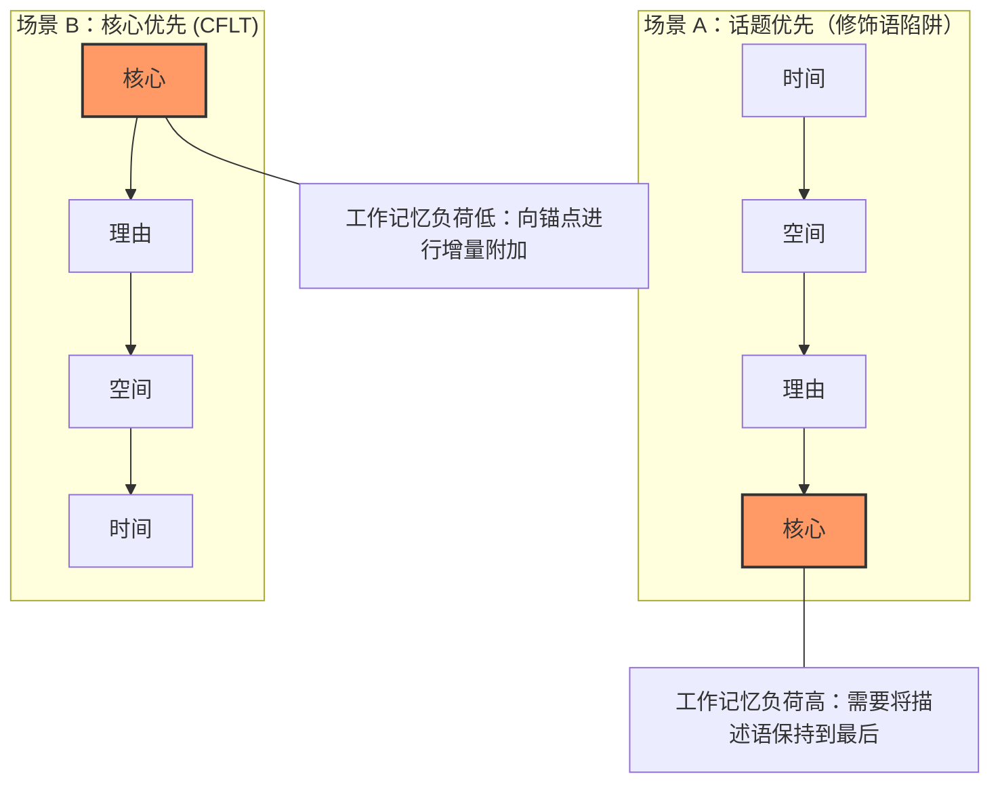
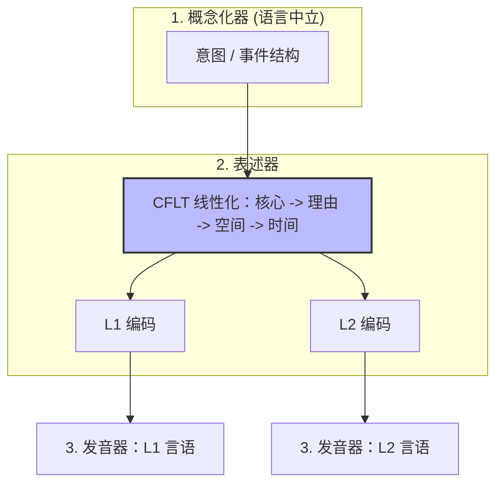

# CFLT 的语言学基础

> **版本：** 1.0.0 (内部草案)
> **作者：** CFLT 核心团队
> **组织：** [CFLT.center](https://cflt.center)
> **许可：** [CC BY 4.0](https://creativecommons.org/licenses/by/4.0/)

---

## 1. 范围：“核心优先”并非“动词优先”

CFLT 为教学法和机器推理定义了一个规范序列——`[核心] → [理由] → [空间] → [时间]`。在任何关于 CFLT 的语言学讨论中，最顶层必须进行的一项澄清是：混淆这两个概念会导致对后续内容的所有预测都出错。

### 1.1 两个容易混淆的不同概念

> **符号说明。** 本文档及整个项目使用类型学标准缩写 **S = Subject（主语）、V = Verb（动词）、O = Object（宾语）**，组合为六种可能的排列：SOV、SVO、VSO、VOS、OVS、OSV。它们表示及物陈述句中这三个成分的*默认表面语序*。例如："I (S) ate (V) rice (O)" —— 英语是 SVO。"我-米饭-吃了" —— 日语是 SOV。"吃了-我-米饭" —— 威尔士语是 VSO。跨语言上，SOV (~45%) 与 SVO (~42%) 占主导；VSO (~9%) 居第三；VOS / OVS / OSV 罕见。（Greenberg 1963；Dryer 2013。）这些缩写描述的是**句法**，不是 CFLT 所规定的认知线性化。

| 概念 | 层面 | 主张内容 | 示例 |
|---------|-------|---------------|---------|
| **动词优先 (VSO)** | 表面语序 | 定式动词位于主语和宾语之前 | "Went I to the store" —— 在英语中罕见；在威尔士语、古典阿拉伯语中是自然形式 |
| **核心优先 (CFLT)** | 概念线性化 | 首先提交显著性锚点 | "I went to the store, yesterday" —— 具有固定概念顺序的、可理解的英语 |

动词优先是一个**句法**类别，根据默认成分顺序对语言进行分类。核心优先是一个**认知语用**原则，用于排序说话者的承诺 (commitments)。两者运作在不同层面，并做出不同的预测。

CFLT 中的“核心”是一个**显著性锚点 (salience anchor)**——即说话者根本上承诺的成分。它可以是一个动词短语（"I went out"）、一个系词补足语（"That girl is my sister"）、一个状态（"I'm exhausted"）或一个言语行为（"Could you help me"）。参见 [`core-concept.md`](./core-concept.md) §1 的权威定义；本节采用该定义，不再赘述。

### 1.2 这对类型学文献意味着什么

语序类型学 (Greenberg 1963; Dryer 2013)——SOV (~45%), SVO (~42%), VSO (~9%)——描述的是*动词*在表面语序中的位置。这些文献与 CFLT **基本无关**。CFLT 并不主张类型学上的普遍性，不建议将 VSO 作为目标形式，也不预测自然语言应该重组其表面句法。CFLT 是叠加在目标语言所使用的任何表面语序之上的规范概念支架；产生的 **CFLT 形式 (CFLT Form)** 是可理解的自然语言（如英语、法语、日语等），而非类型学上的罕见结构。

### 1.3 语言学论据的真实基础

1. 在**概念**层面（前言语信息形成；Levelt 1989），显著的事件/状态/身份/请求在认知上是优先的——这一点得到了很好的支持。
2. 作为一种**教学支架**，将概念核心置于线性首位可以降低 L1→L2 的结构重组成本。
3. 作为一种 **AI 提示词协议**，核心优先与已证实的 Transformer 注意力偏差相契合（参见 `llm.md`）——关键是，它是在保持在 LLM 训练所用的自然语言流形之内实现这一点的。

CFLT 的语言学论据主要源自**认知语言学、信息结构和言语生成理论**——诸如图形 (Figure，Talmy)、轮廓 (profile，Langacker)、话题 (Topic) 和主题 (Theme) 等相关概念——而非源自关于动词位置的类型学概括。

---

## 2. 认知语言学：图形-背景与轮廓

### 2.1 Talmy 语言中的图形-背景
> **权威介绍。** 本节是 CFLT 中关于“图形-背景 (Figure-Ground)”不对称性的权威处理。在 `neuroscience.md` §2（神经关联）、`core-concept.md` §1（推广为“显著性锚点”）和 `manifesto.md` §2.2（顶层框架）中从其他视角进行了折射。

Talmy (2000, *Toward a Cognitive Semantics*) 认为，语言结构系统地反映了**图形**（显著的、前景化的实体或事件）与**背景**（作为提供上下文的背景化参考框架）之间的认知区分。

> “图形是一个移动的或概念上可移动的实体，其路径或位置是关注焦点；背景是一个参考实体，图形的路径或位置是相对于它来表征的。” (Talmy 2000:312)

**CFLT 协议映射：**
- `[核心]` = 图形 (Figure)（发生了什么）
- `[理由] → [空间] → [时间]` = 背景 (Ground)（在什么情况下）

因此，CFLT 将图形-背景的不对称性编纂为一种**图形优先 (Figure-First)** 的线性化。虽然自然语言通过多种语序策略分布图形和背景，但图形的认知首要性是稳固的。Talmy 的**偶然性原则 (Contingency Principle)** 进一步表明，人类会优先考虑依附于框架的事件；在 CFLT 协议中，核心（依附事件）被放在首位，随后是提供框架的背景修饰语。

### 2.2 Langacker 的轮廓-基础区分
在认知语法 (Langacker 1987, 2008) 中，每个语言表达都有一个**轮廓 (profile)**（注意力前景化的实体或关系）以及一个**基础 (base)**（预设的概念内容）。轮廓就是该表达“所关涉的内容”。

**CFLT 映射：** 核心动作就是表示事件的子句的“轮廓”。CFLT 强制要求线性话语以轮廓而非基础开始。

---

## 3. 解析效率：早期直接成分 (EIC)

> **权威介绍。** 本节是 CFLT 中关于 EIC 的权威心理语言学陈述。在 `mathematics.md` §3 (CRD 比率形式化)、`neuroscience.md` §4 (BA 44 / lpSTG 依存长度效应) 和 `pedagogy.md` §4.1 (“修饰语陷阱”作为 EIC 的教学体现) 中有相关折射。

除了概念显著性外，CFLT 还得到了解析效率这一心理语言学要求的支持。John Hawkins (1994, 2004) 提出了**早期直接成分 (Early Immediate Constituents, EIC)** 原则：人类处理器更倾向于那些能在尽可能短的窗口内识别出短语的主要构建块 (ICs) 的语序。

### 3.1 最小化成分识别域 (CRD)
CRD 是识别短语所有 ICs 所需的单词数。效率是 ICs 与 CRD 的比率。

通过将核心放在位置 0，CFLT 确保主句的“锚定”成分被立即识别。这导致核心识别的 **EIC 比率接近 100%**，大幅减轻了工作记忆上的“前瞻”负荷。这对于在管理不完整语法树方面认知资源有限的 L2 学习者来说尤其有益。

### 3.2 增量处理 vs. 修饰语陷阱

CFLT 在话语层面创建了一个**中心语在前 (head-initial)** 的结构。这使得**增量处理**成为可能：大脑可以在细节到达时将其“附加”到已知核心上。相比之下，像中文这样中心语在后（话题优先）的语言通常将复杂的修饰语放在中心语之前，迫使听者在了解被描述对象之前，必须在记忆中保持一串描述词——即“修饰语陷阱”。CFLT 为 L2 学习者消除了这一陷阱。

---

## 4. 信息结构：主题、述题、已知、新知

### 4.1 功能句子观 (布拉格学派)
Mathesius (1929)、Firbas (1992) 和布拉格学派提出了**交际动态性 (Communicative Dynamism, CD)** 的概念：每个子句元素都承载着一定程度的“新颖性”或信息推力。具有最高 CD 的元素在英语中通常落在子句末尾（“末尾焦点”），但**主题性 (thematic)** 元素——即信息*所关涉的内容*——通常开启子句。

**与 CFLT 的冲突：** 功能句子观预测*新的和重要的*信息结束句子（末尾焦点、末尾重心）。CFLT 则将最重要的信息放在首位。

**解决方法：** CFLT 的目的不是为已经共享背景的听者封装信息（此时末尾焦点是优化的）；它的目的是为尚未共享背景的听者**明确地将动作断言为话题**。因此，CFLT 与话题突出语言 (Li & Thompson 1976) 中的话题-说明结构相对齐，在这些语言中，话题（在此即核心动作）锚定了子句。

### 4.2 已知性等级与可及性
Gundel, Hedberg & Zacharski (1993) 以及 Ariel (1990) 描述了说话者如何管理指称可及性：更可及（已知）的指称采用更短、更早提到的形式。CFLT 与可及性理论的交集在于，核心动作一旦前置，就成为了已知的“给定信息”，所有随后的修饰语都根据它来解释。

### 4.3 R-S-T 内部顺序：有理由的约定（不是推导）

CFLT 关于 **核心位于位置 0** 的主张是*多重动机收敛*（multiply-motivated convergence）—— 由七条独立的证据支持（Talmy 图形-背景、Hawkins EIC、显著性网络、Levelt 概念化器、早期前缀条件熵稳定性、Transformer **首因效应** —— 注意力汇点是独立的 softmax 稳定性副产物，参见 `llm.md` §2.3、Grice 关联理论）。参见 `core-concept.md` §1、本文 §2-3、`neuroscience.md` §1、`mathematics.md` §2、`llm.md` §2。（这里的"推导"措辞偏松 —— 七条证据共同支持该主张，但单独并不组成形式证明。）

但场景框架内部三槽的顺序 —— **理由 → 空间 → 时间** —— 是另一回事。它是从 $3! = 6$ 种修饰槽位排列中选定的*约定*（convention）。CFLT 不主张从第一性原理推出这个特定的排列；它只主张**固定某个一致顺序，胜过任由顺序漂移**。

这个约定建立在三条理据论证之上，没有一条是最优性证明：

1. **听者问题优先（Grice 关联理论）。** 听者收到核心（"发生了什么"）后，话语连贯性最强的下一个问题是"为什么" —— 原因让事件变得可解释。"哪里"和"何时"是场景定位器，听者通常可以推迟询问或从语境中推断。理由因此最贴近核心。

2. **具象性阶梯。** 空间信息比时间信息更具象（可视化、可感知），后者更直指、更抽象。工作记忆受益于具象到抽象的递进：先听到"哪里"帮助听者在心理上为事件定位，然后更抽象的"何时"绑定才合上场景。

3. **直指可恢复性。** 在对话语境中，时间常具有可恢复的默认值（"现在"或"所讨论的时间"）—— 把它放在最后，使它在很多语境中可以省略而不损失信息。*诚实范围*：Levinson (1983) 把说话者/时间/地点作为三大直指轴而**未**论证某一轴比另一轴更易恢复；"时间比空间更易恢复"是 CFLT 关于非共在 L2 话语的经验观察，不是直指理论的定理。空间默认值（"这里"）同样存在但在教室或远程协作语境中通常较弱，而后者是最常见的 L2 使用场景。

这些是**工程论证**，不是推导。Core → Reason → Time → Space 的协议也可由竞争性论证支持（如"时间是话语锚点，置于第二"）。CFLT 选择 R-S-T 是因为它的三条理由在目标使用场景中（L2 教学、LLM 提示词稳定性）综合上胜过备选方案，但这一选择仍然是**开放的优化问题**（参见 `mathematics.md` §12.2）。

**操作意义。** CFLT 的强主张（"核心位于位置 0"）完全可推导；CFLT 的弱主张（"R 然后 S 然后 T"）是有理由声明的约定。这一区分对任何提议扩展或替代方案的人都很重要 —— 核心居首不可商榷；R-S-T 在实证评估（参见 `methodology/evaluation-metrics.md`）证明另一排列对某语言对表现更佳时可被修订。

### 4.4 覆盖边界：与 Halliday 情境角色的对照

系统功能语言学（Halliday & Matthiessen 2014）把情境状语分解为九大语义角色。CFLT 的三个场景框架槽位是对这一分类的有意压缩。这一压缩只有在我们列出每个 Halliday 角色映射到 CFLT 何处时才是诚实的：

| Halliday 情境角色 | CFLT 位置 | 备注 |
|---|---|---|
| **Extent**（时段、时频） | 槽位 3 [时间] | 所有时间外延归此 |
| **Location: place** | 槽位 2 [空间] | 物理位置 |
| **Location: time** | 槽位 3 [时间] | 时点 |
| **Manner: quality**（如 *慢慢地*） | **核心内**（事件核） | 与谓词绑定的方式状语 |
| **Manner: means**（如 *通过电话*） | **核心内**（工具） | 视为工具，价位绑定 |
| **Manner: comparison**（如 *像 X 一样*） | **核心内**（方式子类） | 比较状语 |
| **Cause: reason**（原因） | 槽位 1 [理由] | 主映射 |
| **Cause: purpose**（目的） | 槽位 1 [理由] | 由功能词 *为了* 区分的子类 |
| **Cause: behalf**（受益者，如 *为 X*） | **核心内**（受益者） | 价位绑定的参与者 |
| **Contingency: condition**（如 *如果 X*） | 槽位 1 [理由] | 由功能词 *如果* 区分的子类 |
| **Contingency: concession**（如 *尽管 X*） | 槽位 1 [理由] | 由功能词 *虽然* 区分的子类 |
| **Contingency: default**（如 *在缺失 X 的情况下*） | 槽位 1 [理由] | 条件子类 |
| **Accompaniment**（伴随，如 *和约翰*） | **核心内**（伴随） | 谓词的价位扩展 |
| **Role**（如 *作为老师*） | 槽位 2 [空间]（角色作 domain）或 **核心内** | 边缘案例；当它本身就是核心类型时通常归核心内 |
| **Matter**（如 *关于 X*） | 槽位 2 [空间]（论题作 domain） | 抽象 domain 子类 |
| **Angle**（如 *根据 X*） | 槽位 2 [空间]（视角作 domain） | 信息源子类 |

**总结**：Halliday 的 9 大类（含子类）中，**6 类映射到场景框架槽位**（Extent、Location、Cause/Contingency 的四个子类除 behalf 外、Matter、Angle），**4 类属于事件核内部**（三个 Manner 子类与 Accompaniment，以及 Cause:behalf 作为受益者）。

这是一个**有结构的压缩**，不是任意压缩：压缩遵循 `core-concept.md` §2.1–§2.2 定义的两层模型（事件核 vs 场景框架）。事件内部的角色（怎样、用什么、和谁、为谁）压缩到事件核；为事件提供框架的角色（为何、何处、何时、就什么而言）填充场景框架。

**诚实的残余**：Halliday 的 *Role*（如 *作为老师做事*）没有干净的归宿，案例处理（通常分解为身份核心或空间作 domain 解读）。这在 `methodology/slot-disambiguation.md` §8 中作为边界案例承认。

---

## 5. 言语生成：Levelt 模型

Levelt (1989, *Speaking: From Intention to Articulation*) 描述了一个三阶段的生成架构：

1. **概念化器 (Conceptualizer)** —— 生成*前言语信息*（意图 + 事件结构）。
2. **表述器 (Formulator)** —— 将信息编码为语法和音系形式。
3. **发音器 (Articulator)** —— 产生物理言语。

关键在于，概念化器的输出是**语言中立的**。意图事件的语义核心在任何 L1 或 L2 特有的表述之前就已经存在。

**CFLT 的教学主张根植于此：**

> 如果前言语信息是语言中立的，那么训练学习者在进入表述器阶段之前，以固定的“核心优先”顺序**线性化前言语信息**，就能将概念结构从 L1 表面语法中解耦。

一旦信息预先线性化为 `[核心] → [理由] → [空间] → [时间]`，L1 和 L2 的表述就都变成了在同一个线性化支架上的标记替换练习。这就是 CFLT 降低 L1→L2 结构重组成本的认知机制。

---

## 6. 普遍语法：关于“核心”的两种不同含义

一个潜在的混淆：Chomsky 的框架也使用了“核心 (core)”一词。区分这两种含义至关重要。

| | **Chomsky 的“核心语法” (1981, 1986)** | **CFLT 的“核心”** |
|---|---------------------------------------|-------------------|
| 领域 | 语法规则集 | 特定话语中的特定成分 |
| 选取内容 | 一门语言的普遍原则 + 参数化规则 | 显著性锚点——说话者根本上承诺的内容 |
| 地位 | 描述性语言学主张 | 规范性教学/计算协议 |
| 示例 | “主谓一致是核心；奇特的格标记是边缘。” | “在 *I went out, because…* 中，核心是 *went out*。” |

这是对“核心”一词的两种不同的概念运用：
- **Chomsky 的核心**是**规则库的分类器**：哪些规则属于普遍核心？
- **CFLT 的核心**是**单次话语的选择器**：哪个成分是显著性锚点？

CFLT 的贡献与 Chomsky 的核心/边缘区分是正交的。CFLT 不对规则进行分类；它指定了一个线性化协议。Chomsky 的框架与 CFLT **相兼容**（它不禁止该协议的线性化规则），但它也不**预测**它。两者运作在语法理论的不同层面。

术语上的巧合虽令人遗憾，但一旦明确了区别，就是无害的。

---

## 7. 语言相对论 (Sapir-Whorf) 与 L2 习得摩擦

### 7.1 强假设 vs. 弱假设
Whorf 的强假设主张（语言决定思维）基本上已被否定 (Pinker 1994)。其**弱假设版本**（语言影响习惯性的认知模式）则得到了很好的支持 (Lucy 1992; Boroditsky 2001)。

### 7.2 在 CFLT 中的应用
对于在信息封装方式强差异的语言之间转换的学习者（例如，汉语的话题突出 + 时间在前结构 vs. 英语的主语突出 + 时态标记结构），结构重组的认知摩擦是真实且可衡量的 (Slobin 1996, "Thinking for Speaking")。

CFLT 提出了一个**中立缓冲区序列**——即核心优先线性化——它绕过了 L1 和 L2 的表面特异性。一旦学习者习惯于以缓冲区顺序生成前言语信息， L2 表面表述就变成了机械的标记替换。

这与 Slobin 的“为言而思 (Thinking for Speaking)”框架一致，该框架认为语言间的差异不在于深层认知，而在于为言语表达而*组织*认知的特定语言模式。

---

## 8. 构式语法与教学易处理性

Goldberg 的构式语法 (1995, 2006) 将语法视为习得的形式-意义配对（“构式”）的清单，而非抽象规则。这与 CFLT 的教学法高度契合：

- CFLT 将每个 `[核心] → [理由] → [空间] → [时间]` 插槽视为一个**构式模板**。
- 学习者通过填充插槽来习得流利度，而不是从抽象的短语结构规则中推导句子。
- 行业特定的标记包（医疗、IT、金融）插入同样的构式插槽。

这使得 CFLT 与现代的、基于使用的认知语言学和构式语法主流相兼容。

---

## 9. 自然语义金属语言 (Wierzbicka)

NSM 项目 (Wierzbicka 1996; Goddard & Wierzbicka 2002) 确定了一个由约 65 个**语义原语 (semantic primes)** 组成的小型清单——这些概念被假设在所有人类语言中都有词汇体现（例如：我、你、做、好、因为、在……之前）。NSM 使用这些原语作为跨语言语义描述的金属语言。

**CFLT 应用：** 四元素排序协议与 NSM 原语密切对应：
- `[核心]` ↔ DO (做), HAPPEN (发生), FEEL (感觉)
- `[理由]` ↔ BECAUSE (因为)
- `[空间]` ↔ WHERE (哪里), IN (在……里面), AT (在)
- `[时间]` ↔ WHEN (什么时候), BEFORE (在……之前), AFTER (在……之后)

因此，NSM 为 CFLT 提供了一个**独立于语言的插槽填充词汇库**。在任何两种语言之间转换的学习者都可以使用经过 NSM 分解的思想作为桥梁。

---

## 10. 诚实的局限性

严谨的基础必须列出 CFLT *不*主张的内容，以及其语言学论据较弱的地方：

1. **CFLT 不是语序的描述性普遍规律。** 表面语序类型学根据*动词*的位置对语言进行分类；CFLT 不涉及动词位置。CFLT 运作在更高一级：由显著性定义的核心，它可能与动词重合，也可能不重合。
2. **末尾焦点的张力。** 在信息封装方面，英语天然地将新的/重的信息放在末尾；CFLT 为了教学清晰性而反转了这一点，接受了早期生成中地道感的一些丧失。
3. **话题-说明 vs. 主语-谓语。** CFLT 与话题突出语言 (Li & Thompson 1976) 的结合比与严格主语突出语言的结合更自然。从汉语转向英语的学习者会发现 CFLT 在源语侧很直观，但在目标语侧会显得有些生硬，直到经过“语法叠加层”的修饰。
4. **地道性。** 地道的 L2 生成需要*超越*协议的僵化插槽。CFLT 是一个入门支架，而不是终极语法。

---

## 11. 开放性研究问题

1. **实证验证。** 经过 CFLT 训练的生成是否能显著降低 L1→L2 结构重组的延迟？（适用于结合眼动追踪和发音起始测量的组间实验。）
2. **类型学推广。** 当 L1 和 L2 都是强中心语在后（例如日语↔韩语）时，CFLT 表现如何——协议仍然有帮助吗，还是认知开销已经微乎其微了？
3. **关键期。** 鉴于成年人更依赖显式的概念支架，CFLT 对成年学习者的益处是否远大于儿童？
4. **地道性天花板。** 在什么水平上，严格遵守协议会成为通往母语般流利度的障碍，以及“语法叠加层”应如何升级以放宽限制？

---

## 12. 参考文献

完整的参考文献请参见 [`bibliography.md`](../bibliography.md)。

---

## 另请参阅

- [`core-concept.md`](./core-concept.md) — 核心作为显著性锚点的权威澄清；如果对范围有疑问，请先阅读。
- [`phonetics.md`](./phonetics.md) — 语音迁移与发音桥梁，句法线性化的表面形式补充。
- [`sociolinguistics.md`](./sociolinguistics.md) — 语体和礼貌如何包裹核心而不干扰其位置。
- [`pedagogy.md`](./pedagogy.md) §7 — Levelt 的言语生成模型，此处 §5 的教学法衔接。
- [`mathematics.md`](./mathematics.md) §3 — 以 CRD 比率重新推导 EIC。
- [`neuroscience.md`](./neuroscience.md) §4 — EIC 的神经关联（BA 44, lpSTG 依存长度效应）。
