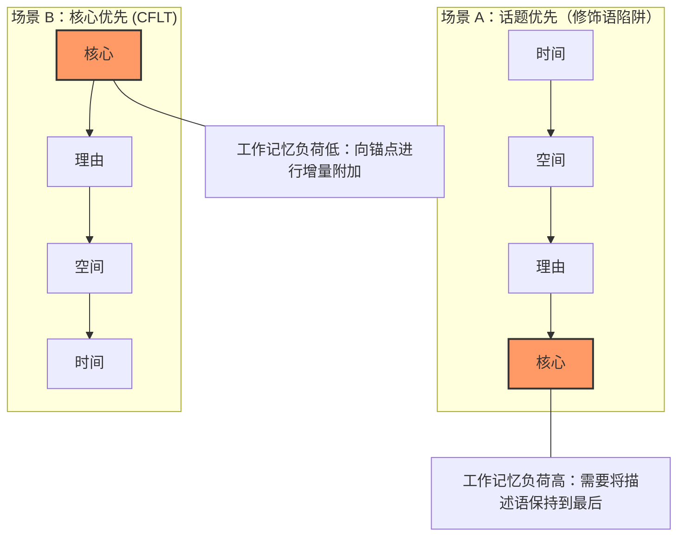
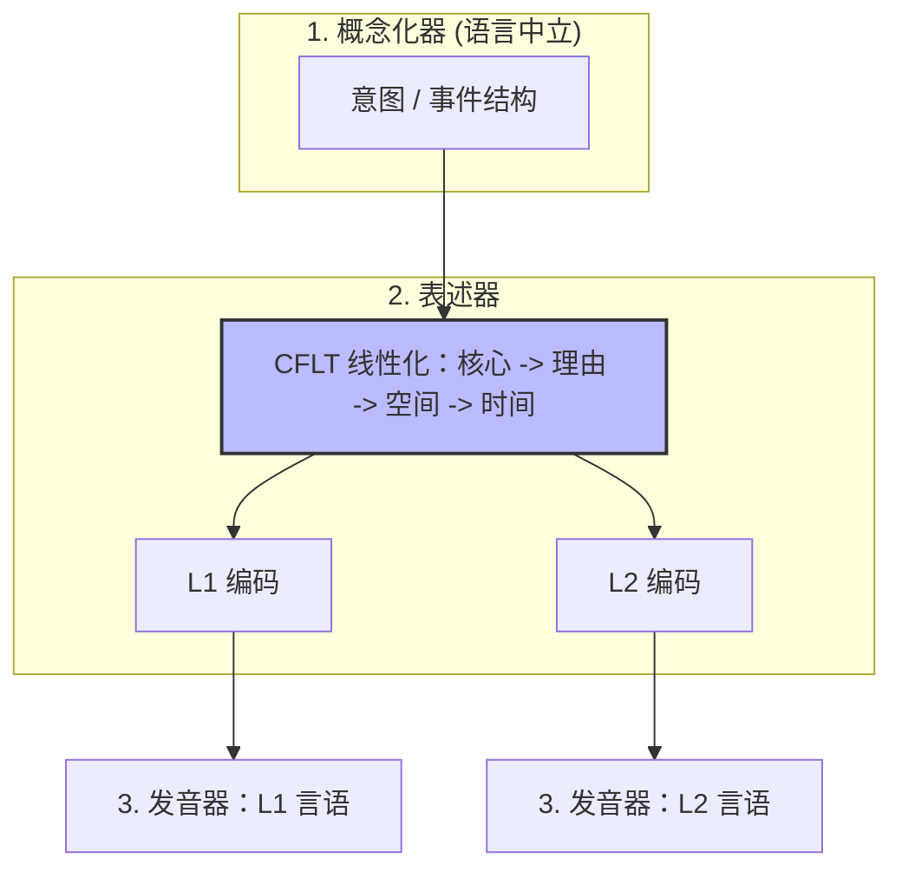

# CFLT 的语言学基础

> **版本：** 1.0.0 (内部草案)
> **作者：** CFLT 核心团队
> **组织：** [CFLT.center](https://cflt.center)
> **许可：** [CC BY 4.0](https://creativecommons.org/licenses/by/4.0/)

---

## 1. 范围：“核心优先”并非“动词优先”

CFLT 为教学法和机器推理定义了一个规范序列——`[核心] → [理由] → [空间] → [时间]`。在任何关于 CFLT 的语言学讨论中，最顶层必须进行的一项澄清是：混淆这两个概念会导致对后续内容的所有预测都出错。

### 1.1 两个容易混淆的不同概念

> **符号说明。** 本文档及整个项目使用类型学标准缩写 **S = Subject（主语）、V = Verb（动词）、O = Object（宾语）**，组合为六种可能的排列：SOV、SVO、VSO、VOS、OVS、OSV。它们表示及物陈述句中这三个成分的*默认表面语序*。例如："I (S) ate (V) rice (O)" —— 英语是 SVO。"我-米饭-吃了" —— 日语是 SOV。"吃了-我-米饭" —— 威尔士语是 VSO。跨语言上，SOV (~45%) 与 SVO (~42%) 占主导；VSO (~9%) 居第三；VOS / OVS / OSV 罕见。（Greenberg 1963；Dryer 2013。）这些缩写描述的是**句法**，不是 CFLT 所规定的认知线性化。

| 概念 | 层面 | 主张内容 | 示例 |
|---------|-------|---------------|---------|
| **动词优先 (VSO)** | 表面语序 | 定式动词位于主语和宾语之前 | "Went I to the store" —— 在英语中罕见；在威尔士语、古典阿拉伯语中是自然形式 |
| **核心优先 (CFLT)** | 概念线性化 | 首先提交显著性锚点 | "I went to the store, yesterday" —— 具有固定概念顺序的、可理解的英语 |

动词优先是一个**句法**类别，根据默认成分顺序对语言进行分类。核心优先是一个**认知语用**原则，用于排序说话者的承诺 (commitments)。两者运作在不同层面，并做出不同的预测。

CFLT 中的“核心”是一个**显著性锚点 (salience anchor)**——即说话者根本上承诺的成分。它可以是一个动词短语（"I went out"）、一个系词补足语（"That girl is my sister"）、一个状态（"I'm exhausted"）或一个言语行为（"Could you help me"）。参见 [`core-concept.md`](./core-concept.md) §1 的权威定义；本节采用该定义，不再赘述。

### 1.2 这对类型学文献意味着什么

语序类型学 (Greenberg 1963; Dryer 2013)——SOV (~45%), SVO (~42%), VSO (~9%)——描述的是*动词*在表面语序中的位置。这些文献与 CFLT **基本无关**。CFLT 并不主张类型学上的普遍性，不建议将 VSO 作为目标形式，也不预测自然语言应该重组其表面句法。CFLT 是叠加在目标语言所使用的任何表面语序之上的规范概念支架；产生的 **CFLT 形式 (CFLT Form)** 是可理解的自然语言（如英语、法语、日语等），而非类型学上的罕见结构。

### 1.3 语言学论据的真实基础

1. 在**概念**层面，Levelt (1989) 确立了言语生成将前言语信息阶段与语法/音系表述区分开来。CFLT *假设*显著的事件/状态/身份/请求是该前言语信息的自然锚点；Levelt 并未确立这一锚点在认知上优先或必须最先说出，因此这是一个受该架构启发、而非由其推导出的 CFLT 提案。
2. 作为一种**教学支架**，CFLT 预测将概念核心置于线性首位可以降低 L1→L2 的结构重组成本（一个待检验的经验主张，而非已确立的结果）。
3. 作为一种 **AI 提示词协议**，核心优先与已记录的 Transformer 位置/顺序敏感性相兼容（参见 `llm.md`）——关键是，它是在保持在 LLM 训练所用的自然语言流形之内实现这一点的。

CFLT 的语言学论据主要源自**认知语言学、信息结构和言语生成理论**——诸如图形 (Figure，Talmy)、轮廓 (profile，Langacker)、话题 (Topic) 和主题 (Theme) 等相关概念——而非源自关于动词位置的类型学概括。

---

## 2. 认知语言学：图形-背景与轮廓

### 2.1 Talmy 语言中的图形-背景
> **权威介绍。** 本节是 CFLT 中关于“图形-背景 (Figure-Ground)”不对称性的权威处理。在 `neuroscience.md` §2（神经关联）、`core-concept.md` §1（推广为“显著性锚点”）和 `manifesto.md` §2.2（顶层框架）中从其他视角进行了折射。

Talmy (2000, *Toward a Cognitive Semantics*) 认为，语言结构系统地反映了**图形**（显著的、前景化的实体或事件）与**背景**（作为提供上下文的背景化参考框架）之间的认知区分。

> “图形是一个移动的或概念上可移动的实体，其路径或位置是关注焦点；背景是一个参考实体，图形的路径或位置是相对于它来表征的。” (Talmy 2000:312)

**CFLT 类比（并非 Talmy 的结论）：**
- `[核心]` ↔ 图形 (Figure)（发生了什么）
- `[理由] → [空间] → [时间]` ↔ 背景 (Ground)（在什么情况下）

Talmy 确立的是图形与背景之间的*关系性*不对称——二者具有不同的概念和注意属性——而**不是**一种普遍的*线性顺序*偏好。因此，图形-背景是 CFLT 用于不对称锚定的最贴近的认知语义类比，而非对表面顺序的来源级支持。在该类比基础上，CFLT *提出*一种**图形优先 (Figure-First)** 的线性化：不对称性是 Talmy 的，而将图形置于位置 0 的决定是 CFLT 自己的外推。自然语言通过多种语序策略分布图形和背景，因此图形优先无法从类型学中直接读出。Talmy 的**偶然性原则 (Contingency Principle)** 在此作为动机而非推导被援引：它并未确立人类在线性上会先于框架说出依附事件，但它使 CFLT 的核心优先放置成为一个值得检验的连贯设计选择。

### 2.2 Langacker 的轮廓-基础区分
在认知语法 (Langacker 1987, 2008) 中，每个语言表达都有一个**轮廓 (profile)**（注意力前景化的实体或关系）以及一个**基础 (base)**（预设的概念内容）。非正式地说，轮廓就是该表达“所关涉的内容”。

**CFLT 映射（类比，而非 Langacker 的结论）：** CFLT 将核心动作视为*类似于*表示事件的子句的“轮廓”，并提出线性话语以该前景化元素开始。轮廓/基础是一种识解不对称，不是关于成分顺序的主张；将其映射到单一话语级核心、以及位置 0 规则，都是 CFLT 自己的假设，受 Langacker 的前景化词汇启发，而非由其推导。

---

## 3. 解析效率：早期直接成分 (EIC)

> **权威介绍。** 本节是 CFLT 中关于 EIC 的权威心理语言学陈述。在 `mathematics.md` §3 (CRD 比率形式化)、`neuroscience.md` §4 (BA 44 / lpSTG 依存长度效应) 和 `pedagogy.md` §4.1 (“修饰语陷阱”作为 EIC 的教学体现) 中有相关折射。

除了概念显著性外，CFLT 还*受*解析效率这一心理语言学要求*启发*——而非由其推导。John Hawkins (1994, 2004) 提出了**早期直接成分 (Early Immediate Constituents, EIC)** 原则：人类处理器更倾向于那些能在尽可能短的窗口内识别出短语的主要构建块 (ICs) 的语序。EIC 是一个句内、由句法定义的度量；把它移到话语级槽序是一个需要自身操作定义与验证的 CFLT 特有类比（参见 §3.1）。

### 3.1 最小化成分识别域 (CRD)
CRD 是识别短语所有 ICs 所需的单词数。效率是 ICs 与 CRD 的比率。

通过将核心放在位置 0，CFLT 确保主句的“锚定”成分被较早识别。这在核心识别窗口给出**较高的 IC-to-word 比率**（不写“≈100%”的具体数字：Hawkins 的 EIC 是句内词数度量，把它移到话语级槽序是类比、非可计算结果），减轻工作记忆上的“前瞻”负荷。这对于在管理不完整语法树方面认知资源有限的 L2 学习者来说尤其有益。

### 3.2 增量处理 vs. 修饰语陷阱

CFLT 在话语层面施加了一个**中心语在前 (head-initial)** 的结构。CFLT 预测这使得**增量处理**成为可能：大脑可以在细节到达时将其“附加”到已知核心上。相比之下，当复杂修饰语被放在**中心语之前**时——如中文的前置定语从句与修饰语串（中文是话题优先、整体上 SVO / 中心语在前的语言，**并非**中心语在后），或日语这类**真正**中心语在后的结构——听者在了解被描述对象之前，必须在记忆中保持一串描述词，即“修饰语陷阱”。（该陷阱指的是名词短语内部的**前置修饰**，并非整个语言的中心语在后。）CFLT 的设计意在为 L2 学习者避免这一陷阱；它是否能可衡量地做到这一点是一个开放的经验问题，因为 EIC 主要是一种解析/语序理论，其向生成的迁移需要直接证据。

---

## 4. 信息结构：主题、述题、已知、新知

### 4.1 功能句子观 (布拉格学派)
Mathesius (1929)、Firbas (1992) 和布拉格学派提出了**交际动态性 (Communicative Dynamism, CD)** 的概念：每个子句元素都承载着一定程度的“新颖性”或信息推力。具有最高 CD 的元素在英语中通常落在子句末尾（“末尾焦点”），但**主题性 (thematic)** 元素——即信息的*出发点*（Halliday 意义上的；并非简单的“关涉性”，也不应等同于显著事件或 CFLT 核心）——通常开启子句。

**与 CFLT 的张力：** 功能句子观预测*新*信息倾向于落在英语子句末尾（末尾焦点、末尾重心）。CFLT 则将核心放在首位。请注意“新”“主题”“核心”并不可互换：FSP 的高 CD 元素未必是 CFLT 的显著性锚点，所以这是一个真实的张力，而非 CFLT 可以简单化解的不匹配。

**CFLT 提出的解决方案（一种项目内部立场，而非 FSP 的结论）：** CFLT 不是为已经共享背景的听者优化信息封装（此时末尾焦点是优化的）；它为尚未共享背景的听者将核心前景化。这是一个其收益必须被衡量的 CFLT 设计选择，而非 FSP 所许可的预测。CFLT 的核心前置立场*类似于*话题突出语言 (Li & Thompson 1976) 中的话题-说明结构，但有一个重要的限定：在 Li & Thompson 的类型学中，话题是一个被说明所*关涉*的话语实体/框架，而非被断言的动作。因此 CFLT 的核心不同于 Li-Thompson 的话题；这种对齐是一种宽松的类比，而非将核心与话题等同。

### 4.2 已知性等级与可及性
Gundel, Hedberg & Zacharski (1993) 以及 Ariel (1990) 描述了说话者如何管理指称可及性：更可及（已知）的指称以更短、更弱化的指称*形式*（代词、零回指）实现。这一文献关注的是话语实体的指称*形式*，而非"更可及的材料必然在子句中出现得更早"的一般规则。因此 CFLT **不**主张前置核心会使其"已知"：话语中的位置并不能追溯性地满足已知性，而一个新颖的事件谓词也不是一个可及的指称对象。CFLT 较弱、准确的主张是：核心一经陈述，*随后的*修饰语便根据它作为已确立的话语语境来解释——这是一个 CFLT 处理假设，可及性理论至多在语序中提供诸多因素之一。

### 4.3 R-S-T 内部顺序：有理由的约定（不是推导）

CFLT 关于 **核心位于位置 0** 的主张是*多重动机收敛*（multiply-motivated convergence）：七条相邻的脉络共同*促成*它，但没有任何一条单独确立它（Talmy 图形-背景、Hawkins EIC、显著性网络、Levelt 概念化器、早期前缀条件熵稳定性、Transformer **首因效应** —— 注意力汇点是独立的 softmax 稳定性副产物，参见 `llm.md` §2.3 —— 以及 Grice 关联理论）。参见 `core-concept.md` §1、本文 §2-3、`neuroscience.md` §1、`mathematics.md` §2、`llm.md` §2。每条脉络都是一个类比或兼容性论证，而非对话语级核心优先的直接证据；它们无论单独还是合在一起，都不构成形式证明。因此，核心优先最好被理解为一个**多重动机促成的、待检验的 CFLT 假设**，而非这些文献推导出的定理。

但场景框架内部三槽的顺序 —— **理由 → 空间 → 时间** —— 是另一回事。它是从 $3! = 6$ 种修饰槽位排列中选定的*约定*（convention）。CFLT 不主张从第一性原理推出这个特定的排列；它只主张**固定某个一致顺序，胜过任由顺序漂移**。

这个约定建立在三条理据论证之上，没有一条是最优性证明：

1. **听者问题优先（一个 CFLT 假设，与 Grice 关联理论相兼容）。** CFLT 假设：听者收到核心（"发生了什么"）后，话语连贯性最强的下一个问题是"为什么" —— 原因让事件变得可解释 —— 而"哪里"和"何时"是场景定位器，听者通常可以推迟询问或从语境中推断。理由因此被置于最贴近核心处。这一排序**并非由 Grice 或关联理论推导而来**：这些框架使一个可预测、低成本的协议*兼容于*合作交际（"要有条理"；最小化处理努力），但二者都未确立"为什么"是事件之后听者的第一个问题，也未将理由总体上排在空间或时间之前。哪种顺序最相关取决于语境，必须被衡量；CFLT 以假设而非 Grice 推论的形式提供这一排序。

2. **具象性阶梯。** 空间信息比时间信息更具象（可视化、可感知），后者更直指、更抽象。工作记忆受益于具象到抽象的递进：先听到"哪里"帮助听者在心理上为事件定位，然后更抽象的"何时"绑定才合上场景。

3. **直指可恢复性。** 在对话语境中，时间常具有可恢复的默认值（"现在"或"所讨论的时间"）—— 把它放在最后，使它在很多语境中可以省略而不损失信息。*诚实范围*：Levinson (1983) 把说话者/时间/地点作为三大直指轴而**未**论证某一轴比另一轴更易恢复；"时间比空间更易恢复"是 CFLT 关于非共在 L2 话语的经验观察，不是直指理论的定理。空间默认值（"这里"）同样存在但在教室或远程协作语境中通常较弱，而后者是最常见的 L2 使用场景。

这些是**工程论证**，不是推导。Core → Reason → Time → Space 的协议也可由竞争性论证支持。CFLT 自行生成这样一个竞争条件 —— 称之为 **R-T-S** —— 并将其与 R-S-T 对比检验。认真对待 R-T-S 的动机来自话语分析文献中的 **"时间锚点优先"** 脉络：Reinhart (1984，《叙事文本时间组织中的格式塔感知原则》) 运用知觉组织原则，分析时间结构如何促成*叙事*文本的连贯性。*归因限定*：Reinhart 并未直接将"何时"与"为何"对比，也未规定一种时间优先的产出顺序，"读者按*何时*而非*为何*组织"这一表述以及 R-T-S 槽序都是 **CFLT 的外推**，而非 Reinhart 中可见的主张。我们把 Reinhart 用作检验叙事时间排序的动机，而非一个已确立的竞争顺序。

我们不把这当作搁置的问题，而是当作一个**体裁条件性的承认**：叙事话语很可能前景化时间结构，而 CFLT 的 L2 会话/说明文默认值不应被读作关于叙事产出的主张。三条实质回应，合在一起看：

- **体裁范围。** Reinhart 所处的叙事分析传统（自 Labov 1972 起）研究的是时间承续对话语组织至关重要的文本。CFLT 的主要使用场景（会话请求、说明性解释、能动 LLM 指令）并非叙事；在其中，时间不被体裁惯例预先锚定，而 CFLT 假设的听者问题优先（理据 (i)）将理由置于最贴近核心处。因此分歧收窄为一个应用域问题，而非矛盾。
- **非叙事话语中的工作记忆成本。** 在像 *"I went out, because it rained, at home, yesterday"* 这样的非叙事话语中，前置时间（*"yesterday, I went out, because it rained..."*）逆转了核心锚点上 Hawkins-EIC 效率的方向，并要求听者在其见效之前，把时间框架保持到核心+理由的整个时长。这是 Reinhart 的叙事论证无需支付的工作记忆成本，因为叙事听者已处于时间追踪模式，而非叙事听者则不然。
- **经验证伪条件。** 若 R-T-S 在*非叙事* L2 产出上跨 ≥ 2 种语言（控制词汇与水平）可靠地优于 R-S-T，CFLT 应采用 R-T-S 作为无标记默认值，时间锚点优先动机即获胜。若 R-T-S 仅在叙事产出上优于 R-S-T，恰当回应是一个**体裁条件性协议**：说明文/会话/教学语体用 R-S-T，叙事用 R-T-S。`methodology/empirical-agenda.md` §3.1 与 `evaluation-metrics.md` §4.2 规定了对比协议。

CFLT 选择 R-S-T（而非 R-T-S、T-R-S 或这三者的任何其他排列），是因为在项目的两个目标使用场景（L2 会话/说明文教学、LLM 提示词稳定性）中，上述听者问题优先与具象性阶梯理据在 §2.5 所考察的类型学范围内综合上胜过叙事-时间锚定；体裁条件性问题仍是一个**开放的优化问题**（参见 `mathematics.md` §12.2 与 `methodology/evaluation-metrics.md` 中可裁决它的实证协议）。

**操作意义。** CFLT 的较强主张（"核心位于位置 0"）是项目作为固定设计默认值（经验上开放）所承诺的一个多重动机假设；CFLT 的弱主张（"R 然后 S 然后 T"）是有理由声明的约定。这一区分对任何提议扩展或替代方案的人都很重要 —— 核心居首是待检验的固定设计默认值；R-S-T 在实证评估（参见 `methodology/evaluation-metrics.md`）证明另一排列对某语言对表现更佳时可被修订。

### 4.4 覆盖边界：与 Halliday 情境角色的对照

系统功能语言学（Halliday & Matthiessen 2014）把情境状语分解为九大语义角色。CFLT 的三个场景框架槽位是对这一分类的一种有意的、刻意有损的 **CFLT 重编码** —— 是为一个生成支架所做的再设计，而非 Halliday 框架本身提供的统一。该分类在此的价值在于检验 CFLT 的覆盖范围并记录 CFLT 舍弃了什么；它不是该压缩的正面证据。这一重编码只有在我们列出每个 Halliday 角色映射到 CFLT 何处时才是诚实的：

| Halliday 情境角色 | CFLT 位置 | 备注 |
|---|---|---|
| **Extent**（时段、时频） | 槽位 3 [时间] | 所有时间外延归此 |
| **Location: place** | 槽位 2 [空间] | 物理位置 |
| **Location: time** | 槽位 3 [时间] | 时点 |
| **Manner: quality**（如 *慢慢地*） | **核心内**（事件核） | 与谓词绑定的方式状语 |
| **Manner: means**（如 *通过电话*） | **核心内**（工具） | 视为工具，价位绑定 |
| **Manner: comparison**（如 *像 X 一样*） | **核心内**（方式子类） | 比较状语 |
| **Cause: reason**（原因） | 槽位 1 [理由] | 主映射 |
| **Cause: purpose**（目的） | 槽位 1 [理由] | 由功能词 *为了* 区分的子类 |
| **Cause: behalf**（受益者，如 *为 X*） | **核心内**（受益者） | 价位绑定的参与者 |
| **Contingency: condition**（如 *如果 X*） | 槽位 1 [理由] | 由功能词 *如果* 区分的子类 |
| **Contingency: concession**（如 *尽管 X*） | 槽位 1 [理由] | 由功能词 *虽然* 区分的子类 |
| **Contingency: default**（如 *在缺失 X 的情况下*） | 槽位 1 [理由] | 条件子类 |
| **Accompaniment**（伴随，如 *和约翰*） | **核心内**（伴随） | 谓词的价位扩展 |
| **Role**（如 *作为老师*） | 槽位 2 [空间]（角色作 domain）或 **核心内** | 边缘案例；当它本身就是核心类型时通常归核心内 |
| **Matter**（如 *关于 X*） | 槽位 2 [空间]（论题作 domain） | 抽象 domain 子类 |
| **Angle**（如 *根据 X*） | 槽位 2 [空间]（视角作 domain） | 信息源子类 |

**总结**：Halliday 的 9 大类（含子类）中，**6 类映射到场景框架槽位**（Extent、Location、Cause/Contingency 的四个子类除 behalf 外、Matter、Angle），**4 类属于事件核内部**（三个 Manner 子类与 Accompaniment，以及 Cause:behalf 作为受益者）。

这是一个**有结构的压缩**，不是任意压缩：压缩遵循 `core-concept.md` §2.1–§2.2 定义的两层模型（事件核 vs 场景框架）。事件内部的角色（怎样、用什么、和谁、为谁）压缩到事件核；为事件提供框架的角色（为何、何处、何时、就什么而言）填充场景框架。

**诚实的残余**：Halliday 的 *Role*（如 *作为老师做事*）没有干净的归宿，案例处理（通常分解为身份核心或空间作 domain 解读）。这在 `methodology/slot-disambiguation.md` §8 中作为边界案例承认。

#### 4.4.1 Matter 与 Angle：为什么“空间作 domain”是可争议的

熟悉 SFL 的读者会反对：Halliday 把 **Matter**（*关于 X*）与 **Angle**（*根据 X*）与 **Location: place** 分开归类，*正是因为*抽象/具体之分在理论上是有负载的——把它们合并进“空间（抽象 domain）”有可能丢失 Halliday 分类本要保留的那个区分。我们承认这一反对，并以三点回应：

1. **Halliday 的归类意图。** Halliday & Matthiessen (2014) 把三者（Location:place、Matter、Angle）都归在更宽的 **Location-Manner-Cause 情境**范畴下，因为它们都回答“这件事在什么语境 / domain 下成立？”这一形式的问题。Matter 回答*“在什么语义 domain 下？”*（如*谈论**关于贝叶斯推断***）；Angle 回答*“从谁的视角？”*（如*据 IPCC 称为真*）；place 回答*“在什么物理区域？”*。CFLT 的“空间”槽位是回答*“事件在什么 domain（物理、语义、视角）下成立？”*的*功能*槽位——CFLT 把它视为*功能*层面的统一，而非 SFL *经验*层面的统一。这是一个 CFLT 自定义的判据，而非 Halliday 的：按 CFLT 自己的功能检验，该压缩在经验层是有损的，而（按此检验）在功能层是忠实的。功能层判据是否真的保留信息，是 CFLT 必须通过评估来确立的，而非可以断言的。

2. **该压缩的操作性检验。** 一个修饰语若回答听者的*“这件事在什么 domain 下成立？”*问题，则属于 CFLT 槽位 2（空间）；否则属于第一层（事件核）或槽位 1（理由）。按此检验，Matter（*关于 X*）与 Angle（*根据 X*）通过——它们限定事件之真值或相关性被断言的 *domain*。Place（*在 X*）也通过。把它们当作单一 CFLT 槽位是一种有意的功能层抽象，而非主张 Halliday 的经验区分是虚幻的。

3. **压缩在何处失效。** Matter/Angle 与核心发生语用互动的情形（如*“据说话者称，p”*是一个有保留的断言构式，而非 *p* 的 domain-限定状语）属于**事件核内部**，作为言外修饰语，而非槽位 2。slot-disambiguation 参考文档处理这些边界案例。

简言之：CFLT *主张*其三槽压缩对无标记默认而言是**功能层无损的**（一个仍待验证的 CFLT 内部保留判据，而非 SFL 结论），而以 SFL 实践者会正当注意到的方式是**经验层有损的**。我们采用功能层压缩，因为该协议是篇章层的生成支架，而非 SFL 的替代品。SFL 完整的九角色分类仍是细粒度篇章分析的恰当工具。

---

## 5. 言语生成：Levelt 模型

Levelt (1989, *Speaking: From Intention to Articulation*) 描述了一个三阶段的生成架构：

1. **概念化器 (Conceptualizer)** —— 生成*前言语信息*（意图 + 事件结构）。
2. **表述器 (Formulator)** —— 将信息编码为语法和音系形式。
3. **发音器 (Articulator)** —— 产生物理言语。

关键在于，概念化器的输出是**语言中立的**。意图事件的语义核心在任何 L1 或 L2 特有的表述之前就已经存在。

Levelt 的架构为*定位* CFLT 拟议的干预提供了位置；它并不确立该干预有效。概念化器输出语言中立这一较强读法本身需要限定（参见 Slobin 1996，§7.2），而在生成符合语法、音系的言语时表述器无法被绕过。

**CFLT 的教学假设，定位于此：**

> 如果前言语信息（在很大程度上）是语言中立的，那么训练学习者在进入表述器阶段之前，以固定的“核心优先”顺序**线性化前言语信息**，*可能*将概念结构从 L1 表面语法中解耦，并减少某些表述器规划需求。

CFLT 假设：一旦信息预先线性化为 `[核心] → [理由] → [空间] → [时间]`，L1 和 L2 的表述就都更接近于在同一个线性化支架上的标记替换练习。这是 CFLT *拟议的*降低 L1→L2 结构重组成本的机制 —— 一个需对照规划与表述延迟指标加以检验的预测，而非 Levelt 模型的推论。

---

## 6. 普遍语法：关于“核心”的两种不同含义

一个潜在的混淆：Chomsky 的框架也使用了“核心 (core)”一词。区分这两种含义至关重要。

| | **Chomsky 的“核心语法” (1981, 1986)** | **CFLT 的“核心”** |
|---|---------------------------------------|-------------------|
| 领域 | 语法规则集 | 特定话语中的特定成分 |
| 选取内容 | 一门语言的普遍原则 + 参数化规则 | 显著性锚点——说话者根本上承诺的内容 |
| 地位 | 描述性语言学主张 | 规范性教学/计算协议 |
| 示例 | “主谓一致是核心；奇特的格标记是边缘。” | “在 *I went out, because…* 中，核心是 *went out*。” |

这是对“核心”一词的两种不同的概念运用：
- **Chomsky 的核心**是**规则库的分类器**：哪些规则属于普遍核心？
- **CFLT 的核心**是**单次话语的选择器**：哪个成分是显著性锚点？

CFLT 的贡献与 Chomsky 的核心/边缘区分是正交的。CFLT 不对规则进行分类；它指定了一个线性化协议。Chomsky 的框架与 CFLT **相兼容**（它不禁止该协议的线性化规则），但它也不**预测**它。两者运作在语法理论的不同层面。

术语上的巧合虽令人遗憾，但一旦明确了区别，就是无害的。

### 6.1 CFLT 不依赖普遍语法

CFLT 早期的表述（如 `manifesto.md` §2.1 的旧稿）读起来仿佛 CFLT *扩展*了 Chomsky 的 UG。那种表述是修辞性的，而非承重的。真正承重的主张要弱得多：*信息形成*（Levelt 1989 的概念化器阶段，见上文 §5）在人类语言使用者之间广泛共享，而在*协议层*的固定核心优先线性化降低 L1→L2 重构成本。这两个子主张都不需要一个天生的、语言特定的 UG。

具体而言：

- 说话者显著性锚点（“核心”）的**概念优先性**，可以从构式语法（Goldberg 1995, 2006）获得动机——其中 [显著性锚点 + 框架] 的安排*可以*被视为一种习得的篇章构式（这是 CFLT 的提议；它在说话者身上的存在与可习得性是一个待检验的假设，而非 Goldberg 的结论）——或从认知语法（Langacker 1987, 2008）类比而来，其中轮廓-基础关系是一种识解不对称。这两种做法都不需要语言特定的天生装置，但也都不*预测*核心优先；它们提供前景化的词汇，而非推导。
- 否定 / 情态 / 体态在事件核内部取域的**跨语言规律性**（`core-concept.md` §2.2）与制图式 UG 分析（Cinque 1999）相容，但也与**类型学-功能观**（Croft 2001 *激进构式语法*）相容——后者认为这种规律性根植于算子取域的认知偏好，而非根植于一个普遍的功能层级。

因此，我们把 UG-扩展的表述视为**若干可用动机之一**，而非一种依赖。第 5 节（Levelt）与第 8 节（构式语法）陈述承重的论据。

### 6.2 与反 UG 阵营的交锋

强 UG 解读——人类拥有一个天生的、语言特定的语言习得装置——受到一个发展成熟的“基于使用 / 涌现论”传统的质疑；鉴于 CFLT 主张*在所调查范围内*的跨语言规律性，CFLT 文档必须与之交锋。

> **两个须分开的主张。**（i）*CFLT 不需要强 UG*——这是直接可辩护的，下文的涌现论传统与之完全相容。（ii）*一个固定的跨语言 CFLT 协议自动与反普遍主义相容*——这**并不**成立。不依赖天生 UG 并不能消解多样性挑战：一个加在句法之上的协议仍然必须跨类型学多样的语言迁移，并在其中感觉自然。因此我们把这种规律性框定为**所调查类型范围内的项目标准默认**，而非语言普遍项，并把多样性文献视为对协议迁移与自然性的直接经验挑战，而非自动背书。

- **Tomasello (2003) *Constructing a Language*** 主张语法是通过一般认知机制（意图识读、模式发现、类比）在使用数据上习得的——而非来自天生 UG。如果 Tomasello 正确，CFLT 的协议层规律性必须被重新奠基为共享信息形成压力的*涌现*结果，而非底层 UG 核心语法的体现。我们接受这一重新奠基：CFLT 不依赖天生性前提（§6.1），并且线性化纪律的收益在基于使用的解释下与在 UG 解释下一样归于*学习者*。
- **Christiansen & Chater (2008)《Language as Shaped by the Brain》(*BBS*)** 主张语言表面上的普遍项是由语言被*学习*与*传递*所受的认知约束解释的，而非由一个天生的语法模块。这同样与 CFLT 相容：核心优先协议可以被读作一种利于学习与传递的线性化（低 CRD、早期显著性承诺），而非 UG 编码的普遍项。
- **Evans & Levinson (2009)《The Myth of Language Universals》(*BBS*)** 主张所谓的普遍项通常是根植于功能压力的统计倾向，而非绝对的认知约束。Evans & Levinson 的批评是对 CFLT 的 L1/L2 层（`core-concept.md` §2.3）所主张的那类跨语言规律性的**最直接攻击**。说 CFLT“与 Evans & Levinson 相容”是不够的——这种相容必须被证明，而非被宣称。三点实质性交锋：
  1. **Evans & Levinson 区分绝对普遍项与统计倾向。** CFLT 的 L1（协议层）主张是**规范性的，而非描述性的**。我们并不主张语言*表现出*核心优先；我们主张核心优先是跨语言接口的一个*好的无标记默认*。Evans & Levinson 的批评针对描述性普遍项主张——它并不针对规范性协议。
  2. **Evans & Levinson 的证据基础。** 他们的批评以 Pirahã（Everett 2005）、玛雅语言以及若干澳大利亚原住民语言作为最强的反类型学证据。`core-concept.md` §2.5 中的 CFLT 五语言*示例*涵盖印欧、汉藏、日本、朝鲜、亚非语系——并且，由于这些形式是手工撰写的，它展示的是可构造性，而非自然性、无标记性或协议层不变性。**我们明确不向 Pirahã / 玛雅 / 澳大利亚原住民 / 萨利什语 / Yup'ik 推广。** CFLT 的跨语言规律性主张是限定于所调查类型范围的项目标准默认，而非语言普遍项；Evans & Levinson 的反类型学落在它之外。
  3. **什么才会真正反驳协议层主张？** 如果所调查类型范围内的某种语言（a）在篇章层缺乏显著性锚点 / 图形（Figure）成分，或（b）无法通过有标记或无标记的表面形式原生地表达 R-S-T 排序，则该语言的 L1 主张被反驳。我们尚未在 §2.5 的五种语言中观察到（a）或（b），但该可证伪条件是可审计的。
- **Newmeyer (2005) *Possible and Probable Languages*** 主张关于认知优先性的普遍主义主张在严格的类型学审视下屡屡失败，而绝对主义主张的恰当领域比普遍项文献常假定的窄得多。CFLT 这样回应该批评：（a）把其普适性限定到**协议层**（`core-concept.md` §2.3 的 L1/L2 层——而非 L3/L4），以及（b）明确列出四层划分，使主张的边界可审计。
- **来自非事件凸显类型的反例。** Mithun (1992) 论 Yup'ik 的篇章驱动前置、Aikhenvald (2004) 论据素优先语言、Foley & Van Valin (1984) 论 Tagalog 的话题凸显，都表明自然语言的信息打包*并不*总是前景化一个以事件为锚的核心。这些是**真正的反证与范围条件**，而非分类待办；它们是对 CFLT 跨语言规律性主张的**最强单一类型学反对**，并界定它能适用的范围：
  1. **在 Yup'ik (Mithun 1992) 中**，子句最左成分常由语用显著性（新信息、话题转移、对比）而非事件识别决定。当空间框架是篇章话题时，Yup'ik 说话者可能合法地前置一个地点状语，产生看起来由语用而非核心优先驱动的结构。
  2. **在据素优先语言 (Aikhenvald 2004)——Tariana、Tuyuca、Quechua、Aymara 中**，陈述可能*强制*指明说话者的信息来源（视觉 / 非视觉 / 推断 / 转述 / 传闻）。*更正*：强制性据素标记并**不**意味着据素是最左或句首元素——Aikhenvald 记录的是强制性来源标记，而非固定的句首位置，我们也不作此主张。人们*可以*把据素分析为显著性锚点（它使说话者承诺于某种认识立场），但那是 CFLT 一侧试探性提出的解读，而非 Aikhenvald 所确立的。
  3. **在 Tagalog (Foley & Van Valin 1984) 中**，话题（由 *ang* 标记）在语法上享有特权，且不必与事件锚重合；话题-评论是主导的信息打包策略。

  **CFLT 如何在这些反类型学下存活。** 四点：
  - （a）**范围限制（已属权威立场）。** CFLT 的类型学范围明确是所调查范围（§2.5：印欧、汉藏、日本、朝鲜、亚非）。Yup'ik（爱斯基摩-阿留申）、Tariana（阿拉瓦克）、Quechua（克丘亚）、Tagalog（南岛）都在该范围之外，跨语言规律性主张不延伸至它们。
  - （b）**显著性锚点 ≠ 事件锚。** CFLT 核心被定义（`core-concept.md` §1）为*显著性锚点*，而非事件锚。在据素优先语言中，据素**可以**被分析为显著性锚点；在 Yup'ik 的篇章前置子句中，被前置的语用显著成分**可以**是显著性锚点。CFLT 的协议层主张是“无论说话者的显著性锚点是什么，把它放在位置 0”——这与核心在非事件凸显类型中是据素或语用话题（而非动作动词）是相容的。
  - （c）**规范性协议 vs. 描述性类型学。** 即便 Yup'ik *当前*的默认线性化是语用驱动而非显著性锚点优先，那是关于 Yup'ik 描述性语法的事实，而非关于一个 Yup'ik 的英语 L2 学习者是否会从 CFLT 支架中获益的事实。CFLT 的跨语言规律性主张关乎 **L2 生成支架层**，而非 L1 的表面语法。
  - （d）**诚实的局限。** 这些类型学反立场揭示出“核心”这一*术语*——它带有事件性的共鸣——有可能误导来自非事件凸显传统的读者。权威的消歧（`core-concept.md` §1）通过对核心作不依赖成分类型的定义（四种类型：动作、身份、状态、请求）来应对这一点。一个可能的未来扩展是第五种核心类型——**据素 / 立场核心**——以覆盖据素优先语言。这是一个开放的经验问题（`methodology/empirical-agenda.md` SLA Track）。在 CFLT 与来自这些语系的说话者及自然构式被检验之前，我们把跨语言规律性主张限定到所调查类型范围，并把据素优先 / 语用排序语言视为**未决的反证与范围条件**——是*候选*的未来扩展，但在那种直接的学习者证据出现之前，它们是对一般主张的反证，而非已解决的分类待办。

  简言之：权威的回应结合了（a）明确的范围限制、（b）对核心作不依赖成分类型的定义、（c）协议-vs-描述的区分、以及（d）承认 CFLT 术语可能需要第五种核心类型以实现完整的类型学覆盖。这些都不为 CFLT 在所调查范围*之外*辩护；它为*受限*版本抵御*一般性*反驳。

**底线。** 反 UG 阵营并不反驳 CFLT；它*收窄*了人们所承诺的 CFLT 版本。这个更窄的、与反对意见相容的版本，正是本文档以及 `core-concept.md` §2.3 / §8.5 所陈述的版本。早先那个更宽的 UG-扩展表述被收回到修辞-动机层。

---

## 7. 语言相对论 (Sapir-Whorf) 与 L2 习得摩擦

### 7.1 强假设 vs. 弱假设
语言相对论最好被视为一个经验研究纲领，而非两侧各有定论的清晰强/弱二分。Whorf 的强假设主张（语言*决定*思维）受到广泛批评 (Pinker 1994)。其**较弱版本**（语言特定范畴与习惯性用法可影响特定认知任务上的表现）在具体任务与领域的研究中获得支持 (Lucy 1992; Boroditsky 2001)，尽管个别发现（包括 Boroditsky 的英语/汉语时间结果）仍存争议。因此证据是任务、领域与语言特定的，而非普遍共识。

### 7.2 在 CFLT 中的应用
对于在信息封装方式强差异的语言之间转换的学习者（例如，汉语的话题突出 + 时间在前结构 vs. 英语的主语突出 + 时态标记结构），Slobin (1996, "Thinking for Speaking") 确立了不同语言会施加不同的*说话时注意*习惯。Slobin 支持的是这些有模式的、语言特定的习惯；他**并未**确立一个量化的、通用的结构重组成本。因此，"跨语言结构重组带有*可衡量的*认知成本"是一个待在 L2 实验中直接检验的 CFLT 预测，而非 CFLT 可从 Slobin 直接读出的结果。

CFLT 提出了一个**中立缓冲区序列**——即核心优先线性化——并*假设*它在生成协议层**减弱**（而非消除）受 L1 和 L2 塑造的认知习惯。"CFLT 训练将减弱受 L1 塑造的时间前置"，以及"L2 表面表述因此更接近机械的标记替换"，都是 CFLT 假设，而非 Slobin 的发现。

这一框架与 Slobin 的“为言而思 (Thinking for Speaking)”一致，该框架认为语言间的差异在于为言语表达而*组织*认知的特定语言模式（但不主张深层认知与"为言而组织"之间存在绝对二分）。

> **诚实范围（弱 Whorf 视角）。** 若弱 Whorf 成立，学习者受 L1 塑造的习性在采用 CFLT 协议时并**不会**消失——习惯性认知模式 (Lucy 1992; Boroditsky 2001) 作为背景倾向持续存在，协议只是在一次 CFLT 格式产出的时长内将其覆盖。因此 CFLT 的主张是更窄的那个：协议提供一个*刻意注意*的支架，受 L1 塑造的说话者可用它在信息形成时*临时中和* L1 的组织习惯。持续使用该协议是否会削弱底层习惯（即产生持久的认知改变），还是仅削弱其产出时的表达，是一个**开放的经验问题**。

---

## 8. 构式语法与教学易处理性

Goldberg 的构式语法 (1995, 2006) 将语法视为习得的形式-意义配对（“构式”）的清单，而非抽象规则。CFLT 的填槽教学法与这一基于使用的图景**相兼容**，且 CFLT 将其 `[核心] → [理由] → [空间] → [时间]` 模板作为一个**待教授、待检验的候选构式**提出——而非一个已被证明存在于说话者中的构式：

- CFLT 将每个插槽视为一个**构式模板**。
- CFLT 预测学习者能通过填充插槽、而非从抽象短语结构规则推导句子来习得流利度——这一主张需要关于固化、能产性、竞争与迁移的证据，而不仅是成功填槽。
- 行业特定的标记包（医疗、IT、金融）插入同样的构式插槽。

这使得 CFLT *兼容于*现代的、基于使用的认知语言学和构式语法主流；兼容是设计契合，而非该构式在认知上自然或如预测般可学习的正面证据。

---

## 9. 自然语义金属语言 (Wierzbicka)

NSM 项目 (Wierzbicka 1996; Goddard & Wierzbicka 2002) 假设了一个由约 65 个**语义原语 (semantic primes)** 组成的小型清单——这些*意义*被假设在所有人类语言中都有词汇体现（带有语言特定的体现形式，例如：我、你、做、好、因为、在……之前）。NSM 使用这些原语及其组合模式作为跨语言语义*释义 (explication)* 的受约束金属语言。原语是意义，不是可直接替换的单一标记。

**CFLT 应用（启发性对应，而非推导）：** 若干 CFLT 槽位标签在 NSM 原语中有启发性的对应：
- `[核心]` ↔ DO (做), HAPPEN (发生), FEEL (感觉)
- `[理由]` ↔ BECAUSE (因为)
- `[空间]` ↔ WHERE (哪里), IN (在……里面), AT (在)
- `[时间]` ↔ WHEN (什么时候), BEFORE (在……之前), AFTER (在……之后)

BECAUSE / WHERE / WHEN 是候选原语，这支持它们的跨语言*可表达性*；它**并不**确立 CFLT 的槽位分类、槽位顺序，或这些槽位在普遍意义上享有优先地位。NSM 是用于受控语义释义与跨语言比较的金属语言，**不是**一个现成的、独立于语言的插槽填充词汇库，也不允许逐标记翻译。CFLT 可以使用 NSM 式释义来撰写受控的跨语言释义材料；而把经 NSM 分解的思想当作任意两种语言之间的普遍桥梁，是一个待验证的 CFLT 提案，而非 NSM 的保证。

---

## 10. 诚实的局限性

严谨的基础必须列出 CFLT *不*主张的内容，以及其语言学论据较弱的地方：

1. **CFLT 不是语序的描述性普遍规律。** 表面语序类型学根据*动词*的位置对语言进行分类；CFLT 不涉及动词位置。CFLT 运作在更高一级：由显著性定义的核心，它可能与动词重合，也可能不重合。
2. **末尾焦点的张力。** 在信息封装方面，英语天然地将新的/重的信息放在末尾；CFLT 为了教学清晰性而反转了这一点，接受了早期生成中地道感的一些丧失。
3. **话题-说明 vs. 主语-谓语。** CFLT 的核心前置立场与话题突出语言 (Li & Thompson 1976) 中的话题-说明组织*类似*，多于与严格主语突出语言的结合——但请记住话题是一个话语框架、而非被断言的动作，所以这是类比、而非等同。从汉语转向英语的学习者是否真的会发现 CFLT 在源语侧直观、在目标语侧生硬，是一个需要学习者证据的经验问题；结论甚至可能相反，此处并未确立。
4. **地道性。** 地道的 L2 生成需要*超越*协议的僵化插槽。CFLT 是一个入门支架，而不是终极语法。

---

## 11. 开放性研究问题

1. **实证验证。** 经过 CFLT 训练的生成是否能显著降低 L1→L2 结构重组的延迟？（适用于结合眼动追踪和发音起始测量的组间实验。）
2. **类型学推广。** 当 L1 和 L2 都是强中心语在后（例如日语↔韩语）时，CFLT 表现如何——协议仍然有帮助吗，还是认知开销已经微乎其微了？
3. **关键期。** 鉴于成年人更依赖显式的概念支架，CFLT 对成年学习者的益处是否远大于儿童？
4. **地道性天花板。** 在什么水平上，严格遵守协议会成为通往母语般流利度的障碍，以及“语法叠加层”应如何升级以放宽限制？

---

## 12. 参考文献

完整的参考文献请参见 [`bibliography.md`](../bibliography.md)。

---

## 另请参阅

- [`core-concept.md`](./core-concept.md) — 核心作为显著性锚点的权威澄清；如果对范围有疑问，请先阅读。
- [`phonetics.md`](./phonetics.md) — 语音迁移与发音桥梁，句法线性化的表面形式补充。
- [`sociolinguistics.md`](./sociolinguistics.md) — 语体和礼貌如何包裹核心而不干扰其位置。
- [`pedagogy.md`](./pedagogy.md) §7 — Levelt 的言语生成模型，此处 §5 的教学法衔接。
- [`mathematics.md`](./mathematics.md) §3 — 以 CRD 比率重新推导 EIC。
- [`neuroscience.md`](./neuroscience.md) §4 — EIC 的神经关联（BA 44, lpSTG 依存长度效应）。
