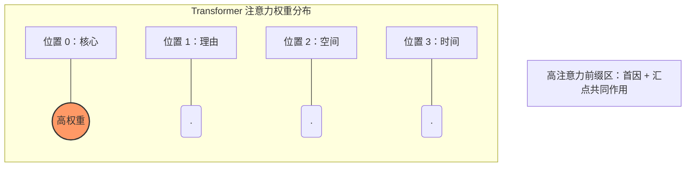
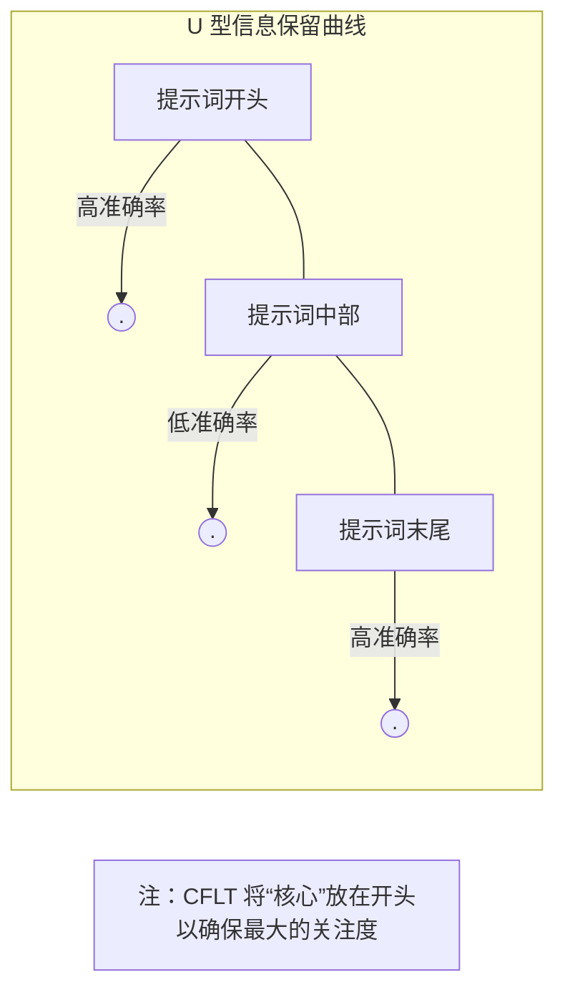
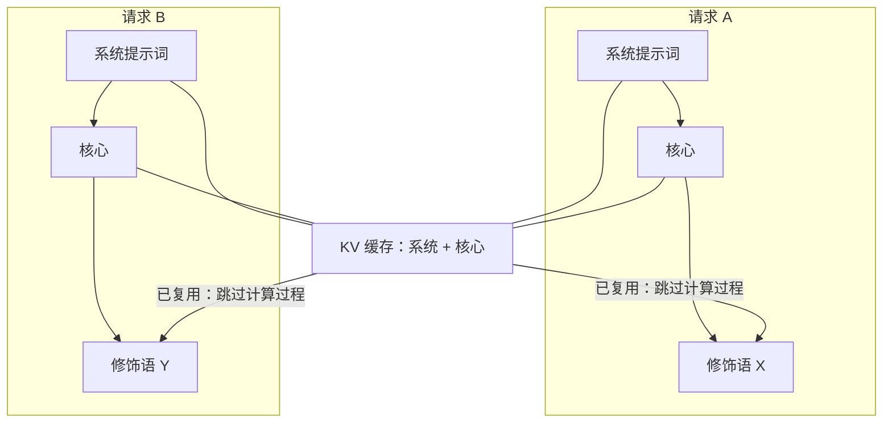

# CFLT 的 LLM 基础

> **版本：** 1.0.0 (内部草案)
> **作者：** CFLT 核心团队
> **机构：** [CFLT.center](https://cflt.center)
> **许可：** [CC BY 4.0](https://creativecommons.org/licenses/by/4.0/)

---

## 1. LLM 作为桥梁：CFLT 的第二支柱

在 CFLT 框架中，LLM 不仅仅是翻译工具；它们是使协议落地的标准化**推理引擎**。CFLT 依靠 LLM 来执行两个不同的任务：

1. **逻辑转换器（Logic Transformer）：** 将凌乱的用户输入转换为严格的 `[核心] → [理由] → [空间] → [时间]` 序列。
2. **语法叠加层（Grammar Overlay）：** 将该严格序列润色为地道的母语级输出（例如，L2 英语、法语或日语）。

CFLT 的计算依据在于：**LLM 对提示词的线性化高度敏感**（Habba 等，2025；Zheng 等，2024）。通过强制执行固定的、以核心为锚点的序列，我们降低了模型输出的方差，并提高了其指令遵循的可靠性。

---

## 2. Transformer 注意力与位置偏置

Transformer 架构（Vaswani 等，2017）将输入序列视为一组 Token，其中每个 Token 都有可能注意到其他任何 Token。然而，实证研究表明，注意力的分布是**不均匀的**。

### 2.1 首因效应与位置 0
LLM 表现出明显的**首因效应（Primacy Effect）**：处于提示词最开头的信息对模型的内部状态具有不成比例的巨大影响。

### 2.2 位置编码
无论是绝对位置编码（Vaswani 2017）、相对位置编码（Shaw 等，2018）还是旋转位置编码（Su 等，2021），位置编码都确保了模型知道 Token 的位置。最近的基准测试表明，“绝对位置 0”获得了不成比例的关注（“注意力汇点”，Xiao 等，2024）。

### 2.3 位置 0 的注意力：两个不同现象

现代 LLM 中位置 0 被过度关注是出于**两个不同原因**，必须区分：

1. **注意力汇点（Xiao 等 2024）** —— *softmax 稳定性副产物*。因 softmax 分母必须求和为 1，注意力会"泄漏"到那些语义内容**并不**特别相关的早期 token 上。Xiao 等明确指出这些 token *"not being semantically important"* —— 汇点是 softmax + 窗口注意力的数学后果，而**不是**语义优先性的信号。
2. **首因/位置偏置** —— 早期 token 也因每个后续 token 的查询都先看到它们而被多关注（因果掩码在深度上累积）。这与汇点机制独立，**确实**支持把语义丰富的内容放在前面。

**CFLT 实际利用的是什么。** CFLT 的 Core-first 主张依靠的是 **(2) 首因**，而不是 (1) 汇点。因为听者/模型在所有后续处理中都条件于前几个 token，把显著性锚点置于此处会在生成的其余部分中累积影响力。汇点现象是一个独立的工程发现 —— 关于*模型在长上下文中如何保持稳定* —— 它本身**不**主张把语义内容置于位置 0。

还需注意：把 Core 放在位置 0 **并不会**"消耗"汇点 —— 多数现代系统把第一个 token（通常是 `<bos>`）作为专用汇点槽，而 CFLT 的 Core 会占据其紧后位置。关键的论断只是：*高注意力前缀区最好被高信息量内容占用。*

（关于互补效应 —— 即*序列中间*的 Token 会被系统性地关注不足 —— 见下文 §3 关于“迷失在中部”现象的讨论。）

### 2.4 锚定非动作核心
汇点效应适用于任何高显著性的成分，而不仅仅是动词：

- **身份核心：** 将“主语身份”（例如，“The solution is...”）放在位置 0 会创建一个**定义性汇点**。随后的修饰语（“如何”和“为什么”）将通过这一固定的谓词来解释，从而防止模型在长段描述中丢失主语的“身份”。
- **请求核心：** 将指令（例如，“Please summarize...”）放在开头，可以确保**任务算子**是 KV 缓存中最稳定的元素。这防止了在中间信息过重的提示词中常见的“指令漂移（Instruction Drift）” —— 即模型开始描述文本而不是执行所请求的动作。

---

## 3. "迷失在中部"现象 (Lost-in-the-Middle)

Liu 等人（2023，*Lost in the Middle*）证明了 LLM 的性能遵循 U 型曲线：对于提示词开头或结尾的信息，准确率很高，但对于中间的信息，准确率会显著下降。

> **重要 —— 原始发现的尺度。** Liu 等的实验使用**多文档问答与键值检索**，把文档/键值放在长上下文中不同位置（10-30 个文档）。他们设置中的"位置"指的是*长上下文中的文档位置*，不是*单句内的 token 位置*。从"文档尺度的中部丢失"直接外推到"句子尺度的核心动作"是*跨尺度类比*，应作为类比对待。

CFLT 在**两个不同尺度**应用 lost-in-the-middle 发现，推论强度不同：

1. **文档/提示词尺度（强支持）。** 当 CFLT 结构化内容置于长 agentic 提示词或 RAG 上下文内时，把最关键的 Core 块放在提示词开头直接缓解 Liu 等的现象。这是直接应用。
2. **句子/token 尺度（类比性）。** 单句内，相关现象是*首因*+*注意力汇点*（参见 §2.3），不是 lost-in-the-middle。U 型曲线在现代 LLM 句内 token 粒度上尚未实验确证。把句子级主张视为由文档级发现*启发*而非*证明*。

通过将**核心动作**放在最开头，CFLT 确保信息中最关键的部分占据高注意力前缀区。修饰语（理由、空间、时间）占据随后的槽位，对于典型的句子长度输入，这些槽位仍然处于高注意力的早期窗口内。

---

## 4. 提示词引导与自回归预测

LLM 是自回归的：它们根据所有前面的 Token $(t_1, \dots, t_{n-1})$ 来预测下一个 Token $t_n$。

$$
p(t_n \mid t_{n-1}, \dots, t_1)
$$

如果 $t_1, t_2, \dots$（前缀）是高熵、低相关性的 Token（如长难句“昨天当我正在走路的时候……”），模型对于核心动作的状态约束就很弱。如果前缀是**核心动作**本身，那么后续所有槽位的概率分布会立即收窄。

CFLT 充当了一种**引导协议（steering protocol）**，在生成过程的早期使模型的分支因子坍缩，从而产生更符合事实且幻觉更少的延续。

---

## 5. 语境学习与“CFLT 流形”

语境学习（In-Context Learning, ICL）通过向模型提供可以扩展的模式来工作（Min 等，2022）。

- 传统的语法规则很难通过少量示例（few-shots）来表达。
- **CFLT 协议**是一个简单的线性模式。

由于 `[核心] → [修饰语]` 序列是模型所训练的自然语言流形（manifold）的一个子集，模型可以通过极少数示例（低样本或仅通过简单的系统提示词进行零样本）学会遵循该协议。

---

## 6. Token 经济与计算成本

最近关于结构化提示词（TOON、CSV 等）的研究报告称，与冗长的自然语言或密集的 JSON 相比，将信息展平为线性的、非嵌套的格式可以显著减少 Token 消耗。报告的幅度因领域而异 —— 已发布的结构化数据基准测试显示，表格内容的降幅在 30%–50% 之间。**CFLT 特有的降幅尚未测量**，不应直接假定与结构化数据文献相匹配：CFLT 处理的是话语语义，而非表格字段，其降幅源自不同的源头（消除句法协调开销，而非序列化行数据）。

CFLT 可能通过以下方式贡献于 Token 经济：
1. **线性化：** 消除对复杂句法标记（关系代数、嵌套从句）的需求。
2. **显式空值（Nulls）：** 对缺失的槽位使用“NULL” Token，防止模型为了保持语法流利而生成“填充”文本。
3. **前缀缓存（Prefix Caching）：** 推理引擎（vLLM, SGLang）中 `[系统提示词] + [核心]` 前缀的高度可重用性降低了计算成本（见 `methodology/llm-prompting.md`）。

实际的降幅必须通过 [`methodology/evaluation-metrics.md`](../methodology/evaluation-metrics.md) §4.1 中指定的消融实验来量化。

---

## 7. 幻觉动态 (Hallucination Dynamics)

幻觉通常发生在模型丢失了主要断言（核心）并开始生成听起来合理但无关的上下文时。

通过将**核心**置于位置 0，CFLT 利用首因效应（参见 §2.3）在早期 KV 缓存中提供稳定的"语义锚点"。这降低了模型随着序列增长而偏离用户意图的"漂移"风险。（注：这是首因论证；§2.3 讨论的注意力汇点副产物是*独立*现象，并非本主张的依据。）

---

## 8. 潜空间中的跨语言对齐

由于 LLM 是在海量的多语言语料库上训练的，它们为语义概念开发了一个**语言中性的潜空间（latent space）**。

CFLT 通过使用**与语言无关的序列**来瞄准这个潜空间。无论表面 Token 是中文、英文还是阿拉伯文，进入注意力头的*概念顺序*是相同的。这使得 LLM 成为实现人类学习者用来连接不同语言的“中性缓冲区”的理想工具。

---

## 9. 局限性说明

1. **严格性 vs. 流利度：** 强制执行严格的序列有时会导致较小模型的输出显得“生硬”。语法叠加层对于恢复自然流利度至关重要。
2. **指令遵循：** 极小的模型（如参数量 <3B）在没有微调的情况下，可能难以维持严格的 CFLT 协议。
3. **推理 vs. 线性化：** 虽然 CFLT 改善了话语结构，但它并不能替代用于复杂数学或逻辑问题的思维链（CoT）推理（Wei 等，2022）。它应该与 CoT *结合使用*。
4. **长上下文漂移：** 即使有首因前缀锚定，极长的修饰语仍可能导致模型丢失核心。建议进行模块化处理（将想法拆分为多个 CFLT 句子）。

---

## 10. 开放的研究问题

1. **具体准确度增量：** 在“大海捞针（Needle-in-a-Haystack）”基准测试中，CFLT 与自由格式提示词相比，在指令遵循方面的绝对提升是多少？
2. **延迟影响：** 在生产级 RAG 系统中，通过前缀缓存 CFLT 结构可以节省多少 TTFT（首个 Token 时间）？
3. **微调收益：** 在专门针对 CFLT 线性化语料库进行微调的模型上，其在跨语言任务中的表现是否优于标准的指令微调？

---

## 11. 引用文献

完整参考文献请参见 [`bibliography.md`](../bibliography.md)（§ 大型语言模型与 NLP）。

---

## 另请参阅

- [`mathematics.md`](./mathematics.md) §6, §7 — 本文件 §4 的马尔可夫链提示词引导和 KL 散度框架。
- [`neuroscience.md`](./neuroscience.md) §5 — 本文件 §2.3 所利用的人脑与 Transformer 注意力汇点的平行关系。
- [`logic.md`](./logic.md) §6 — 关联理论；本文件 §4 工程选择的认知依据。
- [`../methodology/llm-prompting.md`](../methodology/llm-prompting.md) — 本基础文件的工程应用；清理流程、前缀缓存、RAG。
- [`../methodology/software-architecture.md`](../methodology/software-architecture.md) — 本文件 §1 中介绍的两阶段逻辑转换器 / 语法叠加层流水线。
