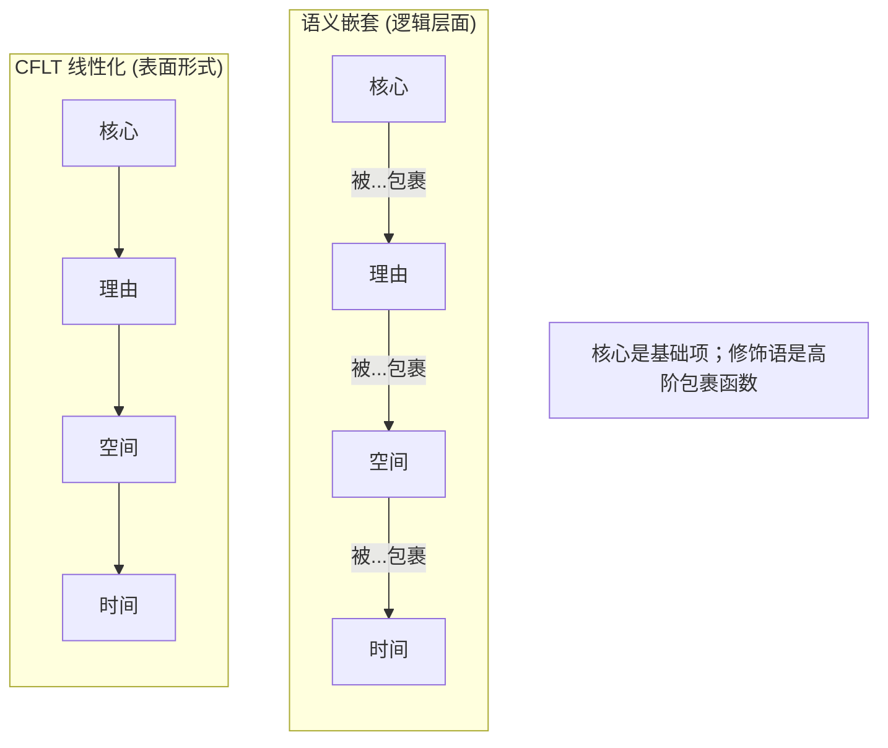
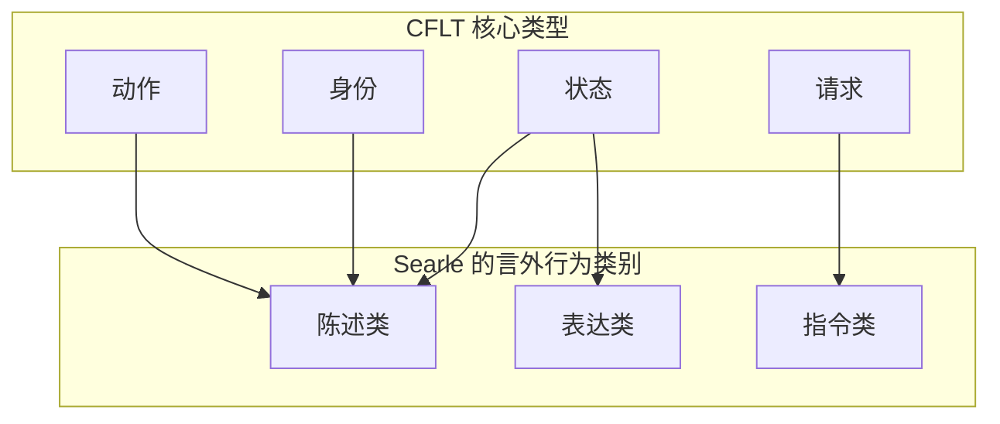
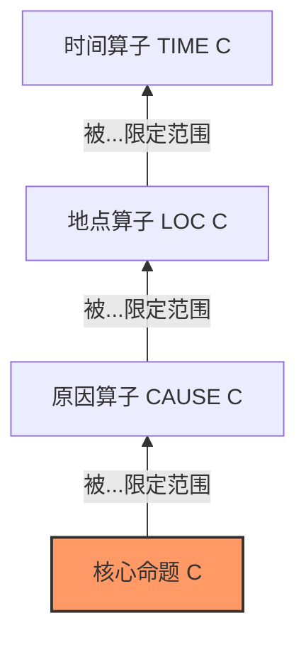

# CFLT 的逻辑基础

> **版本：** 1.0.0 (内部草案)
> **作者：** CFLT 核心团队
> **机构：** [CFLT.center](https://cflt.center)
> **许可：** [CC BY 4.0](https://creativecommons.org/licenses/by/4.0/)

---

## 1. 范畴：形式逻辑作为功能类比

形式逻辑系统与 **CFLT 协议**有着深刻的共同属性：在其底层表示中，它们都优先考虑“功能”（动作或关系）而非其“参数”（实体或语境）。

- **谓词逻辑：** $P(a, b, c)$ —— 谓词符号 $P$（核心）开启了整个表达式。
- **计算机科学：** `function(arg1, arg2)` —— 在处理数据之前先识别操作。

CFLT 借鉴了这一趋同模式并将其应用于自然语言。核心（显著性锚点）被尽早确定；`[理由] → [空间] → [时间]` 修饰语随后附加。**其输出是自然语言**，而非形式化符号 —— 但其概念顺序与形式逻辑一个多世纪以来所使用的顺序是一致的。

> **本文件不主张：** 本文件并不声称 CFLT 产生形式逻辑符号，也不声称 CFLT 是动词领先的，或者在句法意义上是谓词领先的。它主张的是：形式逻辑所清晰阐述的**早期确定（early commitment）**这一抽象原则，是 CFLT 的智力源头之一 —— 并且由此产生的自然语言形式在计算上是良好构建的（well-formed），原因正如形式逻辑所精确定义的那样。

---

## 2. 谓词逻辑与“早期确定”原则

在标准的一阶逻辑中，一个事件被表示为应用于项（terms）的谓词：
$$\text{Go}(\text{me}, \text{store}, \text{yesterday})$$

**CFLT 从这一传统中借鉴了什么：**
1. **歧义消解的顺序。** 首先识别谓词可以减少后续项的歧义。“吃（Eat）”将可能的参数限制为可食用的东西；“去（Go）”将其限制为地点或路径。
2. **“中心词（Head）”地位。** 谓词是表达式的逻辑中心词。

**CFLT *没有*借鉴什么：**
- **符号形式** $P(a, b, c)$。CFLT 产生的是 "I went out, because it rained, at home, yesterday." —— 具有结构化顺序的可理解英语。
- **将“核心”简化为“谓词符号”。** 系动词结构（"That girl is my sister"）在动作动词意义上没有明显的“谓词”，但它有一个清晰的核心（身份断言）。CFLT 可以处理这种情况，而单纯的谓词逻辑则不行。

---

## 3. Lambda 演算与函数应用

Lambda 演算（$\lambda$-演算）将计算建模为函数应用（function application）。在这种形式系统中，应用于参数 $x$ 的函数 $f$ 被写作 $(f\,x)$。

**CFLT 映射（带警示）：** 出于*阐述*目的，我们把 Core 建模为一叠修饰函数中的**最内层（基础）项**，修饰语作为包裹它的高阶函数：

$$\text{时间}\,(\,\text{地点}\,(\,\text{原因}\,(\,\text{核心}\,)\,)\,)$$

> **重要警示 —— 这是 CFLT 线性化比喻，不是 Davidsonian 事件语义。** 在标准 Neo-Davidsonian 事件语义（Parsons 1990；Landman 2000）中，所有事件修饰语 —— 方式、工具、受益者、时间、地点、原因 —— 作为**同级合取项** $R_1(e,x_1) \land R_2(e,x_2) \land \dots$ 附着于事件变量 $e$，**不是**强制嵌套层级。没有 Davidsonian 定理要求 Time 是最外层包裹或 Reason 是最内层。上述 lambda 嵌套是 *CFLT 表面线性化的设计选择* —— 它表达的是协议关于何时说什么的主张，不是关于什么语义上作用于什么的逻辑主张。
>
> 类似地，在模态-时态逻辑中（Prior、Reichenbach、Kamp & Reyle 1993），模态算子（$\Box, \diamond$）与时间算子（$G, F, H, P$）以语言特定、构式特定的方式相互作用；没有标准结果要求 $\text{Time}(\text{Space}(\dots))$ 是规范作用域顺序。
>
> CFLT 选择这一特定排列作为*有理由的约定*（三条理据论证参见 [`linguistics.md`](./linguistics.md) §4.3）。这里的 lambda 嵌套符号*可视化*该约定 —— 它不是从中*推导*出来的。

CFLT 的*表面*线性化是对栈结构的由内而外读取 —— 首先说出核心，然后每个包裹的修饰语被"拆封"时依次附加。等效地，CFLT 表面形式是对 $[\text{核心}, \text{原因}, \text{地点}, \text{时间}]$ 的左折叠（left-fold），每一步附加下一个外部修饰语而非前置。

**具体示例：**
- **自然语言：** "I went, because I was hungry, to the shop, at noon."
- **语义嵌套：** $\text{AtNoon}\,(\,\text{ToShop}\,(\,\text{BecauseHungry}\,(\,\text{I-Went}\,)\,)\,)$
- **CFLT 线性化（由内而外）：** I-Went → BecauseHungry → ToShop → AtNoon

在这一视角下，**"I-Went"** 是基础项，每个随后的槽位都是一个高阶函数，它获取话语的当前状态并将其“包裹”在新的语境层中。CFLT 在表面形式的位置 0 处优先考虑**基础项**（核心）。

**关于普适性的说明：** Lambda 演算与类型无关 —— 函数 $\lambda e.\,\text{COMMIT}(e)$ 可以包裹一个动作、一个状态、一个身份或一个言语行为。这种普适性正是函数应用比喻能自然延伸到 CFLT 四种核心类型的原因。

---

## 4. 组合范畴语法 (CCG)

CCG (Steedman 2000) 是一种高度词汇化的语法形式，其“句法”很大程度上包含在词汇范畴本身之中。CCG 的独特之处在于它允许同一个语义结果具有多种等效的派生（线性化）方式。

**CFLT 作为一种 CCG 调度选择：** CFLT 并没有发明一种新的组合语法。它从 CCG 灵活的空间中选择了一种标准调度：
1. **核心**是主要的算子（functor）。
2. 它以固定的、可预测的方向“寻找”它的参数。

通过固定派生路径，CFLT 协议消除了通常会使 CCG 解析复杂化的“伪歧义（spurious ambiguity）”，使其成为 AI 智能体的理想桥梁。

---

## 5. 言语行为理论 (Speech Act Theory)

语言不仅仅是描述世界；它还执行动作（*施事行为/言外行为*，illocutionary acts）。Searle (1969, 1975) 确定了五大主要的言外行为类别：**陈述类**（Representatives，断言）、**指令类**（Directives，请求、命令）、**承诺类**（Commissives，承诺）、**表达类**（Expressives，感谢、道歉、情感状态）和**宣告类**（Declarations，通过被言说而改变世界的语言，例如，“我宣布你们……”）。

**CFLT 映射：** 在 CFLT 中，核心是施事确定的语言实现。CFLT 的四种核心类型与 Searle 的分类对应如下：

| CFLT 核心类型 | Searle 的分类 | 示例 |
|---|---|---|
| **动作 (Action)** | 陈述类 (Representative/assertive) | "I went out" —— 断言一个事件 |
| **身份 (Identity)** | 陈述类 (Representative，系动词子类) | "That girl is my sister" —— 断言一个分类 |
| **状态 (State)** | 表达类 *或* 陈述类 | "I'm exhausted" —— 表达/断言一种状况 |
| **请求 (Request)** | 指令类 (Directive) | "Could you pass the salt" —— 指示听者采取行动 |

> **关于 Searle 的“宣告类（Declaration）”的说明：** Searle 的*宣告类*是一个狭义的施事范畴（例如，“我特此辞职”、“你被解雇了”、“我宣布你们……”），其言语本身即构成了行为。这与系动词身份陈述**不同**。CFLT 的“身份核心”是一个断言身份主张的陈述类子类；它不是 Searle 意义上的宣告类。这里将两者区分开来，是为了避免在*语法上的*宣言（declaration）与*言外行为上的*宣告类（Declaration）之间发生术语混淆。

CFLT 确保话语的**施事力（illocutionary force）**首先被识别，从而顺应了听者对于确认自己是被告知、被请求还是被称呼的需求。

---

## 6. 关联理论 (Relevance Theory)

关联理论认为，人类交流受追求**最优关联（optimal relevance）**的支配：以最小的处理努力实现最大的认知效果。

**CFLT 作为一种关联最大化策略：** 将核心置于位置 0，将最高效果的 Token 放在了听者注意力最集中的地方。听者（或 LLM，见 `llm.md`）可以从核心开始进行推理计算，而不需要在修饰语中漫长等待以发现话语的主题。

母语级英语的末尾重量（end-weight）倾向（Quirk 等，1985）与这一原则存在竞争：沉重的名词短语（NPs）以及旧/新信息结构往往会延迟新信息的出现。CFLT 通过将末尾重量视为一种在润色阶段（产品实现中的语法叠加层）而非概念支架阶段应用的**文体精炼**，解决了这一张力。

这与更广泛的教训一致：CFLT 优化**概念顺序**；母语习语优化**表面流利度**。语法叠加层将两者调和。

---

## 7. 格赖斯准则 (Gricean Maxims)

Grice (1975) 提出了合作谈话的四项准则：质、量、关系和方式。

| 准则 | 描述 | CFLT 的对应关系 |
|---|---|---|
| 质 (Quality) | 诚实 | 与 CFLT 正交（内容层面的关注点） |
| 量 (Quantity) | 信息充足 | 通过四槽位完整性规则处理 |
| 关系 (Relation) | 相关 | 通过选择一个显著的核心来处理 |
| **方式 (Manner)** | **清晰、简洁、有序** | **固定的槽位顺序即是有序条件** |

方式准则 —— *“要有序”* —— 明确要求可预测的线性化。CFLT 正好提供了一个标准的顺序，完全满足了这一准则。这使得该协议显得异常地**符合格赖斯原则**：母语人士通过语境敏感的启发式方法来即兴构建有序性；而 CFLT 提供了一个能够确定性地实现相同目标的单一规则。

---

## 8. 话语表征理论 (DRT)

DRT (Kamp 1981) 建模了听者在对话展开时如何构建对话的心理“地图”。

**CFLT 映射：** 如果首先引入核心，它会立即建立中心话语指称对象 —— 事件变量、身份主张、状态或言语行为 —— 随后所有的贡献都以此为锚点。修饰语被附加到一个已经存在于话语表征中的指称对象上，消除了如果在修饰语出现在其目标之前会产生的临时歧义。

---

## 9. CFLT 下的模态与时间逻辑

四个 CFLT 槽位与标准逻辑扩展中的算子对齐：

| CFLT 槽位 | 逻辑算子 | 解读 |
|---|---|---|
| [核心] | $C$ | 核心命题 |
| [理由] | $\text{CAUSE}(C)$ | 因果逻辑 |
| [空间] | $\diamond_{\text{loc}} C$ | 地点模态逻辑 |
| [时间] | $\diamond_{\text{time}} C$ | 时间逻辑 ($G, F, H, P$) |

这是一种**算子堆叠（operator-stacking）**读取方式：$C$ 是最内层的确定；原因、地点和时间是包裹它的渐进“外部”模态-时间算子。将它们由核心向外线性化，正好得到了协议的语序。

---

## 10. 局限性说明

1. **形式化符号是类喻，而非表面形式。** 谓词逻辑符号 (`P(a,b,c)`)、Lambda 项和 CCG 范畴是“为什么早期确定在计算上是良好构建的”的启发来源。CFLT 的实际输出是自然语言。如果读者得出“CFLT 就是形式逻辑符号”的结论，则是误读；参见 [`core-concept.md`](./core-concept.md)。
2. **逻辑优先级 ≠ 语用优先级。** 形式逻辑将功能置于最外层，但人类对话受语用支配，其中已知信息通常先于新信息（主题-述题，主位-述位）。CFLT 优化了**显著性确定的清晰度**，这可能与母语习语发生冲突 —— 语法叠加层将两者调和。
3. **牺牲了范畴灵活性。** CCG 明确承认多种等效派生；CFLT 选择了一种标准调度。这用灵活性换取了可预测性 —— 对于教学和机器处理来说这是一笔公平的交易，但对于完全地道的母语生产来说，这确实是一种损失。
4. **非组合性习语。** 像 "kick the bucket"（逝世）这样的习语很难简单地分解为“核心 + 修饰语”。CFLT 最适用于组合性的、字面意义的话语。
5. **嵌套言语行为。** 像 "I promise to leave tomorrow" 这样的施事语嵌入了一个本身就是言语行为的动词和一个命名未来动作的补足语。每个部分填充哪个槽位？CFLT 需要针对嵌套行为的元规则 —— 可能是外部行为作为核心，内部内容填充修饰语槽位。

---

## 11. 引用文献

完整参考文献请参见 [`bibliography.md`](../bibliography.md)（§ 逻辑与语言哲学）。

---

## 另请参阅

- [`core-concept.md`](./core-concept.md) §1 — 为什么“核心”是显著性锚点，*不是*谓词；本文件 §1 明确否认的误读。
- [`mathematics.md`](./mathematics.md) §6, §7 — 与本文件 §3 的 Lambda 应用描述互补的马尔可夫链和 KL 散度视角。
- [`linguistics.md`](./linguistics.md) §4 — 信息结构与末尾聚焦，本文件 §6, §7 中讨论的格赖斯方式准则的平衡点。
- [`llm.md`](./llm.md) §4 — 作为“早期确定”工程体现的自回归预测。
