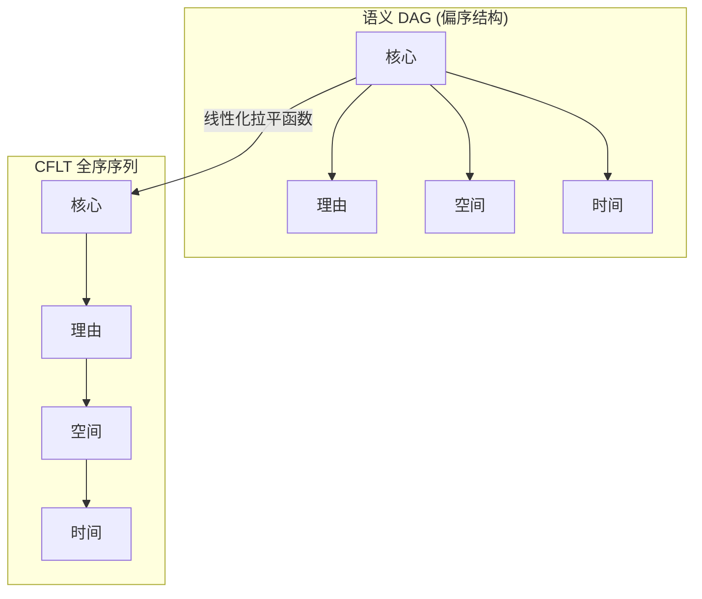
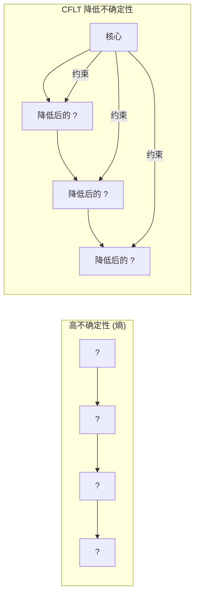
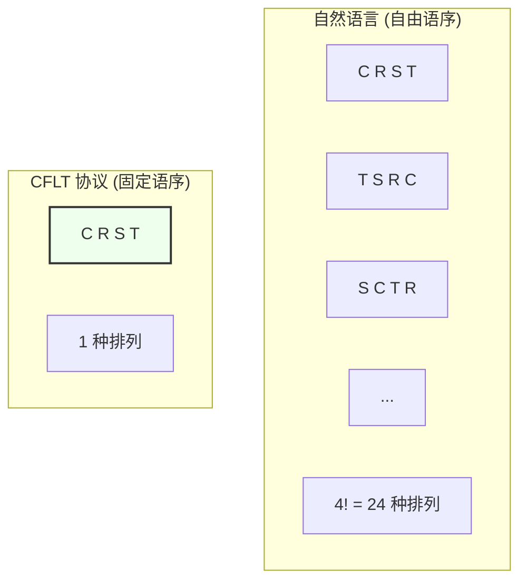

# CFLT 的数学基础

> **版本：** 1.0.0 (内部草案)
> **作者：** CFLT 核心团队
> **机构：** [CFLT.center](https://cflt.center)
> **许可：** [CC BY 4.0](https://creativecommons.org/licenses/by/4.0/)

---

## 1. 线性化问题 (The Linearization Problem)

人类思维（*言前信息*，preverbal message）可以建模为有向无环图（DAG）或语义依赖的偏序结构。然而，言语是 Token 的**全序**（total order）排列。

不同的语言在相同的底层偏序结构上选择不同的确定性线性化函数。CFLT 提出了一种特定的线性化方式：

$$L_{\text{CFLT}}(G) = [\,\text{root}(G),\ \text{cause}(G),\ \text{location}(G),\ \text{time}(G)\,]$$

其中 $\text{root}(G)$ 是核心（Core）。通过在所有语言中固定这一函数，CFLT 将翻译的**计算复杂度**从结构转换（structural transformation）降低为词汇替换（lexical substitution）。

### 1.1 身份核心与请求核心建模
为了证明 CFLT 不仅仅是“动词领先”，我们将核心建模为语义 DAG 中**显著性最高（highest-salience）的节点**，无论其词性如何。

- **身份核心（系表结构/静态）：** 在 "That girl is my sister" 中，语义根是恒等关系 $\{A=B\}$。线性化保持为 $L([A=B], \text{modifier}) = [A=B, \text{modifier}]$。其数学优势在于在处理任何描述性属性之前，立即确定了**参考框架**。
- **请求核心（施事力）：** 在请求中，施事算子（如 `REQUEST(action)`）是根。CFLT 将其线性化为 $[\text{算子}, \text{动作}, \text{语境}]$。这最小化了**施事歧义** —— 听者在听到具体任务（“什么”）之前，就已经知道他们为什么要听（“为什么”）。

---

## 2. 熵与序列预测 (Entropy and Sequence Prediction)

从序列预测器（人类或 LLM）的角度来看，随着提供更多相关的上下文，Token $t_i$ 的条件熵会降低。

$$H(t_i \mid t_{i-1}, \dots, t_1)$$

在 **CFLT 协议**中，核心占据 $t_1$ 位置。由于核心是信息量最高的部分（显著性锚点），它对后续所有槽位的概率分布提供了最强的约束。

> **重要警示 —— 链式法则与联合熵。** 根据熵的链式法则（Cover & Thomas 2006，第 2 章），*联合*熵 $H(t_1, t_2, \dots, t_n)$ 在 token 排列下**不变** —— 序列的总不确定性不取决于我们以何种顺序分解它。因此 CFLT **不**主张通过把 Core 放首位来减少总联合熵。

> CFLT 实际主张的是更弱但依然有用的：在自回归解码下，**把最高信息量成分置于前缀早期区，可使前几步的条件分布稳定性 $H(t_i \mid t_{<i})$ 最大化**。这有利于（a）不缓冲整个话语就开始解释的人类听者；（b）从左到右采样、依赖早期条件分布良好整形的 LLM 生成。

> 数学上：CFLT 优化的是**早期前缀信息量**，不是总熵。正确的措辞是"Core 在 $t_1$ 最小化*这是何种话语*的不确定性，到第 1 步为止"，而不是"Core 在 $t_1$ 最小化联合熵"。

条件熵 $H(\text{rest} \mid \text{core})$ 显著低于 $H(\text{rest} \mid \text{某修饰语})$，这意味着听者/模型能够实现**更早的歧义消解**，即使总联合熵不变。这是 Core-first 在信息论意义上获得动机的准确表述。

---

## 3. 解析效率：早期直接成分 (EIC)

> 参见 [`linguistics.md`](./linguistics.md) §3 了解 EIC 的语言学介绍；本节给出信息论视角的解读（CRD 比率、分支方向）。

John Hawkins (1994, 2004) 提出了**早期直接成分 (Early Immediate Constituents, EIC)** 原则，作为语序类型的基本驱动力。该原则认为，人类解析器更倾向于那种能够以最短窗口识别短语**直接成分 (ICs)** 的线性顺序。

### 3.1 成分识别域 (CRD)
CRD 是识别短语所有 ICs 所需的单词数。Hawkins 将效率量化为 ICs 与 CRD 的比率。

通过将核心置于位置 0，CFLT 协议缩短了主句的 CRD：听者较早识别出“锚定”成分，在核心识别窗口得到较高的 IC-to-word 比率。（此处不给具体数字——Hawkins 的 EIC 比率定义在短语内 IC-to-CRD 的*词数*上；把它用到*话语级*槽序是类比性外推、非可计算值。）这减少了解析器所需的**前瞻缓冲区 (look-ahead buffer)**，降低认知负荷。

### 3.2 分支方向与增量处理
CFLT 实际上为话语层面的核心创建了一个**左重（中心词在前）**的结构。这促进了**增量处理**：听者可以在信息到达时即时整合，而不需要在等待核心的同时将一系列修饰语保留在工作记忆中（这是汉语等中心词在后的语言中常见的“修饰语陷阱”）。

---

## 4. 统一信息密度假设 (UID)

Levy & Jaeger (2007)、Jaeger (2010) 以及更广泛的 UID 文献提出，说话者倾向于在整个话语中**均匀地**传播信息 —— 避免出现峰值和谷值。

这有时被视为反对将高信息 Token 前置的论点。我们诚实地面对这一张力：

- **对于母语者**，UID 预测在流利的话语中，信息密度大致恒定。英语中的末尾聚焦（end-focus）和末尾重量（end-weight）正是通过将沉重的名词短语（NPs）置于右侧来平滑密度。
- **对于 L2 学习者和 AI 智能体**，UID 是一种*生产端*的优化，前提是说话者已经能够进行全局规划。学习者则做不到。因此，CFLT 通过前置核心来优化**理解端**的解析确定性，从而接受一个不那么平坦的密度曲线。

因此，CFLT 并不是对 UID 的反驳；它是一个适用于不同说话者群体的**不同优化目标**。

---

## 5. 编码、访问成本,与源编码类比的边界

一个诱人的类比会援引香农源编码定理 (1948) 与哈夫曼编码 (1952)。**但它们管的是"码字**长度**"的分配——更频繁的符号给更短码字——而非序列中**成分的顺序**。** 不存在"高信息成分应前置"的源编码定理;用它来证 Core-first 线性化是范畴错误,CFLT **不依赖**它。

真正站得住的另置:
- Core-first 的信息论依据是 §2 的**早期条件熵**论证(前置最具约束力的成分,最早降低听者的剩余不确定度),并带 §2 的 caveat:**联合熵在置换下不变**。
- "把最常访问项前置"的直觉**有正当出处**——**访问 / 查找成本最小化**(按访问概率排序可**证明**最小化期望查找成本)。它与源编码是**不同**原理(源编码根本不谈顺序),且**有前提**(需 Core 确为最常访问项)。它**不是**香农 / 哈夫曼所证的东西。

故本节**撤回**先前的源编码 overclaim;信息论的承重在 §2。

---

## 6. 马尔可夫链与序列依赖 (Markov Chains)

被建模为马尔可夫链 $(t_1, t_2, \dots, t_n)$ 的子句具有联合概率：

$$p(t_1, \dots, t_n) = \prod_{i=1}^{n} p(t_i \mid t_{i-1}, \dots, t_1)$$

**早期 Token 主导了所有后续 Token 的条件分布**。如果 $t_1$ 编码了动作动词，那么 $p(t_2 \mid t_1)$ 就会受到严格约束 —— 可能的原因、地点和时间必须与该动作兼容。

对于自回归语言模型（主流 LLM 架构，见 `llm.md`），这意味着：

- 以 CFLT 为前缀的提示词（prompt）会将所有后续生成引向与动作一致的延续。
- 非 CFLT 提示词（例如，以时间状语开头）在许多 Token 之后仍无法确定动作，增加了方差和幻觉风险。

---

## 7. KL 散度与提示词引导 (Prompt Steering)

对于具有条件分布 $p_\theta(\cdot \mid \text{prompt})$ 的自回归模型，不同提示词顺序的**引导效果**可以通过结果分布之间的 Kullback-Leibler 散度来量化：

$$D_{KL}\!\left(p_\theta(\cdot \mid \text{prompt}_A)\,\Big\|\,p_\theta(\cdot \mid \text{prompt}_B)\right)$$

实证研究（Sclar 等，2024；Lu 等，2022 关于顺序敏感性的研究）一致发现，提示词顺序会显著改变模型输出分布。在这种框架下，CFLT 是一种**工程选择**，旨在将提示词前缀固定为高 KL、低方差的顺序。

---

## 8. 构造灵活性的组合边界

对于一个四个槽位的模板，如果每个槽位有 $n_i$ 个候选填充项，那么生成语言的大小为：

$$|L_{\text{CFLT}}| = \prod_{i=1}^{4} n_i$$

这与语序选择无关 —— 但**生产时的搜索空间**为：

- 对于语序自由的自然语言：说话者必须在 $|L_{\text{CFLT}}| \times 4!$ 种排列中做出选择。
- 对于受 CFLT 约束的语言：$|L_{\text{CFLT}}| \times 1$ —— 线性化是固定的。

因此，CFLT 从**协议层**搜索空间中消除了 $4! = 24$ 的因子，将线性化子任务固定为单一的标准调度。

> **注意：** 这是一个关于说话者被允许选择的*空间*的上界论点，而不是声称自然语言生产在运行时字面上会列举 24 种排列。言语生产的实证模型（Levelt 1989; Kormos 2006）认为，线性化是由增量的、受启发式约束的选择引导的，而不是组合搜索。因此，$4! \to 1$ 坍缩的教学力量在于它移除了一个在认知负荷下原本需要学习者去解决的*选择维度*，而不是它简写了一个字面上的 24 选 1 的决策。

---

## 9. L1 → L2 翻译的信息论视角

如果 $L_1$ 和 $L_2$ 在共享语义 DAG $G$ 上具有表面线性化 $\sigma_1, \sigma_2$，那么从 L1 思维产生 L2 需要：

$$\sigma_2 \circ \sigma_1^{-1}(G) = \text{重新线性化从 L1 表面提取的 G}$$

这种组合具有两项成本：
1. **解码** $\sigma_1^{-1}$：从 L1 表面还原 $G$。
2. **编码** $\sigma_2$：在 L2 语序中重新线性化 $G$。

CFLT 通过引入**标准中间线性化** $\sigma_C$ 来简化这两者：

$$\sigma_2 \circ \sigma_C^{-1} \circ \sigma_C \circ \sigma_1^{-1}(G)$$

这看起来更长，但诀窍在于 $\sigma_C$ **在每种语言中都是相同的**。一旦学习者内化了 $\sigma_C$，$\sigma_C \circ \sigma_1^{-1}$ 和 $\sigma_2 \circ \sigma_C^{-1}$ 都变成了简单的 Token 级重新映射，而不是结构性的重组。CFLT 将结构转换转化为词汇替换。

> **注意：本节是启发式的，并非证明。** 从形式上看，$\sigma_C^{-1} \circ \sigma_C$ 只是恒等变换，因此在纯成本函数项下，四箭头形式与 $\sigma_2 \circ \sigma_1^{-1}$ 是*等效*的。实质性的主张是**认知上的**，而非代数上的：内化了 $\sigma_C$ 的学习者可以将解码/编码成本摊销到数百万个话语中，因此*单个话语*的努力从一次结构转换下降到共享支架上的两次词汇替换。这里的数学是为了说明这种分解，而非证明成本的降低。实证验证列在 [`methodology/evaluation-metrics.md`](../methodology/evaluation-metrics.md) §2（发音起始潜伏期、认知负荷指数）中。

---

## 10. 教学决策论框架

学习者在产生 L2 句子时，在每个 Token 位置都面临着序列决策问题。总的**生产成本**可以建模为：

$$C(\sigma) = \sum_{i=1}^{n} c_i(\sigma)$$

其中 $c_i$ 是在给定目前已产生的序列的情况下，选择第 $i$ 个 Token 的认知成本。从实证上看，$c_i$ 随位置 $i$ 处的**分支因子（branching factor）**而变化：还有多少种后续可能？

通过固定槽位顺序，该协议强制首先填充信息量最高的槽位（核心动作），这**使所有后续位置的分支因子坍缩**。总的生产成本上界为：

$$C(\sigma_{\text{CFLT}}) \leq C(\sigma_{\text{free}})$$

当说话者是新手时（基准分支因子较高），这一差距达到最大 —— 这正是 L2 学习者的情况。

---

## 11. 局限性说明

1. **UID 张力：** 如 §4 所述，母语人士的地道英语旨在追求平坦的信息密度（通常通过末尾权重实现）；严格的 CFLT 会产生起伏的信息密度。地道的润色必须在表面阶段进行。
2. **$c_i$ 的实证估计：** 决策论论证依赖于难以直接测量的认知成本函数；需要实验验证（眼动追踪、发音起始潜伏期）。
3. **非事件性子句：** CFLT 模板假设了一个具有明确核心动作的事件表达子句。静态描述、泛指陈述和身份子句（“这是一把椅子”）拟合起来比较尴尬，可能需要一个单独的模板家族。
4. **长程依赖：** 当语义修饰语相互依赖（嵌套原因、条件时间）时，四槽位模板将逻辑上的树结构拉平了。语法叠加层（Grammar Overlay）必须在表面层面重建嵌套。

---

## 12. 开放的数学问题

> **认知论地位说明。** 以下四点刻意以*开放问题*的形式列出 —— 它们不是框架的背景局限，而是未解决的形式问题。前两点特别重要：CFLT **不**主张槽位数量或 R-S-T 内部顺序的数学最优性。"核心位于位置 0" 的主张有多重推导（参见 `core-concept.md` §1、`linguistics.md` §2-3、`neuroscience.md` §1、本文档 §2）；**R-S-T 内部顺序是有三条理据论证支持的约定**（参见 `linguistics.md` §4.3），不是推导。本节是这一区分在数学层面的权威记录。

1. **最优槽位数量：** 为什么是四个？认知成本函数能否证明恰好是四个槽位（Core + R + S + T），还是这只是一个基于实证的启发式方法？注意两层模型（事件核 + 场景框架；参见 `core-concept.md` §2.1）把方式 / 工具 / 受益者 / 伴随 / 情态 / 否定置于 Core **内部**而不是作为额外槽位，因此"四"指的是*情境框架*的维度，不是修饰类别的总数。
2. **槽位顺序证明：** 在任何自然成本函数下，`核心 → 原因 → 地点 → 时间` 是否可证明是最优的，还是它只是多个局部最优解之一？CFLT 当前把 R-S-T 视为从 $3! = 6$ 个备选中选择的排列，由 Grice 关联理论 + 具象性阶梯 + 直指可恢复性三条论证支持（`linguistics.md` §4.3）。形式证明 —— 或反例 —— 会显著收紧基础。
3. **递归 CFLT：** 当一个槽位填充项本身是一个子句时，递归需要一个闭合规则；递归变体是否保持线性化成本定理？
4. **跨语言等价类：** 如果两种语言的 $\sigma$ 函数在四个槽位的置换下一致，则它们共享一个"CFLT 等价类"。这种等价关系的代数结构是什么？

---

## 13. 引用文献

完整参考文献请参见 [`bibliography.md`](../bibliography.md)（§ 数学与信息论；§ 大型语言模型与 NLP 自回归参考资料）。

---

## 另请参阅

- [`linguistics.md`](./linguistics.md) §3 — 语言学层面的 EIC；本文件的 §3 给出了其信息论对应部分。
- [`logic.md`](./logic.md) §3 — Lambda 演算框架，与本文件 §6 的自回归马尔可夫链互补。
- [`llm.md`](./llm.md) §4, §6 — 提示词引导与 Token 经济，本文件 §7 和 §8 的工程推论。
- [`neuroscience.md`](./neuroscience.md) §3 — “前额叶税（Prefrontal Tax）”，本文件 §10 建模其抽象形式的神经成本函数。
