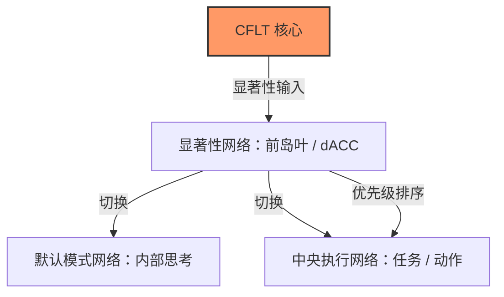
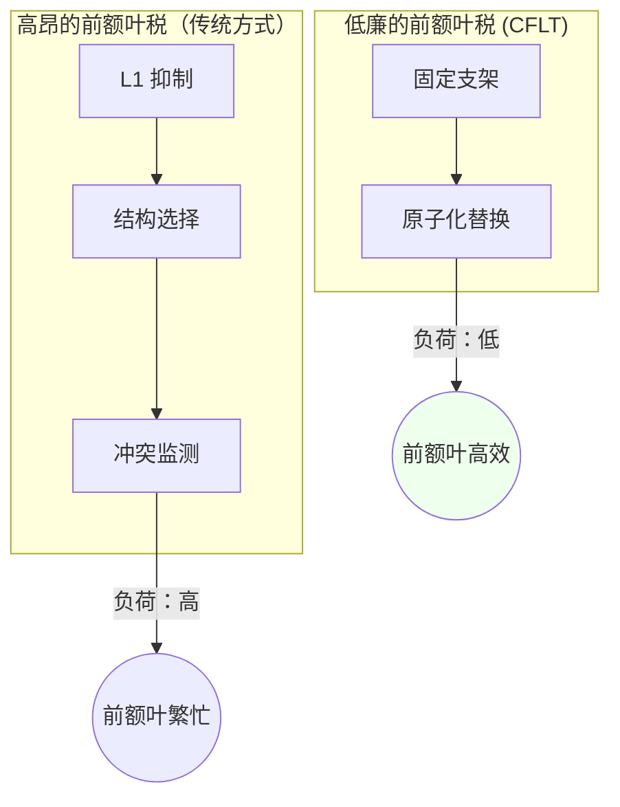
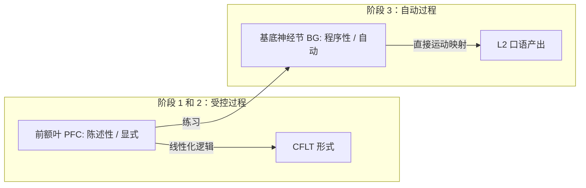

# CFLT 的脑科学基础 (Neuroscience Foundations)

> **版本:** 1.0.0 (内部草案)
> **作者:** CFLT 核心团队
> **组织:** [CFLT.center](https://cflt.center)
> **许可:** [CC BY 4.0](https://creativecommons.org/licenses/by/4.0/)

---

## 1. 显著性网络与 “核心 (Core)”

人类大脑处理信息并非呈扁平序列。它使用一个专门的**显著性网络 (Salience Network, SN)** —— 核心位于**前岛叶 (Anterior Insula)** 和**背侧前扣带回 (dACC)** —— 来识别哪些刺激在行为上是相关的 (Seeley et al. 2007)。

- **动态切换:** SN 充当默认模式网络 (内部思考) 与中央执行网络 (任务聚焦) 之间的开关。
- **CFLT 对齐:** CFLT 中的 "核心 (Core)" 是最具显著性的事件或意图的语言化实现。通过将核心置于**位置 0**，CFLT 协议使线性话语与大脑内部的 "优先级队列" 对齐。我们**预测**这减少了从概念化到发音之间的延迟；相应的实证检验（PFC 激活增量）已在 §7.1 中列为开放性问题。

> **概念导入范围 (T2 部分等价)。** *我们仅借用**显著性网络** (Seeley et al. 2007) 的优先级检测功能 —— 即大脑标记行为相关刺激的能力。我们**并不**主张产生符合 CFLT 格式的话语会激活 SN 文献中描述的相同前岛叶 / dACC 节点；SN 这个名称代表其**认知角色**，而非**神经底层**。设计用于测试底层主张的直接针对 CFLT 的 fMRI 研究已在 §7 中列为开放性问题。这一警示与 §2 中的 LATL 警示以及 §4 中的 EIC "诚实范围" 警示相平行。*

---

## 2. 图形-背景与注意力网络

> 参见 [`linguistics.md`](./linguistics.md) §2.1 获取图形-背景的规范介绍；本节给出神经相关性的视角。

CFLT 的 "核心优先" 原则在类比意义上是**图形-背景 (Figure-Ground)** 区分 (Talmy, 2000) 的语言学实现。Talmy 是认知语义学来源，并不提供神经成像证据；此处提及的**后顶叶皮层 (PPC)** 与**额顶注意力网络**仅作为 CFLT 认为对"前景化"具有启发性的*注意力研究*基底，而非由 Talmy 确立的神经相关性。

- **注意力窗口化:** 大脑使用 "窗口化" 将特定的实体 (图形 - Figure) 置于前景，以参考框架 (背景 - Ground) 为背景。
- **反转的神经成本:** 一项跨语言神经类型学综述（Hashimoto, Yokoyama & Kawashima 2012）回顾了既往 SVO/SOV 句子理解研究，报告规范词序类型学与额叶、颞叶等区域的不同激活分布相关联，作者将其解读为与不同工作记忆负荷相兼容。这是一篇*文献综述*，而非受控实验：它**并不**检验图形-背景反转，**未**在统一设计内比较规范与非规范词序，也**未**提供可复用的协议。因此 CFLT 仅将其视为**间接的神经类型学动机**，用于支撑"违反默认显著性预期会带来成本"这一假设 —— 该假设须由 CFLT 直接检验，而非作为对 CFLT 干预的测量。**警示**：最小组合的 LATL 发现（Bemis & Pylkkänen 2013；Pylkkänen 2019）有时被引用以说明基本语义组合的稳定性，但那些实验并未检验广义的词序不变性；组合是否跨词序稳定仍是开放问题。针对 CFLT 的 fMRI 研究已在 §7 中列为开放性问题。
- **CFLT 策略:** 通过先断言核心 (图形)，后提供修饰语 (背景)，CFLT 遵循了大脑空间和注意力处理阻力最小的路径。

---

## 3. 最小化 “前额叶税” (重构成本)

CFLT **假设**：成年人的 L2 产出之所以在代谢与计算上昂贵，是因为它调用了一个**分布式的双语控制网络** (Abutalebi & Green 2007/2016) —— 其中包括（但不限于）**背外侧前额叶 (DLPFC)** 与**布若卡氏区 (LIFG)** —— 而非受制于任何单一脑区。我们用"前额叶税"作为 CFLT 旨在降低之成本的简称；它是否存在、落在何处，是 §7.1 的实证问题。

| 成本来源 | 神经机制 | 预测的 CFLT 效应 |
|---|---|---|
| **抑制控制** | DLPFC 须抑制自动化的 L1 习惯。 | 预测固定的 4 插槽脚手架减少实时进行结构决策的需求。 |
| **选择需求** | LIFG 须在相互竞争的 L1 和 L2 规则间做出选择。 | 该协议消除了线性化选择 ($4! \to 1$)；预测可释放用于词汇检索的资源。 |
| **冲突监测** | ACC 检测 L1 与 L2 间的 "预测错误"。 | 预测可预测的模式建立一个稳定的 "心理模板"，从而减少预测错误。 |

上述三项效应均属于 §7.1 *PFC 激活增量* 的开放实证问题；所引神经成本框架（DLPFC / LIFG / ACC 的角色；Friederici 2011；Hashimoto et al. 2012）立论扎实，但 *CFLT 特有的* 降低是预测，而非测量。

通过提供**固定的概念脚手架**，CFLT 旨在降低 "前额叶税"。这是否转化为可测量的、在 L2 语法完全内化之前更高的流利度，是 P3（`foundations/core-concept.md` §8.5）的实证内容。

---

## 4. 早期立即成分 (EIC) 与神经效率

> 参见 [`linguistics.md`](./linguistics.md) §3 获取 EIC 的规范介绍；本节给出神经效率视角的反映。

**早期立即成分 (Early Immediate Constituents, EIC)** 原则 (Hawkins, 1994) 表明，大脑更倾向于那些能让其尽早识别出短语中心语的结构。

- **依存长度:** 神经成像 (fMRI) 发现，**BA 44 (布若卡氏区)** 和 **lpSTG** 的激活程度往往随相关成分之间距离的增加而上升 —— 这一依存长度效应为 EIC 提供动机，但本身并不确证 EIC。
- **CFLT 实现:** 通过类比 EIC，核心优先协议将 "中心语" (核心) 放在最开始，使到从属成分的距离较短。CFLT **假设**这会减少 "前瞻缓冲区 (look-ahead buffer)" 与工作记忆负荷。Hawkins 的 EIC 是基于语料库的解析度量，本身并不提供"最大化 EIC"的最优解，也不提供顶叶负荷的结论；无论是话语层面的效率主张还是其定位，都是 CFLT 的预测而非推导（见下方诚实范围警示）。

> **"神经相关"主张的诚实范围。** 神经成像研究（Friederici 2017 *Language in Our Brain*；Bemis & Pylkkänen 2013 关于 LATL 组合活动；Pylkkänen 2019 *Science*）找到了**早期句法/语义组合**的神经标记 —— 例如 ELAN ~150–250 ms，以及最小短语的左前颞叶组合信号。这些发现为 EIC 风格的早期成分加工提供**动机**，但**它们不是 EIC 效率度量本身的直接神经确证**，也**未**确立最小组合在不同词序下不变（所引实验并未检验这一对比）。EIC 是基于语料库推导的解析效率度量（Hawkins 1994）；其具体的神经实现仍是开放的实证问题。CFLT 在语言学层面对 EIC 的援引立论扎实；本节的神经效率框架应被解读为理论受激励，而非已被检验的神经生物学主张。

---

## 5. 位置 0 效应：大脑首因 与 Transformer 注意力

最近对 "StreamingLLM" (Xiao et al., 2024) 的研究发现序列开头的 token 是**注意力汇点 (Attention Sink)**。如 `llm.md` §2.3 仔细消歧所示，汇点是 *softmax 稳定性副产物*（Xiao 等明确指出这些 token "not being semantically important"），与因果掩码累积早期 token 影响力的**首因效应**是分离的两个机制。认知神经科学在脑部识别出部分对应的机制 —— 有时非正式地称为 *"原始标记 (Primal Tokens)"*（项目内部用语，非标准认知科学术语）—— 早到的信息在流式理解中被赋予更大权重。

- **锚点效应:** 大脑使用稳定的参考框架（如自我图式）作为传入感官数据的显著性锚点。
- **首因偏差:** 序列早期项目被更深整合（Murdock 1962 *系列位置效应* —— 一个*自由回忆的记忆*现象，把它迁移到在线理解/产出的凸显是**类比**、非直接证据；Baddeley 工作记忆首因）。
- **CFLT 应用:** 将核心置于位置 0 利用**大脑首因**（与 LLM 注意力汇点副产物兼容，但不严格依赖之）。它确保最关键的信息占据人类听者与 LLM 上下文的高注意力前缀区。CFLT 的主张依赖首因，不是汇点；详细消歧见 `llm.md` §2.3。

---

## 6. 从 PFC 到基底神经节：程序化

技能习得理论（Anderson；DeKeyser）描述了从**陈述性**（"知道是什么"）向日益**程序化、自动化**的表现的转变过程。CFLT 将其借作学习阶段的类比。陈述性→程序性的转变**并非**从 PFC 到基底神经节/小脑的简单位置移交：其底层神经系统是分布式的，"PFC 存陈述性、BG 存程序性"这种干净的映射是一种过度简化，我们仅用于阐释。

- **语言的 “肌肉”:** CFLT 将语言视为一种技能，并**假设**固定的 4 插槽协议可通过反复使用实现**“程序化”** —— 这是有待检验的预测，而非已被证实的结果。
- **降低表述器负荷:** 通过训练大脑直接将概念映射到 CFLT 脚手架中，CFLT 旨在**降低表述器阶段 (Formulator stage)** (Levelt, 1989) 上某些规划负荷。CFLT **并不**主张可以绕过表述器 —— 语法与语音编码仍需表述；所预测的收益是更低的规划成本，须经实证测量。

---

## 7. 开放性研究问题

1. **PFC 激活增量:** 与传统的基于语法的产出相比，接受 CFLT 训练的 L2 产出是否显示出显著更低的 DLPFC 激活？
2. **ERP 特征:** 可预测的 CFLT 结构是否会导致处理过程中的 **P600** 或 **LAN** 波幅减小？
3. **半球间转移:** "核心优先" 协议是否提高了复杂话语中大脑半球间沟通的效率？

---

## 8. 引用作品

有关完整参考文献，请参见 [`bibliography.md`](../bibliography.md) (§ Neuroscience)。相关的神经科学著作包括：
- **Hashimoto, Yokoyama & Kawashima (2012)** *Cross-linguistic difference in canonical word order affects brain responses during sentence comprehension* —— 关于词序处理差异的正式期刊文章。DOI: [10.2174/1874347101206010062](https://doi.org/10.2174/1874347101206010062)
- **Pliatsikas (2020)** 关于 L2 重构的神经生物学研究。DOI: [10.1017/S1366728919000130](https://doi.org/10.1017/S1366728919000130)
- **Seeley et al. (2007)** 关于显著性网络的研究。DOI: [10.1523/JNEUROSCI.5587-06.2007](https://doi.org/10.1523/JNEUROSCI.5587-06.2007)
- **Friederici (2011)** 关于大脑中语言层级结构的研究。DOI: [10.1152/physrev.00006.2011](https://doi.org/10.1152/physrev.00006.2011)

---

## 另见

- [`linguistics.md`](./linguistics.md) §2, §3 —— 认知语言学层面的图形-背景不对称性和 EIC；本文档给出了它们的神经相关性。
- [`pedagogy.md`](./pedagogy.md) §4, §5 —— 认知负荷理论和技能习得理论，是本文档 §3 和 §6 的教育学推论。
- [`llm.md`](./llm.md) §2 —— Transformer 注意力汇点；本文档 §5 描绘了大脑与 Transformer 的平行关系。
- [`mathematics.md`](./mathematics.md) §6 —— 对本文档 §1 中神经描述的相同早期令牌主导地位的马尔可夫/自回归视图。
