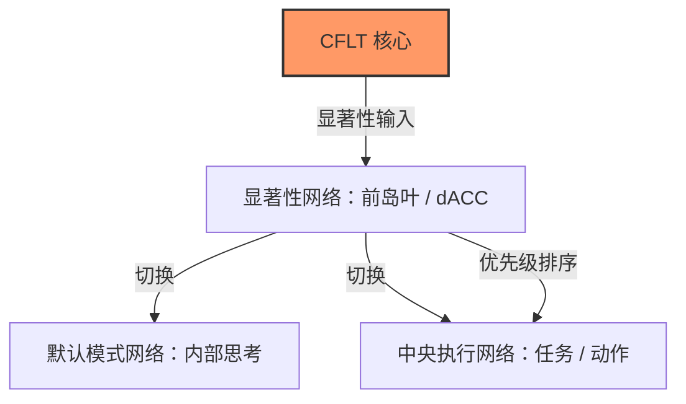
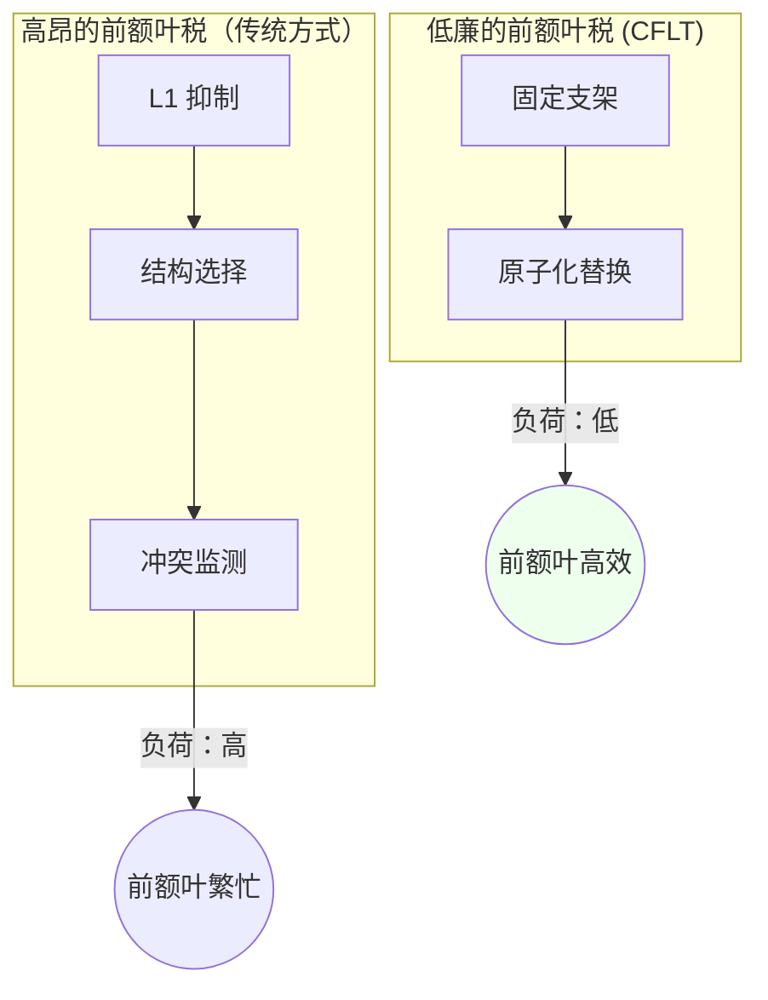
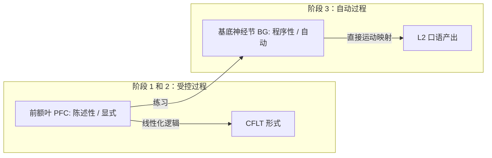

# CFLT 的脑科学基础 (Neuroscience Foundations)

> **版本:** 1.0.0 (内部草案)
> **作者:** CFLT 核心团队
> **组织:** [CFLT.center](https://cflt.center)
> **许可:** [CC BY 4.0](https://creativecommons.org/licenses/by/4.0/)

---

## 1. 显著性网络与 “核心 (Core)”

人类大脑处理信息并非呈扁平序列。它使用一个专门的**显著性网络 (Salience Network, SN)** —— 核心位于**前岛叶 (Anterior Insula)** 和**背侧前扣带回 (dACC)** —— 来识别哪些刺激在行为上是相关的。

- **动态切换:** SN 充当默认模式网络 (内部思考) 与中央执行网络 (任务聚焦) 之间的开关。
- **CFLT 对齐:** CFLT 中的 "核心 (Core)" 是最具显著性的事件或意图的语言化实现。通过将核心置于**位置 0**，CFLT 协议使线性话语与大脑内部的 "优先级队列" 对齐。这减少了从概念化到发音之间的延迟。

---

## 2. 图形-背景与注意力网络

> 参见 [`linguistics.md`](./linguistics.md) §2.1 获取图形-背景的规范介绍；本节给出神经相关性的视角。

CFLT 的 "核心优先" 原则是**图形-背景 (Figure-Ground)** 区分 (Talmy, 2000) 的语言学实现。这种区分的神经相关性存在于**后顶叶皮层 (PPC)** 和**额顶注意力网络**中。

- **注意力窗口化:** 大脑使用 "窗口化" 将特定的实体 (图形 - Figure) 置于前景，以参考框架 (背景 - Ground) 为背景。
- **反转的神经成本:** 跨语言神经成像研究（主要是 Hashimoto, Yokoyama & Kawashima 2012，该实验室的正式期刊文章）表明，处理非规范的图形-背景分配和非规范的词序会引发左侧额叶区域 (LIFG / DLPFC) 的活动增加，这与违反默认显著性预期时所需的额外工作记忆和冲突监测负荷一致。我们将这些发现解释为显著性不匹配成本的*神经签名*，而非对 CFLT 干预的直接测量。**警示**：后续 LATL 组合研究（Bemis & Pylkkänen 2013；Pylkkänen 2019）显示基本语义组合在不同词序下是稳定的，故观察到的成本更可能反映表层重分析而非核心组合加工缺陷。针对 CFLT 的 fMRI 研究已在 §7 中列为开放性问题。
- **CFLT 策略:** 通过先断言核心 (图形)，后提供修饰语 (背景)，CFLT 遵循了大脑空间和注意力处理阻力最小的路径。

---

## 3. 最小化 “前额叶税” (重构成本)

成年人的 L2 产出受到**前额叶皮层 (PFC)** 的制约。用新语言生成句子需要在**背外侧前额叶 (DLPFC)** 和**布若卡氏区 (LIFG)** 投入高昂的代谢和计算成本。

| 成本来源 | 神经机制 | CFLT 解决方案 |
|---|---|---|
| **抑制控制** | DLPFC 必须抑制自动化的 L1 习惯。 | 固定的 4 插槽脚手架减少了实时进行结构决策的需求。 |
| **选择需求** | LIFG 必须在相互竞争的 L1 和 L2 规则间做出选择。 | 该协议消除了线性化选择 ($4! \to 1$)，释放了用于词汇检索的资源。 |
| **冲突监测** | ACC 检测 L1 与 L2 间的 "预测错误"。 | 可预测的模式建立了一个稳定的 "心理模板"，减少了预测错误。 |

通过提供**固定的概念脚手架**，CFLT 降低了 "前额叶税"，使得学习者在 L2 语法完全内化之前就能获得更高的流利度。

---

## 4. 早期立即成分 (EIC) 与神经效率

> 参见 [`linguistics.md`](./linguistics.md) §3 获取 EIC 的规范介绍；本节给出神经效率视角的反映。

**早期立即成分 (Early Immediate Constituents, EIC)** 原则 (Hawkins, 1994) 表明，大脑更倾向于那些能让其尽早识别出短语中心语的结构。

- **依存长度:** 神经成像 (fMRI) 显示，**BA 44 (布若卡氏区)** 和 **lpSTG** 的激活程度随相关成分之间距离的增加而线性增加。
- **CFLT 实现:** 核心优先协议是一种**最大化 EIC** 的策略。通过将 "中心语" (核心) 放在最开始，到从属成分的距离被最小化，从而减少了 "前瞻缓冲区 (look-ahead buffer)" 以及**顶叶皮层**的工作记忆负荷。

> **"神经相关"主张的诚实范围。** 神经成像研究（Friederici 2017 *Language in Our Brain*；Bemis & Pylkkänen 2013 关于 LATL 组合活动；Pylkkänen 2019 *Science*）找到了**早期句法/语义组合**的神经标记 —— ELAN ~150–250 ms、LATL 组合信号在不同词序下稳定。这些发现为 EIC 风格的早期成分加工提供**收敛证据**，但**它们不是 EIC 效率度量本身的直接神经确证**。EIC 是基于语料库推导的解析效率度量（Hawkins 1994）；其具体的神经实现仍是开放的实证问题。CFLT 在语言学层面对 EIC 的援引立论扎实；本节的神经效率框架应被解读为理论受激励，而非已被检验的神经生物学主张。

---

## 5. 位置 0 效应：大脑首因 与 Transformer 注意力

最近对 "StreamingLLM" (Xiao et al., 2024) 的研究发现序列开头的 token 是**注意力汇点 (Attention Sink)**。如 `llm.md` §2.3 仔细消歧所示，汇点是 *softmax 稳定性副产物*（Xiao 等明确指出这些 token "not being semantically important"），与因果掩码累积早期 token 影响力的**首因效应**是分离的两个机制。认知神经科学在脑部识别出部分对应的机制 —— 有时非正式地称为 *"原始标记 (Primal Tokens)"*（项目内部用语，非标准认知科学术语）—— 早到的信息在流式理解中被赋予更大权重。

- **锚点效应:** 大脑使用稳定的参考框架（如自我图式）作为传入感官数据的显著性锚点。
- **首因偏差:** 序列早期项目被更深整合（Murdock 1962 *系列位置效应*；Baddeley 工作记忆首因）。
- **CFLT 应用:** 将核心置于位置 0 利用**大脑首因**（与 LLM 注意力汇点副产物兼容，但不严格依赖之）。它确保最关键的信息占据人类听者与 LLM 上下文的高注意力前缀区。CFLT 的主张依赖首因，不是汇点；详细消歧见 `llm.md` §2.3。

---

## 6. 从 PFC 到基底神经节：程序化

语言精通是从**陈述性记忆** (知道是什么 —— PFC) 向**程序性记忆** (知道怎么做 —— 基底神经节/小脑) 转化的过程。

- **语言的 “肌肉”:** CFLT 将语言视为一种物理技能。僵硬的 4 插槽协议旨在通过反复使用实现**“程序化”**。
- **绕过表述器:** 通过训练大脑直接将概念映射到 CFLT 脚手架中，我们绕过了存在瓶颈的**表述器阶段 (Formulator stage)** (Levelt, 1989)，实现了 "即时" 的言语产出。

---

## 7. 开放性研究问题

1. **PFC 激活增量:** 与传统的基于语法的产出相比，接受 CFLT 训练的 L2 产出是否显示出显著更低的 DLPFC 激活？
2. **ERP 特征:** 可预测的 CFLT 结构是否会导致处理过程中的 **P600** 或 **LAN** 波幅减小？
3. **半球间转移:** "核心优先" 协议是否提高了复杂话语中大脑半球间沟通的效率？

---

## 8. 引用作品

有关完整参考文献，请参见 [`bibliography.md`](../bibliography.md) (§ Neuroscience)。相关的神经科学著作包括：
- **Hashimoto, Yokoyama & Kawashima (2012)** *Cross-linguistic difference in canonical word order affects brain responses during sentence comprehension* —— 关于词序处理差异的正式期刊文章。DOI: [10.2174/1874347101206010062](https://doi.org/10.2174/1874347101206010062)
- **Pliatsikas (2020)** 关于 L2 重构的神经生物学研究。DOI: [10.1017/S1366728919000130](https://doi.org/10.1017/S1366728919000130)
- **Seeley et al. (2007)** 关于显著性网络的研究。DOI: [10.1523/JNEUROSCI.5587-06.2007](https://doi.org/10.1523/JNEUROSCI.5587-06.2007)
- **Friederici (2011)** 关于大脑中语言层级结构的研究。DOI: [10.1152/physrev.00006.2011](https://doi.org/10.1152/physrev.00006.2011)

---

## 另见

- [`linguistics.md`](./linguistics.md) §2, §3 —— 认知语言学层面的图形-背景不对称性和 EIC；本文档给出了它们的神经相关性。
- [`pedagogy.md`](./pedagogy.md) §4, §5 —— 认知负荷理论和技能习得理论，是本文档 §3 和 §6 的教育学推论。
- [`llm.md`](./llm.md) §2 —— Transformer 注意力槽；本文档 §5 描绘了大脑与 Transformer 的平行关系。
- [`mathematics.md`](./mathematics.md) §6 —— 对本文档 §1 中神经描述的相同早期令牌主导地位的马尔可夫/自回归视图。
