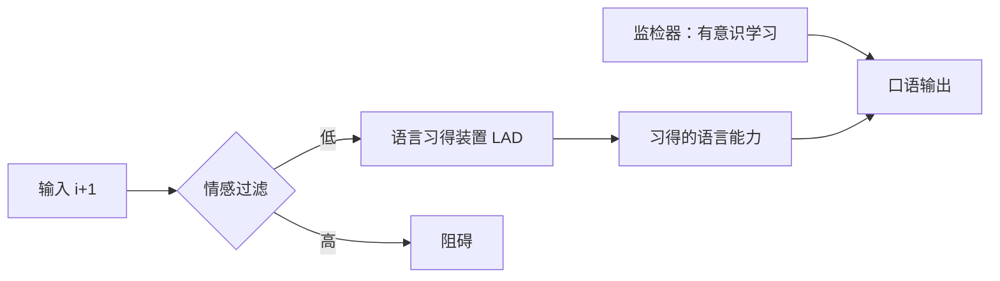
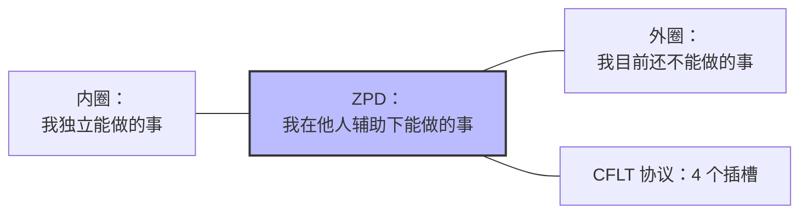
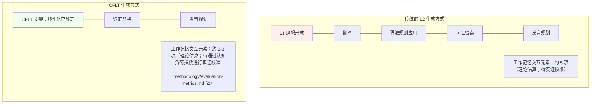

# CFLT 的教学法基础

> 伴随文档：[`manifesto.md`](../manifesto.md)
> 目的：将 **CFLT 协议** 的教学设计植根于第二语言习得 (SLA) 文献中——包括 Krashen、Vygotsky、认知负荷理论、技能习得理论和任务型语言教学。这些来源为该设计提供动机与约束；"核心优先 (Core-First)"课程是**受理论启发且可实验检验的**，下文的学习主张是有待评估的 CFLT 预测，而非已确立的结果。

---

## 1. CFLT 回答的教学问题

为什么成年学习者即使经过多年的学习也无法实现口语流利？

CFLT 的假设：瓶颈在于生成时的**结构重组成本**。具有强大 L1 习惯的成年学习者在每次表达时都面临一个实时决策问题：如何将 L1 形状的前言语信息映射到 L2 表面形式。CFLT 通过提供一个**固定的概念支架**（无论 L1 或 L2 如何都保持一致）消除了这一决策。

---

## 2. 输入假说 (Stephen Krashen)

Krashen (1982, 1985) 的模型认为，人类通过**可理解性输入** ($i+1$) 习得语言，并且当"情感过滤 (affective filter)"较低时，学习效果最好。

**CFLT 的契合点：**
- CFLT 被设计为一个**有利于习得的支架**，而不是一个规则记忆系统。不要求学习者显式记忆四元素协议；他们通过反复接触和模式补全（游戏化的 Builder、基于场景的课件）将其内化。
- 固定协议**降低了情感过滤**：通过使"接下来是什么"变得可预测，该协议减少了实时规划句子的焦虑。
- **CFLT 形式 (CFLT Form)** 的输出被设计为可理解的（相对于学习者当前状态的 +1），但尚未完全地道。Krashen 的 $i+1$ 指的是包含下一阶段结构的可理解性**输入**，而非一种输出格式；CFLT 将可理解性视为一项设计考量，而非声称 CFLT 形式*就是* $i+1$ 区域。

**CFLT 立场（诚实定位）：** Krashen 的强形式（1982；2003 重申）认为**显式形式教学不能转化为习得** —— 监控器只能在限制性条件下*编辑*输出，绝不产生母语级流利度。在该观点下，CFLT 的显式协议与 Krashen 正统不兼容。

CFLT 因此**不**声称与 Krashen 兼容。更接近的理论近亲是：
- **Long (1991) 的关注形式（Focus-on-Form）** —— 任务驱动，但当学习者困难信号出现时允许显式形式关注
- **Ellis (2008) 的接口立场** —— 显式知识在练习实现程序化后可转化为隐式知识
- **VanPatten 的加工教学** —— 在交际使用前进行形式-意义映射的显式训练

CFLT 操作化了接口立场：协议是显式支架（陈述性），跨任务的反复使用使其程序化（程序性），最终风格偏离标志表达性掌握（自动化 + 灵活）。技能习得弧线参见 §5。

---

## 3. 最近发展区 (Lev Vygotsky)

Vygotsky (1978) 的**最近发展区 (ZPD)** 是指学习者独自能做的事情与在指导下能做的事情之间的距离。

**CFLT 作为 ZPD 内的候选支架：** CFLT 把四元素协议提出为一种候选教学支持，与 ZPD 理念兼容 —— 其意图是为学习者在 ZPD 内操作提供支持，而无需为他们完成认知工作。学习者仍然选择核心，仍然选择合适的 L2 词汇，仍然绑定修饰语 —— 但*线性化决策*被卸载给了协议。该协议是否真的落在某位学习者的 ZPD 之内是一个实证问题，需要逐学习者、逐任务地评估；而"支架 (scaffolding)"本身是后续教学研究的术语，并非 Vygotsky 本人所用。

*学习者周围的三个嵌套区；ZPD 是中间带（依据 Vygotsky 1978）。连结为无向的 —— 这些是有界区域，而非进展序列。*

**操作意义：** 随着学习者的进步，CFLT 提议逐渐撤走支架（"消退"理念来自后续支架研究，而非 Vygotsky 本人）。CFLT 假设严格的四插槽强制执行适用于早期阶段；随着学习者掌握协议，系统应放宽约束，最终允许地道的偏离作为有意识的风格选择。消退计划是 CFLT 有待检验的设计假设，而非来源已确立的处方。

---

## 4. 认知负荷理论 (John Sweller)

Sweller (1988, 2011) 确定了工作记忆上的三种认知负荷：

| 负荷类型 | 描述 | CFLT 影响 |
|---|---|---|
| **内在负荷 (Intrinsic)** | 任务固有的复杂性 | 固定的设计默认值（实证上仍开放）；由 L2 的复杂性决定 |
| **外在负荷 (Extraneous)** | 对学习目标的干扰 | CFLT *预测*通过移除结构选择来减少此类负荷（一项尚未测量的 CFLT 特有主张） |
| **相关负荷 (Germane)** | 旨在构建图式的负荷 | CFLT 旨在通过向学习者提供一个图式（四插槽协议）而非数十条规则，将外在负荷转化为相关负荷 —— 这是一项预测，而非已确立的结果 |

**CFLT 认知负荷论点：** 在传统课程中，成年学习者生成 L2 句子大致执行：
1. L1 思想形成
2. L1→L2 翻译
3. L2 语法规则应用（时态、冠词、一致性、语序）
4. 词汇检索
5. 发音规划

这至少是工作记忆上的五个并发需求。CFLT 将 (1)+(2)+(3) 压缩为一个单一的固定顺序操作：将前言语信息线性化为核心优先，然后执行词汇替换。

### 4.1 解决"修饰语陷阱" (教学中的 EIC)

> 参见 [`linguistics.md`](./linguistics.md) §3 了解 EIC 的权威介绍；本小节给出教学法的折射（"修饰语陷阱"作为 EIC 的学习者侧面）。

认知负荷的一个假设来源是**修饰语陷阱**（与 Hawkins 的 EIC 原理类比而来；EIC 主要是关于分析/排序的理论，因此向生成侧的迁移是一项需要证据支持的 CFLT 外推）。对于具有中心语在后背景（如中文）的学习者来说，将修饰语放在名词之前的 L1 习惯被预测会创造很高的**前瞻缓冲区 (look-ahead buffer)** 需求：说话者必须在说出中心语之前规划好整个名词短语。

CFLT 的**中心语在前话语协议**被**预测**能消除这个缓冲区。通过首先明确核心，学习者立即"卸载"了最重要的信息，**预计**能腾出工作记忆来增量地附加修饰语（理由、空间、时间）。这是增量处理的教学应用；工作记忆的量级是一个开放的实证问题（见 §12.1 *情感过滤测量* 以了解相应的测量协议）。

---

## 5. 技能习得理论 (DeKeyser, Anderson)

DeKeyser (2007, 2015) 将 Anderson 的 ACT-R 技能习得模型 (1982, 1993) 应用于 L2 学习：
- **陈述性知识 (Declarative Knowledge)：** 知道*什么*（例如，"核心放在第一位"）。
- **程序性知识 (Procedural Knowledge)：** 知道*如何*（例如，能够说出来）。
- **自动化 (Automaticity)：** 无需有意识努力即可执行技能。

**CFLT 作为技能习得课程：**
1.  **第一阶段 —— 认知重塑**：学习者习得协议的陈述性知识。
2.  **第二阶段 —— 原子映射**：通过多样化的练习（游戏化 Builder、课件、语音挑战、角色扮演），它变得**程序化**：学习者无需有意识分解即可生成符合协议的话语。
3.  **第三阶段 —— 文化细化**：地道的 L2（语法叠加后的形式）变得自动化，而 CFLT 协议成为学习者在认知压力下可以依靠的备用支架。

---

## 6. 任务型语言教学 (TBLT) —— 诚实定位

TBLT (Long 1985, 2015; Ellis 2003) 主张语言学习应围绕交际任务而非语言结构来组织。TBLT 文献内部分为**强式 TBLT**（Long 2015）与**弱式 TBLT**（Ellis 2003），CFLT 与两者的关系不同。

**CFLT 与强式 TBLT *不*兼容。** Long (2015) 显式拒绝*合成型大纲*（synthetic syllabus）—— 任何作为教学主轴的预定义语言项序列 —— 并把*关注形式*（focus on form，任务过程中偶发的形式注意）视为唯一可接受的形式聚焦策略。CFLT 协议在任务之前规定 `[Core] → [Reason] → [Space] → [Time]` 固定模板，正是 Long 反对的合成/关注形式（focus-on-forms）支架。

**CFLT *有可能*与弱式 TBLT（Ellis 2003）和 VanPatten 加工教学兼容，但取决于活动设计。** Ellis 把显式形式聚焦与任务实践视为互补；VanPatten 的加工教学在交际使用前显式训练学习者的形式-意义映射。CFLT *力图*同时操作化两者 —— 协议作为显式支架，课件作为任务交付 —— 但一项 CFLT 活动只有在满足正式任务标准时才算作"任务"，并且在声称符合加工教学之前需要真正的结构化输入活动（而不仅是输出练习）。

> **任务清单（在使用 TBLT 标签前审核）：** 一项活动只有同时满足以下条件才算作任务：(1) 主要以意义为中心，(2) 具有非语言的交际结果，(3) 包含信息、推理或观点缺口，(4) 要求学习者调用自身的语言资源。仅凭场景标签和词汇情境并不能确立"任务性 (taskness)"。

**CFLT 课件生成器作为候选（弱式）TBLT 引擎：** 生成器接收输入 `topic`（主题）、`industry_context`（行业背景）、`age_group`（年龄组）、`difficulty_level`（难度级别），并生成一系列基于场景的活动，每个都是一个符合协议的交际场景，嵌入了词汇重点和视听情境。这些是否算作 TBLT *任务*，必须在活动与结果层面对照上述清单加以证明，而不能仅凭场景标签断言。IT 英语模块（宣言 §8.2）是规范案例：诸如"部署服务、调试延迟问题、重构模块"等活动携带行业适用词汇，而协议提供结构骨架。

**诚实总结**：CFLT 把自身定位为 *接口立场*（Ellis 2008）框架 —— 显式协议 + 任务实践 → 程序性自动化 —— 而**不是**严格 Long 意义的 TBLT。

---

## 7. 言语生成模型 (Levelt, Kormos)

Levelt (1989) 和 Kormos (2006, 2014) 对言语生成链进行了建模：
**概念化器 → 表述器 → 发音器** (Conceptualizer → Formulator → Articulator)

成年 L2 生成通常"不流利"，因为**表述器**阶段存在瓶颈。大脑在试图寻找单词的同时，还在试图决定把单词放*哪里*。

**CFLT 干预点：** 通过固定线性化子任务（不再有"时间状语放哪？"的决策），CFLT *预测*协议会为 Kormos 确定的 L2 特有需求腾出工作记忆。（Kormos 描述的是横跨多个生成阶段的约束，并未单独锁定表述器，也未测试固定模板，因此这是一项可测试的外推，而非已确立的证据。）具体而言：
1.  **更早的发音起始：** 学习者一检索到核心就开始说话。
2.  **降低修复率：** 由于顺序固定，纠正语序错误的"重新开始"减少了。

这些是关于接受过 CFLT 训练的学习者在工作记忆负荷下的生成行为的可测试预测。

---

## 8. 双语词汇检索 (Kroll)

Kroll 的**修订分层模型 (Revised Hierarchical Model)** (Kroll & Stewart 1994; Kroll et al. 2010) 表明，早期 L2 学习者通过其 L1 获取意义（*单词关联路径*）。随着他们的进步，他们直接从概念获取意义（*概念中介路径*）。

**CFLT 作为提议中的概念中介加速器：** 通过训练学习者以语言中立的线性化方式思考（概念 → CFLT 支架 → L1 *或* L2 表面），CFLT *假设*该协议绕过单词关联路径。两项 Kroll 研究都没有测试结构支架或 CFLT，且路径强度是分级的、对任务敏感的、并存的，而非离散的普遍阶段 —— 因此这种加速是一项有待通过直接翻译与图片命名实验检验的 CFLT 假设。

CFLT *提议*将其与自然语义金属语言 (NSM) 的作用配对（宣言 §2.5）：语义原语作为填充插槽的语言中立原子。"NSM + CFLT 共同构成一个学习者在提交到 L1 或 L2 表面形式之前先访问的**语言中立概念层**"这一观点是一项 CFLT 教学提议，而非已确立的结果。

---

## 9. 关键期与发展阶段

儿童常被**假定为更好的长期 L2 习得者**（尤其在母语级最终成就方面），不过所引用的统计学习研究展示的是婴儿在受控任务上的成功，而非普遍意义上儿童优于成人。儿童同样不擅长*解释他们学到了什么*。因此，正确的问题不是"CFLT 对儿童有效吗？"，而是**"每个发展阶段的正确交付机制是什么？"**

"核心优先"协议运作在**认知概念层面**，而非元语言层面。内化该协议的孩子不需要*知道*他们正在应用一个四元素协议；他们只需要通过反复接触符合协议的输入来吸收模式。这正是孩子最初习得语法的方式 —— 没有规则讲座。

| 学习者类型 | 交付方法 | 理论基础 |
|---|---|---|
| 早期学习者 (~4–11 岁) | **视觉 CFLT**：用于插槽填充符的动画图标，约 500 个语义原语，通过游戏吸收模式 | Krashen 的内隐习得；在所研究任务范围内已证实的婴儿统计学习能力 (Saffran, Aslin & Newport 1996)，而非已确立的儿童优于成人的优势 |
| 成年人 | **效率 CFLT**：显式图式，行业标记，复杂连接词 | 成年人的元语言优势 (DeKeyser 2007)；图式迁移；刻意练习 |

宣言的 §8.1 "跨年龄适应"已经编码了这种差异。CoreFirst v1 PRD 将初始产品范围限定为成年学习者 —— 但这只是一个 **v1 产品范围决策**（UI/UX 适配、内容审核基础设施和适合儿童的课件需要大量的额外投入），**而非 CFLT 不适合儿童的理论主张**。

CFLT 可能特别适合早期学习者的几个原因 —— 与"成年人进行显式学习"的框架可能幼稚地暗示的相反：

1.  **假设中的统计学习契合。** 婴儿在所研究条件下是强大的模式提取器 (Saffran et al. 1996; Lany & Saffran 2010)。CFLT *假设*符合 CFLT 的输入会为学习者提供一个更干净、更一致的统计信号供其内化；没有任何所引用的研究测试过 CFLT，也没有确立减少自然语言方差确实有益于长期习得，因此这是一项有待检验的 CFLT 假设。
2.  **假设中的较低 L1 干扰平台期。** 成年人通常会遇到平台期，因为根深蒂固的 L1 习惯抵制重组。CFLT *提议*在 L1 之后或同时习得 L2 的儿童可能更直接地吸收该协议，需要克服的干扰较少 —— 这是一项尚未检验的 CFLT 预测。
3.  **关键期证据是渐进的，而非青春期断崖。** Hartshorne, Tenenbaum & Pinker (2018) 估计，语法学习*能力*在约 17.4 岁之前保持较高，随后下降；而母语级最终成就通常需要在约 10 岁前开始，因为学习会持续多年——起始年龄与能力是两个不同的概念，不应混为一谈。CFLT *提议*，通过将线性化决策外化，它或许能缩小最受年龄影响的那部分差距（结构重组子任务），同时让不受年龄影响的技能（词汇、语用）正常发展 —— 这一主张需要一项 CFLT 的年龄×训练实验来验证。

---

## 10. 诚实的局限性

1.  **教学的"人造性" / 僵化风险。** 严格的四插槽句子对高级学习者来说可能感觉很不自然。Skehan (1998) 的权衡假设促使我们*同时测量*复杂度、准确性和流利度；至于固定模板会使学习者在*流利度*上达到平台、而以*复杂度*和*准确性*为代价这一具体主张，则是一项 CFLT 特有假设，而"Wes"单一个案传统（Schmidt 1983）展示的是某一位学习者身上交际能力与语法能力的分化，而非对 CFLT 模板的检验。CFLT 提议的应对是下文 §11.2 的去支架化路径：系统力图管理**向显性偏离的过渡**（宣言 §3.1），以避免流利度天花板。§11 的支架消退课程是 CFLT 针对该风险的具体应对，也是一项有待检验的设计假设，而非来源已确立的解决方案。
2.  **动机 vs. 方法。** 没有任何协议能解决学习者动机缺乏的问题。CFLT 是一个高效引擎，但它仍然需要学习者与输入进行互动。
3.  **词汇广度。** 协议侧重于结构。词汇习得仍然是一个独立但相关的挑战，需要专门的模块。

---

## 11. 高级前沿：Skehan 的权衡与脚手架撤除

对固定序列协议的一个常见批评是，它们可能导致"语言僵化"或"模板僵化"。Skehan 的 **权衡假设 (Trade-off Hypothesis)** (1998) 并未确立固定序列模板会导致僵化或流利度平台；它促使我们*同时测量*复杂度、准确性和流利度。CFLT 即以此方式使用它，并把下文的模板僵化担忧与去支架化应对都框定为有待检验的 CFLT 特有假设。

### 11.1 流利度-准确性-复杂度 (FAC) 三元组
Skehan 认为学习者的注意力资源有限，必须在以下三者之间分配：
- **流利度 (Fluency):** 产出的难易程度。
- **准确性 (Accuracy):** 语法的正确性。
- **复杂度 (Complexity):** 结构的多样性和有标记形式的使用。

**CFLT 的战略选择**（级别阈值是 CFLT 的设计默认值，实证上仍开放，并非由 Skehan 推导）：
- **在 A1–B1 级别**，CFLT *力图*通过固定序列优先考虑**流利度**（并预测同时提升**准确性**），从而降低"复杂度"（规划）负荷。流利度与准确性是否真的会同步提升是一个测量问题，而非有保证的结果；其意图是让学习者能够尽早获得交际成功。
- **在 B2+ 级别**，目标发生转移。一旦学习者实现了无标记序列的自动化，CFLT 提议重新引入**复杂度**。

### 11.2 去支架化 (脚手架撤除)
精通的定义不是严格遵守协议，而是**有意识地**偏离协议的能力。CFLT 的高级模块（第三阶段：表达性掌握）显式教授**焦点驱动的偏移**：
- **主题化 (Topicalization):** 将 [时间] 或 [空间] 移至句首以进行宏观主题强调。
- **末尾焦点重新打包 (End-Focus Repackaging):** 利用分裂句（*"It is [X] that..."*）来突出显示场景框架槽位，当它是话语的具体述位（新信息）时。

*示例：*
- **无标记（第 2 阶段）：** "I wrote the code, at home, yesterday."
- **有标记（第 3 阶段空间焦点）：** "**It was AT HOME** that I wrote the code, yesterday."

在这种观点下，CFLT 协议是一个**生存脚手架**，最终被"淹没"到学习者的潜意识中，成为他们可以为了修辞细微差别而偏离的默认逻辑。这标志着向母语般流利度的过渡，此时协议充当的是认知"保险丝"而非僵硬的约束。

---

## 12. 开放性研究问题

1.  **情感过滤测量。** 协议的可预测性能否显著降低外语口语焦虑 (FLSA)？
2.  **消退计划。** 引入"有标记"形式（例如前置的时间状语）的最佳时间是什么时候，以避免阻碍学习者的风格发展？
3.  **跨模态迁移。** 通过语音挑战进行的"核心优先"协议训练能否有效地迁移到写作和阅读中？

---

## 13. 参考文献

完整的参考文献请参见 [`bibliography.md`](../bibliography.md) (§ 教学法与第二语言习得)。

---

## 另请参阅

- [`linguistics.md`](./linguistics.md) §5 — Levelt 的言语生成模型，此处 §7 的认知基质。
- [`neuroscience.md`](./neuroscience.md) §3, §6 — "前额叶税"与程序化；此处 §4 和 §5 背后的神经机制。
- [`mathematics.md`](./mathematics.md) §10 — 每个标记认知成本的决策论界限，使此处 §4 的认知负荷论点形式化。
- [`../methodology/human-learning.md`](../methodology/human-learning.md) — 本基础文档在理论上支持的学习者操作指南。
- [`../methodology/curriculum-engineering.md`](../methodology/curriculum-engineering.md) — 通过标记包进行的 TBLT 扩展，源自此处 §6。
