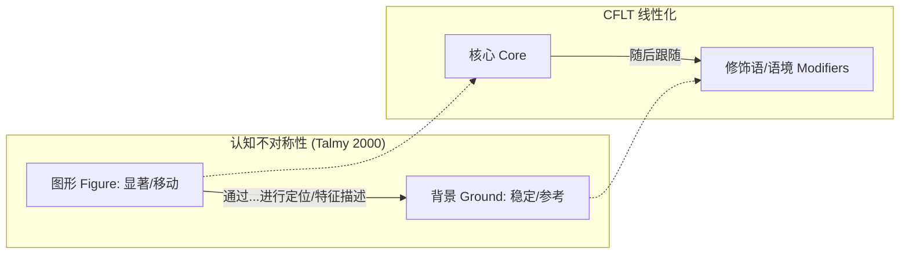
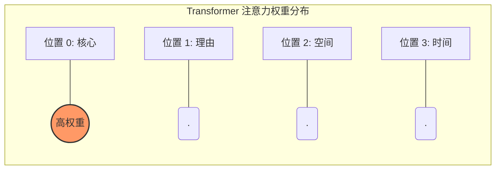

# 核心优先语言理论 (CFLT) 宣言：从第一性原理重构全球双语教育

> **版本:** 1.0.0 (内部草案)
> **作者:** CFLT 核心团队
> **组织:** [CFLT.center](https://cflt.center)
> **许可:** [CC BY 4.0](https://creativecommons.org/licenses/by/4.0/)

## 1. 摘要

**核心优先语言理论 (Core-First Language Theory, CFLT)** 是一个面向跨语言通信与双语教育的统一理论与操作框架。它提出一条话语层级 (discourse-level) 的原则 —— *话语的认知核心，也是其在任何语言中被普遍优先排列的线性位置* —— 并由此定义出一套可教学、可被 AI 支持的排序协议（**CFLT 协议**），用以最小化任意两种自然语言之间的认知摩擦。

### 1.1 CFLT 的性质：协议 vs 描述

明确区分两个层级的语言主张至关重要：
1.  **描述性观察：** 自然语言的表面语序千差万别（如英语 SVO vs 日语 SOV）。CFLT *并不* 主张所有自然语言在天然分布上都是核心优先的。
2.  **规范性协议：** CFLT 是一套**认知人体工程学 (Cognitive Ergonomics) 的工程协议**。它定义了信息*应当*如何排序，以实现在跨语言迁移、二语习得和 AI 提示工程中的最低认知负荷。

CFLT 之于语言，正如 **TCP/IP** 之于网络：它是一种标准化的思想“数据包头”格式。通过采用“核心优先”的中介语协议，学习者可以避开结构重构（如在德语中等待动词，或在日语中先构思 10 个词的修饰语再产出名词）所带来的巨大代谢成本。它是**无标记的默认值**，而非描述性的普适规律。

通过识别全人类共享的认知“硬件”（乔姆斯基的普遍语法，并经由 *核心语法 (core grammar)* ↦ *核心优先排序 (core-first sequencing)* 的扩展）同时中和文化“软件”层面的偏差（萨丕尔-沃尔夫假说），CFLT 借助 AI 在任意两种语言之间构建无缝桥梁。

**分层命名：**

| 层级 | 名称 | 角色 |
|---|---|---|
| 框架 | **CFLT — 核心优先语言理论** | 统一了学术理论与操作协议的名称 |
| 实施 | **CFLT 协议** | 具体的 `[核心] → [修饰语]` 排序规则 |

**CFLT** 是其科学基础与实践方法的统一名称。术语 **CFLT 协议** 特指操作层面的排序规则。**CFLT 是开放框架**：任何团队都可以独立研究、实现或扩展它。**CoreFirst**（[corefirst.world](https://corefirst.world)）是 CFLT 的官方参考实验项目，但不是必需的依赖或许可门槛 —— 它与社区可能构建的任何其他实现并存。

---

## 2. 理论基础

> §2.1–§2.5 的概述刻意保持简洁。如需深入论述（含诚实的局限性与引用），请参阅配套文档：
> - **[`foundations/core-concept.md`](foundations/core-concept.md) — 请先阅读此篇。** 定义 "核心 (Core)" 的含义：显著性锚点，而不是动词或谓词。可避免误读其他基础文档中的类比。
> - [`foundations/linguistics.md`](foundations/linguistics.md) — 普遍语法 (UG)、信息结构、认知语言学、言语产生
> - [`foundations/phonetics.md`](foundations/phonetics.md) — 跨语言语音迁移、肌肉智能
> - [`foundations/sociolinguistics.md`](foundations/sociolinguistics.md) — 礼貌、语体、敬语
> - [`foundations/pedagogy.md`](foundations/pedagogy.md) — Krashen、Vygotsky、认知负荷理论、任务型语言教学 (TBLT)、技能习得
> - [`foundations/neuroscience.md`](foundations/neuroscience.md) — 显著性网络、前额叶皮层 (PFC) 代谢成本、早期立即成分 (EIC)、程序化
> - [`foundations/logic.md`](foundations/logic.md) — 谓词逻辑、lambda 演算、组合范畴语法 (CCG)、言语行为、关联理论
> - [`foundations/mathematics.md`](foundations/mathematics.md) — 信息论、均匀信息密度 (UID)、最优编码、线性化
> - [`foundations/llm.md`](foundations/llm.md) — Transformer 注意力偏差、提示词顺序、思维链 (CoT)
> - [`bibliography.md`](./bibliography.md) — 统一参考文献列表

### 2.1 普遍语法与 *核心语法* (诺姆·乔姆斯基)
**概念：** 人类大脑天生具有一种生物学层面的“语言习得装置 (LAD)”。乔姆斯基将 *核心语法* (普遍原则) 与其 *边缘* (特异、习得的部分) 相区分。

**CFLT 扩展：** 在乔姆斯基的 *核心语法* 作为一个结构范畴的基础上，CFLT 引入了**动态线性化**原则：*认知核心同时也是话语在普遍意义上被优先放置的句首位置*。

### 2.2 认知基础：图形-背景与 EIC

**图形-背景 (Talmy):** CFLT 编纂了**图形优先**线性化。核心 (图形) 是显著事件，而修饰语 (背景) 提供参考框架。这符合将显著事件相对于稳定框架进行定位的认知预期。

**早期立即成分 (Hawkins):** CFLT 为了**解析效率**进行了优化。通过将核心置于位置 0，它最小化了“成分识别域”，使效率比接近 100%，并减少了人类和机器的前瞻缓冲区。

### 2.3 计算基础：注意力槽 (Xiao 等)

**概念：** 基于 Transformer 的 LLM 出于两个不同原因过度关注前缀区 —— (1) **注意力汇点（Attention Sinks）**（Xiao 等 2024），softmax 稳定性副产物，初始 token 不论语义内容如何都吸收注意力；(2) **首因/位置偏置**，因果掩码使早期 token 对后续 token 的影响在深度上累积。
**CFLT 应用：** CFLT 利用的是 (2)，不是 (1)。把核心放在高注意力前缀区（通常是 `<bos>` 之后位置）会在生成中累积其影响力 —— 但这是首因论证，**不是**主张注意力汇点"偏好"语义内容。详细消歧参见 [`foundations/llm.md`](foundations/llm.md) §2.3。

### 2.4 萨丕尔-沃尔夫假说 (语言相对论)
**概念：** 语言结构影响习惯性的认知模式。
**CFLT 应用：** 对于来自“主题优先”背景 (如中文) 的学习者，CFLT 提供了一种**中性缓冲序列**，以消除在不同的 L2 结构中进行“为言语而思考”的心理成本。

### 2.5 自然语义金属语言 (安娜·维兹比卡)
**概念：** 所有含义都可以被还原为普遍的“语义原语”。
**CFLT 应用：** AI 利用这些原语作为**原子词汇**来填充 CFLT 槽位，促进任意对任意的跨语言翻译。

---

## 3. 核心框架：核心优先排序协议

### 3.1 原则：“核心在前，补充在后”
CFLT 规定一种标准化的信息序列以统一人类表达：

**`[核心] → [理由] → [空间] → [时间]`**

在**规范（无标记）序列**中，所有四个元素都存在。具体实现和教学材料在教授默认形式时应保留此四元素排序；部分序列（例如丢弃 `[空间]`）被视为规范序列的**简略形式**而非替代协议，且槽位顺序规则仍适用于存在的任何槽位。

> **四槽的覆盖范围。** 协议只规定**场景框架** —— 事件外部的世界框架。属于事件本身的修饰语（方式 *慢慢*、工具 *用黄油*、受益者 *为妈妈*、伴随、情态、否定）作为事件核的一部分**驻留在 Core 内部**，不是独立槽位。每种语言用各自的原生句法（格标、介词、助词、连动结构）在内部组装事件核；CFLT 不规定这种内部组装。因此四槽**不是**所有修饰语的穷尽分类 —— 它们是无标默认值置于 Core 之后的*情境框架*的穷尽分类。两层模型参见 [`foundations/core-concept.md`](foundations/core-concept.md) §2.1–§2.2，操作判定树参见 [`methodology/slot-disambiguation.md`](methodology/slot-disambiguation.md)。

> **英语在本文档中的角色。** 由于英语是最有文档积累的 L2、也是 LLM 支持最强的语言，本文档使用英语作为**默认示例语言**与**跨语言槽位分配的验证锚**。然而英语**不是**跨语言学习的强制中介（汉语↔日语学习者不必经过英语），也**不是**非英语目标语言中 Core 边界的判定权威。
>
> CFLT 的普适性是**协议层主张**：模式（核心居首、R→S→T）与槽位语义（功能性 WHY/WHERE/WHEN 问题）是语种无关的。**它不主张英语在实践中不必要。** L3 / 附加语习得文献（Cenoz 2003；De Angelis 2007）从理论上支持 L1↔L2 直接迁移的立场，但*生态现实*是英语在全球大多数学习语境中充当资源与元语言媒介。具体语言对课程可以合法地使用学习者既有 L2（通常是英语）作为元语言解释媒介，而不矛盾于 CFLT 的协议层普适性。事件核内部组装与语言特定的 edge case 委托给各语言的原生句法。分层细分参见 [`foundations/core-concept.md`](foundations/core-concept.md) §2.3，具体语言对的落地参见[语言对指南](methodology/language-pair-guides/index.md)。

> **重要适用范围说明。** 四元素规范序列定义的是 CFLT 的**无标记默认值** —— 即流利说话者在没有特殊修辞目的时产出的形式。它**并不**禁止成熟流利度所需的标记偏离（主题化、前置、分裂句、末尾重量重组），也不要求每个话语都展示所有四个槽位。每种自然语言对同一命题内容都有多种表达形式，CFLT 通过将自身视为学习后期有意进行的标记偏离的**基准线**来包容这一点。这种设计也正面回应了 **Skehan 的权衡假设 (Trade-off Hypothesis)**：在初级阶段通过限制复杂度（固定模板）来换取流利度与准确性，而在高级阶段通过“脚手架撤除”引入标记形式。完整的无标记/标记区分参见 [`foundations/core-concept.md`](foundations/core-concept.md) §6，误读反驳矩阵参见 §7。

### 3.2 演示 CFLT 转换

CFLT 中的核心是一个**显著性锚点**，而不是动词（参见 [`foundations/core-concept.md`](foundations/core-concept.md)）。以下四个例子说明了协议所容纳的四种核心类型。

#### 示例 1 — 动作核心
**L1 (中文，重语境顺序):** *昨天下雨，我在家没出去。* — 时间 → 原因 → 结果
**CFLT 重构:** *我没出去，因为下雨，在家，昨天。* — 核心 → 原因 → 空间 → 时间
**英语 (CFLT-L2):** *I didn't go out, because it rained, at home, yesterday.*

#### 示例 2 — 身份 / 描述核心
**L1 (中文):** *那个穿红衣服的女孩是我妹妹。* — 修饰语重的名词短语 → 身份
**CFLT 重构:** *那个女孩是我妹妹，穿着红衣服，在照片里，去年夏天。* — 核心 (身份) → 描述 → 空间 → 时间
**英语 (CFLT-L2):** *That girl is my sister, wearing a red dress, in the photo, from last summer.*

#### 示例 3 — 状态核心
**L1 (中文):** *开了一下午会，我在办公室都累瘫了。* — 原因 → 空间 → 状态
**CFLT 重构:** *我累瘫了，因为开了一下午会，在办公室，刚才。* — 核心 (状态) → 原因 → 空间 → 时间
**英语 (CFLT-L2):** *I'm exhausted, because of the meeting, in the office, just now.*

#### 示例 4 — 请求 / 言语行为核心
**L1 (中文):** *现在能在桌上帮我递一下盐吗？* — 时间 → 空间 → 请求
**CFLT 重构:** *请帮我递一下盐，在桌上，现在。* — 核心 (请求) → 礼貌标记 → 空间 → 时间
**英语 (CFLT-L2):** *Could you please pass the salt, on the table, now?*

**CFLT 优势：** 在所有四种核心类型中，一旦学习者在母语思维中采用了核心优先排序，生成目标语言就变成了一项**令牌置换**练习，而不是结构重组。协议是统一的；填充位置 0 的内容随说话者的意图而变化。

---

## 4. 与相邻文献的区分

CFLT 应与文献中已经出现的表面相似的短语仔细区分：

> Ambridge, B. & Wagner, L. (eds.) (2021). *Testable Theories of Core First Language Acquisition*. Special Issue, *Journal of Child Language*, Vol. 48, Special Issue 5.

**切分对比：**

| | Ambridge & Wagner (2021) | CFLT (本项目) |
|---|---|---|
| 成分结构 | `[core] + [first language acquisition]` | `[core-first] + [language theory]` |
| 主题 | 儿童习得 L1 的**核心机制** | 跨语言话语的**核心优先排序**规则 |
| 人群 | 习得母语的儿童 | 产出 L2 的双语学习者 |
| 领域 | 发展心理语言学 | 应用语言学 + AI 辅助双语教学 |

这两个字符串在三元组 "core first language" 处重叠，但其底层概念互不相关。CFLT 不涉及 L1 习得；Ambridge/Wagner 卷不涉及双语排序。在任何可能与 L1 习得文献共同被检索到的作品中，论及 CFLT 的作者必须援引此项区分。

---

## 5. AI 驱动的实施路线图

### 阶段 1：认知重塑 (LLM 作为逻辑导师)
AI 训练用户使用核心优先序列在母语中表达意图。该阶段专注于打破特定于 L1 的句式模式。

### 阶段 2：原子映射 (LLM 作为令牌交换器)
AI 在已建立的核心优先框架中引入目标语言的 "令牌"。语法通过模式识别隐性习得，而不是显式规则记忆。

### 阶段 3：文化精炼 (高级模块)
一旦通过 CFLT 实现了功能性流利，AI 就会引入特定于文化的习语、隐喻和高级风格细微差别。

---

## 6. 全球愿景：任意对任意双语化

CFLT 不仅限于中文到英语。它被设计为**人类交流的通用协议**。通过采用核心优先序列作为 "全球中介语"，我们可以跨任何语言对扩展双语教育：

*   **日语 (SOV) ↔ 德语 (V2):** 
    - *日语习惯:* [修饰语] → [宾语] → [动词]。 
    - *CFLT 枢轴 (脚手架形式):* "Ich esse einen Apfel (核心), weil ich Hunger habe (理由), im Park (空间), jetzt (时间)。" 
    - 通过强制日语大脑立即输出动作 (动词)，我们绕过了德语 V2 主句中的 "等待动词" 处理延迟。随后，语法叠加层将附加的状语润色为地道的德语位置。
*   **阿拉伯语 (VSO) ↔ 西班牙语 (SVO):**
    - *阿拉伯语习惯:* [动词] → [主语] → [宾语]。 
    - *CFLT 枢轴 (脚手架形式):* "Como una manzana (核心), porque tengo hambre (理由), en la cocina (空间), ahora (时间)。" 
    - CFLT 将阿拉伯语的动词优先倾向与西班牙语的 SVO 核心对齐；**自然语义金属语言 (NSM) 原语**在跨语言中介层充当语义桥梁，确保动词的 *意图* 在不同的变位系统中得以保留。上方所示为西班牙语 L2 的 CFLT 脚手架形式（与日语 ↔ 德语示例同层级），而非 NSM 符号本身。

官方参考实现托管在 **corefirst.world**；框架本身开放给任何团队独立实现。

---

## 7. 参考实现：CoreFirst

下面这一节描述 **CoreFirst**，CFLT 的官方参考实现。它示范协议如何被操作化为产品；它**不是**规定所有 CFLT 实现必须如此设计。

### 7.1 "语义乐高" 哲学
CoreFirst 不将语法作为僵硬的规则来教学，而是将语言视为一组功能块。目标是以**最低的认知负荷**实现**最高的交流效率**。

### 7.2 核心语言要素的实现

#### A. 词性 → 逻辑块
语法术语（名词、动词）被直观的功能类别取代：
*   **`[谁/什么]`** (主语/宾语)
*   **`[动作]`** (谓语)
*   **`[语境]`** (时间、地点等状语)

> *注：此处 `[语境]` 是面向学习者展示时（教材、课件、产品界面皆适用）使用的归类标签，统称 CFLT 的修饰类槽位 —— 通常对应 §3.1 中的 `[空间]` + `[时间]`。它不是第五个 CFLT 槽位。*

#### B. 时态 → 语义时间令牌
为了解决英语时态的复杂性，CFLT 使用 "时间令牌"。
*   *输入:* "I eat [时间: 昨天]"
*   *AI 增强:* 自动精炼为 "I ate"，同时验证语义意图 (过去) 已被正确传达。

#### C. 复杂结构 → 扁平化逻辑
避免嵌套子句（如定语从句）。使用线性的、叠加的逻辑。
*   *传统:* "The man who is standing there is my boss."
*   *CFLT 逻辑:* "That man is my boss, [描述] he is standing there."

### 7.3 产品逻辑：语义优先，语法其次
1.  **语义核心:** 优先考虑 CFLT 逻辑序列的正确性。
2.  **语法叠加:** AI 充当非侵入式的 "自动纠错" 插件，在不中断思维流动的情况下，将用户的 CFLT 输出润色为地道的 L2。

---

## 8. CFLT 内容生态：通用教学法

### 8.1 跨年龄适应
CFLT 为所有年龄段取得教育内容奠定了基础：
- **早期学习者:** 专注于 "视觉 CFLT"，使用动画图标和约 500 个受限的语义原语，建立直观的概念到逻辑的映射。
- **成年学习者:** 专注于 "效率 CFLT"，针对专业场景使用行业特定的令牌和复杂的逻辑连接词。

### 8.2 行业特定模块：以 "IT 英语" 为例
CFLT 框架特别适用于技术交流。在 **IT 行业**，"动作-结果优先" 的逻辑与工程文档和协作编码完美契合。
- **示例令牌:** *deploy, refactor, debug, latency, endpoint, scalability.*
- **逻辑映射:** 而不是 "If we have high latency, we should refactor the code," CFLT 鼓励: "**Refactor the code**, because of **high latency**, in the **backend**, now."
- **益处:** IT 专业人员可以即时、准确地跨文化传达关键的技术决策。

同样的模块化词词汇注入模式可以扩展到医疗、金融、技术和酒店行业，而无需改变底层的认知协议。

### 8.3 多模态交付 (视听合成)
- **音频优先:** 优先考虑语音输出，韵律和重音模式强调 CFLT 块的 `[核心]`。
- **视觉支持:** AI 生成的图像或短片为核心概念提供即时的视觉反馈，绕过对母语翻译的需求。

### 8.4 自动化课件生成
利用 LLM，CFLT 框架可以根据简单的提示（例如 "为一个 8 岁孩子设计的医院场景"）自主生成完整的课程。这确保了所有教育内容都与 "核心优先" 排序原则保持一致。

---

## 9. 语音迁移：利用现有知识体系

### 9.1 拼音-到-IPA 桥梁
对于亚洲学习者，特别是具有中文背景的学习者，CFLT 利用其对**拼音**的既有掌握来加速发音的习得。
- **重叠集:** 直接迁移共有的声音，如 /b/, /p/, /m/, /f/。
- **修改指导:** 提供 "相对调整" 而非抽象的发音描述。(例如: "要发出英语的 /v/，从拼音 'f' 的肌肉位置开始，但振动你的声带。")
- **零到一音位:** 对于母语体系中完全缺失的声音 (如 /θ/)，AI 根据相关的母语口型生成类比。

### 9.2 肌肉智能
语言学习是一项身体技能。通过识别 L1 和 L2 之间的 "肌肉重叠"，CFLT 降低了学习 "新" 声音的认知阻力，将其视为熟悉动作的变体。这与核心优先排序原则相辅相成：如果说 §3 减少了**句法**摩擦，那么 §9 减少了**发音**摩擦。两者都源于同一个第一性原理方法 —— 利用学习者大脑和身体已经编码的内容。

---

## 10. 结论：智能的统一协议

CFLT 不仅仅是一个语序规则；它是一个旨在解决全球语言区域间认知异构间隙的**中性逻辑协议**。

### 10.1 核心发现
跨语言交流的障碍根源于**结构重组税 (Structural Restructuring Tax)**。当在异构语系（如汉语 ↔ 英语、日语 ↔ 德语）之间迁移时，大脑会将有限的代谢资源消耗在将 L1 逻辑模板“重塑”为 L2 表面形式上。这种持续的后台处理是人类表达不流利和 AI 逻辑方差的根源。

### 10.2 解决方案：中介语缓冲区
CFLT 主张在 L1 和 L2 之间存在一个**语言中性逻辑层**。通过将原始意图直接映射到核心优先序列，我们创建了一个标准化的“思想数据包”（思想的 TCP/IP）。该协议具有：
- **L1 兼容性：** 它捕捉说话者的意图，而无需过早进行句法承诺。
- **L2 友好性：** 它为目标语言令牌提供了一个一致的落地信标。

### 10.3 终极效益：即时流利 (Instant Fluency)
通过采用 CFLT 协议，学习第二语言的任务从**复杂的结构重组**转变为**简单的令牌置换**。
- **对于人类：** 它消除了重组延迟，实现了**即时流利 (Instant Fluency)** 并减少了言语焦虑。
- **对于 AI：** 它使信息密度与 Transformer 的注意力架构对齐，实现了**无损逻辑对齐 (Lossless Logic Alignment)** 和确定性推理。

CFLT 是桥梁。通过标准化思想序列，我们将人类与机器智能统一为一个高保真的通信网络。

---

*由 CFLT 核心团队创作，2026。项目主页: cflt.center*