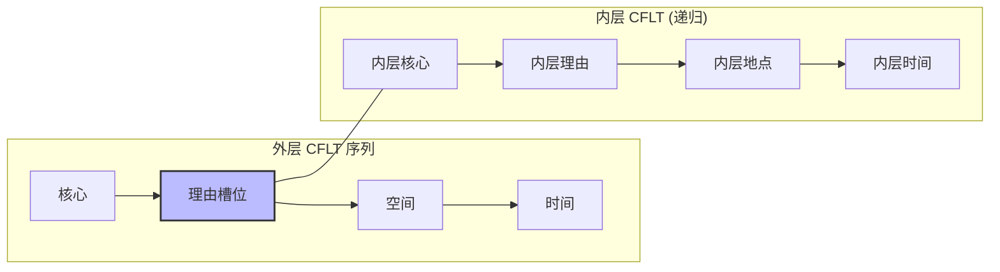
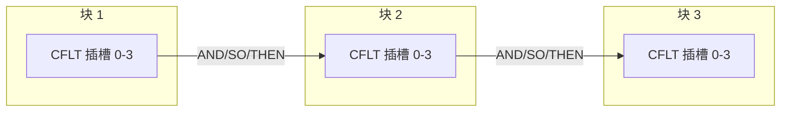
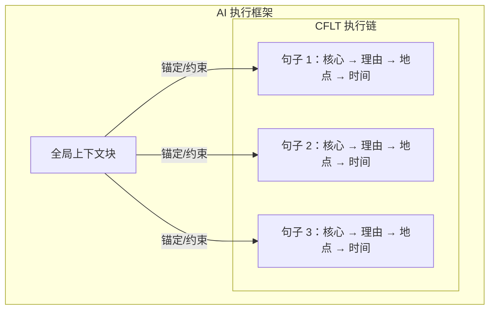

# 方法论：复杂结构与递归 (CFLT-Complex)

> **版本：** 1.0.0 (内部草案)
> **作者：** CFLT 核心团队
> **组织：** [CFLT.center](https://cflt.center)
> **许可：** [CC BY 4.0](https://creativecommons.org/licenses/by/4.0/)

> **目的：** 扩展基础 CFLT 协议，以处理嵌套从句、条件句和复杂的叙述结构，同时不违反“核心优先 (Core-First)”的指令。

---

## 1. 基础协议的局限性

基础 CFLT 序列 —— `[核心] → [理由] → [空间] → [时间]` —— 针对单一、离散的思想进行了高度优化。它体现了“扁平化逻辑”。

然而，人类的自然交流经常涉及 **递归 (Recursion)** 和 **依赖 (Dependency)**。当一个“原因”本身就是一个完整的事件时会发生什么？当一个句子包含多个条件依赖时又会发生什么？

CFLT-Complex 提供了 **从句堆叠 (Clause Stacking)** 和 **递归槽位填充 (Recursive Slot-filling)** 的规则。

## 2. 递归槽位填充

CFLT-Complex 的首要规则是：**CFLT 序列中的任何槽位都可以包含一个嵌入式 CFLT 序列**，前提是内部序列也遵守“核心优先”规则。

### 示例：嵌套原因
*原始输入 (中文)：* 因为如果明天下雨航班会取消，所以我决定今天走。

**CFLT 分解：**
- **外层核心 (Outer Core)：** 我决定走。
- **外层时间 (Outer Time)：** 今天。
- **外层原因 (Outer Reason)：** [因为航班会取消，如果下雨，明天] *(这是一个嵌套的 CFLT 块)*



**CFLT-Complex 输出：**
> "I decided to leave, today, because [the flight will be canceled, if it rains, tomorrow]."

*注：在高级执行中，学习者将嵌套块视为独立的思想，一次处理一个核心 (Core)。*

## 3. 从句堆叠 (按时间及逻辑链条)

在叙述一系列事件时，强行将所有内容挤进一个四槽位句子会导致“修饰语陷阱”再次出现。

**规则：** 将长叙述分解为独立的 CFLT 块，并通过明确的逻辑连接词 (`AND`, `BUT`, `THEN`, `SO`) 进行连接。



### 3.1 时间链条 (Chronological Chaining)
*原始输入：* 昨天我在办公室开了一下午会，然后去餐厅吃了晚饭，最后回家睡觉了。

**CFLT-Complex 输出：**
1. "I had a meeting, in the office, all afternoon, yesterday."
2. `THEN` "I ate dinner, at the restaurant."
3. `THEN` "I went to sleep, at home."

### 3.2 条件链条 (Conditional Chaining / If-Then)
条件句天生具有复杂性，因为“条件 (If)”在时间上往往先于“结果 (Then)”，但“结果”通常才是语义上的核心 (Core)。

**条件句的 CFLT-Complex 规则：** 始终先断言 **结果 (核心/Core)**，然后在 `[理由]` 槽位中追加 **条件**。

*原始输入：* 如果你完成报告，我明天就在办公室请你喝咖啡。

**CFLT-Complex 输出：**
> "I will buy you coffee, if you finish the report, in the office, tomorrow."

*为什么？* 听者的脑部会立即锚定在主要的奖励/动作 (“buy coffee”) 上。条件则作为修饰语起作用。

## 4. 多 Agent 上下文：“上下文块”

对于 LLM 提示词 (Prompting) 和多 Agent 通信，在 `[理由]` 或 `[空间]` 槽位中传递大量上下文会破坏解析器的效率。

**规则：** 对于 AI 系统，利用位于 CFLT 执行数组之前的明确 **[全局上下文 (GLOBAL CONTEXT)]** 块。

```json
{
  "global_context": "生产服务器在凌晨 02:00 宕机。",
  "cflt_execution_chain": [
    {
      "core": "重启数据库",
      "reason": "为了清理连接池",
      "space": "在 us-east-1 区域",
      "time": "立即"
    },
    {
      "core": "通知值班工程师",
      "reason": "进行二次验证",
      "space": "通过 PagerDuty",
      "time": "重启之后"
    }
  ]
}
```



## 5. 局限性说明 (Honest Limitations)

1.  **嵌套形式的地道性上限：** 嵌套的 CFLT 块 (如 *"I decided to leave, today, because [the flight will be canceled, if it rains, tomorrow]"*) 是 **脚手架形式**，而非最终的地道英语。语法覆盖层 (Grammar Overlay) 预计将其打磨为 *"I decided to leave today, because the flight will be canceled if it rains tomorrow."* CFLT-Complex 定义的是递归规则，而非表层输出。
2.  **连接词库是开放的：** §3 列出了 `AND / BUT / THEN / SO` 作为规范连接词；真实的链式话语使用更广泛的集合 (让步、转折、时间先导等)。这组最小词库应被视为起点，而非闭集。
3.  **递归深度无正式限制：** §2 允许任意递归嵌套，但人类的工作记忆和 LLM 的注意力在深度嵌套时都会下降。实际的深度限制 (口语表达可能为 1–2 层，书面或 Agent 使用可能为 2–3 层) 需要其实证界限。
4.  **跨块的时态传播：** 当链式的 CFLT 块共享一个隐含的时间框架时，该协议尚未指定语法覆盖层应如何跨块传播时态、体 (Aspect) 和指代 (例如共享主语省略、时态一致性)。这是一个开放的扩展方向。
5.  **修饰语角色覆盖范围仅限于场景框架。** 理由 / 空间 / 时间三元组处理的是关于原因、位置、时间的情境修饰语。方式、工具、受益者、伴随、情态、否定**不**在无标序列中获得独立槽位 —— 它们作为事件核的一部分驻留在 Core 内部（参见 [`../foundations/core-concept.md`](../foundations/core-concept.md) §2.1–§2.2 和 [`./slot-disambiguation.md`](./slot-disambiguation.md)）。因此四槽协议是**情境框架的典型性最优**，而非所有修饰类型的覆盖普适性主张。

---

## 6. 总结

CFLT-Complex 并非偏离核心优先 (Core-First) 原则，而是该原则的递归应用。通过将复杂句子视为 **简单 CFLT 块的链条**，学习者和模型可以处理理论上无限的复杂性，而不会超过单一子句的工作记忆限制。
