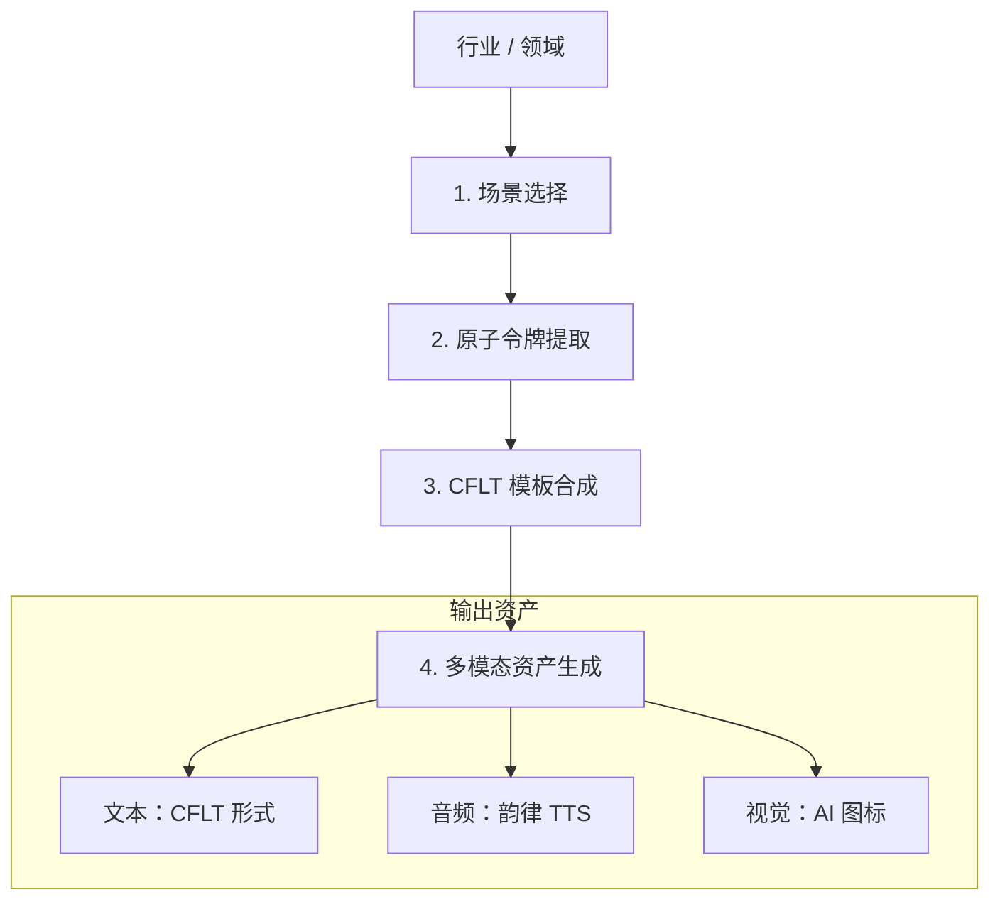
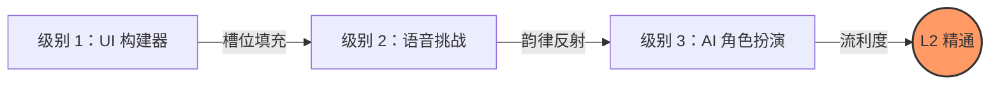
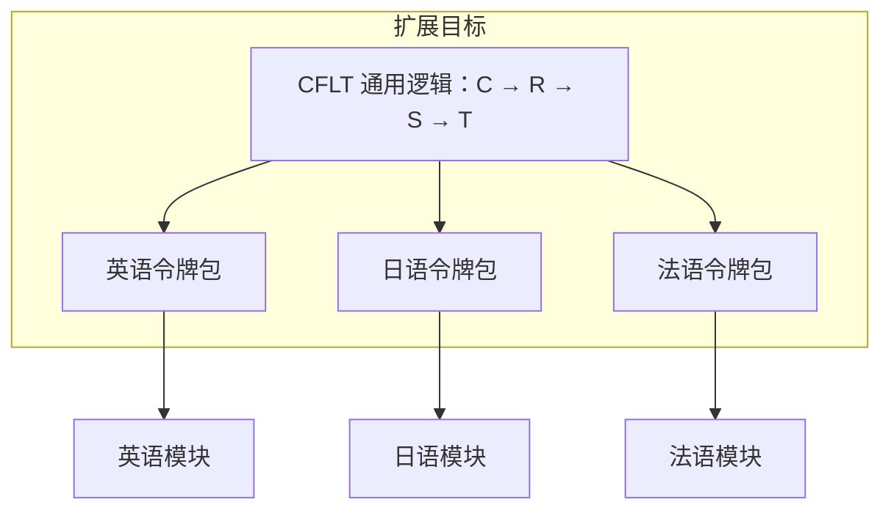

# 方法论：课程工程 (CFLT-Content)

> **版本：** 1.0.0 (内部草案)
> **作者：** CFLT 核心团队
> **组织：** [CFLT.center](https://cflt.center)
> **许可：** [CC BY 4.0](https://creativecommons.org/licenses/by/4.0/)

> **目的：** 提供一个系统的工程框架，利用大语言模型 (LLM) 大规模生成高质量、符合 CFLT 规范的教育内容。
>
> **理论锚点：** 本文件操作化了 [`foundations/pedagogy.md`](../foundations/pedagogy.md) §6（**弱式 TBLT** —— Ellis 2003；CFLT *不*与 Long 强式 TBLT 兼容，诚实定位详见 pedagogy §6）和 §8（双语词汇提取），并依赖于 [`foundations/linguistics.md`](../foundations/linguistics.md) §8（构式语法槽位填充）和 §9（作为槽位填充词汇的自然语义金属语言 NSM）。"令牌包 (Token-pack)"设计是这些理论承诺在工程层面的具体体现。

---

## 1. 从理论到内容：模块化方法

传统的课程设计速度慢且依赖人工。CFLT 将语言学习视为功能块和行业特定令牌 (Token) 的组装，从而实现了 **程序化课程生成 (Programmatic Curriculum Generation)**。

## 2. 课件生成流水线

CFLT 模块 (例如“后端工程师英语”) 的生成遵循一个四步自动化流程：

### 第一步：场景领域选择
识别目标受众的高频场景。
- *输入：* "后端工程"
- *输出：* ["系统部署", "数据库故障排除", "代码审查", "延迟调查"]

### 第二步：原子令牌提取
识别该领域特定的 **显著性锚点 (核心/Cores)** 和 **上下文修饰词**。
- *核心动作 (Core Actions)：* `deploy` (部署), `refactor` (重构), `debug` (调试), `optimize` (优化)。
- *空间上下文 (Space Contexts)：* `production server` (生产服务器), `local environment` (本地环境), `staging cluster` (预发布集群)。
- *原因上下文 (Reason Contexts)：* `high latency` (高延迟), `buffer overflow` (缓冲区溢出), `deprecated API` (已弃用的 API)。

### 第三步：CFLT 模板合成
将场景和令牌组合成有效的 `[核心] → [理由] → [空间] → [时间]` 模式。
- *模板示例：* `[Action: Debug] because [Reason: Error 500] in [Space: Microservice] [Time: Now].`

### 第四步：多模态资产生成
- **文本：** 经过优化的 CFLT-L2 形式。
- **音频：** 文字转语音 (TTS)，强调核心部分的韵律。
- **视觉：** AI 生成的图像或图标，代表原子令牌。

---

## 3. “IT 英语”模块案例研究

由于 IT 领域与工程流程在逻辑上的高度契合，它是 CFLT 的首要目标。

### 3.1 令牌分类学
| 逻辑块 | 令牌示例 |
|---|---|
| **核心 (Core)** | `merge`, `revert`, `scale`, `containerize` |
| **原因 (Reason)** | `bottleneck`, `concurrency issue`, `security patch` |
| **空间 (Space)** | `repo`, `pipeline`, `endpoint`, `firewall` |
| **时间 (Time)** | `sprint`, `deployment window`, `retroactive` |

### 3.2 学习路径工程
1.  **级别 1 (构建者)：** 将这些令牌拖放到 4 槽位 UI 中。
2.  **级别 2 (发声者)：** 说出序列："Scale the database, because of traffic spike, in AWS, tonight."
3.  **级别 3 (反射者)：** 实时角色扮演，使用严格的 CFLT 逻辑回应 AI “资深架构师”。

---

## 4. 验证内容质量

所有 AI 生成的内容必须通过 **CFLT 验证器 (CFLT Validator)**：
- **约束检查：** 句子是否包含所有必需的槽位？
- **显著性检查：** 最重要的动作是否确实位于位置 0？
- **词汇检查：** 是否使用了提供的行业令牌包？

## 5. 扩展：任意语言对的内容生成

由于 CFLT 逻辑是通用的，一旦工程化了“IT 英语”模块，系统就可以通过简单地更换令牌包和语法覆盖层 (Grammar Overlay) 配置，自动生成“IT 日语”或“IT 法语”模块。这是通往 **全球任意语言对双语能力 (Global Any-to-Any Bilingualism)** 的路径。

---

## 6. 总结

课程工程在 CFLT 中从“编写书籍”转向了“工程化系统”。通过自动化行业逻辑与 CFLT 协议的合成，我们旨在提供跨越广泛专业领域的个性化、相关且逻辑一致的学习材料，从 [`../manifesto.md`](../manifesto.md) §8.2 中提到的四个领域 (IT、医疗、金融、酒店) 开始，并通过令牌包工程扩展到更多领域。跨领域的扩展取决于下文所述的局限性。

---

## 7. 诚实的局限性

上文所述的“更换令牌包即可获得新模块”的故事是协议层的理想情况。在实践中，以下警示适用，并应缓和对完全自动化跨语言/跨行业推出的主张：

1. **跨语言 LLM 能力不均衡。** 现代 LLM 在不同语言上的表现并不相同 (Lai et al. 2023; Bang et al. 2023)。在同一个 LLM 上运行的 CFLT 格式的越南语或斯瓦希里语课程，其流利度、错误率或事实性包络线将与英语版本不同。CFLT 无法弥合这一差距；它只能减少协议层面的漂移。有关跨语言 LLM 警示，请参见 [`./llm-prompting.md`](./llm-prompting.md) §2。
2. **语音桥梁是针对母语 (L1) 的，而非通用的。** 任何模块的语音教学组件 (拼音到 IPA 的映射、发音重叠分析) 都锚定在*学习者的母语*上，必须为每个母语群体重新工程化，而不只是针对每个目标语言。有关 L1 特定性警告，请参见 [`../foundations/phonetics.md`](../foundations/phonetics.md) §5。
3. **令牌包工程仍需要领域专业知识。** 生成“IT 日语”模块不仅仅是“更换令牌” —— 它需要由了解技术领域和目标语言语体惯例的人员策划的日语 IT 词汇表。CFLT 协议是框架；令牌包是*内容*，而内容需要专业知识。
4. **边缘案例校准具有语言对特定性。** 哪些内容进入核心 vs. 进入场景框架的边界规则在不同语言之间存在第 4 层 (edge-case) 差异 —— 请参见 [`../foundations/core-concept.md`](../foundations/core-concept.md) §2.3 和 [语言对指南](./language-pair-guides/index.md)。每个新的语言对至少需要轻量级的第 4 层校准；这无法仅通过协议实现自动化。
5. **实证验证是针对每个领域的。** [`./evaluation-metrics.md`](./evaluation-metrics.md) 中的基准数字是预估目标，而非实测结果；每个行业/语言模块在宣传其益处之前，都必须独立进行实证验证。
