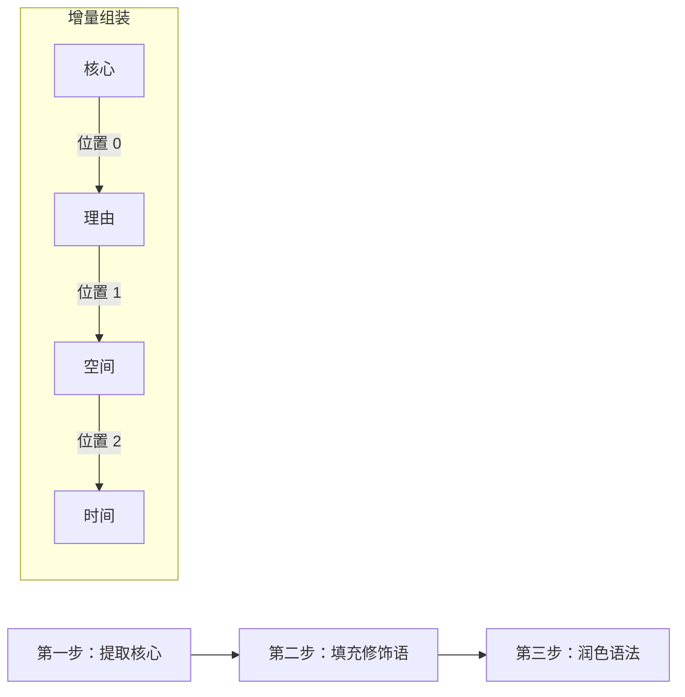
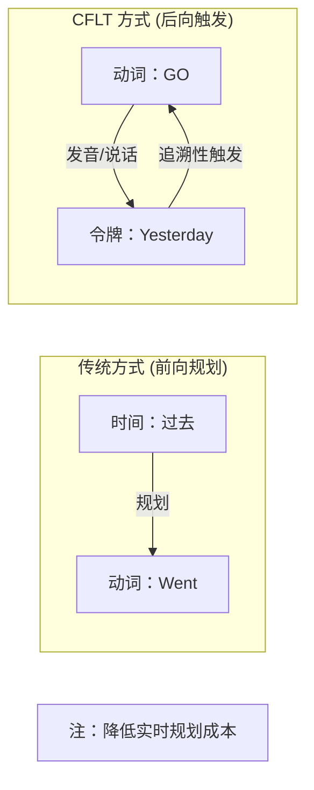
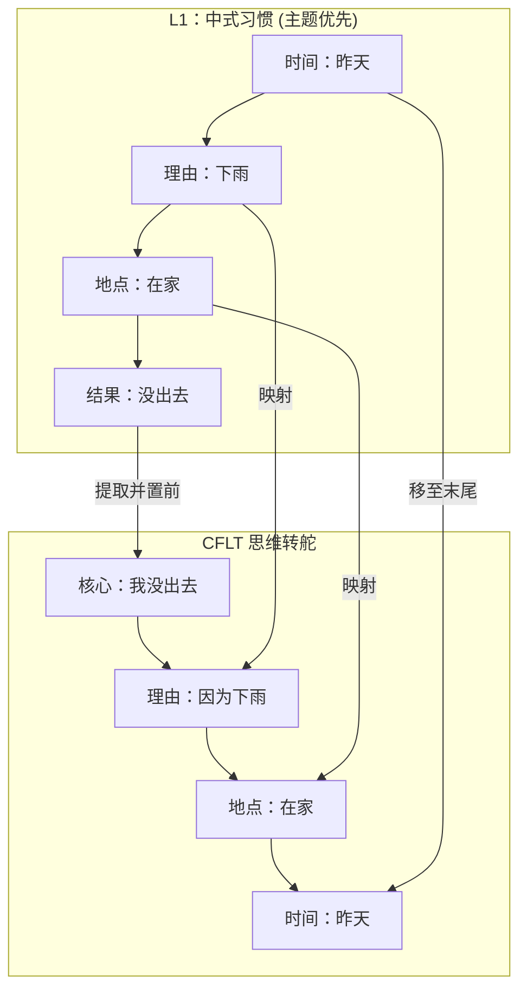

# 方法论：人类认知重塑 (L2 流利度)

> **版本:** 1.0.0 (内部草案)
> **作者:** CFLT 核心团队
> **组织:** [CFLT.center](https://cflt.center)
> **许可:** [CC BY 4.0](https://creativecommons.org/licenses/by/4.0/)

---

## 1. 问题所在：“修饰语陷阱”

大多数成年学习者之所以无法实现口语流利，是因为他们试图将母语 (L1) 的想法 “翻译” 成目标语 (L2) 的表层形式。如果你的母语是**中心语后置** (如中文，描述词放在名词前)，而你的目标语是**中心语前置** (如英语)，你的大脑在每一句话中都会面临巨大的**结构重组成本**。

这导致了**“修饰语陷阱 (Modifier Trap)”**：在你还没说出消息的核心内容之前，你的工作记忆就已经被复杂的修饰语占满了。于是你卡壳、结巴，或者失去了表达的思路。

## 2. 解决方案：语义乐高 (三步协议)

CFLT 通过将语言视为 “语义乐高” 来解决这个问题 —— 即无论目标语的语法如何，功能块始终按相同的认知顺序组装。

### 第一步：提取核心 (显著性锚点)
忽略背景、时间和理由。问自己：**“我根本上想要断言的一件事是什么？”**
- 这就是你的**核心 (Core)**。
- 将其放在**位置 0**。
- *示例:* “我没出去。” / “那个女孩是我妹妹。”

### 第二步：填充槽位 (增量修饰)
一旦核心内容从你的工作记忆中 “卸载”，再按固定的 **CFLT 序列**逐个添加修饰语：
1. **[理由]** — 为什么或在什么条件下？(*因为下雨*)
2. **[空间]** — 在哪里？(*在家*)
3. **[时间]** — 什么时候？(*昨天*)

### 第三步：语法叠加 (隐性润色)
在这个阶段，不要担心语法是否 “完美”。如果需要，可以使用**原子词汇** (语义原语)。目标是建立序列。
- **CFLT 形式:** “I didn't go out, because it rained, at home, yesterday.”

随着你越来越熟练，**语法叠加 (Grammar Overlay)** 层（由 AI 或自然习得提供）会将这种形式润色为地道的 L2（例如："It rained yesterday, so I stayed home"）。然而，在实时对话的热度下，**请坚持使用 CFLT 形式** —— 它对听者高度可理解，且对说话者的结构重组负担极小。

### 2.1 时间令牌 vs. 时态：后向约束
在传统的 L2 学习中，“时态” 是一个前向规划的噩梦。你必须在选择动词形式*之前*就知道事件的时间。

CFLT 通过**后向时间约束 (Backward Temporal Constraints)** 扭转了这一点：
1.  **核心优先:** 立即以其基础/原子形式说出动作。
2.  **时间最后:** 在最后附加 “时间令牌”。
3.  **肌肉记忆训练:** 训练学习者将最后的时间令牌视为一个 "触发器"，追溯性地验证核心。在 "语法叠加" 阶段，大脑开始通过潜意识反馈回路将时间令牌 *预回响 (pre-echo)* 到核心动词中，将 "I go... yesterday" 转化为 "I went... yesterday"。这模拟了母语者处理长距离依赖关系的方式，在不增加规划成本的情况下建立词形变化的肌肉记忆。

> **该机制的诚实范围。** 后向时间约束是**选择支架** —— 它帮助学习者通过锚定时间状语来决定*选哪个*时态。它**不能**自动解决时态形态本身的*产出*。Lardiere (1998) "Patty" 案例研究（DOI 10.1191/026765898674105303）显示一位高级中文 L1 学习者过去时产出仅约 6%，归因于：(a) 汉语音节结构约束（无尾辅音簇）限制 *-ed* 产出；(b) 著名的"缺失表层屈折"挑战（Hawkins & Liszka 2003 *韵律迁移假说*；Goad & White 2006）。CFLT 的后向时间支架帮助学习者*知道*要用哪个时态，但本身无法克服形态-音系映射瓶颈。有效的汉→英时态教学应把 CFLT 时间支架与屈折形态的显式语音训练结合。

---

## 3. 案例研究：中国学习者学英语

**场景：** 你想说 “昨天下雨，我在家没出去”。

1. **L1 习惯 (主题优先):** [时间] → [理由] → [结果]。
2. **CFLT 思维转舵:**
   - **核心:** 我没出去 (I didn't go out)
   - **原因:** 因为下雨 (because it rained)
   - **空间:** 在家 (at home)
   - **时间:** 昨天 (yesterday)
3. **英语输出:** "I didn't go out, because it rained, at home, yesterday."

**结果:** 你是以增量方式产出句子的。你不需要在开口前等待大脑处理完时间或原因。从第一个词开始，你就是流利的。

---

## 4. 如何练习

1. **“最大省略”测试:** 拿出一个复杂的想法，试着将其缩减为一个短语。那个短语就是你的核心。每一句话都以它开始。
2. **槽位填充练习:** 练习一次只添加一个修饰语。
   - *初级:* 核心 + 时间。
   - *中级:* 核心 + 空间 + 时间。
   - *高级:* 核心 + 原因 + 空间 + 时间。
3. **语音压力测试:** 使用 CoreFirst App 的语音挑战。强迫自己在不看屏幕的情况下说出协议序列。信任这套协议。

---

## 5. 数据与预估：量化认知负荷

CFLT 的有效性得到了基于成熟解析原则和双语产出模型的理论指标支持。

### 5.1 EIC 效率 (理论推导)
根据 **John Hawkins** 的**早期立即成分 (EIC)** 原则 ([Hawkins 1994, 2004](https://doi.org/10.1017/CBO9780511554285))，人类的解析效率是已识别成分 (ICs) 与单词数 (CRD) 的比率。
- **经验基准:** 研究表明，中国学习者在将中心语后置 (L1) 映射到中心语前置 (L2) 结构时，面临显著的**负向 L1 迁移**，导致**句子起始延迟**测量值显著增加。
- **CFLT 预估:** 通过在句首最大化 EIC 比率 (接近 100%)，该协议**预计**能将工作记忆的 “前瞻” 负荷降低 **2 到 5 倍**。

### 5.2 产出延迟 (实验预估)
跨语言神经成像研究（例如 **Hashimoto, Yokoyama & Kawashima 2012** [[10.2174/1874347101206010062](https://doi.org/10.2174/1874347101206010062)]）报告，处理非规范词序会引发左额叶活动增加，与额外工作记忆与冲突监测负荷一致。注意这是**收敛的神经证据**，不是 SVO/SOV 成本不对称的直接测量：后续 LATL 组合研究（Bemis & Pylkkänen 2013；Pylkkänen 2019）表明基本语义组合在不同词序下是稳定的，故神经成本差异更可能反映表层重分析工作量而非协议层缺陷。
- **重构延迟:** 由于 “修饰语陷阱”，将 L1 (主题优先) 映射到 L2 (主语优先) 在自发言语中通常会增加 **200ms–500ms** 的认知延迟。
- **假设:** **假设** CFLT 通过将线性化决策移至言语前的自动阶段，从而消除这一特定的重组延迟 ([Levelt 1989](https://mitpress.mit.edu/9780262620895/speaking/))。

---

## 6. 提议的验证方案：CFLT 延迟测试

为了验证这些主张，我们建议进行以下**心理语言学实验**:
1. **任务:** 图片命名或场景诱导任务 (L1 思想 -> L2 言语)。
2. **变量:** 对照组 (自由 L2 词序) vs. 实验组 (严格 CFLT 序列)。
3. **指标 A (延迟):** 从刺激到说出第一个词的时间。
4. **指标 B (流利度):** 每 100 个单词的停顿/犹豫次数。
5. **指标 C (记忆):** 说话时的数字跨度任务表现 (测量剩余认知容量)。

---

## 7. 熟练度弧线：从协议到精通

CFLT 是一个辅助轮系统，而不是牢笼。**语法叠加**充当了从严格线性化到母语水平表达的桥梁：

1.  **阶段 1: 严格协议 (0-20% 熟练度):** 学习者仅使用 4 插槽序列。输出是 “机械的” 但非常清晰。
2.  **阶段 2: 隐性叠加 (20-60% 熟练度):** 通过 AI 反馈和接触，学习者开始将插槽 “凝结” 在一起 (例如，合并原因和核心)。
3.  **阶段 3: 标记偏离 (60-90% 熟练度):** 学习者开始为了修辞效果有意打破协议 (例如，“Yesterday, I stayed home”)。因为他们已经掌握了**未标记基准 (CFLT)**，这些偏离现在是刻意的选择，而不是 “修饰语陷阱” 错误。
4.  **阶段 4: 透明流利 (90%+ 熟练度):** 协议变成了隐形的认知骨架。说话者可以产生任何 L2 结构，但当遇到认知压力时，他们会退回到高效的 CFLT 核心以维持言语流。

---

## 8. 总结

CFLT 的目标不是说得 “完美”，而是说得**“即时”**。通过固定你思维的顺序，你让大脑释放出资源去关注真正重要的事情：**沟通。**

**核心优先，补充在后。**
