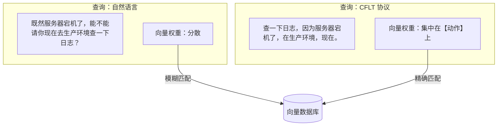
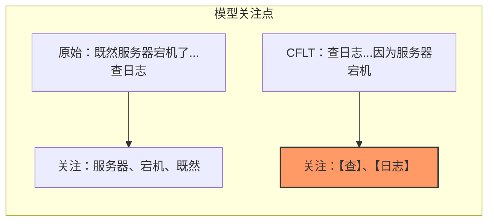

# 方法论：LLM 系统提示词 (工程协议)

> **版本:** 1.0.0 (内部草案)
> **作者:** CFLT 核心团队
> **组织:** [CFLT.center](https://cflt.center)
> **许可:** [CC BY 4.0](https://creativecommons.org/licenses/by/4.0/)

---

## 1. 问题所在：提示词方差与注意力衰减

自然语言具有高熵和高方差的特性。在生产级 AI 系统中，用户语序的微小变化可能导致模型行为的显著差异（即**顺序敏感性**问题）。此外，LLM 在位置 0 表现强**首因（Primacy）**、末尾**近因（Recency）**，往往会忽略埋在长提示词中间的关键信息。（注：位置 0 过度关注是首因与 softmax 稳定性副产物"注意力汇点"的联合效应；详细消歧参见 [`../foundations/llm.md`](../foundations/llm.md) §2.3。）

## 2. 解决方案：将 CFLT 协议作为 "线缆格式 (Wire Format)"

**CFLT 协议**充当了**结构稳定器**的作用。通过强制执行固定序列 (`[核心] → [理由] → [空间] → [时间]`)，你可以使模型的计算与其固有的位置偏差相对齐。

> **警示 —— 多语言 LLM 稳定性。** CFLT 设计为*语言无关协议* —— 其槽位语义与顺序主张意在适用于任何表面语言。然而当前 LLM 在不同语言上**能力不均衡**：实证工作（Lai et al. 2023 *ChatGPT Beyond English*；Bang et al. 2023；"Don't Trust ChatGPT when your Question is not in English"，EMNLP 2023）显示非英语输入上有显著退化，包括指令跟随、推理与安全。CFLT 无法消除这一 gap —— 它只能减少跨语言转写中的*协议层*漂移。不要把 CFLT 的普适性解读为"用越南语或斯瓦希里语渲染的 CFLT 提示会像英语版一样表现"。

### 2.1 位置 0 的注意力
LLM 不成比例地关注前几个 token（位置 0）。这是**首因**（因果掩码使早期 token 的影响累积）与**注意力汇点**（Xiao 等 2024 —— softmax 稳定性副产物）的联合效应。CFLT 利用的是首因：把**核心动作**置于高注意力前缀区，使模型的早期状态条件于主要意图。首因 vs 汇点的细致消歧参见 [`../foundations/llm.md`](../foundations/llm.md) §2.3。

---

## 3. 实现：清理工作流 (Sanitization Workflow)

对于高可靠性的智能体 (Agentic) 工作流，不要直接将原始用户输入传递给你的主推理模型。相反，应使用两步走的**清理工作流**:

### 第一步：CFLT 转换器 (小型/廉价模型)
使用快速模型 (如 GPT-5.4-Nano, Haiku 4.5, Llama-3-8B) 将用户的输入扁平化为严格的 CFLT JSON 或文本结构。

**转换器代理的系统提示词:**
```markdown
你是一个 CFLT 逻辑转换器。
你的任务是将任何用户输入转换为以下严格的话语序列：
[核心] -> [理由] -> [空间] -> [时间]

规则：
1. 识别最具显著性的动作或断言。这就是核心 (CORE)。
2. 如果缺失某个组件，使用 "NULL"。
3. 将结果输出为扁平字符串或 JSON。
```

### 第二步：主推理代理 (大型/强力模型)
将清洗后的 CFLT 字符串传递给你的主模型。由于输入现在是低方差且核心锚定的，模型的生成将更加稳定，且对意图的忠实度更高。


### 3.1 何时不使用两步工作流

两步走的清理工作流并非在所有情况下都是首选。最强有力的反对立场是：**现代最前沿的经过指令微调的 LLM (GPT-5.5, Claude 4.7-class, Gemini 3.1+) 可能不需要显式的预处理器**。增加一个独立的逻辑转换器环节会引入：(a) 额外的延迟；(b) 额外的失败表面 (转换器可能误判核心)；(c) 如果转换器丢失了主模型本可以利用的上下文线索，则会造成信息损失。对于许多任务，直接用一行 CFLT 指令 (*“请按 [核心, 理由, 空间, 时间] 的形式回答”*) 提示主模型，可能达到或超过两步流水线的表现。

在以下情况下使用两步工作流：

- 主模型较小或处于中等级别，受益于经过清洗、预结构化的输入。
- 流水线在每个会话中运行大量请求，且转换器的输出被复用或审计 (从而平摊了延迟成本)。
- 可靠性/可审计性比绝对延迟更重要 (例如：受监管行业；下游工具调用依赖核心结构的智能体工作流)。

在以下情况下**优先选择单次调用提示词** (带内联 CFLT 指令)：

- 模型处于最前沿级别，且指令遵循能力已经很强。
- 延迟是主导成本。
- 用户的输入足够短，主模型可以自行提取核心而无需单独处理。

这两种架构之间的选择是**经验性的，而非教条式的** —— 请通过 [`./evaluation-metrics.md`](./evaluation-metrics.md) §4.1 中指定的消融实验为你的技术栈做最终决定。我们将两步工作流视为*针对可靠性敏感流程的推荐模式*，而非 CFLT 强制要求的架构。

> **开放实证问题。** 在 ≥ 3 个最前沿模型上，对于同一项下游任务，两步工作流是否显示出优于单次调用 CFLT 指令提示词的衡量优势？CFLT 特有的 P2 证伪条款 (`foundations/core-concept.md` §8.5) 建立了一套受控对比方案。

---

## 4. 计算效率：令牌与缓存优化

除了推理稳定性，CFLT 在特定场景下提供了可衡量的性能提升；各项主张的实测结果见 §5.2。

### 4.1 通过结构扁平化减少令牌消耗
自然语言经常使用复杂的嵌套 (定语从句、插入语)，这需要大量的令牌开销来充当句法标记。
- **CFLT 方案:** 通过将逻辑扁平化为线性序列，并对缺失槽位使用 "NULL" 值，你消除了对冗余连词和填充短语的需求。
- **结果:** 在不牺牲语义密度的情况下，降低了单次请求的令牌数量。

### 4.2 KV 缓存重用性与推理速度
在现代 LLM 推理（vLLM Automatic Prefix Caching、SGLang RadixAttention）中，**KV 缓存**可被共享相同前缀的请求重用。

- **可缓存的部分。** vLLM APC 工作在**块粒度**（默认每块 16 token，要求字节精确匹配且对齐块边界）；SGLang RadixAttention 工作在 **token 级 radix tree**（粒度更细但要求 token 精确匹配）。
- **CFLT 的贡献。** 可缓存的前缀是**稳定包装层** —— 即：(a) 系统提示词模板，(b) CFLT 结构的*静态 schema*（槽位标签 token 本身，如 `[Core]:`、`[Reason]:` 等若以词法形式序列化）。Core *内容*本身是每个请求的**变化载荷**，**直接受缓存收益有限** —— 不同任务的 Core 动作不同。所以精确机制是：CFLT 的稳定 schema 比自由格式自然语言提供更长的可缓存前缀；Core 的变化性限制了缓存切入位置。
- **结果：** 包装层部分的 TTFT 降低；Core 之后仍需新鲜 prefill。实际收益在 agentic / 多轮流中最高 —— 那里系统提示 + schema 占提示词长度的主要份额。

### 4.3 提升 RAG (检索增强生成) 的命中效率
当用户的查询被传递给向量数据库进行 RAG 时，嵌入模型通常会将权重分散在整个句子中。
- **CFLT 方案:** 通过将**核心动作**放在查询的开头，嵌入向量受实际 “意图” 的影响更强，受 “语境噪声” (时间/空间) 的影响较小。
- **结果:** 更高的 Top-K 检索准确率，确保根据所需动作检索到最相关的文档。



## 5. 数据与基准：经验证据 vs. 预估

CFLT 的有效性得到了现代推理引擎的行业基准测试和近期提示词工程研究的理论预估的双重支持。

### 5.1 已建立的行业基准 (经验性，通用)
现代推理框架 (如 vLLM 的 APC, SGLang 的 RadixAttention) 为提供固定、可重用提示词前缀的**任何**工作负载提供了经过验证的性能提升。下方的数字是**通用的前缀缓存收益**，而非 CFLT 特有的结果 —— CFLT 的贡献在于，它通过强制执行稳定、可重用的前缀形状，使提示词*符合*获得这些收益的条件：

- **TTFT (首个令牌时间) 降低:** **SGLang (2024)** ([NeurIPS 2024](https://openreview.net/forum?id=VqkAKQibpq)) 的基准测试显示，缓存前缀的 TTFT 可**降低 80%–95%**，因为共享结构的 “预填充” 阶段被绕过。
- **吞吐量增益:** 在智能体推理和多轮工作负载中，**RadixAttention** 通过最大化前缀重用，实现了比基线 vLLM **高出 2x–5x 的吞吐量** ([LMSYS Org. 2024](https://lmsys.org/blog/2024-01-17-sglang/))。
- **线性化影响:** **DOVE 研究 (2025)** ([Findings of ACL 2025](https://doi.org/10.18653/v1/2025.findings-acl.611)) 发现提示词线性化 (信息顺序) 可能在 MMLU 等推理基准测试上导致 **10%–15% 的绝对准确率差距**，这证实了提示词结构在实质上影响模型行为 —— 这是 CFLT 的设计选择产生影响的*必要前提*，而非 CFLT 特别捕捉到这一差距的证据。

简而言之：§5.1 确立了某种固定前缀协议是有回报的。§5.2 则指定了 CFLT 必须展示什么才能声称它是*正确的那一个*。

### 5.2 CFLT 特有的验证结果（2026-05-17，扩展自 2026-05-16 4 模型基线）

以下为跨 **5 个前沿模型**（GPT-5、Gemini 3 Flash Preview、Qwen3.5-Plus、DeepSeek V4 Pro、Claude Sonnet 4.6）在 24 个受控案例上的实测结果（N=3 runs / arm）。完整数据见 [`llm-part2-verification.md`](./llm-part2-verification.md)。

**准确率提升（干扰信息场景 L3——主要信息层级）：**

| 模型 | Control | CFLT | Δ | vs 预测 |
| :-- | :-- | :-- | :-- | :-- |
| GPT-5 | 61% | 100% | **+39pp** | ✅ 超过预测 +15–20pp |
| Gemini 3 Flash | 78% | 100% | **+22pp** | ✅ 超过预测 |
| Qwen3.5-Plus | 61% | 100% | **+39pp** | ✅ 超过预测 |
| DeepSeek V4 Pro | 56% | 100% | **+44pp** | ✅ 超过预测 |
| Claude Sonnet 4.6 | 72% | 100% | **+28pp** | ✅ 超过预测 |

**全部 5 个前沿模型在 L3 distractor-heavy 场景下精确达到 100%** 准确率，而自然语序 control 组为 56–78%（均值 65.6%）。简单场景（L1/L4）多数模型两组均饱和；L2 在五分之三模型上饱和（GPT-5、Gemini、DeepSeek），在另两个上呈噪声区行为（Qwen +6pp；Claude −6pp，详见 [`llm-part2-verification.md`](./llm-part2-verification.md) §5.5）。多候选决策场景（L4）CFLT *仅* 在 DeepSeek V4 Pro 上呈回归（−11pp）；其他四个模型 L4 在两组上都接近或处于天花板。

**令牌经济（实测机制与原始预测不同）：**

- **Prompt token 节省：约 -1%**（不显著）。本数据集两组词汇相同，无法测试 prompt 压缩效果。原文 -30–50% 预测基于 prompt 压缩机制，在此场景不适用。
- **Reasoning-capable 模型的 completion token 节省：-12% ~ -38%**。CFLT 的 core-first 结构让显式 chain-of-thought 模型（Qwen3.5-Plus -38.4%，DeepSeek V4 Pro -12.5%）更快收敛，缩短推理 trace。Qwen 总 token 降幅（-37.1%）落在原预测区间内，但节省来自 completion 而非 prompt。
- **短输出 / 隐式 reasoning 模型无 token 效应**。GPT-5（+0.7%）、Gemini Flash（+1.4%）、Claude Sonnet 4.6（+0.9%）的 completion token Δ 都在 ±1.5% 噪声范围内。这确认了一个干净的双簇模式：**token 节省取决于可见 reasoning trace**。

> **注：** 若要测试 prompt 压缩主张，需加入第三组"压缩 CFLT"（含 NULL 填充和显式槽位标签的紧凑形式），本数据集设计不支持该测试。

---

## 6. 已完成的验证：CFLT 消融实验（2026-05-17，5 模型）

§5.2 的预测已通过受控消融实验进行验证。实验遵循以下设置（详见 [`llm-part2-verification.md`](./llm-part2-verification.md)）：

1. **控制组：** 自然语序提示词（通常 reason-first）。
2. **实验组：** 相同词汇内容重排为严格 CFLT 序列（Core → Reason → Space → Time），无字面槽位标记。
3. **指标 A（精度）：** JSON 结构化抽取的指令遵循准确率（N=3，temperature=0）。
4. **指标 B（效率）：** prompt_tokens 和 completion_tokens 分别报告。

**核心结论（5 模型，24 case，每模型 144 calls，共 720 次试验）：**

- 在含干扰信息的场景（L3）下，CFLT 将 **5/5 前沿模型** 的准确率从 56–78% 提升至 **100%**（L3 control 均值 65.6%；Δ 范围 +22 ~ +44pp）。L3 CFLT 在所有 5 个不同模型家族（覆盖隐式 reasoning、显式 chain-of-thought 和短输出三种输出模式）上一致饱和至 100%，是本实验最有力的证据。
- 在多候选决策场景（L4）下，−11pp 的 CFLT 回归**仅限于 DeepSeek V4 Pro 一家**；其他四个模型 L4 都饱和。L4 异常因此是**模型特异**而非通用模式（修正自加入 Claude 前的 4 模型解读）。
- Reasoning-capable 模型（Qwen3.5-Plus、DeepSeek V4 Pro）的 completion token 分别减少 −38.4% 和 −12.5%，机制为推理开销减少。三个短输出 / 隐式 reasoning 模型（GPT-5、Gemini Flash、Claude Sonnet 4.6）的 completion token Δ 都在 ±1.5%（无效应）——确认 token 经济收益**取决于可见 reasoning trace**，而非通用。

完整数据表、per-case 结果、方法论说明，以及 Claude 集成适配器（容错 JSON 解析器）见 [`llm-part2-verification.md`](./llm-part2-verification.md)。

---

## 7. 多智能体通信中的 CFLT

当多个智能体协作时，使用 CFLT 作为通信协议提供了三个益处：

1. **降低解析延迟:** 接收方智能体始终知道 “命令” 或 “结果” (核心) 位于消息的开头。
2. **人类可观测性:** 与二进制或密集的 JSON 不同，CFLT 对人类完全可读。你可以审计智能体间的日志并瞬间理解 “意图”。
3. **上下文窗口效率:** 通过将嵌套逻辑扁平化为线性序列，你减少了模型 “理解” 事件间关系所需的令牌复杂度。

---

## 8. 示例：提示词优化

**原始输入:** *"既然服务器宕机了，能不能请你现在去生产环境查一下日志？"*

**CFLT 优化后:** *"查一下日志，因为服务器宕机了，在生产环境，现在。"*

**为什么有效:**
- 模型立即开始处理 “查一下日志” (首因效应)。
- 理由 (服务器宕机) 提供了即时的因果背景。
- 约束 (生产环境，现在) 充当最后的转向令牌。



---

## 9. 总结

CFLT 是一种**结构化提示词协议**，其核心主张已获得跨 5 个前沿模型的受控实验支持（参见 [`llm-part2-verification.md`](./llm-part2-verification.md)）：

**CFLT 在以下场景有明确益处：**
- **干扰信息场景**（context 中包含干扰项、修饰从句、背景噪声）：将核心动作置于 position 0 在所有 5 个被测前沿模型上将准确率提升至 100%，Δ +22~+44pp。
- **Reasoning-capable 模型的推理效率**：CFLT 在显式 chain-of-thought 模型（Qwen、DeepSeek）上减少 completion token 12%–38%，机制为缩短在干扰信息中的搜索困惑。**对短输出 / 隐式 reasoning 模型（GPT-5、Gemini Flash、Claude Sonnet 4.6）无 token 效应**。

**CFLT 在以下场景无效：**
- **简单直接的指令**：模型已能可靠完成，CFLT 无增益。

**CFLT 在以下场景有模型特异问题：**
- **DeepSeek V4 Pro 在多候选决策（L4）上**（−11pp）。其他四个被测前沿模型（GPT-5、Gemini Flash、Qwen3.5、Claude Sonnet 4.6）不出现该回归。先前"CFLT 在多候选场景下普遍轻微有害"的解读已撤回，更准确的表述为："DeepSeek V4 Pro 在该类场景下显示模型特异的指令遵从异常；在该模型上部署 CFLT 处理该任务类型前需 A/B 测试。"

> CFLT 是**信息密度高、干扰场景**下**与模型无关的可靠增益**工具——不是对所有提示词都适用的通用优化，也不是对所有任务类型在所有模型上都安全的。L3 通用性（5/5 模型）是最有力的单一发现；DeepSeek L4 异常（1/5 模型）是最有力的反例，作为诚实证据保留在文档中。
