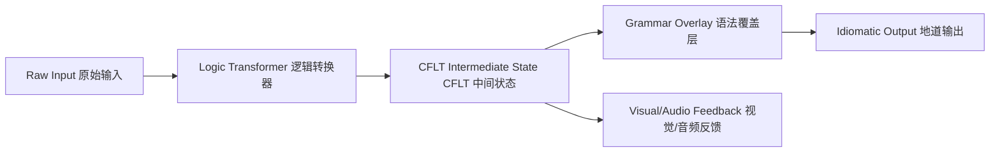

# 方法论：软件架构 (CFLT-Engine)

> **版本：** 1.0.0 (内部草案)
> **作者：** CFLT 核心团队
> **组织：** [CFLT.center](https://cflt.center)
> **许可：** [CC BY 4.0](https://creativecommons.org/licenses/by/4.0/)

> **目的：** 定义实现 CFLT 原生应用程序的参考软件架构，重点关注两阶段 AI 流水线：逻辑转换器 (Logic Transformer) 和语法覆盖层 (Grammar Overlay)。
>
> **理论锚点：** 逻辑转换器/语法覆盖层的两阶段拆分实现了 [`foundations/llm.md`](../foundations/llm.md) §1 (逻辑转换器与语法覆盖层的区分)，并利用了同文件 §2.3 和 §6 中记录的注意力汇 (Attention-sink) 和前缀缓存 (Prefix-cache) 特性。第二层的“溯及性屈折 (Retroactive Inflection)”依赖于 [`methodology/human-learning.md`](./human-learning.md) §2.1 中定义的后向时间约束。

---

## 1. CFLT 流水线概述

符合 CFLT 规范的应用程序 (如 CoreFirst) 作为一个模块化流水线运行，它解构人类意图并将其重构为目标语言的表层形式。



## 2. 第一层：逻辑转换器 (LT)

LT 是一个专门负责 **意图提取 (Intent Extraction)** 和 **线性化 (Linearization)** 的 AI Agent。

### 2.1 LT 实现技术栈
- **模型：** 优化后的中小型指令遵循模型 (例如 Llama-3-8B, GPT-4o-mini)。
- **任务：** 将非结构化输入 (L1) 映射到 4 槽位 JSON 模式。
- **歧义处理：** 如果输入缺失核心 (Core)，LT 必须提示用户或注入 `[NULL]` 令牌，以维持协议稳定性。

### 2.2 逻辑提取提示词模式
LT 使用“显著性优先 (Salience-First)”的提示词，忽略语法修饰：
```json
{
  "instruction": "提取动作/身份、原因、空间和时间。",
  "constraint": "CORE (核心) 必须是一个独立的功能性断言。",
  "output_format": "CFLT_JSON"
}
```

## 3. 第二层：语法覆盖层 (GO)

GO 负责 **形态学精修 (Morphological Refinement)** 和 **地道性打磨 (Idiomatic Polishing)**。

### 3.1 GO 实现技术栈
- **模型：** 具有高度细微差别捕捉能力的大型模型 (例如 GPT-4o, Claude 3.5 Sonnet)。
- **任务：** 接收 `CFLT 中间状态` 并生成 L2 表层形式。
- **温度控制：** 设置 `temp=0.3` 以确保核心意图保持不变，同时允许自然流畅的表达。

### 3.2 溯及性屈折 (时态求解器)
GO 负责解决“后向时间约束” (见 `human-learning.md` §2.1)。它读取 `[Time]` 槽位，并在生成过程中将正确的时态注入到 `[Core]` 槽位中。

## 4. 第三层：内容引擎

为了扩展 CFLT，软件架构必须支持 **模块化令牌注入 (Modular Token Injection)**。

- **令牌包 (Token Packs)：** 行业特定的 CSV/JSON 文件 (例如 `it-tokens.json`)。
- **动态槽位填充：** 引擎将这些令牌注入到 CFLT 模板中，生成无限的、上下文相关的练习场景。

## 5. 前端策略：“语义乐高” UI

UI 必须反映底层逻辑。UI 应提供 **视觉化槽位 (Visual Slots)**，而不是简单的文本框：
1.  **槽位渲染：** 为核心、原因、空间和时间提供清晰的视觉边界。
2.  **状态管理：** 实时验证用户是否按正确顺序填充槽位。
3.  **视觉锚定：** 将图标与 NSM 原语 (语义原语) 链接，减少对 L1 翻译的依赖。

## 6. 工程师性能基准

- **LT 延迟 (TTFT)：** 目标 < 300ms (以维持对话流)。
- **GO 忠实度：** 通过 `意图保留分数 (Intent Preservation Score)` 衡量 (输出是否与输入核心匹配？)。
- **上下文窗口利用：** 通过使用扁平化的 CFLT 字符串而非嵌套的 JSON 结构来最小化开销。

---

## 7. 总结

CFLT 软件架构专为 **确定性话语 (Deterministic Discourse)** 而设计。通过将逻辑与语法分离，我们实现了更快的处理速度、更低的错误率，并在人类意图与机器执行之间建立了无缝桥梁。
